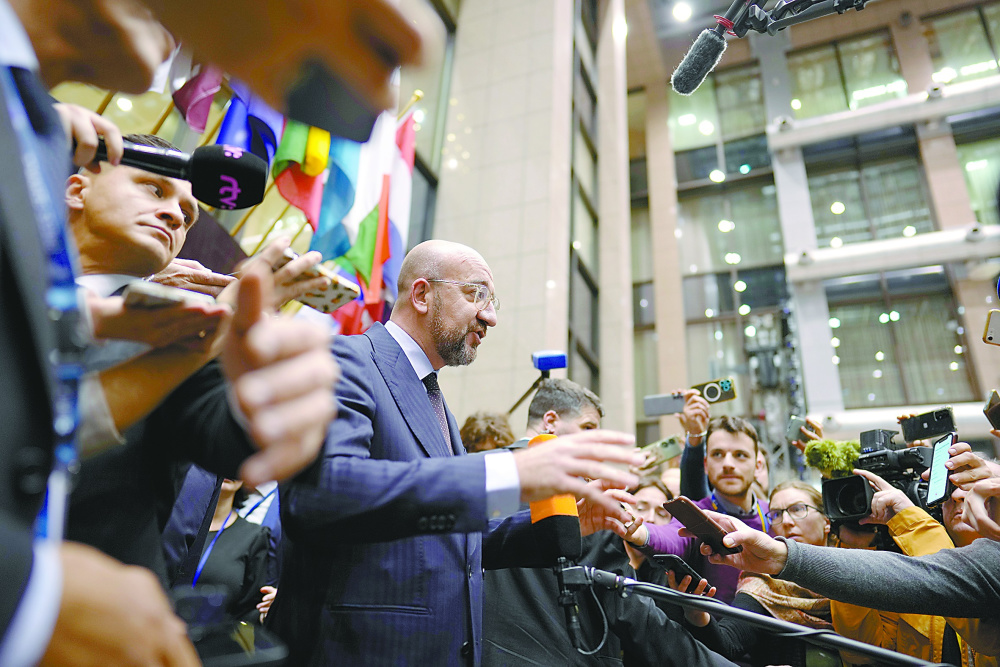

# 入欧盟之门开启，500亿经济援助被拒！泽连斯基欢呼胜利后被泼冷水

【环球时报驻德国特约记者 青木 环球时报特约记者 柳直 甄翔
宇扬】“迈两步，退一步。”为期两天的欧盟峰会自当地时间14日起在布鲁塞尔举行，主要议程包括是否决定启动乌克兰的入盟谈判，以及表决是否将向乌克兰提供500亿欧元的经济援助。本次欧盟峰会前，不少分析曾预测，在从美国“空手而归”后，乌克兰总统泽连斯基极有可能又将面对欧洲带给他的失望。然而，欧洲理事会主席米歇尔却在峰会第一天就出人预料地宣布，欧盟已决定启动与乌克兰的入盟谈判。这让泽连斯基高呼“胜利”。不过仅仅几个小时后，匈牙利就阻止了欧洲对乌克兰的重要援助计划。对此，英国《金融时报》、美国《华盛顿邮报》等媒体15日评论称，这场欧盟峰会对乌克兰来说喜忧参半，一方面该国在入盟问题上取得了象征性胜利，但同时进一步加剧了乌方此后从欧盟和美国获得持续金援的不确定性，它可能给俄乌冲突局势发展带来深刻影响。

_当地时间14日，欧洲理事会主席米歇尔就启动与乌克兰和摩尔多瓦的入盟谈判向媒体发表声明。_

**“伸出一只手，收回另只手”**

当地时间14日，米歇尔在社交媒体上宣布，欧洲理事会已决定启动乌克兰和摩尔多瓦加入欧盟的谈判。他还说，欧盟决定给予格鲁吉亚欧盟候选国地位，并决定“在达到必要的入盟标准后”启动与波黑的入盟谈判。

不少欧洲媒体报道称，这一决定之所以能够通过，是因为匈牙利总理欧尔班当天“缺席”投票。欧尔班此前一直坚决反对“乌克兰入盟”，但在欧盟委员会13日宣布为匈牙利解冻部分冻结资金后，他的口风有所松动。据路透社报道，在14日晚间开始投票时，欧尔班离开了会场，并未参与表决。而此前对乌克兰“快速入盟”持反对意见的斯洛伐克和奥地利并未投出反对票，因此决议最终以26个成员国一致同意通过。

欧尔班随后在社交媒体上表示，26国坚决做出这样“无意义、非理性和错误的”决定，匈牙利不想参与其中。美国“政治新闻网”引述知情人士的说法透露，建议欧尔班离开会场使投票得以通过是德国总理朔尔茨的主意。

投票结束后，米歇尔称，这一结果向乌克兰人民和整个欧洲“发出了清晰的希望信号”。泽连斯基在社交媒体上表示，上述结果“创造了历史”，是“乌克兰和全欧洲的胜利”。美国总统国家安全事务助理沙利文也在社交媒体上发文称，美国对欧盟与乌克兰和摩尔多瓦开启入盟谈判的“历史性举措”表示欢迎，称此为“实现欧洲—大西洋愿景的关键一步”。

不过，“胜利”的喜悦还未维持多久，乌克兰又被泼了一桶“冷水”。当地时间15日凌晨，欧尔班在社交媒体上宣布，他对向乌克兰提供额外资金投下反对票。对于自己的反对理由，欧尔班表示，他们想用钱来延续战争，这侵犯了匈牙利的利益。

米歇尔称，除了欧尔班外，剩下26国的领导人都同意提高预算和援助计划。但由于匈牙利的反对，各国领导人将在明年1月继续开会讨论相关问题。

德国电视一台15日评论称，这是欧盟峰会的历史性决定和否决，欧尔班成为欧盟峰会的关键人物。对于两项议程的不同结果，《金融时报》描述称，欧盟向乌克兰“伸出一只手，收回另只手”。

**“钱是更迫切的问题”**

欧盟在乌克兰问题上做出的决定引发俄各界关注。据俄《消息报》15日报道，俄总统新闻秘书佩斯科夫当天在回答“乌克兰入盟”相关问题时称，乌克兰和摩尔多瓦都不符合加入欧盟的标准。有关谈判可能需要几年甚至几十年。他说：“无论是从欧盟运作的角度来看，还是从经济角度来看，欧盟目前都并非处在历史上最好的时期。因此，欧盟与两国进行谈判绝对是一个政治化的决定。欧盟希望以此表明对这些国家的支持。但毫无疑问，这些‘新成员’可能破坏欧盟的稳定。我们密切关注事态发展。”

对于匈牙利阻止欧盟向乌克兰提供新援助，佩斯科夫称：“匈牙利是一个主权国家。该国有自己的利益，匈牙利与欧洲许多国家不同，清楚地知道要捍卫这些利益。普京总统昨天说过，不要认为匈牙利和其他国家捍卫自己的利益就是亲俄。他们只是有足够的意识和独立性来捍卫自己的利益。”

俄新社15日引述莫斯科国立国际关系学院欧洲法系副教授托波宁的话称：“乌克兰的入盟谈判过程将是漫长、痛苦且复杂的，并不容易。很明显，这可能持续多年。一切将取决于谈判如何发展，以及乌克兰如何有效地消除存在的问题。”

谈及乌克兰未能从欧盟拿到500亿欧元新援助，俄政治学家祖金对俄卫星通讯社分析称，随着时间的推移，欧盟国家在援乌问题上将更难进行协调。“简单总结一下就是：目前，欧盟内部正在发生分裂，与美国国内差不多。美国国内的分裂强化了欧洲内部的分裂。越来越多的欧洲国家反对提供援助，因此，乌克兰从欧洲拿到钱的前景变得越来越黯淡。”

美国有线电视新闻网15日报道称，欧盟决定与乌克兰开启入盟谈判，这既是向前迈出的切实一步，也是一个重要的象征性时刻。但欧盟未能就对乌援助达成一致，让基辅的“兴奋”因此而降温。对于乌克兰来说，这不仅仅是美中不足。“坦率地说，基辅需要现金来继续打这场仗，钱是更迫切的问题。”

**“欧洲肯定会输”？**

法新社15日称，随着对美国的支持产生怀疑，基辅正试图紧急改变外界有关西方盟友对其支持正在减弱的说法。而与基辅开启入盟谈判并不意味着乌克兰很快就将加入欧盟。在谈判启动之前，欧盟国家必须就谈判框架达成一致，这给了欧尔班机会再次拖延有关进程。同时，欧尔班缺席入盟谈判相关投票可能会在未来的讨论中重演，削弱欧盟团结。塞浦路斯总统赫里斯托祖利季斯说：“我认为这是一个负面的先例。”据路透社报道，欧尔班15日称，尽管欧盟批准启动，但匈牙利仍可阻止乌克兰加入欧盟的谈判。

据俄罗斯媒体15日报道，匈牙利记者、“瓦尔代”国际辩论俱乐部成员斯季尔称：“俄乌冲突将以欧洲的失败告终。欧洲正在自愿允许美国削弱其在世界舞台上的地位。欧洲政客不明白或不想明白乌克兰正在发生的事情。他们没有意识到欧洲的竞争力正在受到影响。乌克兰不可能在这场冲突中获胜。我们同情乌克兰人民，但我们必须真实地评估正在发生的事情。误解俄乌冲突对欧洲来说是危险的，因为在这场代理人战争中，欧洲肯定会输。”

