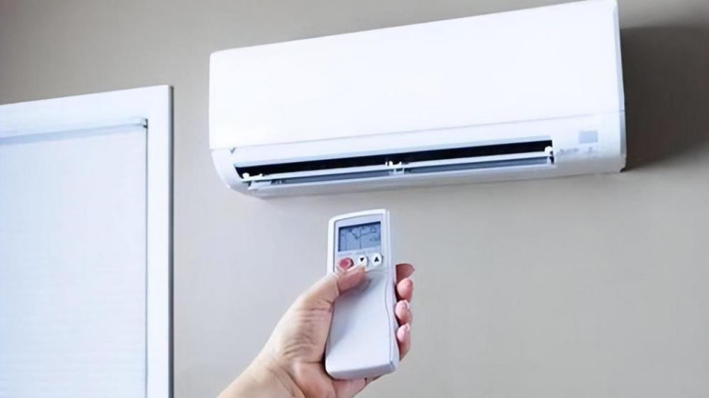

# 多地倡议节约用电：机关单位空调制热不超20°C，低楼层使用步行梯

**12月15日，江西发文倡议全社会联合行动，共同做好节约用电、错峰用电**

江西省发展和改革委员会、江西省机关事务管理局等在倡议书中称，此举是为积极践行绿色低碳生产生活方式，保障全省电力供应平稳有序，最大限度降低今冬明春电力供应紧张对经济社会、生产生活的影响。

其中，全省各级党政机关和事业单位要带头践行绿色节能办公，积极建设节约型机关。做好计算机、打印机等办公设备的用电管理，非工作时段及时关闭或切断设备电源；减少空调使用时间，制热温度设置不高于20℃，用电高峰时段设置在16℃（9:00-12:00、17:00-21:00），空调运行期间保持门窗关闭；办公楼较低楼层倡导使用步行梯，减少电梯使用，白天光线充足时不开照明灯。集中办公区、学校、医院等重点用能单位要加强内部节能管理，提高能源利用效率。

商场、综合体、写字楼、宾馆饭店等公共场所和地铁站、高铁站、汽车站、机场等交通场站要提高节电意识，在用电高峰时段（9:00-12:00、17:00-21:00）自觉停用或减少使用大功率用电设备和非必要照明灯具；提升楼宇空调负荷用电管理，空调制热温度设置不高于20℃，营业结束前半小时关停空调；合理压减公用设施、公共场所和大型建筑物等装饰性景观照明及各类广告灯用电。

受新一轮强冷空气影响，暴雪、寒潮、大风纷纷来袭，多地气温“俯冲式”下跌，供暖供电需求攀升，能源供应已迎来“大考”。在新华社12月15日的报道中，国家能源局电力司司长杜忠明说，预计今冬明春全国电力供应总体有保障，但西北、华东、西南、南方区域的部分省份保供压力较大，其中云南存在一定电量缺口，内蒙古西部局部时段存在一定电力缺口，陕西、甘肃、青海等地电力供应较为紧张。

**同在12月15日，安徽省合肥市发展和改革委员会、合肥供电公司也发文倡议全社会共同做好节约用电、杜绝电力浪费**

倡议书提到，各机关单位要推动绿色低碳工作方式，培养节电意识，带头建设节能型机关，在社会面发扬节约用电典范作用；严格控制空调开启关闭时间与温度设定，非特殊要求，原则上温度不高于20℃；严格控制办公楼照明设备，把关非必要时间和照明，严控景观装饰性照明；做好随手关灯、办公设备断电、电梯低楼层停开等日常节电举措，营造单位内部良好节电氛围。

另外，在保障行人、车辆安全的前提下，通过路灯“隔位开启、减半开启”节约用电，推广可再生能源路灯；加强对新建景观照明项目电能消耗情况的审查；严格控制超高耗能、过度亮化的展示性城市灯光秀，减少公共场所、公共设施和大型建筑等景观照明、广告展示耗电。

**浙江省嘉兴市南湖区也倡议机关事业单位带头节电**

据微信公众号“南湖发布”12月16日公布的倡议书，随着寒流来袭，近期南湖区气温快速下降，全区用电需求节节攀升，为保障经济社会平稳运行和城乡居民生活用电需求，鼓励全区各机关、企业事业单位、工商业用电户和广大居民群众携手共度绿色节电的冬季。

其中，全区各级党政机关要积极创建节约型机关，带动全社会节约用电。在用电高峰期，减少空调使用时间，设置制热温度不高于20°C;减少照明时间和数量，出门随手关灯，杜绝“白昼灯”“长明灯”“无人灯”;低层办公场所倡导使用步行梯，减少电梯使用;减少夜间景观灯亮灯时间或暂停使用夜间景观灯。

**更早前的12月11日，四川乐山市公共机构节能工作协调小组已向全市公共机构干部职工倡议：加强空调使用管理**

严格执行国家有关空调室内温度控制的规定，冬季空调温度设置不高于20℃,加强空调保养和定期清洗，避免频繁启停，空调运行期间关闭门窗，下班前半小时关闭空调；减少办公设备能耗。下班关闭电脑、打印机、复印机、饮水机等设备，切断所有电源，拔掉电器插头，杜绝待机消耗；加强电梯节能管理。各级行政机关办公场所3层楼以下（含3层）原则上停开电梯，减少电梯使用频率。结合实际合理设置单双层错峰运行，短距离上下楼层不乘电梯。非工作时间，核减电梯运行台数；除重大活动期间，一律关闭行政机关办公大楼景观灯。非工作时间关停中央空调、电锅炉、电热水器等高耗能设备。

