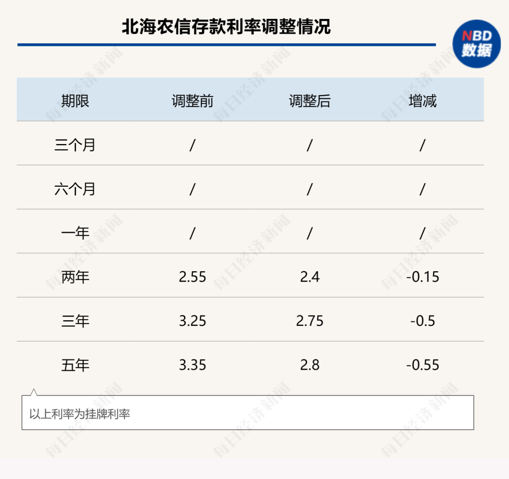
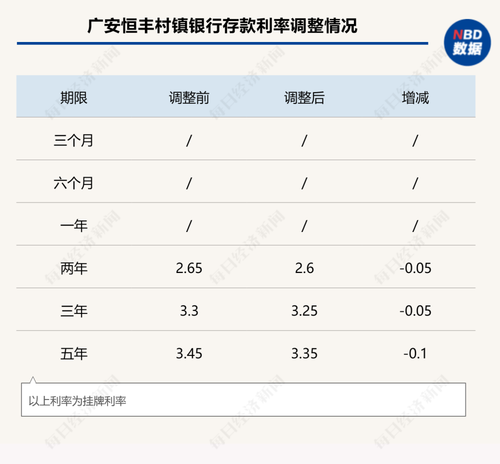
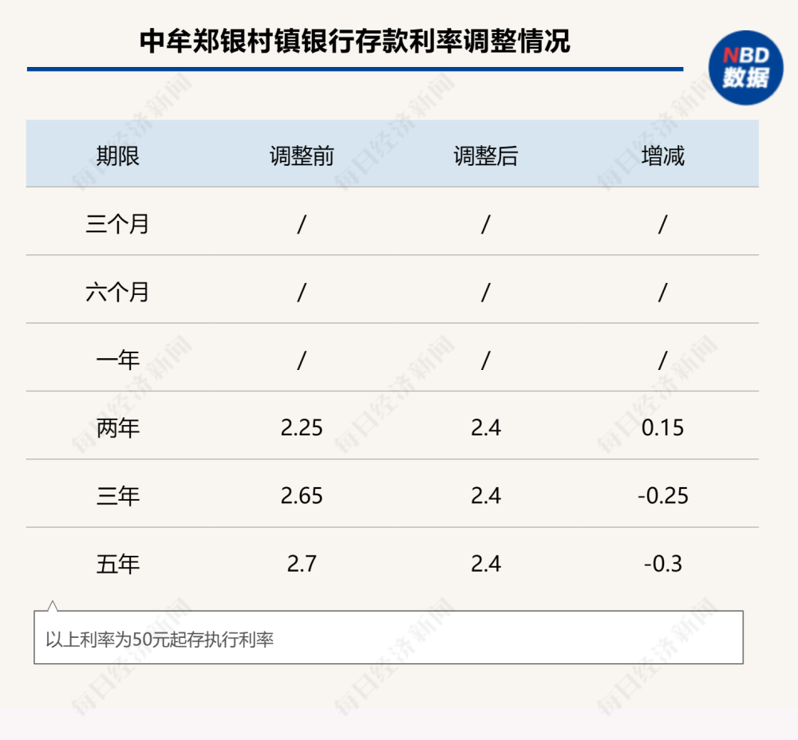
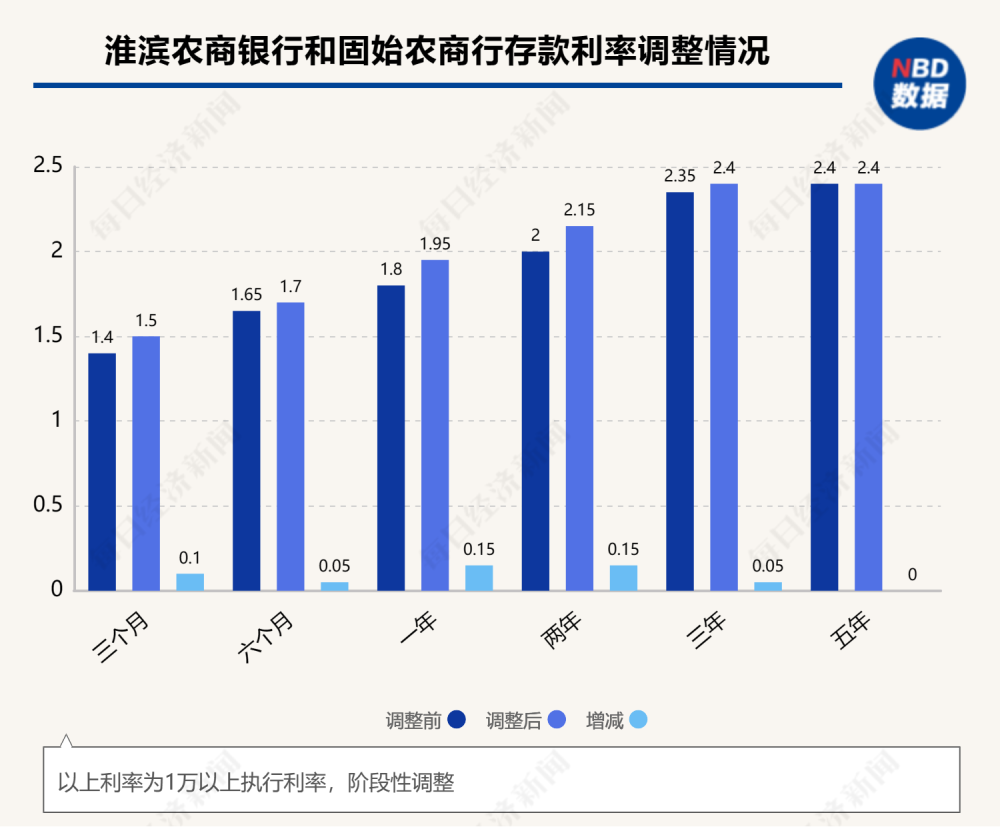

# 有银行给员工下达年末存款硬性指标：“拉不到100万元存款扣工资”

每经记者：张宏 每经编辑：张益铭

岁末年初，中小银行存款利率有升有降。部分中小银行继续下调存款利率，12月12日，北海农信发布消息称，自12月15日起，下调二年、三年和五年期存款挂牌利率。

与长期以来的“降降降”不同，为迎接“开门红”，也有多家农商行、村镇银行宣布上调个人定期存款执行利率。中牟郑银村镇银行、桂林国民村镇银行均将短期限存款利率上调，长期限存款利率下调。淮滨农商银行和固始农商行则将全部期限1万起存的执行利率阶段性上调。

值得注意的是，部分城商行分行为迎接“开门红”，给员工下达了年末存款硬性指标。“到年底要拉到100万的存款，指标完成不了要扣工资，”该城商行员工补充，“完不成扣工资还是第一次。”为完成指标，分行和员工为客户提供现金返现。

国有行员工也在个人养老金、普惠、存款、代发等指标中穿梭忙碌。

中小银行存款利率有升有降

进入2023年最后一个月，在净息差不断缩窄及“开门红”的双重压力下，中小银行的存款利率走向分化。

**部分中小银行继续下调存款利率。**

12月12日，北海农信发布消息，称北海市区联社将自12月15日起，调整人民币定期存款整存整取二年、三年和五年期产品挂牌利率，其他产品挂牌利率不变。调整后，二年期定期存款整存整取挂牌利率为2.4%，三年期为2.75%，五年期为2.8%。

“一年期的利率没变。此前两年期的利率是2.55%，本次下调了0.15个百分点；原来三年期的利率是3.25%，五年期的利率是3.35%，分别下调了0.5个百分点。”北海农信工作人员表示，新的利率从今天开始实施。

12月14日，广安恒丰村镇银行发布公告，自12月15日起调整人民币存款挂牌利率，整存整取2年、3年、5年期个人定期存款利率分别为2.60%、3.25%、3.35%，较此前分别调降5BP、5BP、10BP。

**部分村镇银行则选择将50元起存的短期限存款利率上调，长期限存款利率下调。**

中牟郑银村镇银行公告自本月8日起，两年期存款利率上调15BP，三年期、五年期存量利率分别下调25BP、30BP，调整后的两年期、三年期、五年期存款利率均为2.40%；

桂林国民村镇银行宣布从12月1日起半年期存款利率上调25BP，三年期存款利率下调10BP，调整后的半年期、三年期存款利率分别为2.05%、3.3%，一年期存款利率维持不变，仍为2.15%。

“因为贷款利率一直在降，存款利率也会降。短期限利率上调是考虑到吸储因素”，桂林国民村镇银行客服人员告诉记者。

**部分农商行选择将大部分期限执行利率阶段性上调。**

12月12日，淮滨农商银行宣布，即日起阶段性上调新开户个人整存整取定期存款利率。起存金额大于等于1万元的执行上调后利率，个人整存整取3个月、半年、1年、2年、3年定期存款利率分别上调10BP、5BP、15BP、15BP、5BP，上调至1.50%、1.70%、1.95%、2.15%、2.40%。1万元以下存款则执行原利率。

与淮滨农商银行类似，固始农商行则于本月初宣布阶段性上调新开户个人整存整取定期存款利率。上调幅度、上调后的利率与淮滨农商银行相同。

“这是过年期间的‘开门红’活动，阶段性上调将持续到3月份。”淮滨农商银行客服告诉记者。

而更早一些，广东鹤山珠江村镇银行宣布于11月1日起将整存整取一年期执行利率上调15BP，调整至2.25%；广西兴安民兴村镇银行宣布自11月21日起，对6个月和1年期2款“县域专属定期”存款利率分别上调30BP和15BP。

值得注意的是，当记者以外地储户身份致电上述银行时，部分银行表示，外地储户可以通过手机银行提前支取；部分银行则表示，外地储户虽然可以开户，但非柜业务会受限，如需取款，仍需本人持身份证、存单到柜面办理。

邮储银行研究员娄飞鹏表示，对于银行来说，岁末年初往往是揽储旺季，在利率市场化深入推进的情况下，银行根据自身负债结构特点等，有针对性地调高存款利率有助于更好吸收存款，也有助于优化存款结构。

他表示，中小银行是否会跟进调高存款利率主要看其经营策略，不过在利率市场化背景下，银行根据自身经营需要，在市场化原则下合理加息和降息都是市场行为。

硬性指标完不成扣工资 个别银行向客户现金返现

值得注意的是，为迎接“开门红”，有银行选择调整存款利率，也有银行选择下发硬性指标。

《每日经济新闻》记者注意到，部分城商行为迎接“开门红”，给员工下达了年末存款硬性指标。“到年底要拉到100万的存款，指标完成不了要扣工资，扣一万多，”该城商行分行员工无奈地说道，“完不成扣工资还是第一次。”

为完成指标，分行和员工为客户提供现金返现。在存款利率基础上，按“千2.5”返现。“行里出小头，员工出大头。”该员工用汉语拼音打出“xianjin”二字，并补充，“存1年就行，半年也可以，不过返现也要减半。”

对存款客户进行现金返现是否符合监管规定？娄飞鹏表示，为了吸收存款给客户返还现金是违反监管规定，也是扰乱金融市场秩序的行为。《商业银行法》第四十七条规定，商业银行不得违反规定提高或者降低利率以及采用其他不正当手段，吸收存款、发放贷款。

值得注意的是，对于贴息揽储，监管早已明令禁止，根据《储蓄管理条例》规定，储蓄机构不得使用不正当手段吸收储蓄存款。《关于完善商业银行存款偏离度管理有关事项的通知》规定，商业银行不得通过返还现金或有价证券、赠送实物等不正当手段吸收存款；不得通过个人或机构等第三方资金中介吸收存款。

在规范市场秩序、落实监管规定的同时，需要反思的是，银行和员工为何铤而走险、自掏腰包也要违规？以不正当手段吸收储蓄存款的行为为何屡禁不止？

个人养老金、普惠、存款、代发……不同银行指标不尽相同

岁末年初，国有行员工也在忙着完成各种指标。

在某国有行分行党办工作的王勤（化名）问记者要不要开个人养老金账户。该人员表示，“个人养老金属于全员营销的指标，下半年开始，一直持续到年底。搞竞赛，看别人都开了多少，水涨船高。党办需要作表率，凡事不能落后。”

不过该人员表示，“开了账户，放在那里不用也可以。”

之后想注销怎么办？记者致电银行客服，客服表示，如果个人养老金账户没有存钱则可以注销，如果存钱了，则暂时无法销户，只能转移（到其他行的个人养老金账户），或者等退休后领取个人养老金。

另一国有行客户经理则告诉每经记者，“每个地方指标不一样，我们最近的精力都用在普惠、存款、代发上面，”提及存款指标，该人员表示，“今年区域支行全年存款增量指标8亿，但至今还有5亿缺口。没完成不会扣工资，但是会不发钱、扣业绩。”

对于年末银行业是否存在流动性紧张的问题，娄飞鹏表示，目前银行业流动性总体合理充裕，相对稳定。

一位银行业人士向记者表示，流动性确实是影响银行存款利率报价的因素之一，但加息不一定是因为流动性紧缺。

“一般来说，商业银行总行通过FTP价格引导分支机构的存款定价行为，小一些的机构会直接管理。但无论是不是这个定价管理模式，
最终对客户的存款利率定价，其中一部分反映的就是流动性溢价。也就是说，流动性越紧张的时候，越倾向于更高的报价。”“但是，这种逻辑不能反向成立，影响存款利率的因素不止有流动性。”该人士补充说道。

**商业银行在制定存贷款指标时通常考虑哪些因素？应更注重净息差还是更注重存贷款增速的匹配？**

娄飞鹏表示，存贷比是反映商业银行贷款资金来源和运用情况的重要指标之一，银行在制定存贷款指标时会重点关注。同时，银行在贷款投放时也会根据国家战略需要、政策导向、自身优势，以及资本情况等综合考虑。

每日经济新闻

