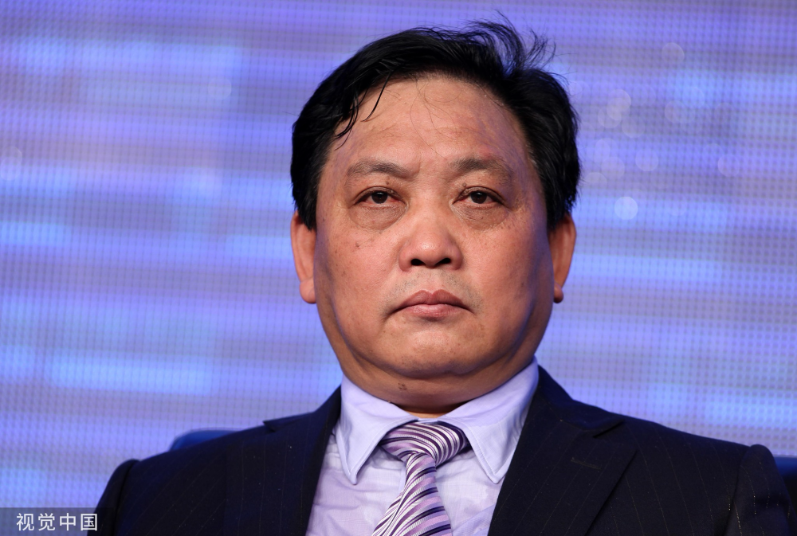
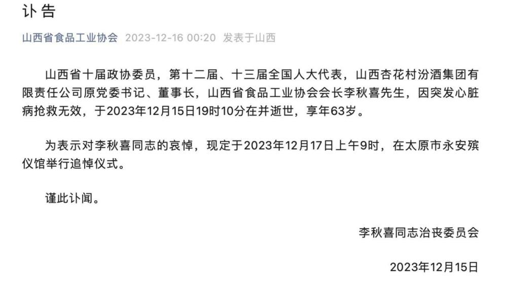

# 李秋喜突发心脏病去世，曾带领汾酒走出困境，硬刚茅台“国酒”商标

_图片来源：视觉中国_

**作者|岳家琛**

**编辑|陈弗也**

**出品|棱镜·腾讯小满工作室**

12月15日晚间，《棱镜》作者从汾酒集团的相关人士处获悉，汾酒集团原党委书记、董事长李秋喜突发心脏病辞世。

李秋喜于2021年12月到龄退休，此后担任山西省食品工业协会会长，根据12月16日凌晨山西省食品工业协会发布的讣告，李秋喜于12月15日19时10分，因突发心脏病抢救无效，在太原市去世。

 _图片来源：视觉中国。“并”为太原市的简称。_

公开资料显示，在12月10日举行的“世界晋商发展沙龙（第三期）”上，已经满头白发的李秋喜还分享了企业管理心得体会。

2005年，李秋喜调任汾酒，当年的山西汾酒营收10.72亿，净利润1.32亿，已不复昔日荣光，全国仅排名第六。2021年12月19日，汾酒发布《关于李秋喜董事长到龄退休辞职的公告》，彼时，汾酒已是主营收200亿级的行业龙头。

2017年初时，山西汾酒总市值仅为147亿元。而李秋喜卸任之时，山西汾酒总市值高达3716亿元。

在他掌舵期间，山西汾酒引进华润战投，在内部管理、组织队伍、营销体系等方面开启一系列改革，2019年实现汾酒集团整体上市。

作为晋商，诚信是他身上最突出的特质。“一个人，诚信是立身之本，其他都是诚信的内涵和外延。”李秋喜曾在接受腾讯新闻《财约你》栏目采访时表示，“要用诚信来支撑企业未来的发展，把晋商这种理念传承给后代，把晋商的精神发扬光大。”http://view.inews.qq.com/a/20210112V00E3X00（此处为《财约你》完整版专访链接）

**“救火队长”**

公开资料显示，李秋喜1961年9月生于山西晋城，毕业于中央党校，1983年9月参加工作。加入汾酒前，李秋喜曾任职于晋牌水泥。

“救火队长”，是人们贴给李秋喜的标签。

回顾他的任职履历，从接手晋牌水泥到掌舵汾酒集团，他多次临危受命、力挽狂澜。

李秋喜早年间在山西天脊煤化工集团任职，曾任集团组织部部长，后升任集团董事、党委副书记。资料显示，天脊煤化工集团现隶属于潞安化工集团，前身为山西化肥厂，是较早发展起来的国内知名复合肥企业，1997年完成改制更名。

李秋喜于2001年赴任晋牌水泥集团。彼时，晋牌水泥正处于历史上最困难的时刻。据媒体报道，前身为山西水泥厂的晋牌水泥，当年“停窑熄火、工厂放假、工资欠发、人心涣散，濒临倒闭”，可谓“四面楚歌”危机重重。

最终，李秋喜通过强力推进改革，仅用了一年时间，就让这个连年亏损的企业成功扭亏为盈，晋牌水泥跻身全国建材业名牌，并开始走上稳健发展之路。

李秋喜与汾酒结缘始于2005年。那年，44岁的李秋喜空降汾酒，出任汾酒集团副董事长、总经理。

当时的汾酒，已错失了与五粮液、泸州老窖、茅台等名酒的竞争契机，全国仅排名第六。“汾老大”的荣耀始终如芒在背。

汾酒曾在1989年时达到巅峰，当时“全国卖一斤白酒有半斤是汾酒”。由于1998年的朔州假酒案，汾酒跌入低谷，完全退守山西。“汾老大”亟待改变。

“汾酒在计划经济向市场经济转轨的过程中，尤其是八十年代后期、九十年代初期，从战略上面失去了一个很好的战略机遇期，没有跟上国家发展战略步伐，有点小步慢走。”李秋喜在接受腾讯新闻《财约你》采访时曾说。

到2009年，五粮液和贵州茅台营收先后破百亿；2011，洋河股份也加入“百亿阵营”。汾酒落后了。

2009年底，李秋喜“临危受命”，当选山西汾酒董事长。

**签军令状“人生最难忘的时刻”**

从2009年12月“掌舵”汾酒，到2021年12月卸任，12年时间，汾酒在李秋喜的带领下高质量地完成了“追赶、领先”的前两步目标，进入了第三步的“全面超越”和“全面复兴”阶段。

其中，2009年至2012年是李秋喜执掌汾酒的第一个阶段。2009年时，山西汾酒总营收仅为21.43亿元，净利润为3.5亿元；到2012年，山西汾酒已经实现营收64.79亿元，净利润13.27亿元。

2012年，汾酒集团营收首次突破100亿。

这之后，三公消费限制令的出台，白酒行业面临严峻挑战。2013年12月，证监会提出山西汾酒与汾酒集团存在人员交叉、机构重合等问题。2014年，李秋喜辞任山西汾酒董事长，时任副董事长谭忠豹接任董事长。

从2014年到2016年，是山西汾酒业绩增长停滞期。这三年，山西汾酒营收增速分别为-35.67%、5.43%和6.69%。

2017年2月，李秋喜再度担任汾酒集团党委书记、董事长。

再度接棒后，李秋喜代表汾酒集团，与山西省国资委签订“军令状”，并表示“完不成目标任务，我将引咎辞职”。

汾酒集团“经营业绩目标责任书”约定，汾酒集团2017、2018、2019年收入（酒类）增长目标为30%、30%和20%；三年利润（酒类）增长目标为25%、25%、25%。

“那是我一生中最难忘的一个时刻。”李秋喜此前对腾讯新闻《财约你》表示，“要背水一战，做最坏的打算，迫使自己必须往前走，没有留后路。”

彼时被认为几乎是不可能完成的“目标责任书”，李秋喜做到了。汾酒在2018年提前完成了“三年经营任务”，实现了“三年任务两年完成”。在随后的2019年，汾酒更是跑出了加速度。

根据山西汾酒历年年报，2017年，山西汾酒营收为60.37亿元，2019年增至118.8亿元；2017年，山西汾酒净利润为10.04亿元，2019年达20.54亿元。

2019年，《山西日报》报道称，李秋喜是“有名的‘闯将’”，“带领汾酒在改革之路上奋力前行，创造了经营业绩两年翻一番的‘汾酒速度’”。

**一系列改革，引入战略投资者**

李秋喜在事后复盘中，将超额完成任务归因于充分放权。

“汾酒品质没问题，文化没问题，历史没有问题，只是我们在运转的过程中，市场拓展力度不够大，体制、机制制约了汾酒的发展。人才支撑有一定的难度。”李秋喜曾对腾讯新闻《财约你》如是说。

“国企有的毛病汾酒都有，国企没有的汾酒也有。”李秋喜曾这样说道。营销能力不足，机制僵化，制约着汾酒的发展。

国企改革，是李秋喜的一大成就。2017年初，山西国企改革大幕拉开，汾酒集团作为试点，接过了第一棒。

这年起，李秋喜相继完成山西汾酒男篮、汾酒商务中心、职工医院等非酒类资产剥离，所有酒类业务“打包”注入上市公司。

2017年至2018年，汾酒集团先后完成对宝泉涌、义泉涌、神泉涌、汾青酒厂、国际贸易公司部分资产、酒业发展区销售公司、宝泉福利公司等的收购整合工作，完成对集团持有汾酒销售公司及竹叶青酒营销公司少数股权的收购。

2019年，汾酒集团酒类业务全部并入股份公司，初步实现一体化运营，基本完成集团酒类资产整体上市，成为山西省第一家、白酒行业第一家整体上市公司。

这之后，李秋喜开启了更加大刀阔斧的改革，在内部通过契约化管理，在用人上实施聘任制，山西汾酒从销售公司入手，解聘了经理层、部门负责人，用市场化的方式聘任管理层。同时进行人员精简，推动组织扁平化，建立了差异化薪酬体系。

此外，李秋喜还推出了股票激励计划等一系列举措，提高了汾酒的整体运行效率与活力。

据李秋喜此前对腾讯新闻《财约你》透露，关于股权激励，最初考虑过全员持股。但对于企业的激励和发展而言，全员持股并不可行。“应该激励真正创造财富的那些关键岗位、关键人。”

同时，李秋喜战略引进央企华润，参与集团层面混改。引入外部的战略投资者也被认为是汾酒复兴的重要一步。

2018年，汾酒集团以协议转让方式，向华润置地集团旗下华创鑫睿（香港）有限公司以51.6亿元转让山西汾酒11.45%股份。汾酒集团持股比例降至58.52%，华创鑫睿成为山西汾酒的第二大股东。华润方面派出3名代表出任董事，其中一人任副董事长。

同时，汾酒进一步优化了股权结构，解决了一直萦绕在山西汾酒与汾酒集团内部的同业竞争和关联交易问题。2019年12月，汾酒主业整体上市工作圆满完成。

对于李秋喜个人而言，2019年，山西汾酒新一届董事会选举中，李秋喜再次当选上市公司董事长，谭忠豹退居副董事长、总经理。

**“硬刚”茅台**

“硬刚”巴拿马博览会金奖叙事，也是李秋喜为人所知的动作。

为提高汾酒在市场中的声量，李秋喜曾多次在公开场合炮轰茅台虚假宣传，称山西汾酒才是1915年巴拿马博览会金奖获得者。

李秋喜各种“掐”茅台，也让其成为新闻人物。2012年，他对茅台申请国酒商标提出质疑，并发出异议书。2018年茅台对商标委及反对同行进行上诉，诉讼以茅台时任董事长李保芳向李秋喜发出道歉函、撤回商标申请而告终。

李秋喜还提出了“汾酒复兴战略”，强调汾酒是“清香鼻祖”，应该和酱香、浓香“三分天下”。

“这几年茅台、五粮液的品牌塑造是很成功的，这个我们是要向人家学习的。”李秋喜告诉腾讯新闻《财约你》，“我觉得谁做得好，我就向谁去学习。对标的目的是为了追赶，追赶的目的是为了超越。”

李秋喜也不是“完人”，在带领汾酒复兴的过程中，他也曾走过弯路。

清香型白酒相对缺乏高端白酒品牌，山西汾酒自身也曾长期强调其“平民酒”身份和价格优势。在作为高端白酒标志的“千元价格带”上，山西汾酒上市了定价1099元的青花汾酒30·复兴版。

这是山西汾酒首次卡位“千元价格带”。然而提价约3个月后，由于提价过猛，市场并不买账，最终经销商只能通过“价格倒挂”的方式清掉“青花30”的库存。

2021年12月19日，年满60岁的李秋喜到龄退休，不再担任任何职务。原山西交通控股党委书记、董事长袁清茂接任。

彼时卸任新闻传出之际，山西汾酒盘中一度接近跌停。市场的反应某种程度上也体现了李秋喜在山西汾酒的影响力。2017年以来，山西汾酒的市值排名超越洋河股份和泸州老窖，从第五位跃升至第三位。

16年汾酒人生，也让汾酒烙下太多“李秋喜烙印”。以至于当他卸任时，媒体提出了“汾酒路在何方”的疑问。

交出汾酒这家近4000亿市值的上市公司时，山西汾酒的营收增速和净利润增速分别为42.75%和72.98%。不过从2022年开始，山西汾酒的增速已有放缓迹象。

2023年三季报显示，前三季度，山西汾酒实现营业收入267.44亿元，同比增长20.78%；实现净利润94.31亿元，同比增长32.68%。在第三季度单季中，山西汾酒营业收入为77.33亿元，同比增长13.55%；净利润为26.64亿元，同比增长27.12%。

汾酒能有今日的成绩，李秋喜功不可没。李秋喜的人生已经驶向终点，而“汾酒号”列车未来将会驶向何方？

