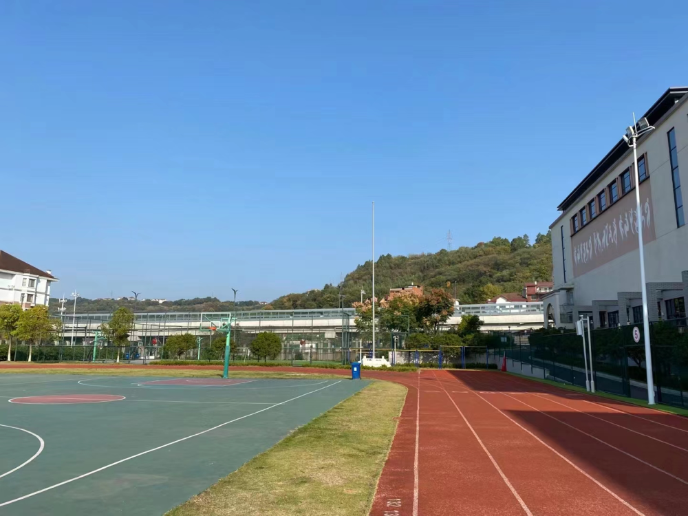
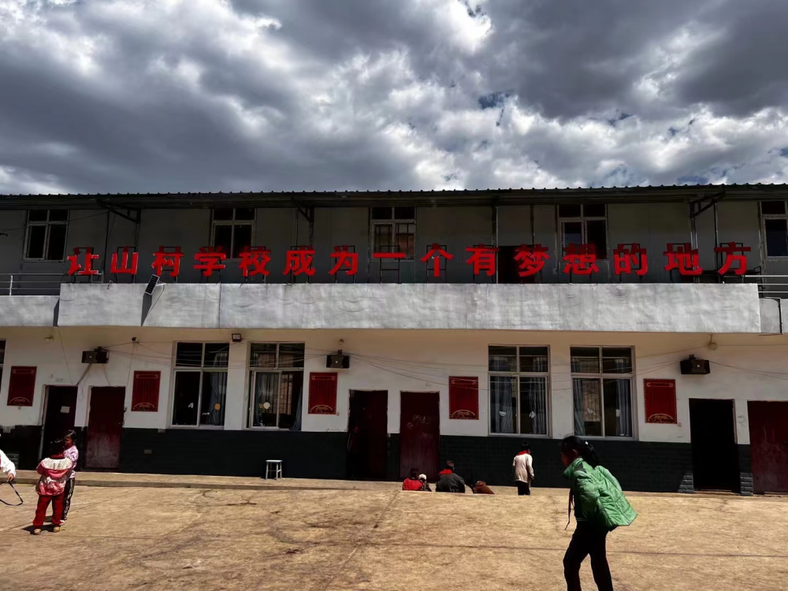
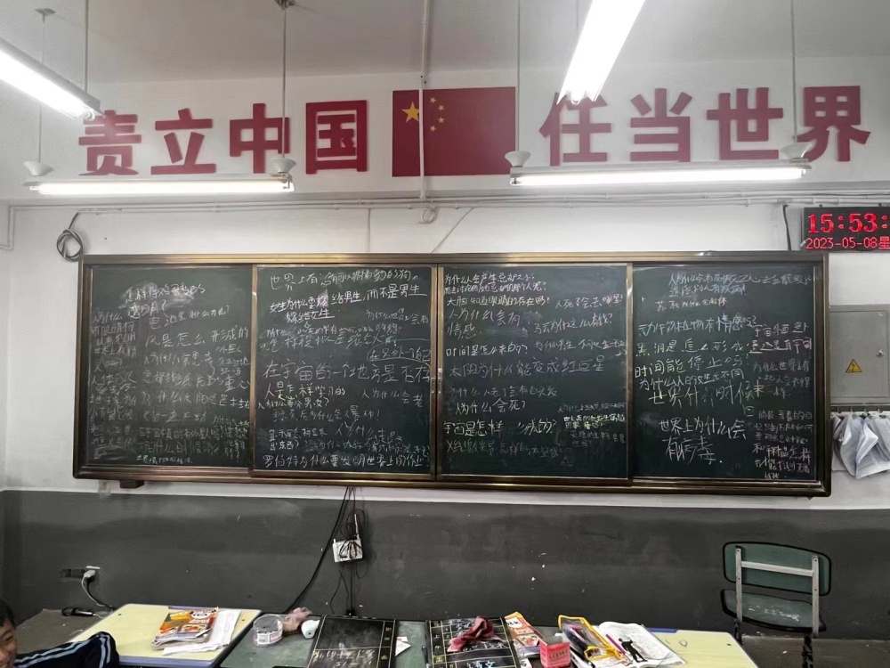

# 活在社会想象外的中小学老师：“你能想象晚自习要上到9点的小学吗”

“你能想象晚自习要上到9点的小学吗？”

晓非见过，他是某985高校教育学专业硕士，曾到四川省凉山彝族自治州昭觉县一所小学支教过一年。在这里，老师会全天候监管学生一举一动，一手抓学习，一手还要应付非教学任务。

他也不例外，要在三个角色之间不断切换——语文老师、包班老师、校长办公室副主任，日常工作除了教学，还要策划活动比赛、收集学生资料、组织家长开展主题教育等等。

在社会的想象里，中小学教师总是跟“铁饭碗”“工作稳定”“寒暑假带薪”“社会地位高”等词联系起来。而晓非却看到了活在社会想象之外的中小学老师的真实状态。

曾经担任过高中老师的陈晨自嘲自己成了“仆人”“表姐”，接不完的家长电话，填不完的表格，以及干不完的活。刘艳也是一名高中老师，在办公室里，班主任的口头禅是“抽空备个课”。“备课上课好像反倒成其次的了。”刘艳说，教师行业还有一句戏言，“也就除了火葬场不给咱们安排活了”。

当班主任比居委会更能触达家庭、点对点联系家长和孩子，很多非教学性任务借机纷纷进校园，社会把增强民众教育和提高防范意识的部分压力转移到学校，学校再层层压到老师身上，老师成了各类形式主义的“迎接检查专业户”。

前有湖南湘西教师李田田撰文批判形式主义检查，后有郑州一小学教师吕某留下遗书随后坠楼自杀，让老师回归教书育人的呼声越来越高。

研究教育学的晓非不禁发问：我们究竟应该如何才能将老师“解放”出来？非教学类工作该由谁来做，如何合理配置人力资源？这些工作到底有没有价值，是不是必要的？教育的本质是什么？

**“我们有个称号叫‘表姐’”**

“小学老师的实际工作内容和社会想象之间偏差太大了。”陈晨目前在西安一所公立小学担任一年级班主任和语文老师。她坦言，老师快成仆人了，大家有一个外号，叫“表姐”。

这句玩笑话的背后是他们日常的工作状态——填不完的表格，包括班级工作日志、班级安全日志、家校沟通表、家访表、教学计划表、教学任务表，大单元教学表，特色作业表等等。单单是特色作业就包括特色教案、设计、目标、依据、内容、效果等等。

她解释，安全日志是用来保护老师的，万一学生出了什么安全问题，教师往往是第一个被举报的，如果有存档、留底、证据，老师就可以拿出来保护自己。

在小学阶段，如果出现传染性的疾病，班上学生请假到一定程度会停课，她需要记录谁生病请假了，生的是什么病，体温多少度，家在哪里，在哪个医院就诊，几点就诊，就诊结果，医生建议等等，工作繁琐。作为一个老师，备课上课才是本职工作，但她每天的备课时间被挤压到只有“一小会”。

彩云在小学任教了29年，曾担任14年班主任。在她看来，学校大概是从二零一几年以后开始变得很忙，老师工作之余还要完成很多非教学任务。尤其是疫情期间，孩子不能到校上课，老师们除了准备课件、线上授课，还要穿上防护服参加社区防疫检测工作。

在日常工作中，她负责学校的话剧社团，有其他学校来参观学习或者县里举办文化节，她就要带着孩子汇报表演。此外，她每天还要登录某学习类APP，打卡做摘录笔记，分数不能低于30分。她下载了多个APP，参与各项调查，比如政府创建文明城市调查、教育安全平台等，不断催促家长和孩子完成网络学习。

学校为了创建示范学校，经常要做统计，为了迎合领导的检查，老师需要准备很多资料，缺少的记录还要补回来。例如她教音乐课，还兼着上其他课，都必须要有教研活动的记录，以备教学检查，以此证明学校的教育没有缺位。

年轻老师则更辛苦，不但要运营宣传学校的公众号，还要参加各种教学比赛，例如优质课比赛、文艺汇演、课堂乐器比赛等。老教师基本上能推就推，年轻教师只好上场。很多年轻老师拉不下脸来拒绝，也不敢说不，从早上忙到下午，甚至忙到深夜，要是在学校做不完，只能带回家做，疲惫不堪。

_彩云任教的学校。本文图片均由受访者提供_

**“班主任负责学生在学校的一切”**

刘艳大学毕业后进入县级一所寄宿制高中教书，今年是她工作的第五年。“可以毫不夸张地说，学生在学校的一切都是班主任负责。”

普通老师除了要上课、跟进早晚自习，还要备教案课件，参加教学研讨，要坐班、签到、监考改卷、出课时练习题、培优补差等等。而班主任还远不止这些工作，教书育人以外，还要完成领导和一些部门安排的活。很多任务和教学并无直接关系，但学校会用检查倒逼老师执行。

通常来说，对于没什么经验的新老师，学校会分给他一个普通的班，这意味着学生的学习习惯和成绩都一般，需要老师投入大量的精力和心血。没有经验的新老师，遇上调皮难管的学生，以及时不时安排任务的领导，经常会觉得很无助。

办公室里，一些班主任老师的口头禅是“抽空备个课”。“备课上课好像反倒成其次的了。”刘艳说，教学如同学习，每个人用的方法不一样。学校似乎要用更多量化的标准来规训每个教师，这样做只是方便了领导检查，对于教学成绩的提高作用并不明显。

她觉得，现在教育行业是家长累、学生累、老师也累，但好像收效甚微。这也是某种程度上的内卷，在资源有限的情况下，想要获得资源就必须内卷。在这个程序里，教师好像是一种内卷的燃料，很少有人在乎教师的处境。

陈晨刚毕业没多久，在当小学老师之前，她曾去了乡镇的一所私立高中任教，带高二的班级。待了三个月后，因为工作压力太大，她辞职了。她自嘲，感觉自己是在拿命去换那一点点“窝囊费”。

她每天的工作和生活像卷进了不能停歇的系统里——带两个班，工作日早上5点半起床，六点跑操，上午一般有4-6节课加早读，两次大课间跑操，下午一般有1-2节课，晚上十点半下晚自习。学校实行班主任陪餐、陪寝制。早餐、午餐和晚餐时间，学生在吃饭的时候，班主任不可以就餐，要站在饭堂监督学生。另外，午休和晚上，她还要到学生宿舍巡逻查寝，等学生全部睡着之后，才有自己的休息时间。每晚等她忙完回到宿舍，已经是深夜11点半，甚至接近零点。

有时候，宿管会突然在深夜给她打电话说哪个学生不见了。有的学生可能会偷偷跑出去谈恋爱、翻墙上网。她只能立马穿戴整齐出去，到处找学生。家长可能还会在深夜12点甚至半夜两点给她打电话，甚至领导可能半夜召集老师紧急开会。

在那三个月里，她见到了各类事情发生，有学生割腕，有学生被诊断出躁狂抑郁症，还有学生同性恋。让她更崩溃的是，有的学生明明做错事了，但家长无理取闹甚至放狠话恐吓她。她比较早上学，21岁就毕业参加工作了，面对这些棘手的事情，几乎天天崩溃大哭。

**“教师的崇高感是我‘下不来的高台’”**

教师似乎不好意思公开谈钱。

彩云所就职的小学在浙江省绍兴，她解释，老师的工资是按级别的，一般资历越老、工资越高。除了基本工资，老师每个月有绩效考核奖，以1000元作为基础打底，代课费是一节课10元，带班主任一天是20元，另外按教龄每年补贴10元。

彩云有29年的教龄，考核奖可以拿到1290元，再加上到手的基本工资2900元，一个月拿到手的钱也只有4190元。

而那些年轻老师工资更低，很多还要靠父母补贴。她的办公室里有一位年轻老师拿到手的基本工资，扣去五险一金和所得税，本来只有一千多元，去年刚涨到两千多元。年轻老师通常拿着最少的钱干着最重的活。

“一线老师很多时候是弱势群体，出了什么事，领导和家长第一个想到的就是找老师。”彩云说，对于普通老师来说，很多时候能做什么、可以做什么，取决于领导能否为老师担责，家长能否理解老师。

在河南新乡任教了5年的年轻老师刘艳，也觉得付出和收获严重不对等。她每月基本工资2100元左右，课时费1000元左右，算下来大概三千元，这个收入即便在小县城也算低的，老师成了“钱少、事多、压力大”的低收入群体。

对刘艳来说，教师这份职业的崇高感是“下不来的高台”。她感觉周围的人对老师的学识、道德、人品有一种不切实际的高要求，让她压力很大。以前的教师工作自由度更大，现在的教师谨小慎微，就算干得再努力辛苦，一个举报就可以抹杀了所有努力。“教师好像不被允许抱怨，是一个失去了表达权利的群体。”

郑州“00后”女教师吕某因为压力过大坠楼自杀后，有的学校给老师安排了心理讲座，还要求老师写心理报告，做心理评估测试等等。陈晨觉得，这样反而增加了大家的工作量和心理负担。

陈晨所在的小学直接给每位老师发了一张购物卡。她觉得这是安抚老师最有效的手段，“嘘寒问暖不如直接打款”。虽然购物卡金额不多，但她确实感受到了温暖。

她也学会给自己一些私人的空间，例如跟家长“立规矩”：晚上七点以后尽量不要给她打电话，不太急的事可以先微信留言，等到第二天工作时间再回复，如果遇到非常紧急的事就直接打电话给她，她随时接听。

有时候走在路上，有人向她打个招呼，问问最近怎么样，工作还顺利吗，有什么需要帮忙的吗？即使只是一句客套话，也会让陈晨感觉到有人在关心她。

**教育没有标准化模板**

这些非教学工作到底是不是有价值和必要的？教育的本质是什么？

晓非一直在思考这个问题。作为某985高校教育学专业硕士，他曾作为支教团一员参加了国家的西部计划，到四川省凉山彝族自治州昭觉县一所小学支教了一年，以研究者的视角深入思考中小学教育中存在的问题。

 _晓非支教的小学。_

在学校里，他有三个角色身份：语文老师、包班老师和校长办公室副主任。为什么很多事情要跟老师直接关联起来？在他看来，老师是最容易实现点到点触达家长、联系群众的桥梁。甚至居委会对业主的干涉都是有限的，解决问题的能力还远比不上学校里的老师。老师也因此被迫承接了很多本不属职务范围内的工作。

为了了解每位学生的信息，班主任要经常联系家长，填写表格和资料。有些材料确实可以提高集体管理的效率，但也挤占了教师的时间精力。他认同有些教学外工作是需要做的，但他不认同让班主任承担全部。

校长和晓非想到了一个解决办法，就是增加一位副班主任，从学校里的闲职岗位中选。例如跟晓非搭档的副班主任是学校的合同工，平时担任图书管理员，他是凉山的彝族本地人，对学生的家庭情况和住址反而更了解。

 _晓非班上有学生住在悬崖村里。_

晓非觉得，既然有的老师承担的工作压力过大，学校为何不多招人？现在求职难，即便是合同工，也有不少人想在中小学谋求一份稳定的工作，不存在招人难的问题。学校也有很多闲职岗位，可以充分调动起来。

晓非也注意到网络上热议的教育疲态现象——老师疲于应付各种检查，家长疲于配合学校各种要求，学生疲于完成各种课业，压力大睡眠不足。

在晓非看来，教育疲态背后，一方面是学校担心学生出事故，减少安全事故，降低学校管理的压力；另一方面是，学校以成绩和升学为导向，把学生对知识的接受和掌握作为教育的目的，学生考出好成绩，学校的名声才会更响，就越能吸引到更多好的生源，形成循环。

“你能想象晚自习要上到9点的小学吗？”晓非发问。在他支教的小学里，老师会全天候管着学生的一举一动。以语文课为例，如果老师觉得当天的语文课讲得不够，就会在晚自习继续上课，讲完后老师会采用题海战术，比较卷的班级一到期末能做掉30套卷子。不过，学生课余活动没有那么丰富，每天只有两件事：学习和运动，生活状态比较简单，开心得也很纯粹。

大家为什么要死记硬背？因为效果好，成绩提高比较明显。即便还只是小学，学生的压力也很大。县城里好的学校只有那么几所，如果没有在小升初考到好的中学，一环紧扣一环，以后考上好的大学概率就更小了。在经济欠发达地区，学校无奈只能实行应试教育，导向比较功利。

但晓非觉得，学校除了培养孩子的认知能力，还应该培养他们的社会与情感能力，例如创造力、合作力、利他主义等等。社会与情感能力影响人的性格，作用于人的一生。“现在很多学校往往忽视了这一点，转而只重视认知能力的培养，其实在终身学习的观念里，这是舍本逐末、本末倒置的做法。”

在他看来，如果教育变成了一个放之四海而皆可用的标准化模板，学校只按安排照做，没有充分理解教育的内涵的话，教育可能会变得片面化、浅表化，不利于培养真正的“人”，“完整的人”。

 _晓非让学生在黑板写下他们想问的问题。_

（文中受访者均为化名）

