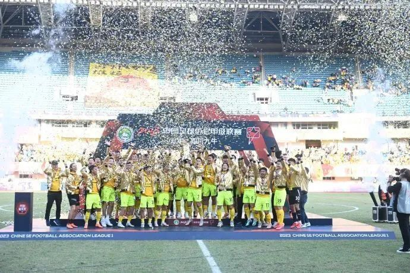
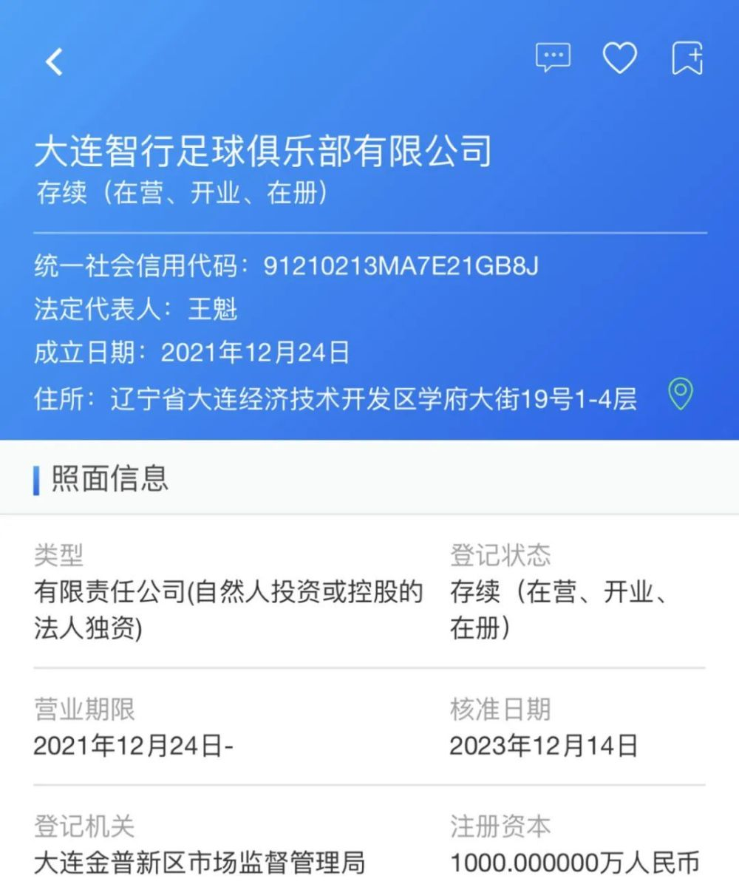
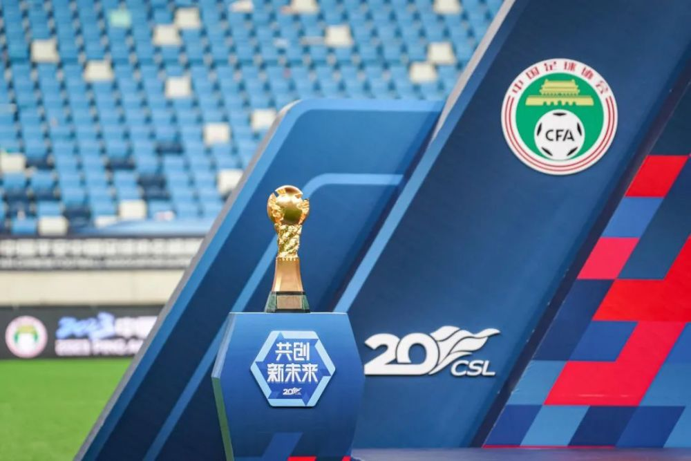
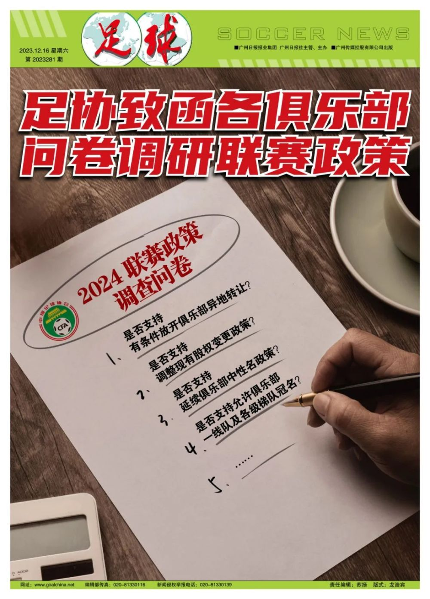

# 足协致函俱乐部调研联赛：异地转让、一线队冠名、增加外援等成焦点

**记者鲁蜜报道**
虽然中国足协在11月25至27日在苏州召开了职业联赛工作会议，但2024赛季的联赛相关制度仍然存在变数。本报获悉，中国足协于12月12日向三级联赛各俱乐部下发了《关于征求2024赛季职业联赛相关政策意见的通知》，以调查问卷方式向各俱乐部进行调研。调研内容主要包括三大方面，分别是联赛相关政策、准入相关要求以及竞赛办法。调查问卷上交的时间是14日，考虑到这一调研的进行，以及后续调查结果整理、可能发生的相关政策调整所需的时间，不排除准入结果的公布还会后延。

在《关于征求2024赛季职业联赛相关政策意见的通知》中，相对重要的是第一大方面，也就是联赛政策，这部分，足协设置了5个相关问题。

第一个是对于有条件（转出地体育局和会员协会同意转出，转入地会员协会、体育局及当地政府同意转入，5年内不得再转让）放开俱乐部异地转让政策是否支持。

异地转让放在首位，是因为这几年，谋求异地转让的俱乐部很多。如去年的淄博蹴鞠，就谋求转让到重庆某区县，今年也有几家中甲球队试图到重庆谋生存；去年还在中甲的九牛，一度获得了长沙方面的转入许可以及四川省足协方面的转出许可；与这两家俱乐部有相同想法的，还有很多，但去年这一政策要放开之际突然被叫停，多家俱乐部搬迁计划落空。

本赛季联赛结束后，多家俱乐部希望“放行”异地转让，并且提前做了准备。近日，有消息称，一家名为深圳深城足球俱乐部有限公司于12月14日注册成立，由城市集团中国区CEO汤锡钢任执行董事、总经理、法人代表，四川九牛百分百控股股东北京映像汇文化创意有限公司百分之百持有深城俱乐部股份。这说明，九牛在迁到深圳方面，已提前做了准备。

众所周知，上赛季降级的深足债务庞大，欠薪严重，在准入上困难重重，而深圳对于职业俱乐部来讲具备足够的吸引力，所以，谋求搬迁到深圳的职业俱乐部不少，除了九牛外，至少还有两家也有这个想法，包括同省的中超球队梅州。

是否允许俱乐部异地搬迁，足协此前有过表态，大概率在2024赛季维持原样。不过，从目前的时间点及足协发布问卷的情况来看，三级联赛俱乐部的意见，或许会成为重要参考。

问卷中，联赛政策相关的第二个重要议题是是否支持“调整现有股权变更政策”。在2016年足协印发的关于《中国足协职业足球俱乐部转让规定》的通知中，对俱乐部股权转让有明确且相当细化的规定。

在转让形势和原则上，足协规定，职业足球俱乐部可进行重要股权转让和次要股权转让，其中，重要股权转让是指俱乐部全部股权或重要股权、表决权
(股权变更后，股东持股比例不低于30%，或股东拥有表决权比例不低于30%)发生变更，或因股权变更、更换法定代表人、借款、抵押、股权质押、代持协议等方式而使俱乐部的控股股东、实际控制人发生变更的股权转让；次要股权转让是指除以上重要股权转让外的股权变更。

这其中，重要的一点是，获得升级资格的俱乐部，在当年低级别赛季结束后的一年内不得进行重要股权转让，而这，这就关系到上赛季中乙亚军大连智行的命运了。

11月29日，大连市公安局对大连智行俱乐部提起司法拍卖，拍卖标的物为俱乐部100%股权。拍卖于12月1日8点正式开始，起拍价为146.74万元，保证金300万元。虽然首轮流拍，但12日早上，有买家按照起拍价出价。有证据显示，大连智行已完成负责人变更，变更前负责人为周传余，变更后的负责人为王魁。但是，如果继续按照2016年的这版股权转让政策执行，大连智行的转让，是“无效”的。

而第三和第四个议题则均与中性名有关，分别是对于“延续中性名政策”是否支持，以及对于“允许俱乐部一线队以及各级梯队冠名”是否支持。

中性名改革，是2015年国务院出台的《中国足球改革发展总体方案》50条中明确提到的，2020年12月足协发布的《关于进一步推进足球改革发展的若干措施》中，强调各级职业俱乐部于2021赛季前完成名称
“非企业化”变更，未完成变更的，取消俱乐部注册资格。以准入为前提，中性名时隔5年落地，但在当时，外界认为“一刀切”的做法过于粗暴。

采取中性名，加上疫情，不少投资人对足球失去兴趣，进而对俱乐部的运营产生了较大影响。不过，在这个问题上，大趋势如此，应该没有走回头路的可能。但在一线队和梯队冠名上，可以打开一扇窗，对于各俱乐部来讲，算是意外之喜，如果施行，收入应该会有一定的增加。

联赛政策的第五个调研问题是，是否继续沿用原有俱乐部财务约定指标。鉴于目前三级联赛的生存困境，原定的财务约定指标发生变化的可能性不大。

此外，问卷调研还涉及到准入相关要求和竞赛办法两大部分。准入部分涉及现有俱乐部梯队数量要求和体育场相关要求两部分。而竞赛办法则涉及到职业联赛现有竞赛办法及赛程安排和职业联赛外籍球员政策两部分。

有关于外援政策有五个选项，分别是：A：增加外援名额；B：报名人数与上场人数一致；C:减少外援名额；D:增加年轻外援名额；E:其他意见。这项政策可多选，考虑到宋凯在就职中国足协主席时曾谈到“将对标亚足联规则,研究放宽外援政策”，所以不排除外援政策发生变化，但与关系到俱乐部准入和生存的问题相比，改变此政策不存在迫切性。

14日，在问卷调查截止当日，所有俱乐部都将意见回馈到了足协，据悉，足协最早在下周根据问卷有所行动，毕竟，只有新赛季联赛政策落地，准入才会有定论和结果。

