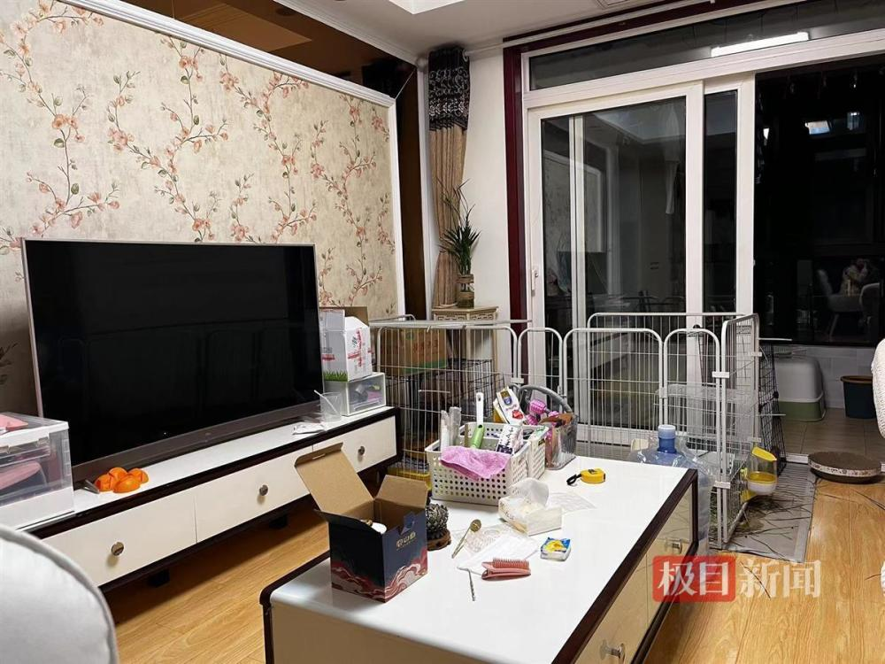
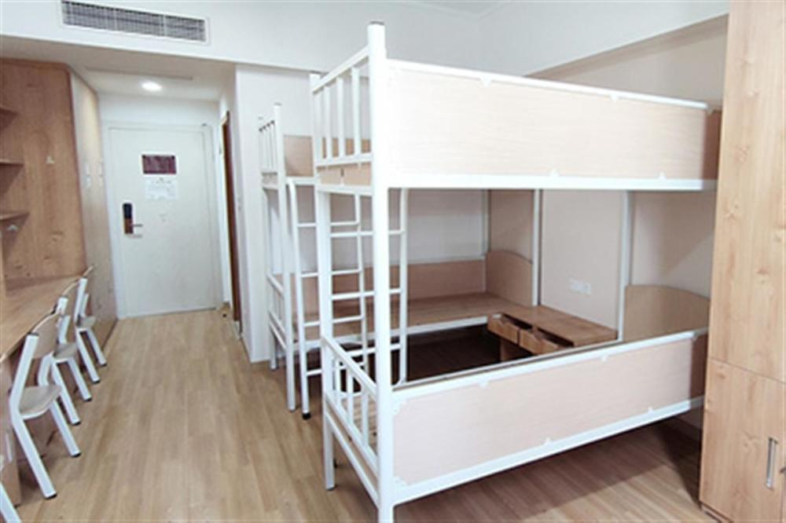

# 住不进校内的专硕生：有人房租是学费的3倍，有人一年花1600元住公寓

近年来，“多所高校不为研究生提供住宿”屡次登上热搜，部分学校表示不为专硕生提供住宿，其中不乏北京大学、复旦大学、南京大学、南开大学等名校。

极目新闻（jimu1701@163.com）记者采访了多名目前正在就读或已经毕业的专硕生。他们都因为学校不提供住宿，在外租房，提前成为“漂”在城市中的一员。他们中，有的房租超过学费的三倍，有的住进学校附近的“老破小”，还有人一年只花1600元住进了离校6公里的公寓。有人感觉因住在校外对学校缺乏归属感，有人觉得能提前学习独立生活。

专家认为，大学不为研究生提供住宿服务，推进后勤服务社会化，是大势所趋，但高校要解决这一问题，不能简单地要求专业硕士自行租房，而应该从学生的实际情况出发，为他们校外租房提供相应的便利，需要社会有相应的配套服务，保障社会化后勤服务方式的公益性。

**有人一年房租是学费的三倍，有人入住一年1600元的公寓**

2021年，黎朝义通过了“梦中情校”南京大学的硕士研究生招生考试初试。复试前夕，她才从学姐那里了解到，她无法入住学校的宿舍。

2021年开始，南京大学不再为全日制专业硕士提供校内住宿。黎朝义最终通过复试被录取，她说自己埋头复习，好不容易考上自己梦寐以求的南京大学，结果无法住在校园内，还是有些遗憾。

 _黎朝义租住的房屋（受访者供图）_

黎朝义的遭遇并非孤例。极目新闻（报料邮箱：jimu1701@163.com）记者了解到，考研大潮下，本就有很多学校不为非全日制研究生提供宿舍。近年来，包括北京大学、北京师范大学、复旦大学、南开大学等名校均开始不为全日制专业硕士研究生提供宿舍。

专业硕士分为全日制和非全日制，对于非全日制专业硕士而言，他们多数可以在职读研，有一定的经济来源；对于全日制专业硕士而言，他们是在校学生，无经济来源。随着多所高校不再为全日制专业硕士提供宿舍，他们在“考研上岸”后的校园生活与传统的大学校园生活不太一样：因为学校不提供住宿，他们在外租房，提前成为“漂”在城市中的一员。

多名全日制专业硕士告诉记者，他们的学校位于一线城市中心，难以在学校附近找到价格低廉又合适的房子。通勤时间、居住质量和价格成为“不可能三角”。例如，复旦大学所处的位置周围基本上是建于20世纪八九十年代的老破小。去年毕业的复旦大学2020级硕士研究生张晨称，当年入学时，为节约通勤时间，她选择牺牲居住质量。为了节约房费，她和同学共三人合租了一套月租为5800元的两居室，两个人住在一个大房间内。“房子60平方米，八几年建的，管道堵了两次，还漏水。”

学校在郊区的学生则面临通勤问题。黎朝义所在的南京大学仙林校区周边比较偏僻，附近并没有太多可供租住的房子。

为了找房子，黎朝义找遍了南京大学仙林校区附近的小区，稍微繁华一些的小区均集中在距离学校4公里的仙林湖附近，黎朝义租的房子就在这里。小区位于二号线终点站外将近2公里。“再往东一点，就出南京了，离句容就两条街的距离。”她整租了一间屋子，月租2500元，加上物业水电费大概每月支出2800元左右。计算下来，她一年光是花在房租上的费用就要3万多元，是学费的三倍有余。

因为交通不便，妈妈心疼女儿，给她花9万买了一辆新能源汽车，充电费一个月下来要60元。为节约开销，她又花1300元买了一辆电瓶车。不下雨的天气，就骑电动车上课，这样一周充电只花3元钱。另外，学校每年会为租房的专硕生提供2000元的交通补贴，为黎朝义稍微减轻一点负担。

为了解决专硕学生住宿问题，部分学校联合社会力量向学生提供更廉价的公寓。复旦大学就联合社会力量，为学生设立爱久公寓。2021年保研进入复旦大学的专业硕士宁宇说，当时自己已有四次租房经验，但在学校周围并未找到满意的房子，于是她选择了居住在离学校6公里远的爱久公寓，一年只需花费1600元。

**有人认为对学校缺乏归属感，有人觉得能提前适应独立生活**

尽管住进了价格便宜的公寓，但从住进爱久公寓的第一天起，宁宇却感觉自己没什么上学的体验感。

和普通学生不同的是，住在校外的研究生宁宇每天醒来要考虑的第一个问题就是“通勤”。爱久公寓距离复旦大学约6公里，由于学校安排的班车最晚一班是8点多，宁宇10点才上课，因此基本没坐过班车；因为地理位置偏远，打车也要等一二十分钟。所以宁宇上课都选择骑车二十多分钟到学校，到学校时她经常感觉双腿酸痛。因此，每次从公寓出门前，宁宇都要做心理建设。

 _复旦大学爱久公寓（图源：爱久公寓官网）_

通勤问题直接影响了她的社交。周末绝不出门，除非有人约；每次有人约也都要把时间定在课后，这样可以节省一次额外的通勤时间。在开学前，宁宇想着一定要多认识几个男生，但住进了爱久公寓以后，她只认识了班上的三个男生。

张晨的住处虽然离学校很近，但没课的时候，也不会像其他学生一样到校园散步，而是会直接回到宿舍，晚上学校有活动也不方便参加。因为张晨住所楼下环境相对复杂，她晚上一般都不外出。张晨甚至觉得：“不住学校，你感觉跟上了个MBA一样，跟学校就是纯纯的买课关系。”

但“漂”在校外也有好处。张晨告诉记者：“我和室友的关系很好，因为大家毕竟是患难与共，还可以提前积累一些社会经验，包括租房子有问题怎么办，怎么和社会上的人相处。”

为了补贴生活费，黎朝义平时会做一些实习和兼职。她做过很多看起来和本专业不那么相关的兼职：考研辅导、南京某博物馆社教公司的课程设计和助教，还有某电视台栏目组文化顾问。因为住的位置太偏僻，兼职来回通勤都需要两个小时以上。好在她的导师非常理解她，鼓励她们多去校外参加实践。“这也对我将来就业有积极的帮助，起码让我对这个行业的运行有一个大致的了解。”黎朝义说。

南开大学研究生李毅家在天津本地，但因为家离学校比较远，他读研期间选择在学校附近租房独居。“我觉得挺好的，我比较喜欢一个人住。”李毅觉得，虽然远离了集体生活，但也减少了很多无用的社交，有更多时间和自己相处。

尽管明知读研需要花费不菲的价格，但多数学生觉得，这个成本是值当的。黎朝义觉得，虽然在南京大学读研时花费了20余万元，但自己以后想要继续读博，以后也想要留在南京。“学校如果能多给一些补贴就更好了。”黎朝义说。

复旦大学2021级专业硕士生李尚告诉记者，他考前择校期就知道复旦大学不会给专硕生提供宿舍，读研花费的成本大约在16万元，但他认为这个成本能抵得上其价值，“参加工作之后一年就挣回来了”。

**后勤服务社会化是大势所趋，但需要相应的公益性配套**

极目新闻记者注意到，近年来，考研人数持续增加，根据官方公布数据，2020-2023年的考研报名人数分别为341万人、377万人、457万人和474万人，2024年略有所回落为438万人。2020年-2023年研究生录取人数分别为99.05万人、105.07万人、110.35万人和124.25万人。

与此同时，不为专业硕士提供住宿的高校在增加。据不完全统计，除南京大学外，2024年已公布的研究生招生简章中，北京大学、北京师范大学、复旦大学、南开大学均明确不为全日制专硕研究生提供住宿。湖南大学则明确，全日制硕士研究生住宿实行自愿申请制，学校根据现有的宿舍资源，在一定范围内提供房源给新生选择。

12月15日，针对近日网上讨论度颇高的研究生不提供住宿问题，复旦大学研究生招生办回应称，从2019年起复旦除个别专业外，专硕都不提供宿舍，主要原因就是宿舍不够用，有的院系会发放一些住宿补贴。

曾有学生质疑，学校这样的做法会增加学生负担。也有不少学生疑惑：同样是硕士研究生，为何学术硕士就可以住校内集体宿舍？

中国教育科学研究院研究员储朝晖告诉极目新闻记者，这与专硕的发展过程有相关性，多年前我国的专硕主要以在职就读人群为主，但现在报考全日制专硕的学生人数增多，甚至超过学硕人数。高校在宿舍资源有限的情况下选择了基数更大的专硕学生，有利于缓解宿舍紧张的现状，而学硕学生相对而言，在校时间更长，更需要利用学术资源，因此该措施有一定合理性。此外，出于公平的考虑，学校也应对专硕生做出一定的补偿措施，如给予一定的租房补贴。

教育学者、21世纪教育研究院院长熊丙奇从现代大学建设角度提出建议。他认为，大学不为研究生提供住宿服务，推进后勤服务社会化，是大势所趋，但高校要解决这一问题，不能简单地要求专业硕士自行租房，而应该从学生的实际情况出发，为他们校外租房提供相应的便利，需要社会有相应的配套服务，保障社会化后勤服务方式的公益性。

近年来，由学校提供集体宿舍的服务方式，越来越不适应高等教育改革与发展的要求。如大学推进学分制教学管理，实行弹性学制，用5年或者6年时间完成本科学业的学生，宿舍怎么解决？这些学生增加，学校宿舍就十分紧张。同样，随着我国高校加强研究生培养质量把关，有的研究生延期毕业，解决他们的住宿问题也是一大难题。如果都由学校解决这些学生的住宿问题，学校就会选择不推进教育改革，让学生在规定时间中毕业。

另外，让专业硕士到校外租房，是高校应对研究生扩招的现实选择。如果必须由学校解决学生住宿问题，扩招就会受阻。

一些人呼吁高校应该结合扩招，增加宿舍供给。这也需要前瞻性规划。需要注意的是，未来10年，我国高校都将面临扩招压力，因为2016年、2017年是我国进入新世纪以来的出生人口高峰年，2035年将是我国大学入学高峰年。之后，由于出生人口下降，大学入学人数又会减少。应对入学高峰与出生人口下降的合适办法，也是实行后勤社会化服务，由学生自主到校外租房。但如果就由学生自己去租房，北京、上海等地的房屋租金，很多学生恐难承受，学生租借的房屋可能距离学校很远。

这要求高校必须考虑学生的实际情况，首先，学校应与所在地政府、街道、社区合作，为学生提供校外住宿资源，地方政府要把学生校外租房纳入人才廉租房政策给予适当优惠、进行补贴；其次，学校可整合校内外住宿资源，面向所有学生，进行一视同仁的申请，学生可根据自己的实际情况，自主选择住校内宿舍还是校外宿舍，在实行自由申请制的基础上，可给贫困生优先申请校内住宿的权利，给这些学生基本的住房保障。

（应采访对象要求，文中黎朝义、宁宇、张晨、李毅、李尚为化名）

（来源：极目新闻）

