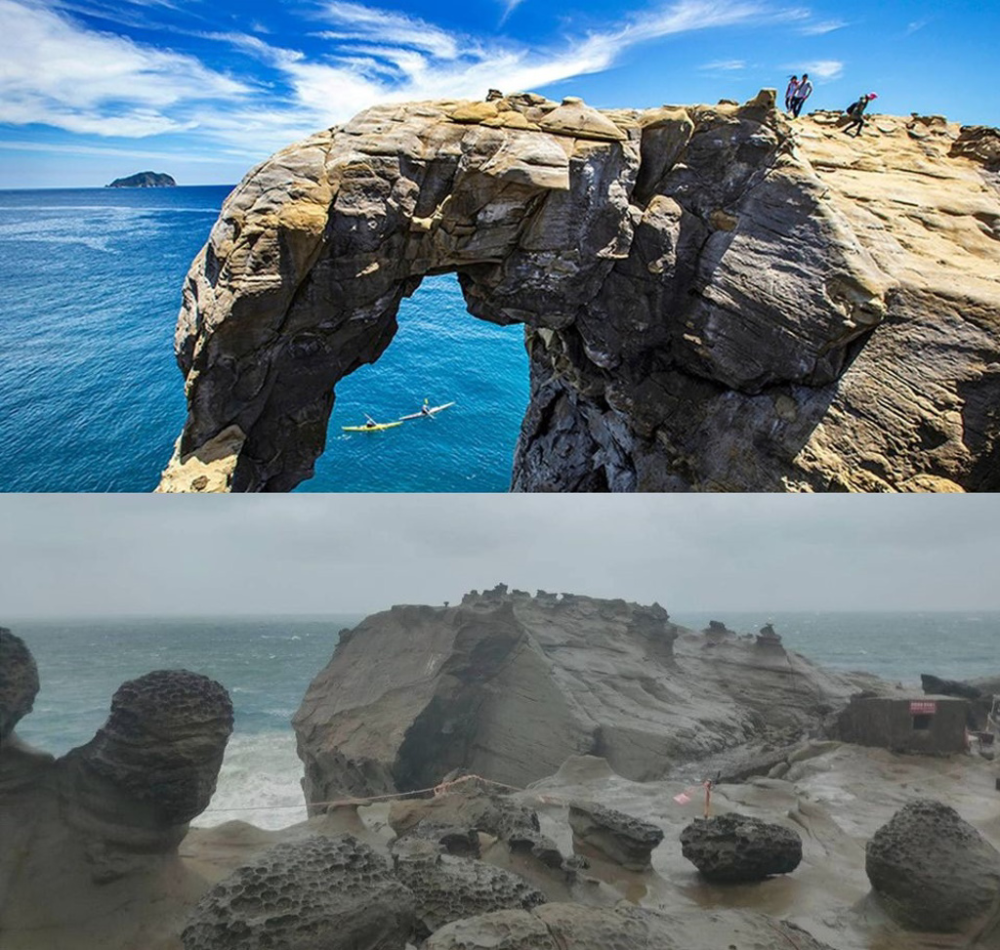

# 台湾知名景点象鼻岩“象鼻”断裂坠海，台学者曾预估“还能撑千年”

【环球网报道】据台湾中时新闻网16日报道，位于台湾新北市深澳渔港旁的象鼻岩，是当地知名景观与打卡地标，16日传出“象鼻”断了，让不少民众感到可惜。负责管理的瑞芳区公所表示，当天风浪大，象鼻岩的“象鼻”断裂，已设围篱避免民众进入。报道称，台湾大学一名地质教授4年前曾预估“还能撑千年”，未料4年后就倒塌。

 _象鼻岩“象鼻”12月16日断裂沉入大海。 图自台湾中时新闻网_

据报道，瑞芳区公所主任秘书李观宏表示，象鼻岩是位在瑞芳区深澳渔港旁的特殊地质景观，16日因风浪较大，象鼻岩受气象影响断裂，因其为自然景观，所以有自然生成与消失的可能，该处有保安驻守，也是保安发现此事。

李观宏说，象鼻岩的“象鼻”断了确实可惜，但深澳地区还有其他特色景点，深澳渔港也有美味海鲜可以品尝，区公所会再开发其他景点。

有网友也在瑞芳公共论坛发文表示，“残念，象鼻岩崩塌了，瑞芳少一个天然的地景。”“此景点以后得要有新名字了，该叫什么好呢？”

报道提到，台当局“观光署”YouTube曾在4年前上传“地质之旅-
象鼻岩”视频，并找到台湾大学地质系兼任教授徐浩德介绍象鼻岩。徐浩德称，台湾类似情况的海蚀拱门很多，但象鼻岩是唯一一个单边的海蚀拱门，因此可以预料，经过时间演化，总有一天会整个崩塌，拱门消失，但预估至少能撑上千年。有网友到视频下方评论区留言称，“说好的千年呢？”“结果百年都没撑到。”“少了一个景点，可惜了。”

