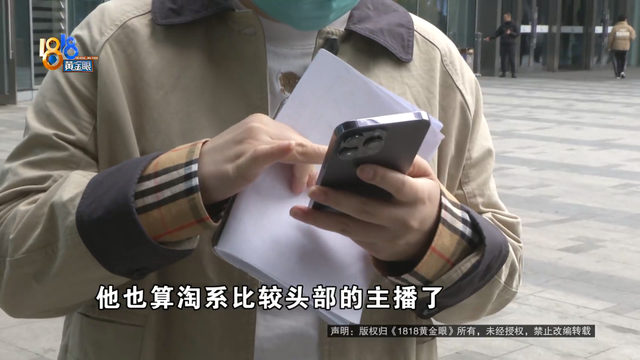
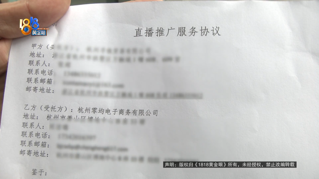
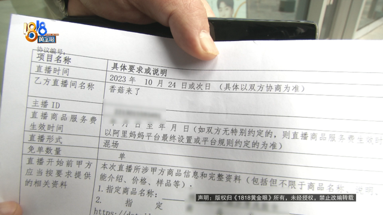
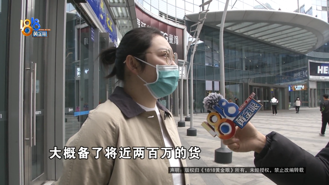
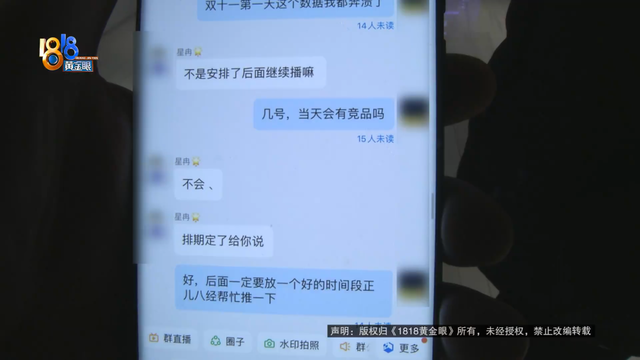
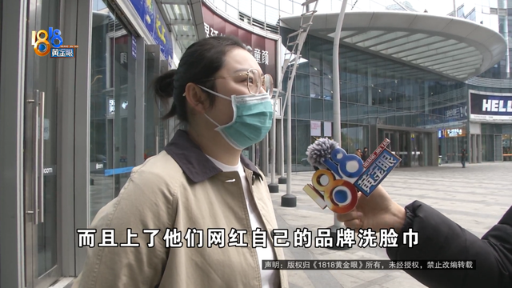
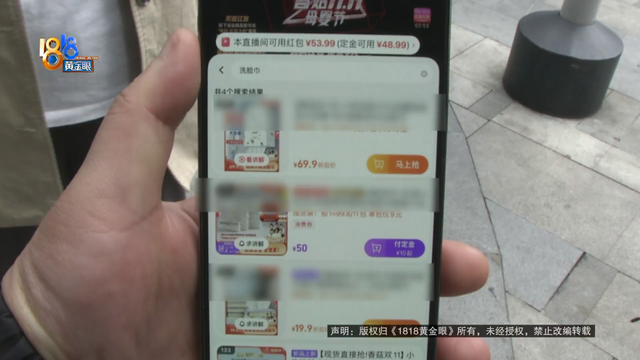
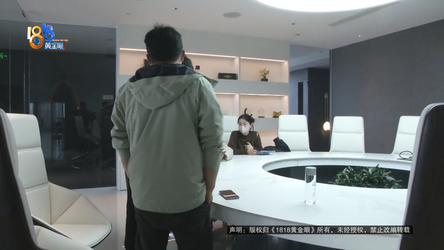

# 备了近两百万元的洗脸巾，交了十万六千元“坑位费”上直播间，没想到...

杭州的张女士反映，他们公司为了做“双11”的推广，交了十万六千元“坑位费”上直播间，可当天的情况让她很不满意。

张女士：我们是洗脸巾，想通过直播带货，提高一下“双11”的销量，他也算淘系比较头部的主播了，量还行的。

张女士说9月底，她想通过“香菇来了”直播间做“双11”的活动，他们公司和杭州零均电子商务公司签了合同。

约定直播时间是10月24日或次日，具体时间双方协定，固定服务费十万六千元，直播商品服务费费率20%。

张女士：我们从跟他谈合作谈成，签合同，然后就“双11”开始备货，大概备了将近两百万的货，结果我们交了十万零六千的坑位费，他们只帮我们卖出了十三万的销售额，而且还给了他们百分之二十的佣金。相当于我十三万的货发出去，坑位费除掉，我就是一分钱都没有的那种。

张女士还提到，对方公司的商务人员曾承诺不会有竞品，实际情况并非如此。

张女士：当时约定的是，放在好的时间段去给我们进行讲解，但是也没有，而且上了他们网红自己的品牌洗脸巾。他们就说他们老板要坚持上自己的产品，因为商务说他们老板说，他们自己的产品有50%的毛利，预计卖三百万就能赚一百五十万，然后我们的坑位费他也要收。合同里没有提到这个，我们就是在沟通群里聊的这个，没有竞品他们也答应的，就是有聊天记录回应的是不会有竞品的，但是直播的前一天夜里，短信发过来说，老板还是要坚持上他们的产品，我们不同意但是他们也不管不顾。我的诉求就是坑位费退还，并且相应地赔偿。

张女士说，对方公司后来又给他们的产品上了一次直播间，但不在“双11”期间效果不佳，直播过程中也同样存在竞品，张女士的丈夫现场联系了对接的商务人员。

张女士的丈夫张先生：我现在在你们公司这边，我们来当面沟通一下，我们之前“双11”的一个事情。

杭州零均电子商务公司商务人员：直接找我们法务聊就好了，你不是都已经寄律师函了嘛。

张先生：但你们也没有给我回复呀？

杭州零均电子商务公司商务人员：问题是你们寄律师函了，就让律师直接找我们法务就行了。

张先生：就是你这边不管了，我直接找法务是吧？

杭州零均电子商务公司商务人员：对呀对呀，我不管了啊。

杭州零均电子商务公司位于萧山区博地中心，关于张女士反映的情况，记者希望了解核实一下，出面对接的是公司的法务，表示需要和张女士这边进一步沟通。发稿前张女士反馈，双方还在协商。

来源：1818黄金眼

