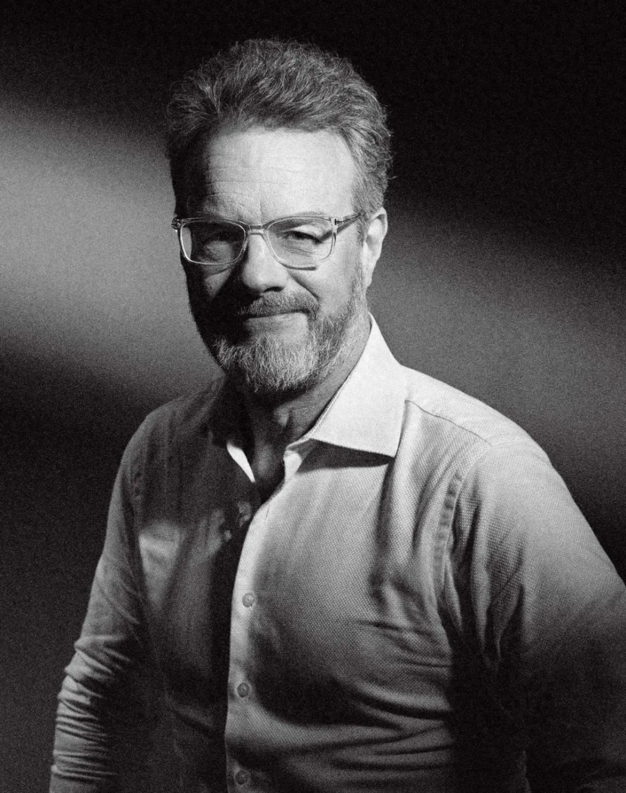
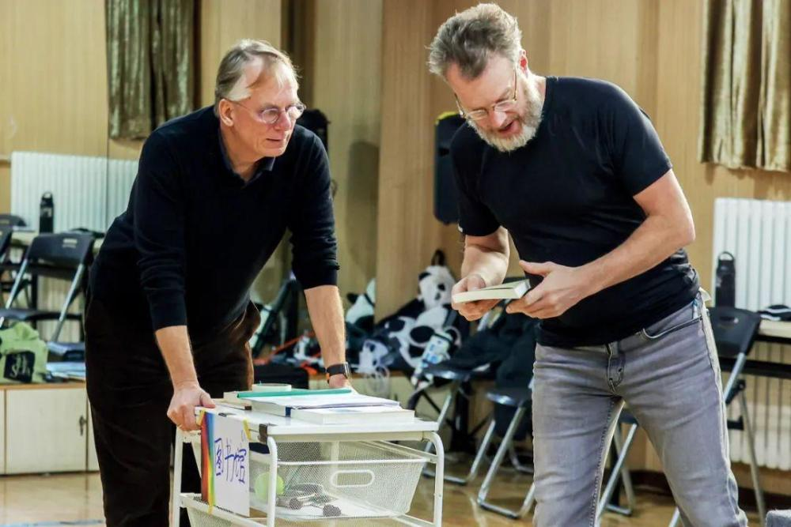

# 大山58岁：不再穿着唐装作揖拜年

赶到排练场的时候，大山已经出了一身汗，每天中午，他从10.8公里外的家骑车出门，晚上八点半排练结束，再从排练场骑回去。“毕竟要上舞台呢，这不能太粗哇”，大山摸摸自己的腰。58岁的年纪，他当然不再是30多年前站在元旦晚会上的瘦高小伙子了，金黄色的头发已经花白，但也并没有发福，可他还是坚持为了新工作减一减重。

新工作是中文版话剧《肖申克的救赎》，他扮演银行家安迪在肖申克监狱的好友瑞德，也是故事的讲述者。一个蹲了大半辈子监狱的人，总该要消瘦一些才更可信。他的相声师父姜昆曾经写文章说，大山对待工作极尽刻苦、认真。今天，他似乎仍然如此。

大山比约定的时间晚到了10分钟，一直解释，为什么出来迟了——他上午把自己背好的所有台词录了下来，好在骑车的时候听，既能更熟悉台词，也听听自己有没有什么问题，路上这40多分钟不能浪费。毕竟，中文说得好和能拿中文演话剧是两码事。

他现在把全部时间和精力铺在话剧上，笑眯眯地憧憬，《肖申克的救赎》应该是自己明年最得意的一件作品。

如今的大山，已经不再出现在晚会里，尽管那个身穿唐装或大褂作揖拜年的形象还深深刻在人们的脑海中。他心里很清楚，自己幸运地踩中了时代的步点，成为一个特别的文化交流符号。是符号也没关系，只是，他希望大家别老用旧的眼光看他。

 _大山扮演话剧《肖申克的救赎》中肖申克的监狱好友瑞德。本文摄影/龙马社 海淀阑尾、蔡园_

**走进“肖申克”**

“哗啦啦”，监狱大门打开，“新来的”到了“肖申克”。舞台上一溜站开，不管“老人”“新人”还是狱警、典狱长，一水儿西方面孔。他们一张口，能吓人一跳，都是地道的中文普通话。看排练前，以为大山肯定是演员里汉语最拔尖儿的，看完发现，他只是最拔尖儿的之一。

“好几个人是在北京长大的。他们那中文，比我溜。”大山对《中国新闻周刊》说。排练场后方的墙壁上，贴着几个大字：“进了肖申克，必须说普通话！！！！”这是导演张国立对所有演员的要求。

大山是第一个敲定的演员。一开始，他有点犹豫，一群外国人用中文演话剧，史无前例，“该不会是变相的‘汉语桥’吧？”30多年前，他出名的1989年，中国的国门打开还不久，洋人能把中文说利索，还会说“盖了帽儿了”，那简直就是新闻。“今天不能再演那样的节目了，时代变了，我也变了，不能现在上了台还是给大家来段绕口令啊。”后来听说导演是张国立，又是龙马社的项目，还是经典的戏，他放了心。

从1982年小说问世，“肖申克”的故事已经被反复演绎了40年，这部在绝境中寻找希望的作品无疑是普世的。故事发生在美国俄亥俄州，一群西方面孔也很合理，剩下的，就是台词是否本土化和演员能否准确传达感情的问题。

如何塑造瑞德，大山提出了不少意见，作为故事的讲述者，他的旁白充满文学性，可是当瑞德到了故事里，是不是还这样文绉绉地说话？“他毕竟是个监狱里的囚徒，不是文人，进入戏里的时候，和旁白的感觉不能一样，虽然是一个人，需要不同的处理。”对于细节，他和导演张国立抠了很久，细到是不是偶尔可以带脏字，某句话能不能加“他妈的”。

大量旁白极考验朗诵水平，凑巧的是，大山在之前两年意外地做了准备。2020年，疫情把所有人关在了加拿大的家里，不能去线下演出，大山琢磨着居家能干点什么。那时，短视频平台正在兴起，他观摩了一阵海外博主们的内容。分享生活他接受不了，“起床，吃早饭，做个咖啡都要拍，不行不行，我没那么强的分享欲。”和他一样的跨国婚姻的内容他也看过，觉得挺纳闷，怎么两口子都一起生活好几年甚至半辈子了，讲的文化差异还跟第一天认识似的？他没有这样的段子，也不想暴露家人的生活。评论国际局势、时事政治更不是他的专业，相比输出观点，他还是愿意精心准备好一个节目，表演给观众，让观众评论。

思来想去，他想到了自己喜欢的那些中国古诗词，而且在以往的演出中，一赶上大段独白，他感觉自己的中文还是有点磕巴和生硬，不如趁这机会好好练练。于是他花钱在家装修了一个小录音棚，买了专业麦克风，开始录制。让他意外的是，喜欢古诗词的海内外网友不在少数，录制几条之后，点赞和阅读量噌噌涨起来，陈佩斯也来给他点赞，这一下鼓舞了他，逐渐又加上配乐，完善视频内容，从2020年夏天开始，一直没有间断。

后来，张国立和他开视频会议的时候对他说，在网上看了很多他的朗诵视频，话剧《肖申克的救赎》里故事的叙事者瑞德，正好需要这方面的能力。

“真是没有想到，居家的时候打算在朗诵方面做一点突破，结果从疫情走出来，这技能居然就用上了。等于天上掉下来一块馅饼，这得尝一尝啊。”2023年11月中旬，大山回到阔别已久的北京。

中文流利不意味着可以胜任话剧表演。进入“肖申克”的人，语言是最低门槛，有些演员日常交流很顺畅，可是一站上舞台，念起台词，展开表演，语调就不由自主地不受控制，水平直接下降几个量级，只能换掉。大山也有压力，他是剧中台词量最大的演员。

与《中国新闻周刊》见面时，大山进入剧组已经快四个星期，他感觉心里有数了，尽管张国立说，按百分制，他们才刚达到35分。不过，所有人都已经能够脱稿，再经过一个月细排，2024年1月4日全球首演时，他相信能给观众一个惊喜：“绝对不是卖老外用中文演话剧这么个概念，中国观众早过了看外国人说中文就新鲜的时期了，我们是认真排出了一个高水平的精品话剧。”

**那个洋小伙子**

打开大山的短视频号，最多的评论就是：“童年的回忆”“第一个记得住的外国人”“小时候听他汉语说得这么流利都震惊了”……大山在线下演出时也调侃自己，最不喜欢在网上发自拍照，因为会有一大堆评论说：“大山老师您老了。”
“老了就老了呗，最可气的是什么呢？是还非得添那个大哭的表情符号，泪流满面的那种。”

在很多观众的记忆里，大山是第一个登上春晚的外国人，其实他并不是，他出名的小品《夜归》出自元旦晚会。1989年新年，不少中国老百姓在黑白电视机前看到一个无比新鲜的节目，两个金发碧眼的洋面孔操着尚不熟练的汉语出演了一个发生在东北工厂家属楼里的故事。身穿军大衣、头戴雷锋帽，张口一句“玉兰，开门呐，我是大山”引发现场一阵爆笑的小伙子，瞬间被无数观众记住了，他也因此获得了一个中国艺名“大山”。

第二年元旦晚会，他又出现了，这回是站在当时最知名的相声演员姜昆和唐杰忠身边，和他俩一起说相声。他的中文已经利索了不少，凭借扎实的基本功和自然的表演，再次赢得了持续不断的掌声。此时，他已经拜相声演员姜昆为师，成为相声传人里的第一个外国人，开始不断在全国各地的舞台和电视屏幕上献艺。

等他能够登上春晚，已经是1998年，早已家喻户晓。大山觉得这事挺有意思，很多有特点的节目其实都不在春晚，但是大家会在记忆里自动把它们划进春晚，例如郭达的《换大米》、宋丹丹和黄宏的《超生游击队》以及他自己的《夜归》。“春晚垄断了我们对喜剧节目的回忆，大家总说，记得小时候看你的春晚节目，其实他记得的节目80％不是春晚那一台晚会上的，我的成名作也没有一个是春节晚会上的。”在他眼里，春晚更像是一个颁奖仪式，是对一个人的影响力和知名度的认可，可能也因为这种强大的舆论力量，使观众把那些美好记忆都与它勾连在了一起。

当初学习汉语，大山无论如何没有想到会在中国取得这样的成绩。20世纪20年代，大山的爷爷曾在中国的教会医院当外科大夫，只待了几年就因为战争爆发不得不回国，孩提时代的大山因为对中国念念不忘的爷爷而对这个神秘国度充满兴趣。高中暑假，他到照相馆打工，很多顾客是华人，店里也刚好有个华人同事，听着他们铿锵有力的对谈，大山觉得有意思极了，跟着同事就学了起来，后来他才知道，他最开始学习的Chinese，是广东话。

申请大学时，他顺利地被多伦多大学东亚系录取，中文老师根据他的原名Mark
Rowswell给他取名路士伟，结果，名字没用几年就被中国的观众们改成了大山。他更喜欢这个来自小品人物的名字，因为很有中国特色而且雅俗共赏。更何况，这个名字和家里兄弟们的名字对应上了。大山的老粉都熟知这个有关名字的梗，大山家里一共三兄弟，他排行第二，老大叫Daniel（丹尼尔），一般生活中就简称丹（Dan），小他5岁的弟弟叫Benjamin（本杰明），家里人叫他Ben（本），说到这，大山自己都乐了：“我叫Mark多不般配呀，有了大山这个名字之后，我们三兄弟终于成了‘大笨蛋’组合。”

在中国出名后，他的家人、同学觉得这事挺新鲜，但也都说蛮合理，因为他在大学简直就是中国迷。汉语本来是选修课，二年级时，大山把它改成主修，四处寻找中国留学生练习，很快，他就成了东亚系有名的高才生，毕业那年，获得了去北京大学交换学习的机会和全额奖学金。

接下来的故事，也许不能仅仅概括为中国出了一个西方笑星，而是更像一个文化交流现象。年龄渐长后，大山仔细思索过这个问题的答案：自己到底为什么会一炮而红？他觉得，大概是因为刚好踩在了时代变幻的浪尖上。“我出现在大家面前的时候，中国刚刚从一个封闭的时代走出来不久，打开大门，走向世界，世界也在走近中国，人们崇尚外来先进知识、技能和文化的同时，也有担心——我们自己的文化、语言在世界上是什么地位？世界欢不欢迎我？世界是不是也想向我们学点东西？”这是一种微妙的矛盾心理，在他看来，中国一方面飞速发展，一方面又带着数千年文明历史，必然会出现这种矛盾，而且，在很多事情上都矛盾，一个外国人如果想要了解中国的事，得先学会接受矛盾。

“这个时候，有这么一个来自西方先进世界的洋小伙子到了我们国家，不仅仅是学习语言，学的还是传统文化，那这个人的出现，说安慰可能太夸张了，但是对于那种矛盾的心理，当然是找到了一种平衡。”

想通了这些问题之后，他感觉豁然开朗，因为自己的事业不仅仅在喜剧，而是在整个文化交流。既然是文化交流符号，那么在一些重要晚会尤其春晚上的作用就很明显了，尽管不是第一个登上春晚的老外，但从1998年开始，大山四次参加春晚，成为春晚出现最多的老外，在这样特殊的场合，大山承认也不会有什么特别大的发挥，就让大家高兴、喜庆，抱拳吼一嗓子：“过——年——好！”

_话剧 《肖申克的救赎》的排演现场。_

**相声和脱口秀**

“为什么今天让我上台跟大家开个场呢？可能是觉得这场演出缺一点正能量的东西……这是我的主要责任啊。”今年2月，在多伦多一场脱口秀演出上，大山作为暖场嘉宾，一出场，就先拿自己这个最标签化的一面开涮自嘲，引起观众一阵欢呼。

2011年他与孔子学院的留学生一起在春晚表演了群口相声《四海之内皆兄弟》之后，就渐渐淡出了电视观众的视线。等到2015年大山再次亮相，却抛开了他所熟悉的相声表演，带着脱口秀《大山侃大山》举办个人专场。

那时候，脱口秀刚刚在中国萌芽，很多人认为脱口秀就是单口相声。其实，它们有本质区别，单口相声更多是在表演，内容也是相对固定的桥段，讲究传承，而脱口秀相当随意，讲述的是个人生活经历和对这个世界的独特见解。

在从相声转到脱口秀的大山眼里，这两种艺术几乎可以说是中西方喜剧文化差异的缩影——相声有贯口等语言技巧表演，在一些传统节目中，观众要品评演员的技巧呈现，西方喜剧无论形式还是内容，似乎都没有这么高的门槛。对相声而言，传统内容很重要，观众会以艺术欣赏的眼光看其表演是否正宗，脱口秀关注的是当下，几乎没人表演几十年甚至上百年前的传统段子。

大山很喜欢相声，但是一段时间以后，他就清晰地看到了瓶颈。凡是他参加演出的相声，几乎形成一个固定模式——权威的老师带着外国学生，要传授博大精深的中国文化，结果说着说着，就发现这个老师其实一知半解，还不如学生。错位是一种经典的喜剧设计，可是一旦这种设计无法让观众感到意外和惊喜，就不再好笑。

大山回忆说：“后来连台词都有点形成套路，总是‘大山，我来考考你，这你会吗？’，我就吹牛‘张口就来啊’。‘这小子有点傲了啊，我得考考他。’考来考去，最后无外乎一句‘嘿，他可真行啊’。这套路玩了好多年，越来越跳不出观众的想象，我做不到出乎意料了。”

一个“老外”，在中国传统相声里，很难扮演别的角色。他有创作的冲动，但相声的“铺平垫稳”极其严谨，题材也有限制，他承认，写原创相声的坎儿，一直没迈过去。但分享个人经历的脱口秀就容易得多，也自由得多。他开始创作脱口秀段子，在渥太华、多伦多等城市的小剧场里演出，效果相当好，观众主要是90后，和他的孩子同龄，他的喜剧已经至少服务了两代人。当然，他的表演依旧用中文，演给华人观众。

经过几年现场演出，他打磨出了一个60分钟的成熟专场《大山侃大山》。从头到尾有完整结构，以自传体讲他自学习中文以来的有趣故事，逻辑明确，既不同于单口相声整段讲一个故事，也不同于脱口秀的纯“散装”。

有观众说他的脱口秀里仍然有相声的影子，他一点不否认，“其实我还是在以相声表演经验和观众交流。虽然在舞台上没有典型的相声腔，但长期受相声熏陶，一站上舞台我还是这个习惯。”但脱口秀毕竟还是解放了他，在相声舞台上，他必须扮演一个吹牛的角色，美化自己，这条路走到头就不可乐了。而任何喜剧形式，归根结底是要让大家笑出来，观众静静地欣赏最后给点掌声，节目就失败了。脱口秀使他终于有机会从符号里跳出来，拿自己曾经塑造的那个完美的形象去开涮、开玩笑，至于效果，场内观众用超过他表演音量的笑声和欢呼给出了答案。在某种程度上，这才接近真实的他，他想让人们知道，大山并没有多么完美，也不那么顺利。

2017年，他带着《大山侃大山》参加了全球三大喜剧节之一墨尔本国际喜剧节，是那年喜剧节中唯一的中文节目。代表中文喜剧表演的是一个加拿大人，他感慨这世界“真够滑稽的”，也让他觉得尽到了自己的责任——让中文幽默艺术更好地走向世界。这又有点回到了“文化交流”和“文化桥梁”的意味上，对他而言，这样的想法似乎已经成为下意识。

这两年，他又制作了《大山笑友汇》，一场近两小时的专场演出，把脱口秀、曲艺、音乐和朗诵全部融为一体，他说：“别人来做一样的演出确实会感觉很怪，但放到我身上似乎就变得合理了。”因为无论什么形式，总之还是围绕着语言艺术，当然也可以理解为讲故事，有他自己的故事，有中国民间故事，也有历史故事。

由于他的身份和从事的工作，人们喜欢问他中西文化两者间的分别，但他觉得，时间长了就发现其中更多的是共性。因为都是人，人性相通。比如他朗诵的那些古诗词，很多专家说那是中国人特有的情怀，可是自己一个“老外”，明明也有同感。再比如正在排练的《肖申克的救赎》，一个人蒙冤陷入绝境几十年，始终没有放弃希望，中国人也一定会被触动产生共鸣。

大约正是这样的基底，让大山成为两种文化的结合体。他还记得第一次去电视台，那时还没出名，主持国际歌手邀请赛，当时有两位代表中国参赛的刚刚出道的年轻歌手，一个叫韦唯，一个叫刘欢。从那个年代一路走过来，他自己也觉得蛮不容易的。让他感到自豪的一点是，最初上电视表演节目，按理说就是昙花一现的事情，但一步步折腾了30多年，现在也还没停。

发于2023.12.18总第1121期《中国新闻周刊》杂志

杂志标题：大山：从晚会舞台上走下来

记者：李静

