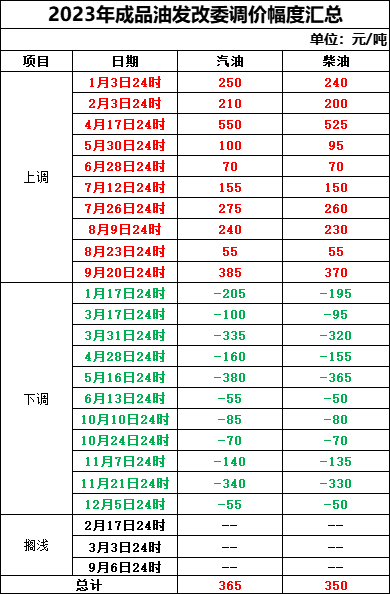
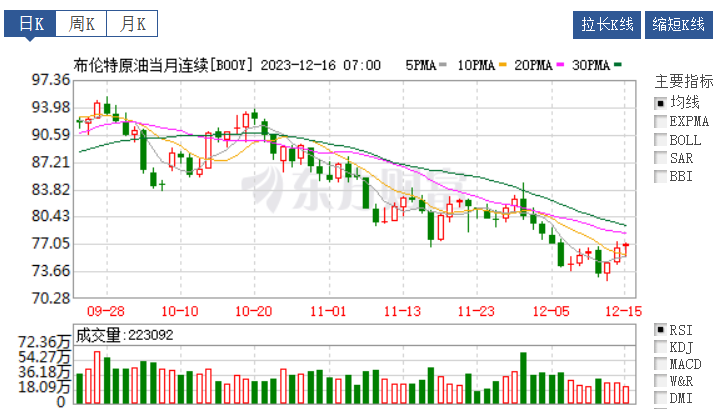

# 时间定了 油价格即将调整 国内成品油价有望实现“六连降”

中国基金报 晨曦

好消息！2023年最后一轮油价调整要来了！

就在下周二（12月19日）24时，国内成品油油价将迎来今年第25轮调整，这也将是2023年的最后一次油价调整。按照近期国际油价表现及监测数据，本轮油价大概率仍将下调。

12月15日，国内第8个工作日参考原油变化率-9.15%，预计汽柴油下调400元/吨；按升价折算后，将下调0.31-0.34元/升。车主加满一台50升油箱的小汽车，将节省15.5-17元左右。在此次调整如期完成后，国内成品油价有望实现“六连降”。

来看详情——

**成品油价格即将调整**

**2023年最后一轮调价**

就在下周二，油价又要调整了！

专业机构监测数据显示，12月15日，国内第8个工作日参考原油变化率-9.15%，预计汽柴油下调400元/吨，远超油价下调红线的50元/升。按照国内成品油调价机制，本轮油价将在12月19日24时起进行调整。

虽然距离正式调整还有两个工作日，但按目前下调幅度来看，本轮油价大概率仍将下调。折算后，成品油价将下调0.31-0.34元/升。按此计算，车主加满一台50升油箱的小汽车，将节省15.5-17元左右。

从近期国内油价表现来看，在此次调降后，除海南、西藏两地外，其余地区的92#汽油将全部回到“7元时代”，部分省份的95#汽油亦有望低于8元/升。

回溯来看，10月10日-12月5日，国内成品油价格实现“五连跌”，标准汽、柴油累计跌幅在690元/吨、665元/吨，折合升价92#汽油、95#汽油及0#柴油分别下调0.54元、0.57元、0.57元。

在此次调整后，国内油价将以“六连跌”完成收官。如能保持当前降幅，则此次调整有望成为2023年下调幅度最大的一次。

今年以来，国内成品油已完成24轮调整，分别为“10涨11跌3搁浅”。涨跌合并后，当前汽油价格较年初涨365元/吨，柴油价格较年初涨350元/吨。按照当前的下调幅度预测，在下周油价调整完成后，国内油价有望追平甚至低于年初价格。

**国际油价持续震荡**

再来看看近期的国际油价变动情况：

12月15日，国际油价微跌。截至当日收盘，纽约商品交易所2024年1月交货的轻质原油期货价格下跌15美分，收于每桶71.43美元，跌幅为0.21%；2024年2月交货的伦敦布伦特原油期货价格下跌6美分，收于每桶76.55美元，跌幅为0.08%。

而在前一日， 由于美元继续大幅贬值和交易商空头回补，国际原油期货价格收盘时显著上涨。纽油、布油当日涨幅均超3%。

从周度数据来看，纽油价格本周累计上涨约0.28%，为连跌七周以来首次录得周涨幅；布油价格累计上涨0.94%。

消息面上，当地时间周四（12月14日），国际能源署（IEA）以美国经济前景改善和油价下跌为由，上调了明年全球石油需求增长预测。IEA同时表示，随着主要国家的经济活动减弱，全球石油需求增长正在急剧放缓。

IEA预计，2024年全球石油消费量将增加110万桶/日，比此前的预测增加13万桶/日。该机构表示，之所以做出调整，是因为与上月报告相比，GDP前景有所改善，这尤其适用于有望实现经济软着陆的美国。

另据外媒报道，丹麦航运巨头马士基表示，将会暂停其所有经过红海的集装箱运输，直至得到进一步的通知，并将选择从非洲绕道。这一消息引发市场对石油等商品出现供应中断的担忧，油价得到一定支撑。

中信期货研报认为，2024年一季度，原油价格或出现多重共振的修复契机。供应端，目前对欧佩克减产能否执行仍有较多怀疑。一季度欧佩克如果落实自愿减产，同时美国产量也可能逐渐转降，可能带来供应预期的修正。需求端，一季度美欧炼厂检修季结束，中国炼厂原油进口配额和成品油出口配额发放，原油加工量和进口量可能逐渐回升。如果未出现大幅衰退，需求预期可能需要修复。资金端，年末海外进入圣诞和元旦双节假期，原油期货成交清淡，流动性降低。一季度新一轮交易启动，资金回归或使投机需求增加。

编辑：舰长

审核：木鱼

版权声明

《中国基金报》对本平台所刊载的原创内容享有著作权，未经授权禁止转载，否则将追究法律责任。

