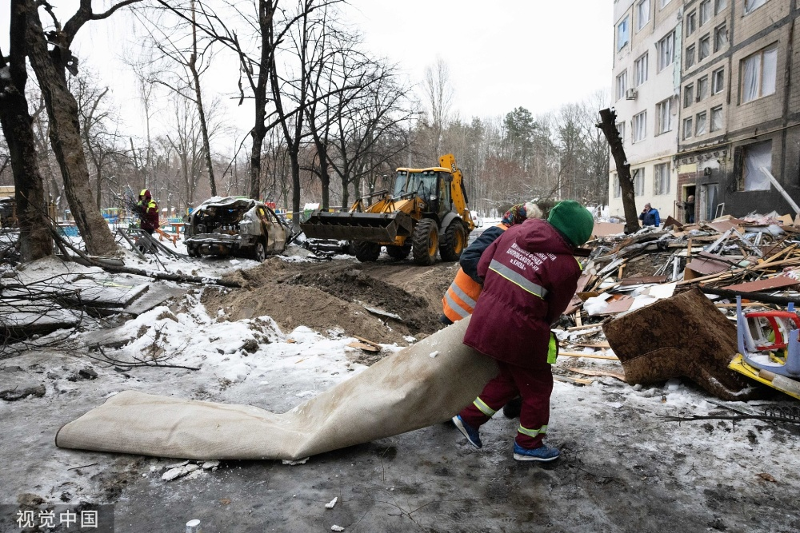

# 没钱援乌了怎么办？美西方被曝计划挪用遭冻结的俄罗斯主权资产

（观察者网讯）近一段时间，乌克兰来自美西方的援助资金告急，美国国会和欧盟峰会先后否决了价值总计达超1100亿美元的援乌资金。据英国《金融时报》12月16日报道，援乌计划搁浅后，以美国为首的七国集团（G7）国家打起了俄罗斯主权资产的主意。当前，俄罗斯央行约3000亿美元的资产被美欧冻结。

报道称，虽然美欧均没有公开表态，但最近几周，随着美国和欧盟最新援乌计划相继搁浅，要求扣押并挪用俄罗斯主权资产的呼声越来越大。

根据《金融时报》看到的一份美财政部内部讨论文件，美国政府认为：“作为一种符合国际法的反制措施，G7成员国和其他受影响国家可以扣押俄罗斯的主权资产，以迫使俄罗斯结束侵略行为。”该文件已在G7成员国之间传阅，美方拒绝置评。

一位美国官员证实，美方正就使用俄罗斯主权资产与G7国家进行积极对话，并透露，各国可能会在明年2月俄乌冲突两周年之际召开的G7峰会上讨论这个问题。这名官员还称，未来几周的目标将是解决所有关键问题，以便G7能够采取共同行动。

_12月15日，一枚俄罗斯弹道导弹在基辅居民楼附近爆炸。图自视觉中国_

但到目前为止，G7成员国政府大多犹豫不决，担心此举会导致一些持有美元和欧元资产的外国投资者逃离。迄今为止，相较于直接动用俄罗斯主权资产，欧盟更青睐于使用俄主权资产遭冻结后产生的巨额利润。

报道指出，在欧洲，德国、法国和比利时等国反对上述举措，但英国坚定和美国站在一起。

“非常时期需要非常措施，”英国外交大臣卡梅伦14日在对一个英国议会委员会发表讲话时称，他相信存在没收这些资产的“合法途径”，并暗示，如果不能说服其他G7盟国，英国可能会与美国一道采取行动。他补充说，他正在G7内部“努力推动”这项提议。

卡梅伦还否认此举会对外资产生“寒蝉效应”。他辩称，那些可能对此感到不安的投资者，早就已经“因我们冻结”俄罗斯主权资产资产而“感到不安”。

《金融时报》称，上述激进举措将开启西方与俄罗斯的金融战争的新篇章。即便一些欧洲国家反对，但一名西方官员表示，G7内部“确实正在进行对话”，且赞成的“共识日益增强”。该官员称：“这又回到了一个问题：战争费用是否只由西方公民和财政部支付，还是克里姆林宫也应该承担责任？”

自去年2月俄乌冲突爆发后，美国与欧洲冻结了俄罗斯央行6400亿美元外汇储备中的大约一半资产。欧盟方面此前承认，俄罗斯央行价值超过2000亿欧元的资产和储备被欧盟冻结。

今年4月，俄罗斯总统普京签署总统令，规定俄罗斯资产在国外被扣押情况下的回应措施。总统令规定，如果俄罗斯的资产在国外被扣押或限制，俄方将对不友好国家在俄罗斯的资产实施临时管理，临时管理可根据俄罗斯总统的决定而终止。

据彭博社7月报道，被冻结的俄罗斯主权资产可能会产生至少约30亿欧元的“暴利”。有知情人士透露，围绕如何使用这笔资金，欧盟内部发生了争执。奥地利外交部长当时表示，如果欧盟决定没收俄罗斯被冻结资产并用于乌克兰，那么必须确保有明确的法律依据，否则对欧盟来说堪称“一种耻辱”。

11月8日，七国集团（G7）外长在日本东京举行会议后发布联合声明。声明表示：“除非俄罗斯同意对乌克兰进行赔偿，否则G7成员国不会向俄罗斯归还其遭冻结的资产。”

**本文系观察者网独家稿件，未经授权，不得转载。**

