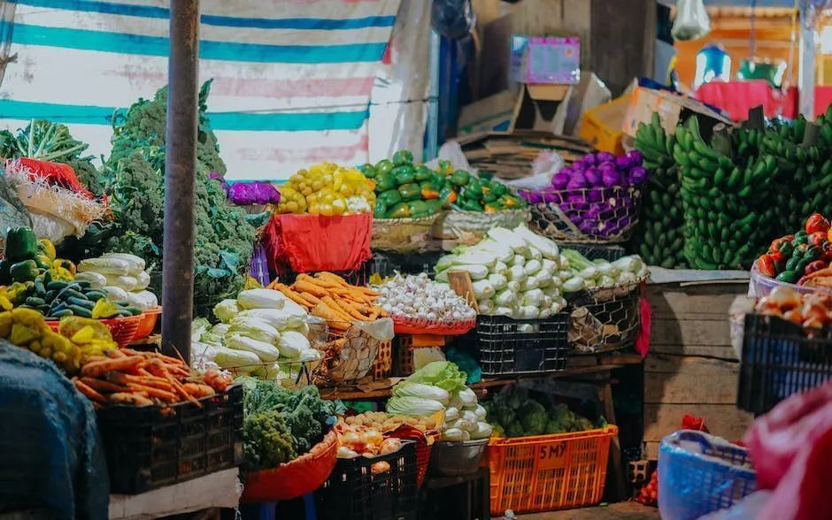
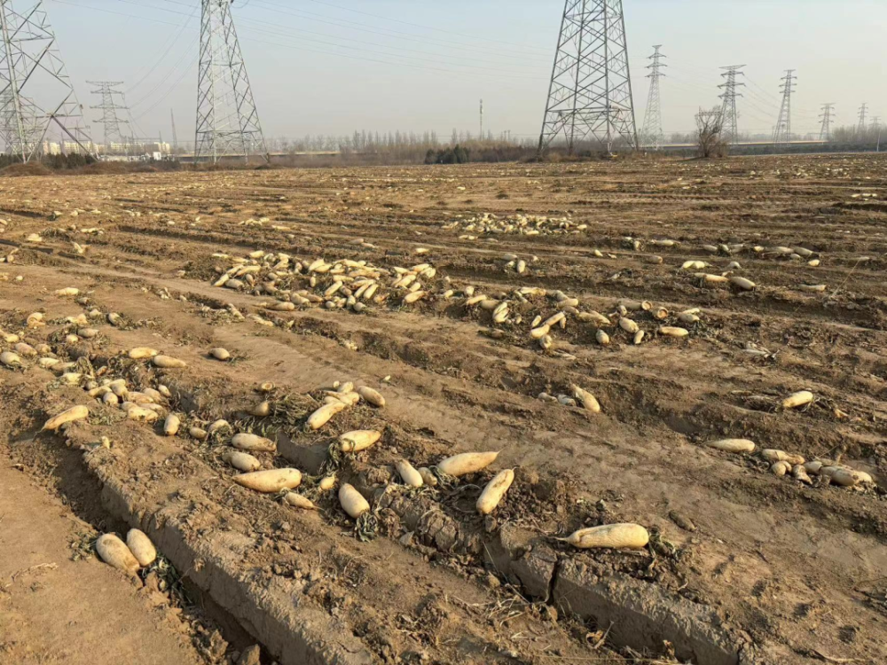

# 菜农：十斤大白菜价格一毛二，卖晚了只能烂在地里

文 | 《财经》特约撰稿人 孙东谡 实习生 王美霖 记者 邹碧颖 张明丽

编辑 | 王延春

“今年白菜价格：5块钱，可以去地里买一米。”

**入冬之后，大白菜、芹菜、萝卜、大葱价格出现暴跌。**
个别地区，甚至传来农民放弃收成、直接将菜铲掉或回田的消息。12月6日，在北京市通州区张家湾镇牌楼营村的平安绿色采摘园，《财经》记者也发现一片被人遗弃的白菜地。

枯枝围出一方菜园，白菜密密匝匝立在地里，外层的菜叶子多已冻伤腐烂。看守菜地的铁皮房，人去屋空。记者遇到三位市民，他们从网上得知这片白菜被人抛掷，寻着过来拔菜。住在隔壁村的王大姨和老伴也来捡拾地里的滴灌带。

“长势好的白菜都拔走了，剩下的都是太老或者没长成的。”王大姨向记者估计，占地三四百亩的白菜，卖出约三分之二。
**据了解，张家湾不止这一片地种白菜，其他地方也种，卖得早，白菜价格还可以，卖得晚的就只能烂在地里。**

“集市上大概一块钱一颗，谁要？”王大姨的老伴告诉记者，三黄庄也有种白菜的农户，有人去买白菜，人家农户一算，卖白菜的钱还不够装车的工钱，干脆不卖了。周边村的胡萝卜、水萝卜、雪里蕻也是拖拖拉拉收，很久才卖完。

_图1 12月6日，北京市通州区张家湾镇牌楼营村被遗弃的白菜地。摄影/实习生 王美霖_

上海钢联农产品事业部蔬菜分析师张敏告诉《财经》，
**2023年至今，蔬菜价格整体呈现为“先高后低，再高再低”的走势变化。年内迄今为止，2月蔬菜均价最高，随后几个月下跌后保持平稳，8月-9月蔬菜月均价开启连续上涨状态，但从10月以来，全国蔬菜价格低迷甚至出现滞销的现象普遍。**

中国农业大学国家农业市场研究中心研究员刘乃郗向《财经》分析，蔬菜价格的短期波动往往能被做市商的投机套利机制所补平，此次持续性下跌，主要还是基本面供过于求。蔬菜集中上市，又难以保鲜，跌价也得卖。“多少不论，经纪商起码要能挣钱。如果光是付仓储物流费都在亏钱，就没人收菜了。”

**价格过低，农户只能抛售回田**

**今年的大白菜究竟有多廉价？“上车一毛二。”“一公斤吗？”“10斤”。**
12月7日，山东青岛平度市大庙庄村的一位农民大哥告诉《财经》，他们家今年种了50多亩地的大白菜，卖掉了30多万斤，目前还有10万斤的大白菜在地里。再不卖出，白菜在地里就会冻坏，只能清掉，“反正就这一礼拜的事”。

低价抛售并非个例。在新疆石河子，王传芳种了40亩白菜、10亩萝卜，以每颗一元的价格处理完了地里的大白菜。“一亩地也就2000株，4、5斤以上的才算一块钱一颗，小的都不算数，都是送的。”王传芳说，家里水果萝卜一袋10元，后来5元一袋也卖。今年种菜总体赔钱，不过能卖一点少赔一点。

王传芳家周边的一些地区，种的萝卜白菜全都打掉了。“你让别人去拿他都不去，因为太远了，10元买白菜，开车烧油都得几十元，人家不去，所以就打在地里，粉碎当肥料了。”王传芳介绍，正常砍完白菜后，需要雇人一颗一颗往车里撂，有的半挂车要装几十吨，
**人工费都比这些两三毛钱一斤的白菜贵。**

“新疆大葱为啥也整块不要了，因为挖大葱比白菜还要麻烦，你没有两锹三锹挖不出来！白菜拿刀咔一砍掉了，所以不是没人要，而是没人挖出来。”王传芳家附近，有人家种的100多亩大葱也不要了，到处喊人来挖。

中国农业大学国家农业农村保险研究中心主任杨汭华告诉《财经》，
**今年冬天蔬菜同期价格呈现全国性走低，或许是因为秋冬气温偏暖使得陆地蔬菜和冷棚蔬菜产出过多；二则是疫情后人们的消费能力受限；三是农户生产要素投入能力下降，低投入成本的蔬菜（如白菜、萝卜等）生产增加，形成结构性过剩。**

北京新发地市场价格监测数据显示，大白菜、萝卜的均价从年中的每斤0.7元跌到11月的每斤0.3元左右，大葱从8月每斤1.4元左右也下跌到近期的每斤0.8元左右。张敏介绍，Mysteel农产品调研了解到，2023年大葱、大白菜以及萝卜的产地收购价格基本上均处于近5年（自2018年开始）以来的最低水平。

新发地是北京市最大的农产品批发市场，每天大约有超过2万吨蔬菜，从这里抵达北京人的餐桌。市场的蔬菜来自田地对接、向农户收购、与农户合作种植、去集中种植地选品收购等渠道，下游则对接着商超、小批发商、其他二级市场。

新发地交易市场宣传部部长童伟向《财经》表示，
**市场选取具有代表性的蔬菜样本，算出的蔬菜平均价是2.79/kg，这是很低的。白菜每斤在2~3毛左右，正常供应平衡的时候应该是4~6毛。白菜刚上市特新鲜，就卖3毛，结果发现大家都卖3毛，或者过了几天菜还没卖出去不新鲜了，商户还会往下调价。**

“白菜等农产品是非标品，今年行情又很差，一些本身种得不好的或者在采摘时损伤的，自然就不要了，直接回田。”童伟对《财经》说。

**种植面积扩张，市场难以消化**

12月5日，北京大兴区后顺路附近的地里，垒着一眼望不到边的白菜堆，个别村民正捡拾白菜。生鲜公司的工作人员告诉《财经》，成堆的白菜会被生鲜公司收走，地里剩下不要的烂白菜也会限制人们大规模捡拾。而在兴东路附近，《财经》记者估计大概有150亩地的白萝卜烂在地里，散发出变质的味道。

_图2 12月5日，北京市大兴区魏善庄镇兴东路附近的萝卜地。摄影/特约记者 孙东谡_

刘乃郗、张敏等专家向《财经》分析， **蔬菜总体的供需关系不匹配是导致蔬菜滞销、低价的最主要原因。种植面积扩张更是加剧了市场供需的不平衡。**

Mysteel农产品调研了解到，近几年，国内蔬菜尤其是设施蔬菜的种植面积及规模基本呈现逐年上升趋势。以全国蔬菜大省山东为例，山东省统计局数据显示，2023年前三季度，山东全省蔬菜面积约1662.1万亩，同比增幅参考2.2%；总产量6271.8万吨，增幅参考3.4%。另据农业农村部的公开数据，截至今年4月上旬，在田蔬菜面积同比增加110多万亩。到10月，相比去年多了133万亩。

今年8月的暴雨结束后，部分地区选择增补蔬菜，新产的蔬菜又正好于最近集中上市，比如白菜和白萝卜。“今年秋冬季节下雨天气较少，大部分主产区气温比常年平均值高一点，有利于蔬菜生长，单产水平也有所上升。”刘乃郗说。

童伟向《财经》分析，疫情管控的特殊时期结束之后，农户对整体消费能力预期偏高，种植意愿强烈。
**此外，近几年，部分行业不景气，从业人员失去工作后选择回到老家，在老家唯一能依托的就是土地，或主动或被动的投入到种植之中，种植人员数量增加，导致今年整体产能过剩。**

刘乃郗表示，中国蔬菜仍然以非专业化生产为主，价格波动引起的正反馈效应大，产销关系随机对接比例高，而美国、日本等发达国家多为专业化生产，供应链关系和结构会稳定一些。中国农产品的产销对接属于大市场大流通，一家农户的蔬菜销售可能50%由老客户买单，50%来自新增客户，交易对手多，供需信息复杂，随机交易比例高。

刘乃郗指出，农户擅长根据市场行情调节农业生产，但也易产生“市场合谋”。去年同期，蔬菜价格有所上涨，到了今年大家都有扩产冲动，没想到今年价格反而降下来了。

此外，蔬菜的市场需求却没有出现显著增长。《2023年中国蔬菜产业发展报告》显示，近十年中国蔬菜需求整体呈现先增后稳态势，年均复合增长率1.76%，2021年至2023年蔬菜人均需求量大约在每年95-96kg，是一组非常稳定的数据。

**眼下，即便销售渠道畅达，农户也很难挣钱。刘乃郗指出，蔬菜的产销对接体系主要依靠熟人网络运转维系，比如从湖北、湖南拉十几吨白菜到北京，路上出现一定的蔬菜损耗，下游批发商在与上游经纪商或农户商定损失时，到底是5%还是10%，双方只能依靠长期合作的信任。眼下销地价格不景气，白菜产地价格每斤也就一毛钱左右，要再分摊掉损坏的部分，农户可谓获利甚微。**

值得注意的是，冷链物流的配送成本相对常温配送往往更高。《物流时代周刊》今年1月刊文指出，目前，中国果蔬、肉类、水产品冷藏运输率分别仅有15%、57%和69%，发达国家已经达到80%-90%之间。中国冷链断链所导致的农产品腐损率是发达国家的1倍-2倍。据估算，
**中国每年因冷链“断链”造成约1200万吨水果、1.3亿吨蔬菜的浪费，经济损失超千亿元。**

杨汭华建议，可通过金融保险政策稳定菜农收益。如通过提供贷款支持，引导农户进行差异化生产；通过优化农业保险保费补贴政策，激励菜农购买蔬菜产量和价格保险。优化农产品物流运输制度，减少运输环节梗阻形成的蔬菜数量和质量失衡问题。此外，提升新鲜蔬菜加工能力，尽可能留利于菜农。

**冻库不足、信息紊乱**

不止白菜、萝卜，大葱今年的行情也不好。在山西河津市西王村，肖滨种了两亩大葱。为了赶紧腾出土地，以一元三斤的价格，零零碎碎地卖完了。隔壁也有种大葱的人家，却是按住不卖，让大葱继续长，打算年后市场价格好了再出手。

然而，绝大多数蔬菜无法在地里久留。刘乃郗分析， **国土面积大、跨度大，是时空错配的第一原因。**
蔬菜供应存在跨季节轮换，北京吃的茄子，不同季节来自不同省份地区，供需的实时精准匹配较为困难。此外，中国许多地区围绕特色产业打造“一县一品”模式，蔬菜产地较为集中，这有利于提升产业效率，但消费分散在千家万户，更加剧了供需的时空错配，让流通体系更加复杂。

杨汭华指出，蔬菜产品以鲜食消费为主，产业链比较短。“蔬菜收获后往往需要立即卖出，农户只能随行就市，没有议价能力。”刘乃郗举例说，上午从湖南田间采收的蔬菜，放入冷库后，下午或晚上就得装上大货车出发，第二天一早运到北京新发地市场，下午抵达商超，全程通常控制在36小时-48小时内。

 _图3 12月6日，北京市海淀区一家菜店的水萝卜价格。摄影/王美霖_

**紧张的销售周期下，准确的市场信息尤为重要。张敏分析，“菜贱伤农”本质是由于菜农种植信息滞后、盲目跟风种植，再加之销售途径单一。**
童伟向《财经》强调，农户不能看什么卖得好就种什么，如果一旦遇到供大于求的局面，又会再次选择改种其他品种，这种“盲从性”往往让农户一直找不到种植方向。

刘乃郗介绍，这些年，农业农村部一直在开展农产品价格监测预警工作，在市场引导上已经取得了很大的改观，但还是会有一些局部的信息错配问题。归根结底，这是由于中国农业种植、生产、加工的标准化、专业化、产业化程度较低，再加上产地冷链物流基础设施不足，造成市场短期波动被放大。

**在张敏看来，白菜、萝卜以及大葱等蔬菜供应严重过剩的格局，今年难有明显改善**
，长期价格走势看涨乏力，但短期波段行情，不排除可能受到降温、降雪以及节日效应，而出现短暂的小幅度提振。对于接下来的蔬菜价格走势，如若明年种植面积缩减达到较大程度，也会从供应端利好价格的水平及走势。

**杨汭华认为，事先合理控制市场规模非常重要，蔬菜供求弹性小，一旦供过于求，势必给农民收益造成损失。**
建议政府部门可结合近年蔬菜播种面积、种植种类、产量和价格的变化情况，给与菜农种植前信息指导。蔬菜生产者也可与蔬菜零售商、批发商、超市和社区等加强沟通，实时了解蔬菜市场变化信息。

**长远来看，中国农产品冷藏保鲜设施的建设将极为重要。**
在中国农业大学国家农业市场研究中心研究员刘乃郗、李钰看来，这是应对市场波动的蓄水池。该机构估计，中国蔬菜产量的60%理应进入冷链流通，但目前低温处理率在20%-25%之间，即是产量的12%-15%进入了冷链流通。而近三年，农业农村部会同财政部已在全国支持建设了7.5万余个产地冷藏保鲜设施，主要就是针对蔬菜、水果的冷藏保鲜能力不足和冷链物流“最先一公里”缺失问题。

“拥有冷藏保鲜设施的部分主体，普遍对今冬蔬菜价格下降更加坦然，尽管销售价格也受到了影响，但总体来看依然不愁卖，能够稳定经营。”刘乃郗说。

童伟建议，还可建立大型的农村合作组织，让领头人具有一定的操作能力、组织能力、对接市场渠道的能力，掌握每个区域性市场的需求。此外，农户也要避免种植竞争强且技术成熟的产品，比如梨、苹果、香蕉、西瓜等非常大众的品种，选择种植高附加值产品、市场供不应求的产品，避免过多竞争。

“一定别等蔬菜快成熟了，再去找市场接口。”童伟建议农户提前对接，以市场标准进行种植管理，验收后再以协议价统一收购，将获得更高的市场确定性。

（应受访者要求，王传芳、肖滨为化名）

责编 | 张雨菲

题图 | 王美霖 摄

