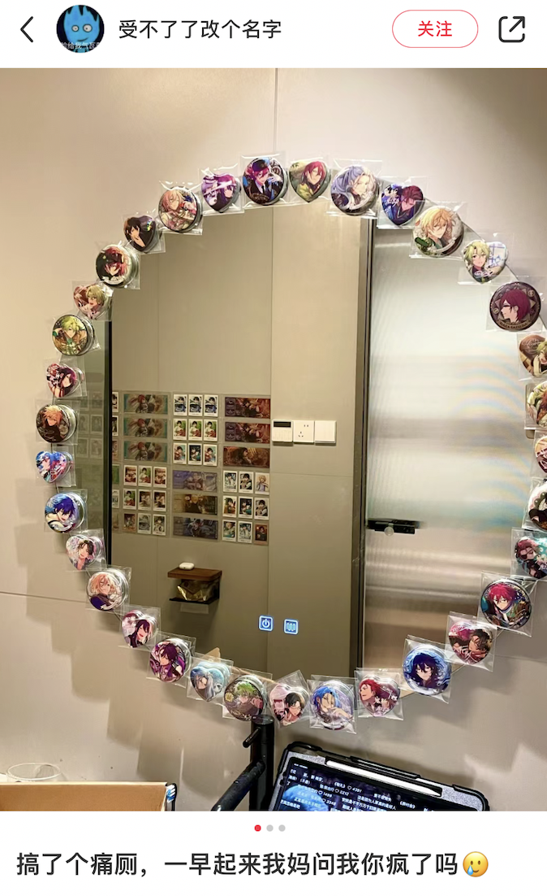
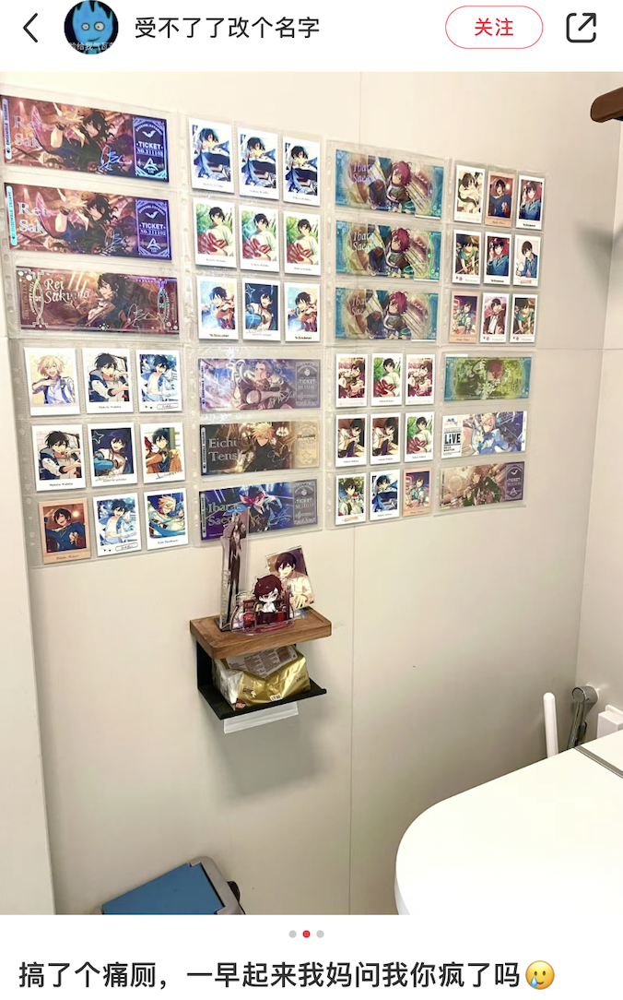
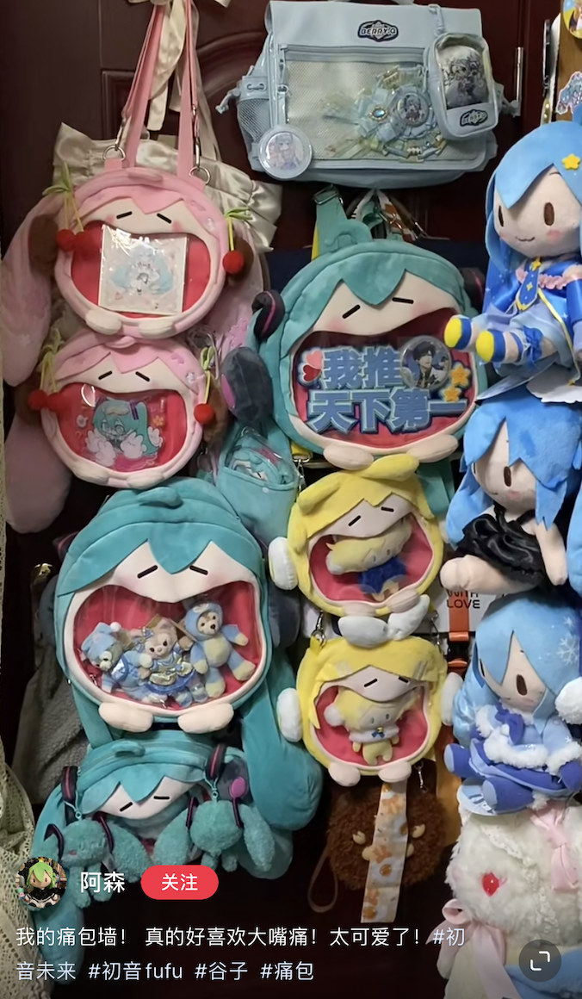
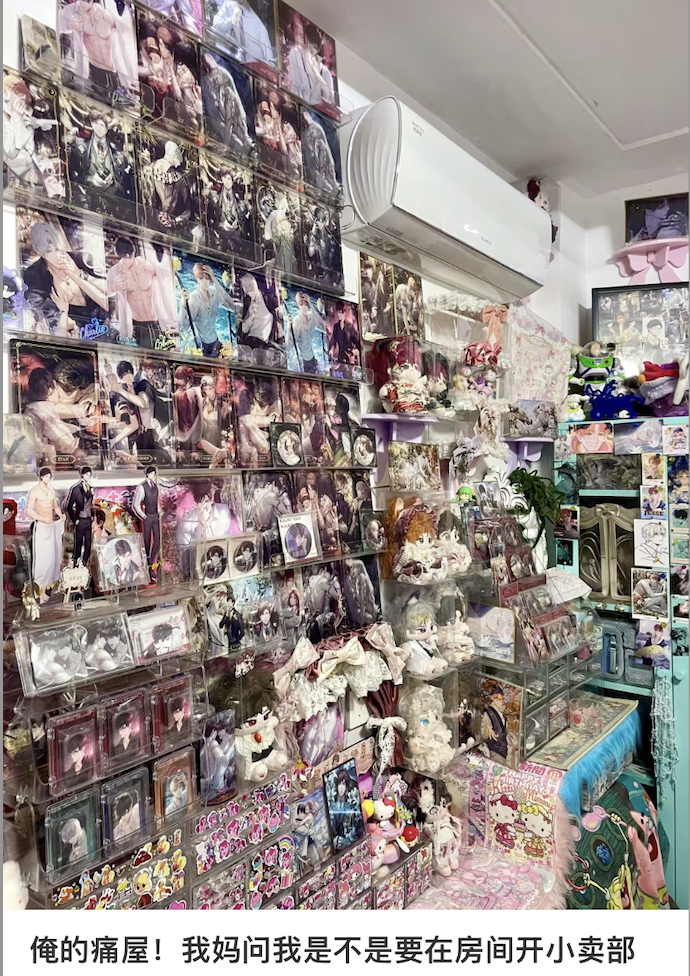
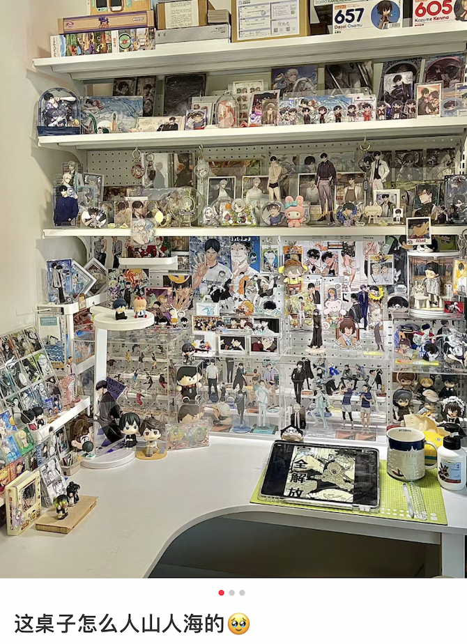
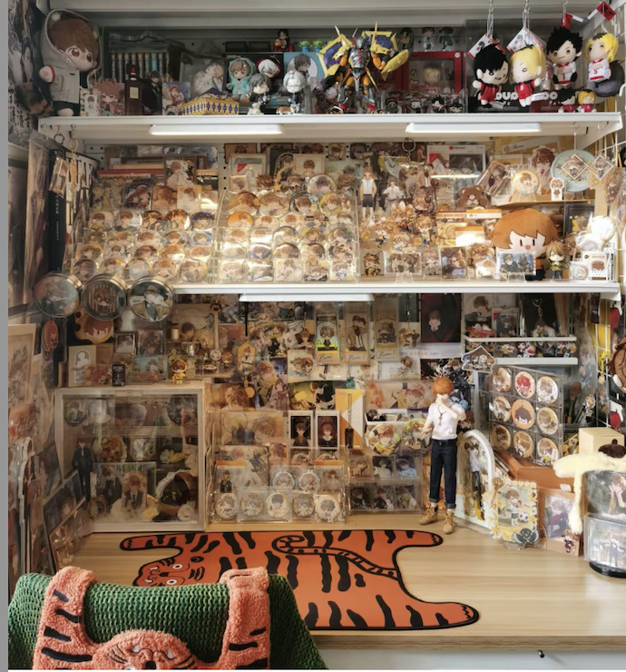
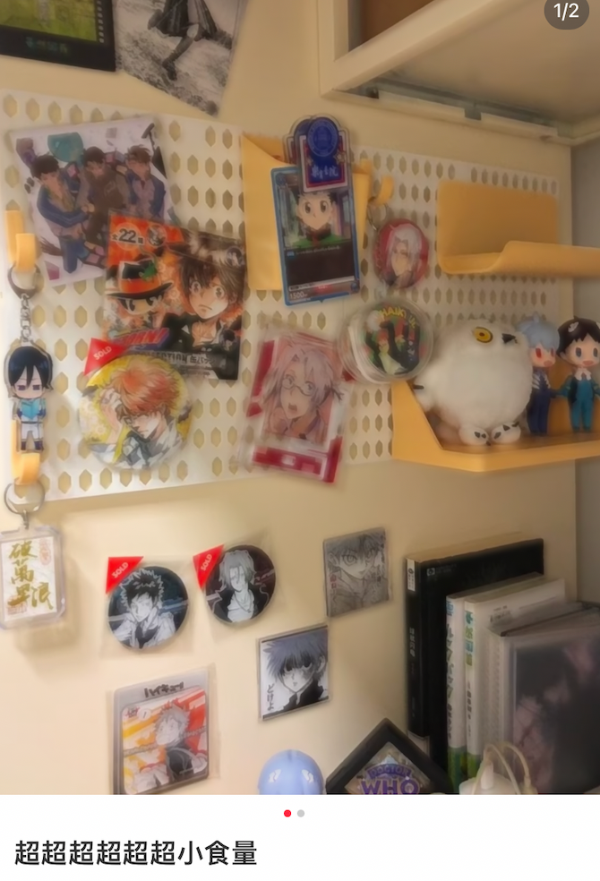
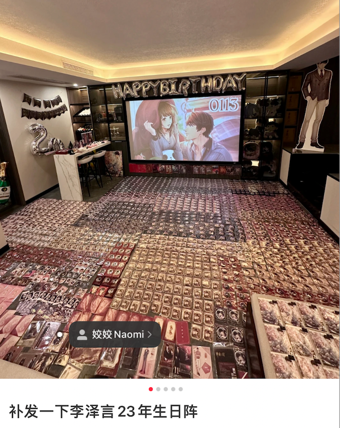
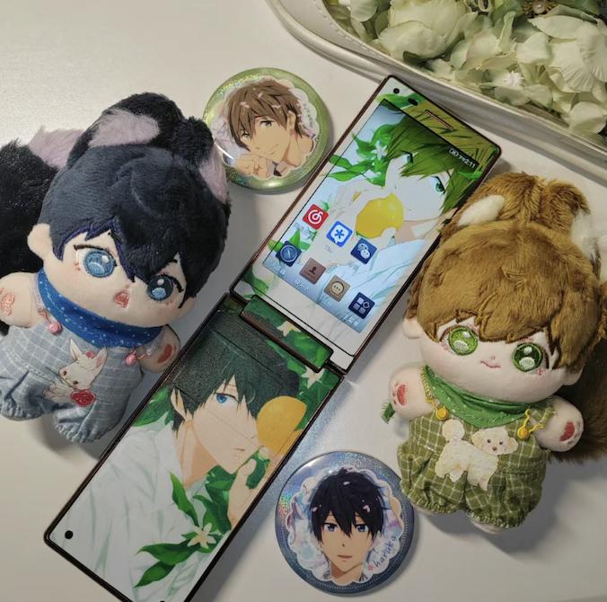

# 00 后“痛文化”流行：一边“吃谷”一边“痛”，加价上千四处求购

_《新鲜计划》栏目由腾讯科技推出，挖掘最新鲜的产品，探索年轻一代的最 in 的生活方式，体验智慧浪潮中的 Aha 时刻。_

划重点：

  * _1_ 不久前，一条“爆改二次元厕所”的笔记登上一个社交软件热榜，按照圈里的黑话，这叫“痛厕所”。“痛文化”已经伴随二次元潮流流行了很长一段时间，是指用喜爱的动漫周边来做装饰，通常面积巨大又浮夸。
  * _2_ 痛文化的主力来自“谷圈”，也就是那些热衷购买动漫周边的群体。谷子是goods的音译，购买周边则被俗称为“吃谷”。"吃谷"不只是取悦自我，痛文化的核心诉求是“晒”，甚至把喜爱的动漫角色穿戴在身上“昭告天下”。
  * _3_ 在社交媒体上，“吃谷-晒单-录开箱-买收纳-拍谷美-扎痛包-摆痛桌痛房”，形成了一条链路循环，每个吃谷人都很难不卷入其中，同时也让吃谷变成了一种“视觉系”的繁荣消费景观。
  * _4_ 在谷圈，“吃复数”是一种惯常的购买模式，同一款产品买N件。这种模式直接拉高了客单价和复购率，拉起了增长曲线。有观点认为，“消费降级”的冷风并没有吹到二次元。消费群体规模、交易活跃度、增长力，都显示出这一市场仍大有可为。

这些年上班族摆盲盒公仔、搞“工位装修”，早就是二次元玩剩下的了。

不久前，一条“爆改二次元厕所”的笔记登上一个社交软件热榜，博主把游戏角色的徽章360°环绕贴满梳妆镜，立牌摆上纸巾架，文件夹当背景墙。这个“妈见打”的厕所，吸引了数十万网友围观和上万点赞，还有数千收藏量暗示了一群人的“臭味相投”。

按照圈里的黑话，这叫“痛厕所”，其实就是用动漫周边去美化装饰厕所。事实上，“痛文化”已经伴随二次元潮流流行了很长一段时间，是指用喜爱的动漫周边来做装饰，通常面积巨大又浮夸。比如“痛车”，就是把动漫图案喷涂到车上。

但在中国，“痛文化”冲淡了刻板印象里浓烈的御宅味，愈发注重美学和视觉呈现，向日常化、流行单品迈进：痛包、痛甲、痛衣、痛笔袋、痛墙，“万物皆可痛”，也成了一群人的身份勋章。

廉价的尼龙包塞满“吧唧”（徽章），就变成了“年轻人第一款轻奢包包”，这样的“痛包”市价轻松上千。更顶奢的是“痛房”，把动漫周边铺满整个房间，每寸面积都散发出直逼六位数的豪门味道。坊间甚至有一种调侃，“金融危机来了都有二次元来扛”。

_（痛包，痛房）_

“万物皆可痛”，一种“现实版美图秀秀”？

打开社交媒体，徽章、立牌、软毛绒、挂件摆满案头，早已是大学生宿舍的日常画风。洞洞板+增高架+桌垫，撑起了“20岁拥有两平米主题乐园”的梦。

在圈外看来，这些二次元脸就像复制粘贴一样，精密排列，丰富、充实又热闹。而在一个二次元人士眼中，痛桌关乎着一种饱满的极繁美学，谷子越繁多就拥有越真实的陪伴感。

痛文化的主力来自“谷圈”，也就是那些热衷购买动漫周边的群体。谷子是goods的音译，购买周边则被俗称为“吃谷”。

_（“小食量”吃谷人也在“痛”）_

艾漫创始人吴伟诚对「玩世代」指出一个市场趋势，年轻人热衷吃谷除了收藏属性，也越来越看重功能性，向家居领域渗透。

圈里有一个玩法叫“摆阵”，指把收藏的谷子平铺到房屋的每个角落，极具视觉震撼力。虽然“摆阵”往往是为了给角色庆生等，是个颇具仪式感的玩法，但用谷子装饰美化空间的趋势愈发明显。痛柜、痛墙、痛屋、甚至痛厕，极致的场景下沉。

_（据说“摆阵”的天花板价值百万）_

对于没有生活压力的00后来讲，“痛文化”，“痛”得更加随心所欲，追求的是“目之所及皆是喜欢”。

那些上班族爆改工位是为了愉悦自我，独自小楼成一统；而大搞痛文化的吃谷人，则在悦己之外更多了一层分享欲，一种社交货币属性。

所谓“买谷不晒等于白买”，这年头，吃谷不只是取悦自我，痛文化的核心诉求是“晒”，甚至把喜爱的动漫角色穿戴在身上“昭告天下”。

某社区平台上，老年机被玩成了时尚单品，战损版iPhone 4和翻盖手机加上定制贴膜就成了“痛机”，让姑娘们爱不释手的“美丽废物”。

而能够出街OOTD凹造型的“痛包”更为主流，在一家短视频平台上有8亿多浏览量。装饰美学、轻潮流化，推动着“痛文化”从小众变成一种群体流行。

一个合格的痛包，要有大天窗，能够充分展示自推，并且给足创作空间。不同谷子和元素相互堆叠，点线面排列、搭配色系，这届学生的痛包模板堪比打工人的PPT模板。为了扎更美的痛包，有人一年能拿下十几只痛包。林林总总算下来，“痛包”花费能顶上一只香奈儿。

更浮夸的玩法是在包里“造景”，甚至扎横幅宽达1米的巨盾痛包，出街回头率100%，“包”不惊人死不休。

在二次元的主阵地的一家视频平台上，“痛爹”火成了中式痛文化的迷惑大赏，有两百多万人围观，二十多万点赞。视频里老爹举着动漫周边一本正经念台词，介绍起女儿热衷的动漫角色。随后还衍生出了“痛老师”“痛妹”“痛弟”。

痛文化愈发“独乐乐不如众乐乐”，“痛”到后来，痛什么已经不重要，痛点是极致的个人表达和情感认同。

谷圈，消费降级都绕着走

但想挤进痛文化的潮流，前提是“吃谷”，得有充足的“素材库”。

在谷圈，“吃复数”是一种惯常的购买模式，同一款产品买N件。有谷圈人士指出，“买复数、反复把玩翻看、珍藏这样的行为才算是买谷”，按照她的消费习惯，“买一件算保底，特别喜欢价格合理就会买复数”。

这种模式直接拉高了客单价和复购率，拉起了增长曲线。今年双十一，游戏动漫周边零售店铺撑起了潮玩热卖榜的半壁江山，有品牌首战就达成了5000万销售额。

多家动漫零售品牌今年营收保持翻倍增长。一家位于南昌的二次元零售门店单店复购率高达73%。

据了解，消费客群中占比最大的00后季度花费上千不算少，相对有经济能力的上班族甚至月烧过万。

谷圈，就是这么反直觉！

尽管大学生们高喊“反向消费”，践行着“特种兵旅游”“吃糊弄饭”，但身体却很诚实——吃谷的人不但没有减少，反而更多了；吃谷的客单价不算高，但按捺不住频繁剁手的心。

今年的春节档、暑期档，上海、广州、北京多地的动漫店挤满了成群结队来逛店的年轻人。其中谷子撑起了门店的“现金牛”。广州樱漫书店透露，商品销售连续三个季度翻倍增长，商品年总销量超百万。

限定要买，场贩要买，联名要买，每一种都代表着稀缺和收藏价值。甚至有时候，“早买早赚到”，“今天不买，明天八百”。比如有游戏周年限定官方发售价百元，一年后就变成了绝版，转手就有人加价一千元求购。这种溢价波动又加大了购买欲刺激。

“谷市”堪比“股市”。那些热门作品中的热门角色、好看的图案和产品工艺质感的单品很有可能是潜在“绩优股”，因为喜欢的人多，就越有人想要买入收藏，就具有了流通价值。

甚至，吃谷上头到有自己的心理计量衡。有谷圈爱好者指出，最着魔的时候，买任何东西都能颅内换算成谷子价格，“一盆草莓等于一个马铁口徽章，两杯奶茶等于一个亚克力立牌”，欲望在美食和吃谷之间反复横跳，最终或又买入了更多铁皮和塑料片。

在社交媒体上，“吃谷-晒单-录开箱-买收纳-拍谷美-扎痛包-
摆痛桌痛房”，形成了一条链路循环，每个吃谷人都很难不卷入其中，同时也让吃谷变成了一种“视觉系”的繁荣消费景观。

一种观点认为，谷子本身就是“廉价快乐”，锁死低价格带，“便宜的小物一买买一大堆”，本身就是消费降级下的标志物。

也有观点认为，“消费降级”的冷风并没有吹到二次元。消费群体规模、交易活跃度、增长力，都显示出这一市场仍大有可为。

三月兽创始人沈浩指出，“消费降级”在二次元品类上体现得较不明显，但商品结构发生变化，热卖主力从动漫角色手办向低单价高成交数的轻周边偏移，如徽章、立牌、镭射票等受到市场热捧。

事实上，手办模型雕像的核心购买主力是男性，而徽章、立牌等平面类产品的消费主力是女性。由此也有市场观察认为，消费力正重新回到女性手上，撑起了这波热潮。

比如女性玩家热捧的乙游《光与夜之恋》，徽章单款就卖出数十万件，刷新销售“天花板”。天闻角川产品开发负责人指出，女性群体热衷吃谷，源于产品能否引起情感共鸣，这种共鸣可以是对角色追逐梦想成功的感动、对美好关系的憧憬，或是对自身幻想的满足。

“二次元消费的本质是对文化产品的认同，体现的是情绪消费，为快乐买单”，漫库创始人赵雷谈到，二次元消费者的忠诚度更高，更愿意为具有文化和情感价值的产品支付溢价。

无论如何，旺盛的付费意愿和消费力，正驱使着消费端进化升级。

线下店遍地开花，都在争一个“快乐老家”

今年最炸场的是，上海百联ZX创趣场打造了“一整栋正版IP大楼”，从1楼到6楼全部主营二次元商品，从游戏到动漫、从手办模型到轻周边包罗万象。其聚集效应直接拉高了整个南京东路的二次元浓度和年轻客流。

每逢周末都有二次元来团建，游戏《无期迷途》、二次元游戏《偶像梦幻祭》，主题活动一场又一场。甚至有些长三角地区的学生打高铁来玩，“杭州到上海坐高铁，往返150元，和朋友一起来很有氛围”，扮上喜欢的角色装扮，抱着角色玩偶，和朋友刷限定，顺便在主题餐厅吃吃喝喝，达成一整天的快乐。

“流量”“销量”的直接回报，让不少海内外版权方、游戏厂商、品牌们加大布局。

日本玩具巨头万代的万代魂商店、扭蛋专卖店挤进全国各大商圈。今年年底前三月兽线下店会增至9家。艾漫的步伐更迅猛，今年新开六十多家门店，预计今年年底会超过百家。漫库则在成都落成了450平的旗舰店，以超级大店来支持举办活动和比赛。

各种零售店、主题店、联名店遍地开花，这还不算上个体经营的谷子店，潮玩集合店、礼品杂货店。

甚至新消费品牌们也抢着当“气氛组”。茶咖品牌接连换装主题店，平均每3天一个联名，买奶茶送贴纸挂件立牌，每每吸引年轻人争相排队打卡。

日杂品牌nikoand在中国最近接连推出eva、咒术回战联名，来抢周边的粉丝人流叠人流，有人排队两小时扫货5分钟，只为徽章、鼠标垫、冰箱贴这些小物件。这劲头不输当年大妈抢购优衣库KAWS联名T恤。只不过，这一次是“二次元”。

密集输出、新鲜限定、唾手可得的平价快乐，繁荣了谷圈的消费图谱。

面对热衷吃谷的年轻人，品牌商也在着力提供更多元的体验，围绕“二次元走到三次元”，去深挖激发潜在需求。

不久前，国漫《天官赐福》在静安大悦城开起主题餐厅，每道餐品紧扣动漫故事主题，最具代表性的“仙乐宫”甜品造型像雕刻宫殿一样。拉上三五好友打卡拍照、吃美食，顺便买周边变得更加顺理成章。

仅12月，上海主流商场的IP主题餐饮店多达15个。其中不乏《咒术回战》《文豪野犬》《非人哉》《魔卡少女樱》《阴阳师》《光与夜之恋》《三丽鸥》《罗小黑》等，都是热门动漫、游戏IP。据了解，像《天官赐福》这样的IP主题店，IPSTAR潮玩星球目前在全国有17家店，同时运行着10个主题，不断翻新花样，满足兴趣群体的喜好。

据《2023中国新消费趋势白皮书》，过去三年（2020年-2022年），18-22岁的00后人群在淘宝天猫上，人均客单价增长高80%，超过其他代际人群。7成00后把兴趣爱好消费当成“日常”，比90后兴趣支出的占比更大，为兴趣买单的意愿更强。这一潜力，“月薪几万的白领”都难以企及。

另据艾瑞报告，2020年国内动漫市场就已步入“千亿大关”，年增速高达32.7%，估算2023年泛二次元群体将达到5亿人次。从年均消费金额来看，二次元用户在动漫方面的消费额在1500元左右，其中大多花在了周边消费上。

年轻人热衷吃谷、喜欢用谷子装点生活，也点亮了线下消费场景焕新。为00后打造一个“快乐老家”，正变成一个更具想象力的生意。

