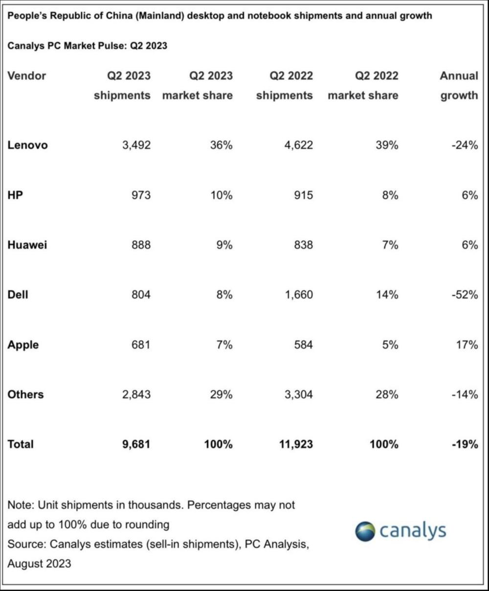
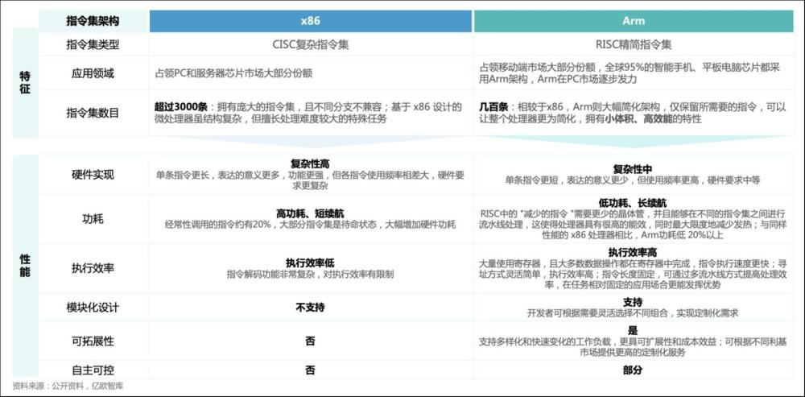

# 2023芯片行业复盘：巨头们扎堆Arm芯片，传统PC厂商拥抱AI

_图片来源：视觉中国_

即将过去的2023年，对于PC产业而言也许将会是转折性的一年。据Canalys预测，2023年，全球智能手机市场预计出货量下降5%；全球PC市场全年出货量将达2.49亿台，同比下滑12.4%。传统PC在疫情结束后正在经历至暗时刻。

但得益于Arm芯片的涌现以及ChatGPT所带来的新一波人工智能高潮，新一代移动架构的笔记本和应用人工智能技术的「AI PC」已经走上舞台。

这两股力量，不仅可能帮助PC产业渡过当前的困境，而且可能为其开启新的发展篇章。

首先，Arm芯片的崛起正在改变传统的PC产业格局。由于其高效能、低功耗的特点，Arm芯片已经被广泛应用于智能手机、平板电脑等领域。而在PC领域，随着微软Surface系列等基于Arm架构的笔记本产品的推出，越来越多的消费者开始认识到Arm芯片的价值。这些笔记本产品不仅具有更长的续航能力，而且性能也足以满足大部分日常使用需求。因此，Arm芯片的普及可能会成为PC产业走出当前困境的一个有力武器。

其次，ChatGPT等人工智能技术的兴起也为PC产业带来了新的发展机遇。「AI
PC」作为一种新型的PC产品，其最大的特点就是集成了人工智能技术。通过深度学习和自然语言处理等算法，「AI
PC」可以自动完成一些复杂的任务，如语音识别、图像识别等。这种自动化的处理方式不仅可以提高工作效率，而且也可以让消费者享受到更加便捷的服务。因此，「AI
PC」的推出不仅可以满足一些专业领域的需求，而且也有望成为未来PC市场的一个重要增长点。

迟到的回应，已至的变局

根据市场研究机构Gartner的报告，全球PC制造商第三季度出货量为6430万台，同比下降9%，目前PC市场已经连续八个季度下滑。

中国市场方面也是同样的境遇，根据Canalys的报告显示，2023
年第二季度中国大陆个人电脑出货量同比下跌19%至960万台。其中值得注意的变化，是戴尔对于既有市场的失守。

_图片来源：Canalys_

据Canalys数据显示，戴尔在头部厂商中降幅最大，同比下降 52%，市场份额由此前的第二下滑至第四，被惠普、华为超越。

早在今年1月，《日经亚洲新闻》就有报道指出戴尔计划到2024年全面停用中国制造的芯片，包括非中国芯片制造商在中国工厂生产的芯片。随后在今年3月，外界传出戴尔已制定了产能移出中国大陆的时间表，将于2025年实现50%的产能移出中国大陆，2027年与中国供应链脱钩，实现100%非中国制造。

在很长一段时间，戴尔方面并未就此任何官方答复，直到今年11月24日，戴尔进入中国市场25周年的活动上，才对相关消息进行了回应。戴尔全球资深副总裁吴冬梅表示，戴尔从未发表过任何信息或评论，戴尔在全球范围内的行为准则就是不对谣言进行评论，这是戴尔一贯的立场，但遗憾的是，这种态度被错误和片面地解读成不评论即是确认。

在戴尔公司工作多年的冯亮告诉钛媒体App，戴尔电脑总部设在美国德克萨斯州奥丝登(Austin)，本身企业文化就偏向保守，一直以来有「少说多做」的传统。在回应外界方面，确实有自己的苦衷。业务方面，目前戴尔的中心也在向人工智能和企业数字化方面转型。

但从具体的财务指标上来看，戴尔的表现很难说是理想。Q3营收同比下降10%至222.51亿美元，含企业及消费者个人电脑销售在内的戴尔PC客户解决方案业务营收同比下降11%，至122.76亿美元，环比则下降5%，不及分析师普遍预期。

_图片来源：视觉中国_

有人忧虑就有人欢喜，华为就是这一波PC市场洗牌的最大获益者。

2023年第二季度中国PC市场，华为的市场占有率为9%，仅次于联想和惠普。虽然季度同比增速只有6%，作为PC市场的新玩家，在大环境下跌的情况下逆势增长实属不易。

相比于传统的PC，华为基于分布式技术，打通Windows
PC与智能手机生态。华为笔记本消费者的陆良告诉钛媒体App：“自己之所以选择华为的笔记本，主要是考虑到自己用的是华为手机，选择华为笔记本互联互通，进行传照片等操作更为方便。”

此外，根据彭博社消息，中国计划于两年内完成全国各事业单位和行政部门的5000万台电脑，实现国产替代。这对于极力推动国产化的企业而言，毫无疑问是利好消息。

巨头扎堆Arm架构，加速释放优势

除了市场变化之外，PC产业在技术层面也发生了一些变化，这些也许将会在未来很长一段时间内，改变人们的工作习惯。

_图片来源：亿欧智库_

相比于传统的x86架构PC，Arm架构PC成本低、功耗低、日常性能够用，也被苹果的M系列芯片验证，可以完成高负载的工作，是面向未来理想型的PC架构。亿欧智库数据显示，全球范围内Arm架构PC的市场份额，已经从2020年的1.4%增长至2022年的12.8%，增长速度非常可观。

2023年10月25日，高通在骁龙峰会期间，正式推出面向PC打造的Arm架构全新处理器：骁龙X
Elite。芯片采用4nm制程工艺，12颗主频为3.8GHz的Oryon CPU大核，并且集成了高通的Adreno GPU和Hexagon
NPU。根据高通公布的数据显示，如果跟英特尔12核的i7-1360P和10核的i7-1355U处理器相比，高通骁龙X
Elite的CPU性能提高2倍，但功耗降低了68%。

有消息显示，除了高通外，更多的芯片企业即将入局。据路透社报道，英伟达正在开发采用Arm技术的芯片，英伟达已开始设计个人电脑CPU，这些CPU将运行Windows操作系统。另有消息称AMD也计划生产基于Arm架构的CPU，最早将于2025年开始销售PC芯片。

在软件生态上，虽然Arm架构才刚刚起步，但却有着更好的通用性。Arm架构具有与智能手机通用的开发工具，在跨设备应用越来越频繁的趋势下，Arm架构基于移动端生态优势更容易打破PC和智能手机之间的边界。亿欧智库预估在2027年，PC市场（不包括平板）中Arm份额将达到26.7%。至于Arm架构的PC产品何时能够对Intel产生实质性的冲击，目前还没有一个明确的答案。

被寄予厚望的AI PC，将会成为未来主旋律？

_图片来源：视觉中国_

除了已经落地和即将到来的Arm架构PC外，AI PC也是2023年最新最火的概念。从最新的发展情况来看，AI
PC可以实现图像放大、文生图、代码编写、视频剪辑等功能。

今年10月，英特尔宣布启动“AI PC 加速计划”，随后在月底联想展示了全球首台AI PC。与传统PC相比，AI
PC能够创建个性化的本地知识库，通过模型压缩技术运行个人大模型并实现用户与AI的自然交互。除了联想以外，宏碁、惠普、雷神、戴尔、机械师、微星都将发布搭载英特尔最新一代酷睿Ultra系列处理器的AI
PC产品。

根据调研机构Canalys的预测，兼容AI的个人电脑将从2025年开始快速普及，并有望到2027年约占所有个人电脑出货量的60%。抓住这次机会的厂商和渠道伙伴将受益于AI个人电脑的较高售价，并有机会提供除硬件之外的服务和解决方案。

但从目前来看，AI PC似乎还缺乏一些确定性，用户究竟有多少刚性需求？AI PC短期内能解决什么痛点？两个方向似乎都不明确。

现阶段AI缺乏「不可替代性」，也就导致所谓的AI PC恐怕很难与传统PC在体验层面拉开差距。受限于算力和硬件规模的限制，即便AI
PC能带来端侧的大模型部署，但它能够实现应用效果，相比拥有更强通用算力或者能够借助云端算力的PC产品，仍然很难拉开差距。

从人工智能发展的进程来看，各家的大模型都还处于基础阶段。10月31日，加利福尼亚大学圣迭戈分校的研究者Cameron Jones和Benjamin
Bergen发布了一份研究报告，给出了他们对GPT-4等AI智能体进行图灵测试的实证研究结果。实验在652位人类参与者的帮助下检验了GPT-4模仿人类的能力，结果发现表现最好的设置能达到41%的成功率，而人类水平为63%，因此作者认为GPT-4未能通过图灵测试。

但无论如何，对于PC企业而言，AI能够提供的吸引力或是想象空间，在如今这个消费电子行业的寒冬里，已经是非常合理的自救手段了。

根据联想2023年二季度财报显示，多元化增长引擎成效持续显现，非个人电脑业务营收占比达到了41%，年比年升4.3个百分点。利用AI优化的AI
PC、AI智能手机、AI 服务器、AI
存储等产品，正在带动联想收入和利润的增长。联想董事长兼CEO杨元庆表示，现在联想的目标是两年时间实现50%以上是非PC业务。

考虑到PC市场的周期性，AI PC随着疫情初期的换机用户升级需求爆发也是合理的预期。像是IDC就预测，中国PC市场将因AI
PC的到来在未来5年中保持稳定的增长态势，台式机、笔记本电脑、平板电脑市场总规模将从2023年的6800万台增至2027年的8000万台以上，增幅接近18%。
**（本文首发钛媒体App 作者/吴泓磊 编辑/钟毅，文中冯亮为化名）**

