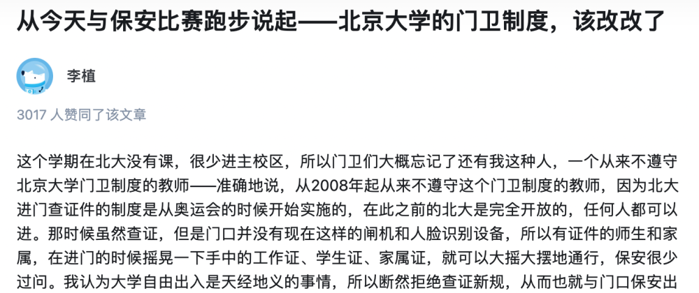
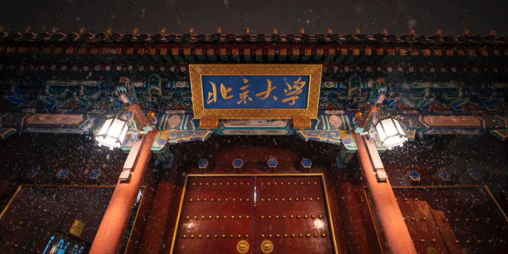

# “跨栏”进出校门的副教授：我这种人，从来不遵守北大门卫制度

据南方周末报道，北京大学工学院副教授李植近日在社交媒体的几篇文章，让大学校园该不该开放的话题再次成为公众关注的焦点。

李植记录了前段时间他“跨栏”进入学校，和保安上演一场“追赶大赛”的故事，呼吁北大打开大门。

此事引起了不小的关注，紧跟着，高校是否应该打开大门引发热烈讨论。有人认为“好的大学没有围墙”，也有人认为，设置进出门槛能更大程度保护在校师生。

**【1】“大学自由出入是天经地义的”**

九派新闻在知乎上找到了一篇名为《从今天与保安比赛跑步说起——北京大学的门卫制度，该改改了》的文章，作者为李植，该用户没有身份认证。

_知乎文章截图_

作者在文中写道，北大进门查证件的制度是从2008年开始实施的，在此之前北大是完全开放的，任何人都可以进。

他认为，大学自由出入是天经地义的事情，所以断然拒绝查证新规，从而与门口保安出现过多次摩擦。“好在我一般都配合调查（只是不出示工作证），也愿意恭候警察前来问话，所以保安们逐渐就知道有我这号人，这么多年了一般都放行，直到校门口装上了闸机。好在闸机的门不高，我抬腿就能跨越，有些闸机的门之间也有比较大的空间，直接挤过去对我这样瘦高的人也不是障碍，所以我仍然拒绝更新的入校制度。”

因为这个学期在北大没有课，他很少来主校区，“所以门卫们大概忘记了还有我这种人，一个从来不遵守北京大学门卫制度的教师。”前几日，当他来到主校区，抬腿跨过闸机之后，“保安不想放过我”。

他和保安在学校上演了一场追赶大赛，他跑向新改造好的数学科学学院，然后向农园食堂转向，再转向新太阳活动中心地下，后来又去了大讲堂，这才被保安追上。他对保安说：“你们的体力不行啊。连我都追不上？”保安回答：“是啊，你跑得挺快！我这身大衣太沉了。”

后来，李植再次向保安出示了工作证，告诉他只要向领导报上他的姓名就没事了。果然如此，赶过来的巡逻队员都迅速撤去。

等到下午离开学校时，保安又要他刷脸，否则不打开闸机。他照例问：“出门还要这么麻烦？”对方回答：“怎么进的就怎么出。”

“我要的就是这句话，一抬腿就出去了，同时告诉他‘我就是这么进来的’。”李植在文中写道。

文章最后，李植称，北大的这种门卫管理制度给师生造成了很大不便，上下班高峰时，北大东门的闸机前常常排起长队。“我们真正希望看到的保安应当更关注校内公共场所，而不是站在门口。尤其是连出门也要管，毫无必要。这种刷脸出入校的闸机，什么时候拆除呢？”

在北京大学的官网上，确实有一名副教授名为李植，官方信息显示其为北京大学工学院力学与工程科学系副教授、流体力学学科点副主任，于1999年开始在北京大学任教。

12月17日，九派新闻尝试与北京大学工学院副教授李植联系，询问该文章的真实性，截至发稿，未获回复。有媒体联系北京大学多部门求证此事，也未获回应。

**【2】高校开放问题并非首次引发讨论**

李植的文章引发了大众对“大学是否应该开放”的思考和讨论。

有不少人支持李植，认为高校不同于小学和中学，应该打开大门，还有不少网友在相关报道下讲述自己因为大学设置闸机或人脸识别带来的不便。

“我们这里的郑大也一样，春天我想去郑大看樱花，结果带了个郑大毕业的老师也混不进去。以至于后来当我去哈佛参观的时候听说可以随便进都不敢相信，进去发现连导游都可以随便进。”

“国庆去西安看女儿，住在校园对面的酒店。早晨打她电话不通，想进学校找她(因为有事)，门卫死活不让进。真行，把二十多岁的成年人保护得跟大熊猫似的，家长都见不到。有点想不通。”

“湖南大学和湖南师范大学校区没有围墙，两所大学挨在一起，也没有明显的界线。走进去能感受到大学的包容和开放。”

“门禁应该移到教学楼和重要场所，打开校园大门，分享公共资源，做精细化管控，而不是一刀切关大门。”

九派新闻注意到，这并非首次高校是否开放引发讨论。

今年7月，北京大学保卫部发布的一则违规情况通报称，7月5日，一支名为“狼爸部落”的校外研学团队，通过联系校内人员、借用账号在树洞平台发布预约求助信息等方式拆分预约，由多名校内师生预约入校。校方决定关闭或暂停该团队校内人员的预约入校权限。

 _北京大学的参观须知截图_

清华大学也发文规定，参观人员须按照规定路线在规定区域内进行参观，参观人员所乘坐的各类车辆禁止入校，非开放区域和校内教学办公楼宇不对参观人员开放。

清华北大等高校陆续打开大门，恢复校园参观预约通道，伴随而来的却是“名额秒没”“黄牛涨价”等现象。

同期，《中国科学报》曾刊文指出，这些现象的背后，是一个常说常新的话题——高校该不该设置围墙，以及大学该如何更好地开放。

比较流行的一个说法是“好的大学没有围墙”，认为大学之“大”在于“有容乃大”。对此，东南大学青年首席教授孙文文告诉《中国科学报》，好大学和有没有围墙并无任何必然联系，围墙本身没有错，也禁锢不了思想。如果把办好大学和围墙联系起来，本身就是悖论。

**【3】公立大学的校园是公共资产，是一种社会性资源**

对于高校是否应该开放，高校的老师又是如何看待的？

九派新闻发现，前几日，李植在知乎上发布文章《再说北京大学的门卫制度为什么必须改》，其在文中提到，北大师生对闸机恐怕也是又爱又恨的。那些喜欢处于被保护状态的人，更多的可能是北大的学生，往往会觉得闸机不错。但闸机也带来不便，比如高峰期排队。其认为闸机还存在安全隐患，若出现危急情况，不利于快速疏散人群。

其在文章最后提到：“因此，作为制度上的建议，我们有必要先从拆除出校闸机入手，出校还刷脸、刷卡是毫无必要的。”

_北京大学。图/北京大学微信公众号_

据央视网报道，对于“为什么大学应该向公众开放？怎样开放大学校园更合适？”这一话题，中国人民大学教育学院胡娟教授表示，公立大学的校园是公共资产，是一种社会性资源。大学校园的开放是符合公共资源利用原则的，是高等学校应承担的一项义务和责任。开放大学校园应该注意教学科研秩序、校园安全和高校的实际情况，通过精细化的管理来做好校园开放。

中国人民大学教育学院周详副教授则认为，现代大学的功能包含教学、科研、社会服务三项，社会服务本身就是大学的重要功能之一。开放大学校园一定是有序、科学地开放，应当在校园承受能力范围之内进行，同时也应以保障师生正常的工作和学习秩序为前提条件。

九派新闻记者 温艳丽

编辑 王佳箐 任卓

【来源：九派新闻】

版权归原作者所有，向原创致敬

