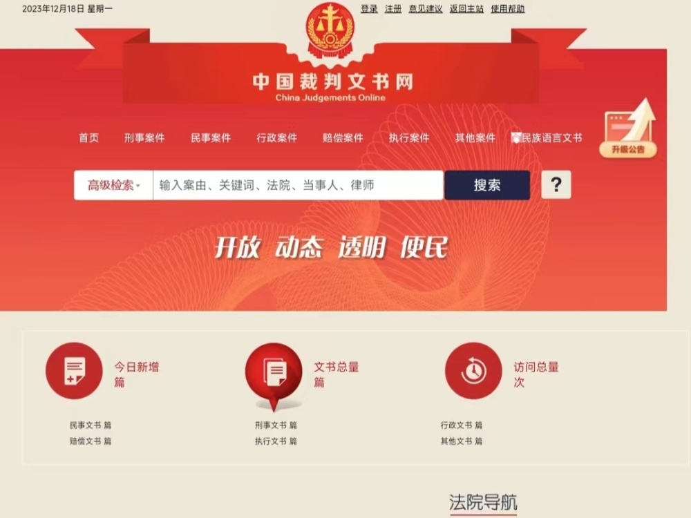
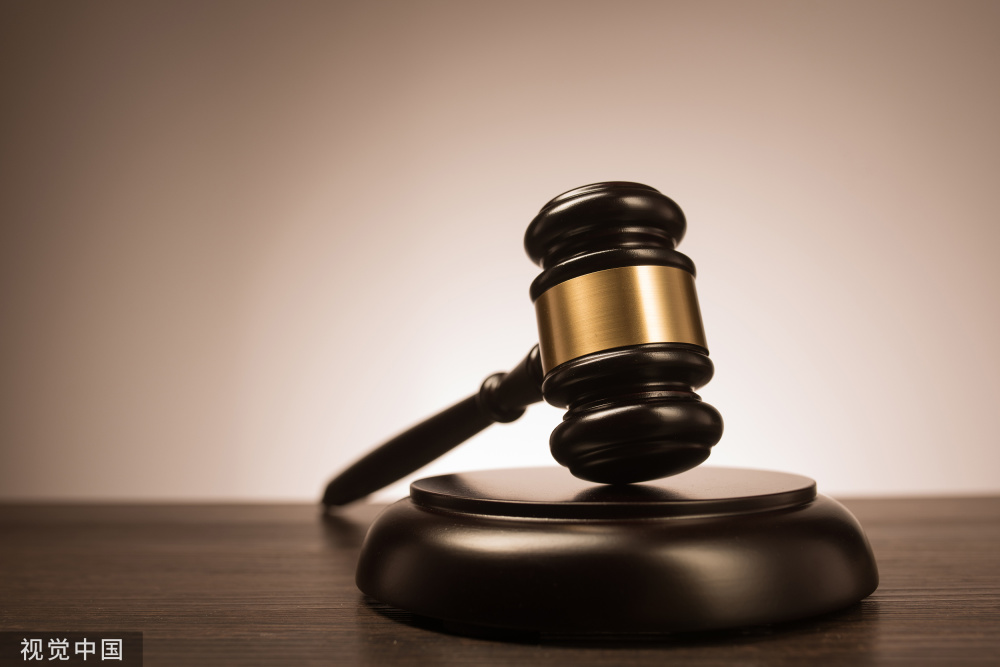
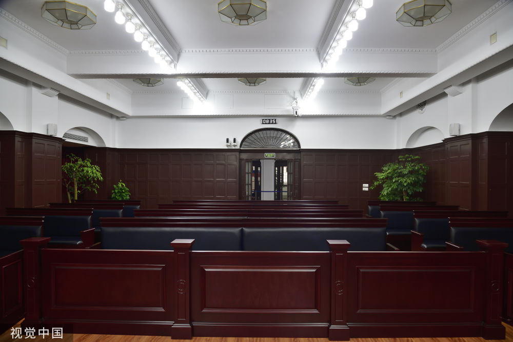

# 中听｜裁判文书网不应被替代，阳光是最好的防腐剂

评论员 邱延波

正义不仅应当实现，而且应当以人们“看得见”的方式实现。

近日，网传最高人民法院明确要在2024年1月启用“全国法院裁判文书库”，仅法院人士在内网可以查询。有消息称，最高法院也在同步筹建“人民法院案例库”，供各级法院、广大法官使用，并适时、以适当方式对外公开，供社会公众使用。

目前，连法院的相关人士都不清楚，建设对内使用的裁判文书库，以及搭建一个可供公众查询“人民法院案例库”，与中国裁判文书网之间会形成并存关系，还是替代关系。如果新建的全国法院裁判文书库与中国裁判文书网并存，就是在现有的裁判文书网体系之外，另建一套系统，属于重复建设，浪费公帑。如果用对内的全国法院裁判文书库替代现在公开的中国裁判文书网，中国裁判文书网就是被判了“死刑”。如果用“人民法院案例库”来代替中国裁判文书网，不仅重复建设，造成浪费，而且何时向公众公开，案件数量有多少，都是未知数，难以让人信服。

2013年以来，最高人民法院秉持“以公开促公正”的改革精神，建设了中国裁判文书网。司法公开被人们津津乐道，大家都说，阳光是最好的防腐剂，这一招可以在很大程度上避免司法腐败。

裁判文书上网，保障了公众的知情权，提高了司法透明度。每一份裁判文书都将接受人民群众的检查和评论，倒逼法官提高业务水平。公开是公正的基础，公开是公平的前提。如果信息“不公开”，会造成信息“不对称”，会导致结果“不公平”。司法工作的神圣职责，是维护“公平”。没有判决书的“公开”，就很难保证判决结果的“公平”。

12月11日至12日，中央经济工作会议在北京举行，进一步推动经济回升向好，预期和信心格外重要。这个信心需要公开透明的法治环境和言行一致的政治信用来支撑。因为经济不是单纯的生产和买卖，经济最重要的是人们对未来的长期投资和稳定预期。从长远看，中国裁判文书网一旦停止对外公开，可能会造成人们对司法透明的信心不足，间接影响人们对经济回升向好的信心。

清华大学法学院教授何海波称，裁判文书公开可以促进司法公正，提升司法公信力，明晰法律规则，促进社会信用和为重要决策提供参考。

10年过去了，裁判文书公开虽然有些小瑕疵，但总体上利大于弊，取得了一致好评。裁判文书公开制度可以改进，但不能倒退。裁判文书网细节可以修补，总体不应被替代。

