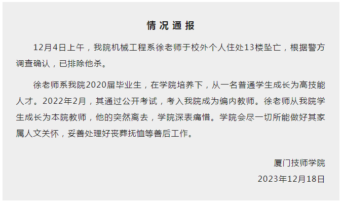

# 厦门技师学院通报一教师坠亡：据警方调查确认，已排除他杀

**情 况 通 报**

12月4日上午，我院机械工程系徐老师于校外个人住处13楼坠亡，根据警方调查确认，已排除他杀。

徐老师系我院2020届毕业生，在学院培养下，从一名普通学生成长为高技能人才。2022年2月，其通过公开考试，考入我院成为编内教师。徐老师从我院学生成长为本院教师，他的突然离去，学院深表痛惜。学院会尽一切所能做好其家属人文关怀，妥善处理好丧葬抚恤等善后工作。

厦门技师学院

2023年12月18日

来源：厦门技师学院

