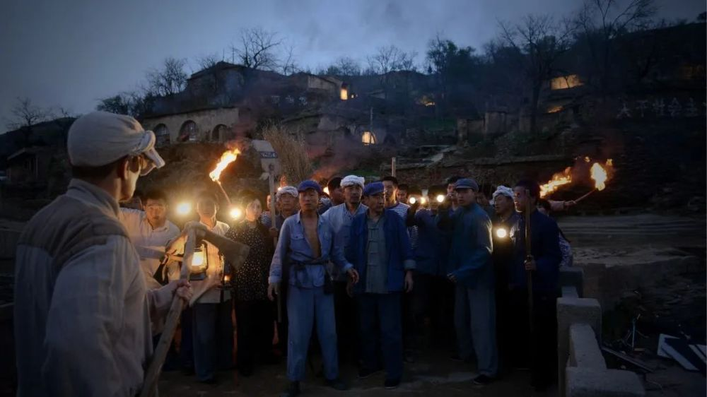
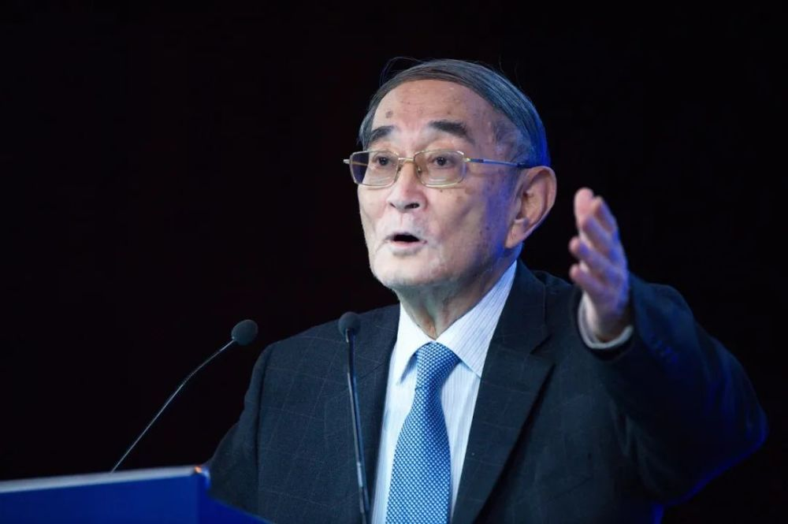
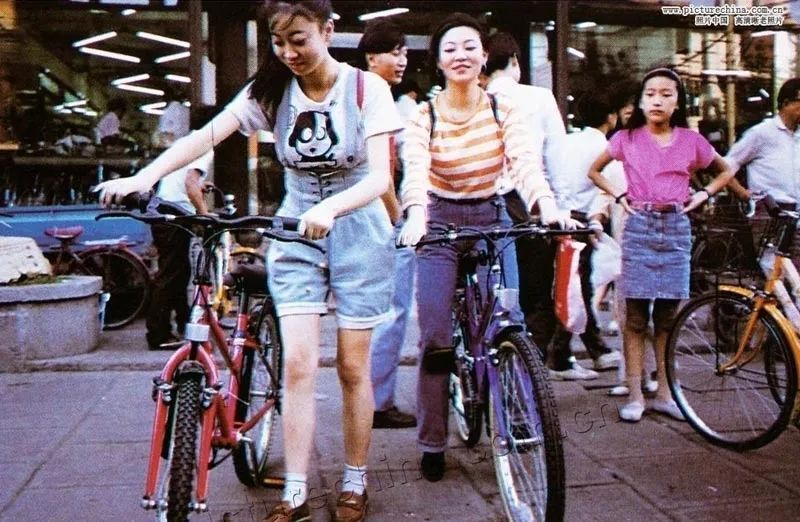
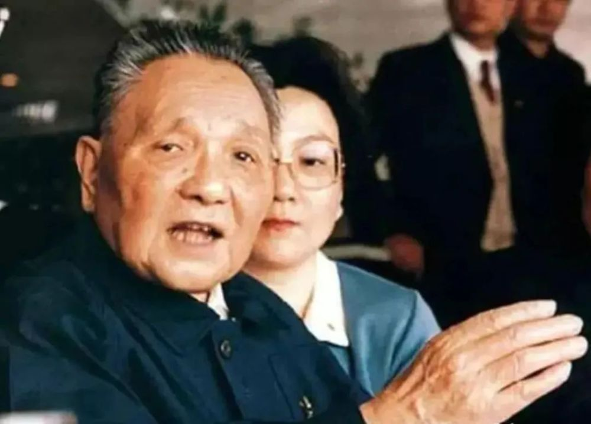

# 四十五年，人生巨变

**作者 | 南风窗记者 董可馨**

45年前的今天（12月18日），十一届三中全会在北京举行。这次会议，做出了把党的工作重心转移到社会主义现代化建设上来的决定，同时，邓小平实际上成为党中央领导集体的核心。

这两件事，标志着中国即将开始的改变。

起点并非这里。1978年5月开始，“真理标准问题大讨论”在思想上首先做了突破和铺垫。获得了很多老一辈革命家的支持后，解放思想、拨乱反正、改革开放的浪潮滚滚而来，即使历经种种反复和艰难，再不能停止。

从1978年到2023年，近半个世纪过去，改革开放给中国人带来的改变早已远远超出当时的人所能料想的。而今天，我们依然在谈论改革、纪念改革、推进改革，改革留给我们的经验和教益，启迪与警示，仍在今天与昨日的共振中回响。

01

改革的三重意义

有几重意义上的改革开放。

第一重，是计划经济转变为社会主义市场经济，国家所有制结构从单一的公有制转变为多种所有制并存，资源配置从政府指令转向市场信息。

这是经济权利意义上的改革。

比如改革前，农民不可以自己承包土地，生产资料归于集体，分配的大头也归国家和集体，分配完农民个人所剩不多，但改革后，农民可以承包土地，自己可以获得生产收益，拥有的土地承包权也可以流转。

再如，改革前，私人不能随便办企业，雇佣劳力也仅限于个位数，改革后，企业雇主可以扩大生产规模，普通人可以从事贸易活动，市场也可以存在了，国企需要自负盈亏，可以破产，再往后，连金融活动也可以有。

_《平凡的世界》剧照_

这意味着，一部分产权从国家那里让渡出来，个体可以在经济生活中拥有追求和建立个人美好生活的权利和自由了。

第二重，是改革开放了几十年后，尽管是社会主义国家，但中国已经深度嵌入全球化的生产和分配体系之中，和世界其他国家结成了你中有我、我中有你的关系，全球化这一目前世界运行的基本逻辑，也极大程度地影响和塑造着中国的经济行为。

按照学者施展的说法，中国处在全球经贸双循环结构的连接点。这两个循环是，中国的制造业与西方的创新产业、高端服务业之间的经贸循环，以及中国的制造业与不发达国家的第一产业之间的经贸循环，它们相互嵌套，中国处在中间节点的位置。正是这个位置，带来了中国经济的腾飞。

中国过去被称为“世界工厂”，这个地位今天依然没有根本改变。中国的生产所供给的，是全世界的需求，而不只是中国人的需求，中国所参与的财富分配，也是全球规模的，而不只是本国内的，所以“脱钩”是中国不愿接受也不能接受的，离开全球经济体系，中国的经济规模和生产活动将大幅度萎缩，这是我们难以承受的。

第三重，是文明层次上的，观念的改变。改革开放将中国推向了全球协作，在协作中，规则和法治是共通的语言，而要能听得懂并且使用这种语言，我们必须共享一些基本的价值理念。

_改革开放让深圳从一个小渔村变成国际化大都市_

比如，我们选择公平互惠互利，坚守人道底线，拒绝暴力强迫，我们接受现代文明的进步价值，作为价值共识。在这个意义上，现代中国与其他现代国家的差异，要远小于与前现代中国的差异。

这个时代，价值观念的激烈冲突不断暴露，全球化所面临的逆流压力，中美“脱钩”的潜在风险，局部地区战争的接连爆发，无不说明，世界观的深刻分歧根深蒂固，这要求我们小心选择自己的价值叙事，并认真思考我们和别国相通、相同的地方。

几代中国人亲眼见证了自己的生活和命运如何被改革开放所改变。此刻，我们在全球图谱中身处什么位置，接下来要去哪里，又要如何到达，这些问题，都变得愈发迫切。

而当我们使用“我们”这个主语时，需要说明的是，“我们”不仅意指整体主义的国家，还有个体，正是每一个具体的、普通的人的安全和自由，对美好生活的向往和追求，形成了我们对改革开放的真实需要。

02

生存倒逼改革

改革是从“最薄弱的环节”——农村开始的。因为农村最穷，日子最苦，阻力最小。

“文革”10年，整体上说，我国生产力水平与发达资本主义国家的差距拉大了。按照1979年中共十一届四中全会《关于加快农业发展若干问题的决定》对农村、农业和农民生活所作出的估计，1978年全国平均每人全年的粮食大体上还只相当于1957年，全国农业人口平均每人全年的收入只有70多元。

学者厉以宁在纪念改革开放40周年的座谈上说，农村跟城市不同，无论经济怎么困难，票据能够给城市一些优惠，但农民是没有粮票的，一旦粮食短缺只有挨饿。在60年代的困难时期，一些地方的农民也曾自发地搞过承包制，但经济状况稍好之后，承包制又被取消了，当时凡是坚持搞承包制的，都受到了程度不等的惩罚。

_厉以宁_

所以当安徽凤阳小岗村18户农民在1978年11月的那个寒夜在承包合同上按下红手印时，可以想见他们承受着怎样巨大的压力和风险，以至于要在合同上写下“如果谁将来被抓了，其他各家有义务把他们的孩子抚养成人”。

农村改革的迫切性得到了国家领导人的承认和支持，在1978年12月10日的中央工作会议上，陈云就直言，建国快30年了，现在还有讨饭的，这个问题必须得解决。

从小心翼翼的包工到组，再包产到组，最后包产到户，最终农民被给予了充分的自主权，农村的改革，真正地从根本上提高了农民的生产积极性。本来是地方上的探索，尽管遇到很大的阻力，但人心所向，包产到户最终成为一股无法逆转的浪潮，蔓延全国。

1982年，中共中央发出了第一个“农字头”1号文件，肯定了家庭承包经营土地的体制。此后5年，中央1号文件都聚焦于农业问题。

_“农字头”1号文件_

农村改革开始后，乡镇企业紧跟着成长和活跃起来。这些乡镇企业，有的是由农民、手工业者等个体工商户建立，有的由“文革”时期的社队企业发展而来，
有的由村、乡、镇政府建立和拥有，还有一部分，利用与外部世界有联系的港澳台投资者，发展外向型业务。

蓬勃发展的乡镇商品经济，被邓小平称为“异军突起”，它们在1980年代是带动中国经济增长加速的引擎，同时成为市场经济转轨的重要推动力。增多的农村劳动力，开始向非农业、工商业和城镇经济释放，这些人被称为“农民工”，构成了被称为中国的人口红利的主要力量，是中国城市化进程中的突出贡献者。

与此同时，经济特区纷纷设立，这几个特区“没有钱，只有政策，自己杀出一条血路来”，从一个个渔村迅速成长为最发达的城市。

邓小平在视察完几个特区之后，在北京曾强调了特区政策的指导思想，“不是收，而是放”。此后，更多的沿海城市，获得了对外开放的自主权。

_90年代初，广州的时尚青年_

不动国有经济部门，农村改革和经济特区的设立，被认为是真正意义上的增量改革，是帕累托改进，它们在启动时，往往先由地方做出了探索和突破，然后被追认、吸收为中央政策，最后得到立法承认，在效果上，不但农民和特区人民有得无失，对其他社会集团的利益也有益无害，所以能快速地推进。

学者周其仁曾对改革经验如此总结道：改革就是把能解决问题的办法合法化。这是对80年代改革过程通俗且准确的概括。

放松手脚后，只在眨眼间，民营经济就蔚为大观了。顺理成章的，国有经济改革势在必行。

03

重点在城市和国企

中国经济的重心在于城市和国有企业，在于工业。社会主义工业化的迅速实现，改革前建立在对农业严重挤压的基础之上，农业和农村变革的程度和效果，其实附属于城市和工业的变革。

当改革开放进程行进至 1984年时，农村也已经不是重点。

中共十二届三中全会通过的《中共中央关于经济体制改革的决定》，将改革的重点转移到城市和国企，要求发展社会主义商品经济，并承认了商品经济的重要性，认为它“是社会经济发展不可逾越的阶段，是实现我国经济现代化的必要条件”。

邓小平曾说，“什么叫社会主义，什么叫马克思主义？我们过去对这个问题的认识不是完全清醒的。”“这次经济体制改革的文件好，就是解释了什么是社会主义，有些是我们老祖宗没有说过的话，有些新话，我看讲清楚了。”

 _上世纪90年代，上海，两个时髦漂亮的女孩到车行买山地车_

在十几年里一度波折反复的城市和企业的改革，大体可以捋出一条从价格改革到产权改革的线索。

在原本的计划体制下，定价权归于国家，小到一盒火柴、一个肥皂，都由国家定价。但是改革的方向是希望引入市场竞争，如果这样，就不能继续国家定价，而要由市场波动来决定价格。

长期存在的国家全面定价是既定现实，骤然变动既要冒风险，也牵扯着千头万绪的利益，改起来有难度，所以在计划经济向市场经济的转轨过程中，曾实行价格双轨制，也就是同一产品计划内部分实行国家定价，计划外部分实行市场调节价。

但是，双轨制后面紧跟着腐败和经济秩序混乱。1988年的“价格闯关”，就是一次领导人决心在短时间内放开价格，由双轨并为一轨的政策尝试。可是，传出价格放开之时，挤兑非常严重，居民疯狂囤盐、囤火柴，囤积各种生活必需物资。结果这次改革草草收场，被认为是失败的。

在关于如何改革的讨论中，厉以宁等北京大学的学者在当时认为：应该首先推行企业制度改革。单纯的放开价格是没有用的，放开价格后只会导致价格的猛涨，却不能改变企业的地位。所以改革的方向应当是让每个企业都成为自负盈亏、自己纳税的经济单位。

现实中，“价格闯关”失败后，又发生政治风波，改革也一度陷入停滞，直到邓小平1992年南方谈话，才给改革开放重新注入强心剂。“东方风来满眼春”，从此，社会氛围大变。

_1992年1月18日邓小平视察武昌、深圳、珠海、上海等地，发表了重要讲话，通称“南方谈话”_

此后的改革方向是，国有资本从一些竞争性领域退出，改善企业治理，尝试探索建立现代企业制度和现代产权制度，股份制成为公有制的主要实现形式。

在改革进程里，社会主义经济体制，也在发生着巨变，从党的表述中，我们得以触摸历史的脉络，也能看到，这个体制，是如何寻求不断地自我更新：

1982年，中共十二大，提出计划经济为主，市场调节为辅。

1987年，中共十三大，社会主义有计划商品经济的体制，它是计划与市场内在统一的体制。肯定私营经济“是公有制经济必要的和有益的补充”。

1992年，中共十四大，确立社会主义市场经济体制。明确计划和市场不是社会主义和资本主义的区别，社会主义也可以有市场。

1997年，中共十五大，不仅承认非公有制经济的重要性，并且对之要鼓励、引导，并认为“只要坚持公有制为主体，国家控制国民经济命脉，国有经济比重减少一些，不会影响我国的社会主义性质”。

04

在世界体系中重塑

在中国不断寻求改革的进程中，我们也看到，它如何与外部接触、互动、彼此融入，以至于重塑自身。

邓小平在 1978 年先后4次出访，到过 7个国家，非常有感触地说：“最近我们的同志出去看了一下，越看越感到我们落后。”

_1979年1月底至2月初，邓小平出访美国_

中国与外部资本主义世界的接触，一直都有，比如1973
年后，先后从日本、西德、美国等资本主义国家引进了一批设备、项目和技术。但1978年决心改革之后的开放，与此前的逻辑完全不同。

如果说在改革之前引进式的开放还是在一种内向型经济环境下的小范围接触，主要意图是弥补不足，那么改革之后的开放，则是把国内市场与国际市场接通，使国家经济成为世界经济的重要组成部分。

并且，外力也是中国对内改革的一种非常大的压力和借力，对世界市场的融入，得以使中国迅速改变国内计划经济和自然经济的格局，形成市场经济制度的改革取向。

开放初期，外商进入中国境内， 反应很普遍、很强烈的一个问题是，引进外资的法律不健全，当时指导工作主要依靠红头文件，而文件不是公开的。

1978 年美国通用汽车公司来华谈判时，提出的唯一要求就是希望中国有一部政府法律，公布后双方可以依法办事。

对于外商，一个安全稳定的市场环境的保障，既来自法律法规，也来自稳定的经济政策。越是在计划体制下，人为的干预力量会越强、越容易；相反，越是在一个市场的环境中，人为的干扰力量越会减弱，至少会变得间接。

在吸引外商来华的迫切愿望下，中外合资法很快进入立法议程。

2001年加入WTO，意义深远。在持续而漫长的15年谈判过程里，为了达到WTO的开放标准，中国除了大幅降低关税壁垒之外，还废止进口配额和许可证、完善法律和执法系统，对外贸体制和外贸政策进行了全面的调整。

现代文明里，和别人打交道的几个特征——自由、法治、友善、民主，都不是凌空虚蹈，也不是门面招牌，它们是实实在在的相处规则。中国提倡通过多边贸易组织来进行贸易活动，反对单边主义和地方保护主义，这都要基于共通的规则。

几十年的对外开放，让中国与世界其他国家形成了频繁密切的贸易往来关系，虽然贸易不一定能带来和保证和平，但是它让彼此之间的利益牵绊更多、更深，让翻脸的成本变大。而比贸易更稳定的是，在往来交道中，我们也习得了谈判的能力、规则的意识、与他者打交道的方法。

开放不只是改革的手段，其意义也远不止于促发展，它是我们在这个世界上生存的方式。

文中配图部分来源于视觉中国，部分来源于网络

**-END-**

编辑 | 李少威

新媒体编辑 | 吴擎

排版 | 风间澈

南风窗新媒体 出品

