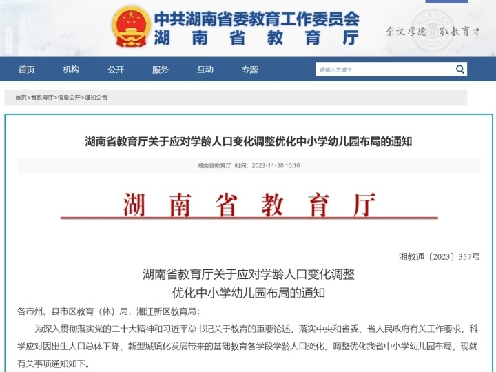
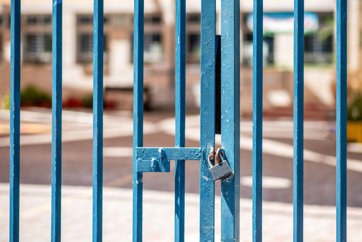
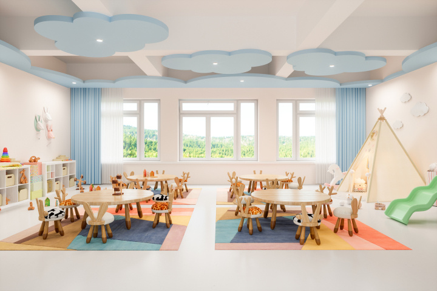
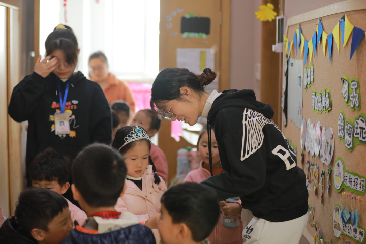

# 多地幼儿园关停，媒体：对孩子或是好事

潮新闻客户端 执笔 薛文春 沈琳 张蓉

最近，人口大省湖南出台新政：有序组织幼儿园设并转撤。

_湖南省教育厅文件截图_

这也是目前我国首个在省级层面提出调整幼儿园布局的省份。

近年来，全国各地幼儿园闭园的新闻不绝于耳。安徽、福建和海南等地均被爆出幼儿园规模性停办。湖南此举也是针对教育规模、结构变化给出的应对之策。

为何屡屡出现幼儿园关停的事件？浙江情况怎么样？关停会引发连锁反应吗？

“ **消失”的幼儿园**

据《2022年全国教育事业发展统计公报》，全国共有幼儿园28.92万所，比上年减少5610所，下降1.90%，这也是2008年以来首次负增长。

事实上，这些年关于幼儿园关停的消息就没有断过，从大城市到小县城，不一而足。

今年8月，安徽省临泉县教育局发布公告，当地50所民办幼儿园终止办学。其中，12所幼儿园申请终止办学，38所幼儿园无实际招生、办学行为，占2022年全县幼儿园总数的11.8%，占全县民办幼儿园总数的24.5%。

同样的情况也发生在福建和海南。9月，福建省漳州市龙海区17所民办幼儿园申请终止办学。11月，海南省海口市2023年民办中小学校和幼儿园年检结果发布，33所民办幼儿园停办，引发了社会热议。

_幼儿园停办。图源：视觉中国_

在浙江，幼儿园的总量也在减少。从近三年幼儿园数量来看，2020年浙江共有幼儿园8009所，到了2021年变成7890所，到了2022年减少到了7709所。相当于3年时间减少了300家，平均每年停办100家。

9月，金华一家民办幼儿园关停了。在教育部门帮助下，“90后”园长李敏妥善安置了学校教职工，把剩下的孩子并入了附近公办幼儿园。

“我不遗憾，能把小孩和老师安顿好就好了。”虽然选择了坦然面对，但是学校关闭那天，李敏还是忍不住红了眼眶。她来到幼儿园工作的时候，每天就住在学校里，与老师和孩子们建立了深厚感情。这里的每一个人、每一寸土地，都让她恋恋不舍。

目前，李敏已经转行离开了幼教行业。

**人口减少并非主因**

幼儿园关停，很多人认为人口减少是主要因素，其实并不完全是。

“中国人口第一大县关停50所幼儿园”的消息传出后，一组政府公开数据被反复提及：“临泉县2023年在园幼儿58243人，比上年减少9.2%，已是连续第四年减少。”

而另一组数据却被人忽略了：“2022年临泉县新建、改扩建幼儿园9所，有效扩增公办幼儿园学位2070个。”

实际上，临泉县关停的50所幼儿园皆为民办，公办幼儿园学位不降反增。

浙江情况也类似。

“出生人口减少并不是民办幼儿园园所数下降的主要原因，只是原因之一。”浙江省教育厅相关负责人表示，近年来，浙江各级党委政府把学前教育作为重要的民生工程，统筹资源配置和入园需求变化，稳步增加公办学位供给。聚焦城镇、因地制宜，通过新建、改扩建、协议收购等新增一批公办幼儿园，依托乡镇公办中心幼儿园办好村级园，推进城乡学前教育一体化建设，不断缩小城乡学前教育发展差距。

_浙江一幼儿园师生观摩研讨幼儿园集体活动。受访者供图_

近两年民办幼儿园数量下降，其实也属于正常的发展变化——

一来优胜劣汰，低、小、散且质量不高的民办园被关停；政府收购了一批质量较好的普惠性民办园转为公办园。

二来市场主动选择。由于适龄幼儿减少，部分民办园向托育转型；家长教育观念转变，更倾向于将孩子送到收费低且质量高的公办幼儿园，造成部分高收费民办幼儿园出现招生困难而停办。

“未来几年学生一年比一年少，我们是要自负盈亏，没有办的必要。”杭州一民办幼儿园园长王丽对于未来前景迷茫。

她算了一笔账，针对普惠型的民办幼儿园，政府补贴的门槛提高，如果继续办下去，必定是亏本买卖。“附近3公里就有一家公办园，环境好，学费低。”

在很长一段时间里，民办学前教育是我国学前教育事业的主力军，用以解决学前教育供给数量远远无法满足人民群众日益增长的学前教育需求的矛盾。

有需求就有市场，但是与此同时，前几年学前教育也出现过分市场化，甚至出现盲目扩张、恶性竞争、管理不善等问题。

随着国家关于学前教育深化改革等规范文件的出台，对幼儿园的办园资质、安全监管、卫生保健等都提出了更高的要求。所以，一些管理不善、经营不好的民办幼儿园被淘汰也是大势所趋。

另外，随着城镇化不断提升，大量农村人口尤其是年轻人持续涌入城市，农村幼儿园也不得不撤并。

_幼儿园教室。图源：视觉中国_

**学前教育大洗牌**

不过，幼儿园关停后更多连锁反应在逐渐显现。幼教从业者首当其冲。

去年毕业前，学前教育专业的岑星星就得知，幼师编制在缩减。为此，她放弃考研计划，进入上海一家幼儿园。工作一年内，她所在的幼儿园就有两位幼师遭辞退。“上海不少幼儿园在减班级、减教师。”岑星星说。

在浙江，幼师岗位需求量也明显下滑。

金华职业技术学院师范学院院长樊丰富直言，“往年秋招季，每年都有十余家县级教育局主动联系我们到学校来招聘。今年，只有五六家教育局主动联系。”

对于学生和家长，幼儿园关停则释放出双重信号。

幼儿园学位从紧缺走向过剩，意味着大部分幼儿园入园门槛将降低，减轻家长的压力。可另一层面，“如果一些民办幼儿园关停后，附近没有公办园或者其他民办普惠园，孩子就要到更远的幼儿园入园。”21世纪教育研究院院长熊丙奇说。

在他看来，应对学龄人口变化，各地要进行具有前瞻性、科学的顶层设计，避免幼儿园无序关停。樊丰富也建议，还是要适当保留一些乡村幼儿园，特别是离镇远的乡村幼儿园。

因适龄幼儿减少，幼儿园关停将不可避免，但同时也给学前教育普惠发展提供了契机。家长们渴望已久的小班制或将变得可行。

我国要发展惠普学前教育，要求财政性学前教育经费占到总财政性教育经费的9%左右，而目前不少地方这一比例只有5%。与之对应的问题是学前教育教师待遇低、幼儿园班额大。

熊丙奇说，我国的幼儿园班额标准是小班25人、中班30人、大班35人，幼儿园专任教师师幼比为1：15。而在发达国家，班额最多20人，专任教师师幼比为1：7到1：10。

如果以此为契机，提高幼儿园建设标准，推进“小园小班”建设，并推进托幼一体化，将有助于学前教育资源的优化配置，提高教育质量。

_金职院附属幼儿园。受访者供图_

“托幼一体化是未来的发展方向。”对此，金华职业技术学院附属幼儿园已率先布局，“我们一直为2-3岁幼儿提供托育服务，打算明年春季班开始招收0-2岁婴幼儿。”樊丰富说，学院还计划在明年开设婴幼儿托育服务与管理专业，培养保育人才。

“洗牌在倒逼民办幼儿园改革，”王丽认为民办幼儿园要全方位转型升级，提高软硬件服务，强化办园特色，提高师资质量等。

“转载请注明出处”

