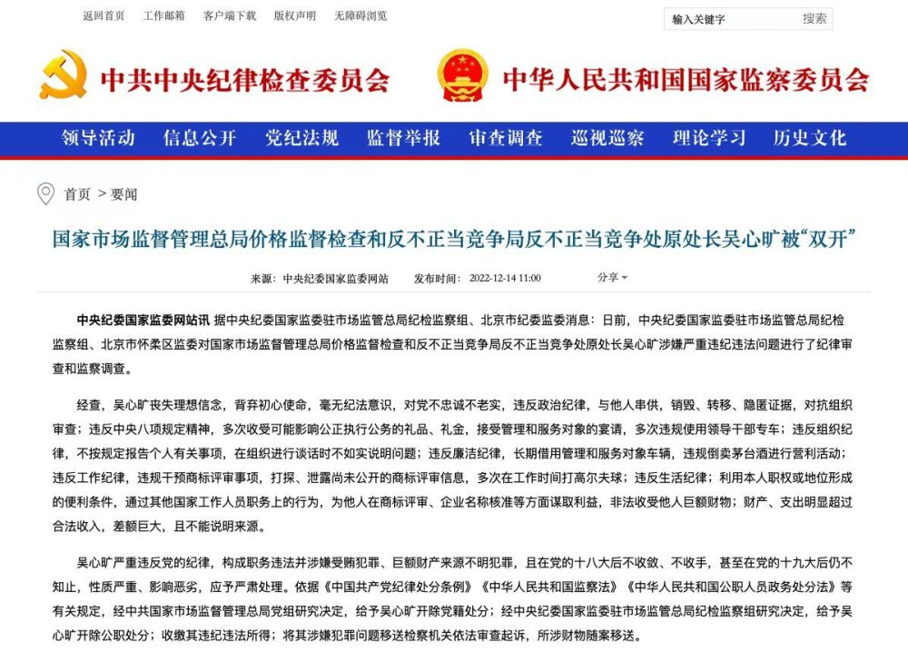
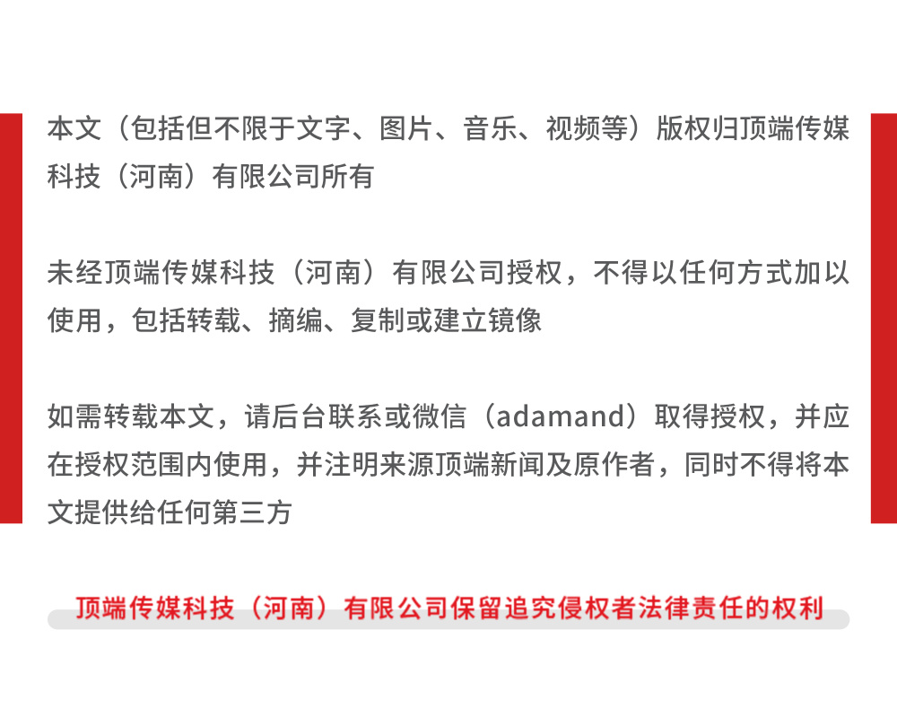

# 揭秘“驰名商标”腐败案：市场监管总局一处长借此敛财获刑

**顶端新闻记者 高鑫**

违规干预商标评审事项，打探、泄露尚未公开的商标评审信息，为他人在商标评审等方面谋取利益……这是中央纪委国家监委网站对吴心旷查处情况通报时指出的。

顶端新闻记者近日获悉，国家市场监督管理总局反不正当竞争处原处长吴心旷，染指“驰名商标”认定、异议等事项，十年间敛财400余万元。他还有超千万财产“不能说明来源”。因此，法院以受贿罪、巨额财产来源不明罪判处吴心旷有期徒刑十二年。宣判后，吴未上诉。

反腐研究专家彭新林教授指出， **吴心旷案暴露出的同事之间“请托说情”类腐败现象危害很大，不仅容易使“同事”变成“同腐”，还会破坏单位和部门的政治生态。**

**不惑之年被查处**

公开资料显示，吴心旷是安徽人。2003年，他大学毕业后进入国家工商总局工作。用了6年时间，他从法规司的普通干部，做到副主任科员。

2009年5月，吴心旷调整到工商总局办公厅，后任秘书一处主任科员、秘书处正科级秘书、副处级秘书。2015年11月，他调到反垄断与反不正当竞争执法局，任反不正当竞争处副处长。

2018年，国务院机构改革后，国家工商总局、国家质检总局等多个部门不再保留，新组建了国家市场监督管理总局，作为国务院直属机构。

2018年8月起，吴心旷在市场监管总局价格监督检查和反不正当竞争局任职。期间，他从该处的副处长升为处长。直至2022年7月，他被宣布免职。

据悉，在被免职的一个月前，吴心旷已因涉嫌职务犯罪被留置。彼时，他即将迎来40岁生日。

5个月后，中央纪委国家监委驻市场监管总局纪检监察组、北京市怀柔区监委通报了对吴心旷涉嫌严重违纪违法问题的纪律审查和监察调查结果。

通报中提到，吴心旷违反中央八项规定精神，多次收受可能影响公正执行公务的礼品、礼金，接受管理和服务对象的宴请，多次违规使用领导干部专车;

违反组织纪律，不按规定报告个人有关事项，在组织进行谈话时不如实说明问题;违反廉洁纪律，长期借用管理和服务对象车辆，违规倒卖茅台酒进行营利活动;

违反工作纪律，违规干预商标评审事项，打探、泄露尚未公开的商标评审信息，多次在工作时间打高尔夫球;利用本人职权或地位形成的便利条件，通过其他国家工作人员职务上的行为，为他人在商标评审、企业名称核准等方面谋取利益，非法收受他人巨额财物;财产、支出明显超过合法收入，差额巨大，且不能说明来源。

上述通报称，吴心旷严重违反党的纪律，构成职务违法并涉嫌受贿犯罪、巨额财产来源不明犯罪，且在党的十八大后不收敛、不收手，甚至在党的十九大后仍不知止，性质严重、影响恶劣，应予严肃处理。

吴心旷被“双开”后，监察机关将其涉嫌犯罪问题移送检察机关依法审查起诉。

2022年12月，吴心旷因涉嫌犯受贿罪、巨额财产来源不明罪被逮捕。此后，检方以受贿罪和巨额财产来源不明罪对吴心旷案提起公诉。

**染指“驰名商标”认定**

据悉， **吴心旷被控的受贿问题，主要源自其染指“商标驰名”的认定、商标复审等事项，且涉及多个知名品牌。**

李某是做知产管理咨询的。2010年，他与吴心旷结识，了解到吴担任市场监管总局分管商标领域副局长的秘书。2011年至2019年间，李某公司就其代理的多个“商标驰名”商标认定、商标注册异议等商标业务，请托吴心旷协调关系、予以关照。

吴心旷的一位同事坦言，其负责商标事项的审查及签发。吴曾找其咨询过李某代理的相关品牌的“商标驰名”认定事项，并让其关注该案件，其出于人情关系答应帮忙。

北京一家律所的高级合伙人张某，在2012年至2021年间，就其代理的多起涉及驰名商标认定、异议评审等案件，请托吴心旷，希望吴协调关系、予以关照。

在安徽做咨询公司的孔某，于2016年在一次饭局上与吴心旷相识。此后两三年里，其就公司代理的“驰名商标”认定业务，请托吴帮忙协调，让两个商标认定驰名商标成功。

……

顶端新闻记者获悉，涉案的品牌涵盖了衣物、食品、家电、游戏、车企等多个行业。在那些商标业务办成后，请托人亦是纷纷向吴心旷表达“心意”，奉上数十万至上百万元的“好处费”。

除外部人员的贿赂，吴心旷还收受过同事的贿赂。他利用自身职权或地位形成的便利条件，通过其他国家工作人员职务上的行为，为该局价格监管二处原副处长张某请托的商标评审、企业名称预先核准等业务提供帮助，分多次收受张某给的好处费。

据检方指控，吴心旷受贿数额达400余万元。另外，2003年至案发，吴心旷个人实际持有的财产、支出，扣除已查证来源的合法收入、违法违纪所得外，还有1000余万元无法说明来源。

法院审理后认为，吴心旷作为国家工作人员，利用本人职务上的便利，通过其他国家工作人员职务上的行为，为他人谋取不正当利益，非法收受他人财物，数额特别巨大;吴心旷的财产、支出明显超过合法收入，不能说明来源的差额特别巨大，其行为分别构成受贿罪、巨额财产来源不明罪，依法应予惩处，并数罪并罚。

最终，
**法院鉴于其到案后揭发检举、有立功表现，当庭认罪认罚，家属代为退缴赃款，以受贿罪、巨额财产来源不明罪判处吴心旷有期徒刑十二年，并处罚金50万元。**

**秘书身份的“隐形权力”**

2023年6月20日，法院审理吴心旷案时，国家食品安全风险评估中心纪委组织了19人到庭旁听。这些人大都是权力部门的高风险岗位人员、年轻干部。

国家食品安全风险评估中心官网发布的相关“工作动态”显示，为引导中心重点工作岗位人员和年轻干部进一步在思想和行动上知敬畏、存戒惧、守底线，该中心纪委组织此次旁听职务犯罪法庭庭审警示教育活动。

同样是年轻干部，同样是手握权力，同样是处在职务“上升期”……这场警示教育安排的很微妙。有旁听人员事后反馈，真切地感受到违纪违法的惨痛教训，带来了巨大的心灵震撼。

那么，吴心旷案为何让人心灵震撼?顶端新闻记者注意到，吴心旷主要是“利用自身职权或地位形成的便利条件，通过其他国家工作人员职务上的行为”，实现了对相关商标认定、异议等事项的干预，从而完成行贿人的请托。

吴心旷的一位同事描述，其曾在商评委工作，负责签发、审定相关商标案件。吴心旷曾向他打听过某商标无效宣告案件，并让其关注一下这个案件。他和吴关系一直较好，出于朋友情面，其答应帮忙。

反腐研究专家、北京师范大学法学院教授彭新林接受顶端新闻记者采访时说，在反腐实践中，同事之间相互“请托说情”、打听案情或干预案件办理现象，在部分地区和某些单位尤为突出。

“有的是碍于人情往来，有的是经不住在金钱或利益的诱惑，还有的是相互交换、
‘抱团腐败’。”彭新林说，这种腐败形式危害很大，不仅容易使“同事”成“同腐”，容易形成利益输送的腐败“同盟”，还会破坏单位和部门的政治生态。

“究其实质，就是把商品交换原则搬到党内政治生活中来，制度规则被商品交换原则取代，党内正常同志关系被宗派主义、圈子文化、码头文化侵蚀。”

吴心旷案的另一细节也引起彭新林教授的关注—— **吴心旷曾多年担任领导秘书工作，这或为其寻找同事帮忙打开了便利之门。**

一位商标局副局长作证时描述，2012年，初吴心旷就某商标认定驰名的事情向他了解情况，询问商标进展。其考虑到吴心旷当时的身份特殊，是总局负责商标业务领导的秘书，他便如实把商标情况告诉了吴。

**“秘书是领导干部的身边人，其地位不高、权力很大。”**
彭新林分析说，这些人会分享和递延领导干部的权力，从而拥有一种隐性权力。级别越高的领导干部，其秘书的活动能量和空间就越大。因此，他建议，在秘书选拔、任用和监督、制约方面要进一步加强工作。

