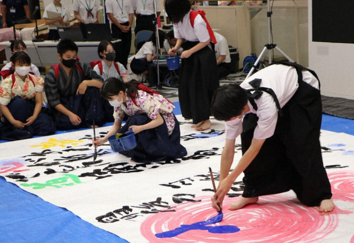

# 日本计划为“书道”申遗引争议，中国书法2009年已入选“人类非物质文化遗产”

【环球网报道】据日本《读卖新闻》18日报道，日本文部科学省的文化审议会当天决定，将“书法”（日语中称“书道”）列为争取登录为联合国教科文组织非物质文化遗产的候选对象。

_日本高中生进行与“书道”有关文化活动的资料图片，日媒报道配图_

据报道，预计日本政府会在有关部门会议协商后于2024年3月末前向联合国教科文组织提出申请书，是否能成功成为联合国教科文组织非物质文化遗产可能会在2026年11月左右揭晓。

报道称，在日本古代，来自中国的汉字与源于汉字的假名传播开来，“书道”也随之渗透到日本人的生活中。《读卖新闻》称，在当下，“书道”与日本传统节日和生活文化密不可分，于2021年成为日本非物质文化遗产。

据报道，就最新的进展，“日本书道文化协会”会长井茂圭洞称，“多年以来，我一直盼望书道能够作为日本文化得到国际社会的理解，也希望在国内能够繁盛起来”。“非常感谢离实现这一目标又进了一步”。

日本政府机构计划为“书道”申遗的消息也在日本网络上引发议论。一些日本网民提到，中国书法此前已经被列为联合国教科文组织非物质文化遗产，还有一些人说道，汉字不是日本的“固有文化”。据《中国艺术报》此前报道，2009年9月30日，联合国教科文组织保护非物质文化遗产政府间委员会第四次会议，正式批准中国书法为“人类非物质文化遗产”。

有日本网民称：“日本让书道成为非物质文化遗产有什么目的？就像其他人提到的那样，作为渊源的中国（书法）已经被登录了，在这种背景下，有必要将从中国衍生的日本书道作为不同的文化登录吗？我觉得，既然中国已经登录，那就可以了。”

