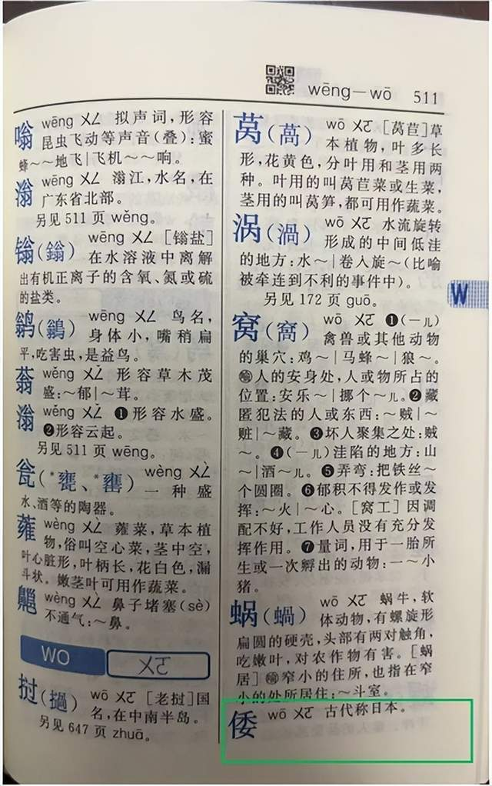

# 有网民起诉《新华字典》，中国出版传媒商报：混淆是非、歪曲事实

近日，某网民发视频称起诉《新华字典》引发关注。中国出版传媒商报记者就此问题咨询了法律专家和语言学专家。他们认为，有网民起诉《新华字典》这一行为，本身可能是出于对出版物内容的关注与对未成年人的关心，但其判断是非专业的、不客观的，其观点可能混淆了是非、歪曲了事实。

其一，网民指出“第12版《新华字典》第511页，对‘倭’字的解释只有一个‘古代称日本’，将倭寇的历史罪恶就一笔勾销，违反《中华人民共和国爱国主义教育法》第37条，‘存在宣扬美化否认侵略战争行为的和屠杀惨案的内容’”，这可以说完全是牵强附会。

法律规定，违反法律的前提是“存在”违法行为，《新华字典》对“倭”仅作解释，没有更多描述，更遑论“存在”的前提。对于违反这条规定的论断，是典型的“莫须有”罪名。

此前6月，网传新版《新华字典》中将“倭寇”一词删除，专业媒体已就此情况作出调查，事实如下：

一是汉语工具书有字典和词典之区分，《新华字典》作为小型字典，重在收字，从上世纪50年代至今，所有版本中，在“倭”字下都未曾收录“倭寇”这一词语，因此所谓“新版删除”该词不属实。

二是商务印书馆出版的《现代汉语词典》和《新华词典》，作为中型词典，各个版本里均一直收录有“倭寇”一词。《现代汉语词典》第7版内文“倭寇”一词的解释为：14～16世纪屡次骚扰抢劫朝鲜和我国沿海的日本海盗。抗日战争时期也称日本侵略者为倭寇。

_《新华字典》1957年版内文“倭”字_

_《新华字典》第12版内文“倭”字_

_《现代汉语词典》第7版内文“倭寇”一词_

其二，“玩”字列有“玩弄”一词，早在1951年，《最高人民法院西南分院关于强奸罪及量刑问题的意见》中就曾使用“玩弄女性”这个词。在《新华字典》中，对“玩”字一个释义是“不严肃对待；戏弄”，这恰恰说明，在《新华字典》的表述里，“玩弄女性”这种社会现象是要坚决反对的，从这个意义看，“玩弄”是贬义词、负面词。

其三，“累”字列有“累赘”一词，意思为“负担”，举例为“孩子小，成了累赘”。查阅报刊语料，这样的用例表述不在少数。养育小孩，是成年人的责任，“孩子小”，大人需要去照料、培养，某种程度上是一种“负担”。因此，国家才一再为生养孩子出台各种照顾和鼓励政策。

其四，“别”字的一个释义是“绷住或卡住”，其后有一用例为“腰里别着一支手枪”。影视剧、文学作品中“别枪”的场景很常见，“别枪”的人可能是正面人物，如警察、解放军，也可能是反面人物，如强盗、土匪。这里只是根据语言事实举例。

其五，“玩弄”“累赘”“别枪”等词语，属于汉语词汇系统中的负面词语、消极词语和中性词语。《新华字典》收录负面词语、消极词语是无法避免的，是符合辞书编纂规范的。编纂字典词典，必须全面客观反映语言现象。“别枪”“玩弄女性”“成了累赘”的举例，属高频用词、典型搭配，均有语料库支撑，所以被收录到《新华字典》中。

 _《新华字典》第12版封面_

《新华字典》是新中国第一部现代汉语字典，从第1版到现在的第12版，历时70多年，是新中国的文化品牌。70年来，一批又一批新中国文化建设者们以崇高的精神品格编纂、修订和出版《新华字典》，叶圣陶、魏建功、邵荃麟、丁声树、陈原、王力、吕叔湘、周祖谟、曹先擢等，都先后参与过这本小字典的编纂修订。

_《新华字典》1957年新1版封面_

来源：中国出版传媒商报

监制：张力

编辑：苏越

流程编辑：严圣淼

