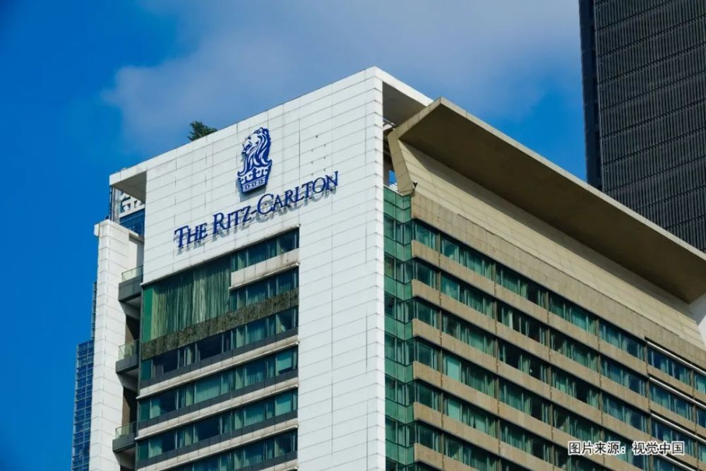

# 神秘人买下天津丽思卡尔顿

_随着市场形势的急转直下，曾在中国遍地开花的豪华酒店市场正迎来一波大洗牌。_

**中房报记者 许倩丨北京报道**

三轮降价后，天津丽思卡尔顿酒店终于迎来新买家。

12月14日，据阿里资产拍卖网，天房商业（天津）有限公司等3户不良债权资产包公开转让处置项目成功出让，本次为该标的第四次拍卖，成交价20亿元。该标的抵押物为天津丽思卡尔顿酒店、三亚洲际酒店、光合谷温泉酒店，建筑面积合计19.9万平方米。

该标的公开竞价中，买家H5219是唯一报名人，也是唯一出价者，竞拍价格即起始价20亿元。根据相关政策文件规定，中国信达竞买结果进行公示，公示期至2023年12月23日止。如在此期间未征询到异议，则与买家H5219确认成交。

买家H5219究竟是谁？目前未有具体信息披露，市场上也暂无消息。

有知情人士称，买家可能是来自北京的一个神秘的国有酒店管理公司，该公司财政年终结余会用来收购优质酒店资产，从不对外披露。

也有人猜测，可能又是煤老板出手。近两年来，多家星级酒店均被来自陕西、内蒙古的煤老板接盘，如海南香水湾富力万豪酒店、雅居乐在海南清水湾的3家度假酒店、清水湾碧桂园希尔顿逸林酒店、三亚湾W酒店、北京威斯汀大饭店等。

奢华酒店变身“不良资产”

在近两年酒店资产拍卖中，这笔拍卖标的算是一个不小的量级。

据记者了解，作为抵押物的天津丽思卡尔顿酒店、三亚洲际酒店和天津光合谷（天沐）温泉度假酒店目前均在正常营业，其中前两家均为知名度很高的酒店物业。

天津丽思卡尔顿酒店是天津市标志性建筑，也是天津首家奢华酒店，坐落于原英租界即如今的商务区，酒店前身是1890年创建的戈登堂，当时英租界的工部局大楼。该酒店是丽思卡尔顿在中国唯一身处历史建筑的奢华酒店，自2013年开业至今颇受好评。

2013年开业的三亚洲际酒店，是三亚热度最高的酒店之一，在一些平台上甚至能排到热门榜单No.1。酒店设有295间客房，位于海棠湾，坐拥连绵17公里的原始沙滩，距离三亚免税购物中心仅86米，购物非常便利。

天津光合谷温泉度假酒店，是天房集团与天沐集团联袂打造的五星级高档酒店。酒店坐落于天津光合谷旅游度假区内，建筑面积5万多平方米，拥有客房179间。

上架的三间酒店背后实控人是天津的天房系，包括天房商业（天津）有限公司、天津天房建设工程有限公司、天津市房信建材科技有限公司，都是天津较为知名的国有房企。

这3家酒店并非首次出售，天房集团多年前已经在寻求出售手中的酒店业务板块。2018年天房集团负债总额超过千亿元；2020年起，多次发生债券违约事件，被列为失信被执行人、被执行人，被限制高消费。

据披露信息，2018年时，天津丽思卡尔顿酒店、三亚洲际酒店和光合谷温泉度假酒店的净资产估值达到45.3亿元。

2023年8月11日，中国信达天津分公司对天房商业等3户不良债权资产包进行公开处置，起始价29.59亿元，上述3家酒店被装进“不良资产包”。这次拍卖被围观超过5000次，但因零人报名、零次出价而流拍。

截至处置基准日2023年4月30日，本次拟处置的3户债权资产包债权本息总额合计为29.59万元，其中，本金余额21.46亿元，利息余额8.13亿元。

9月7日、12月1日，该标的物分别进行第二次、第三次拍卖，起始价分别降至23.67亿元、21.3亿元，同样因无人报名、无人出价而流拍。

一位投资人士称，不良债权资产包流拍并不意外，在面临大宗土地交易时，买家往往持谨慎态度，一方面受制于自身资金实力和运营水平，另一方面，项目背后复杂的债权关系和僵化的运营机制，也是需要考虑的重要因素，而此次交易涉及3户不良债权，不好理清。

直到12月14日，该标的物再次降价进行第四次拍卖，这次围观数超过1万次，热度提升。终于，有1人报名，1人出价，最终以起始价20亿元成交，相当于估值价打了4.4折。

被摆上货架的五星级酒店

20亿元价格属于司法拍卖史上的较高价格。此前国内五星级酒店在司法拍卖中价格很少超过20亿元。其中，今年12月挂拍的深圳佳兆业金沙湾大酒店，评估价23亿元，起拍价16.7亿元，但临拍前被撤回。

此次拍卖价格高昂主要是因为，抵押物中有天津丽思卡尔顿酒店。

数据显示，丽思卡尔顿酒店集团目前在全球35个国家和地区运营超过110家酒店。截至目前，中国共有15家丽思卡尔顿酒店，分布于香港、北京、上海、澳门、广州、深圳、海口、三亚、成都、西安、天津、南京、哈尔滨13个城市。

在中国，丽思卡尔顿与地产开发商深度绑定，例如成都、广州、哈尔滨三家丽思卡尔顿酒店业主背后是富力地产，北京华贸丽思卡尔顿酒店、北京金融街丽思卡尔顿酒店分别由华贸地产、金融街持有。

相比于传统开发业务，酒店业务本身投入大、回报周期长、收入占比小，对于房企巨大的资金缺口而言，无异“杯水车薪”。遇到市场不好时，酒店还会出现亏损，拖累整体业绩。这种情况下，许多核心城市的五星级酒店被“摆上货架”，其中既有开发商主动出售资产回笼资金，也有债权人强制执行下的被动出售。竞得人中，频现煤老板身影。

9月23日，由于原业主方被列为失信人，上海虹口三至喜来登酒店大楼被债权人申请执行拍卖，由上海裕自商业管理有限公司以起始价16.43亿元拍得。该公司控股方为溧阳万峰投资发展有限公司、江苏恒峰投资发展有限公司，各持股50%。前者大股东徐云飞，曾是溧阳市华能煤炭有限公司实际控制人和最终受益人；后者大股东徐云梓，是江苏江山矿山集团大股东和董事长。

10月，中国金茂通过北京产权交易所挂牌出售北京金茂威斯汀大饭店，项目最终被北京渤海润泽商业管理有限公司以28亿元获取。该公司股东为石翠和苏福蛇，二人背后是陕西榆林府谷县的中汇集团，一家从事煤炭开采、洗煤、煤化工等业务的典型煤炭企业。

11月21日，华侨城旗下苏河湾项目酒店系列资产在北京产权交易所正式挂牌，底价24.3亿元，苏河湾项目正是上海宝格丽酒店所在地。

无论是喜来登、威斯汀，还是丽思卡尔顿，均来自美国万豪集团的品牌。随着市场形势的急转直下，曾在中国遍地开花的豪华酒店市场正迎来一波大洗牌。

**值班编委：李红梅**

**责任编辑：马琳 刘亚**

**审读：戴士潮**

**中国房地产报版权所有**

**未经授权不得转载以及任何形式使用**

