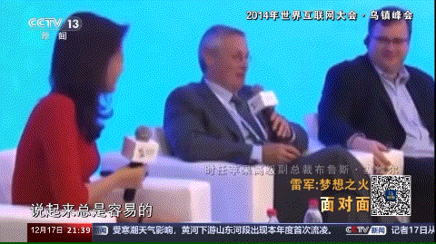

# 雷军：我在央视“面对面”专访，谈谈梦想之火

日前，我接受了央视「面对面」栏目的一次深度采访，差不多半小时的时间里，我分享了很多关于小米这些年发展之路的思考，我把采访的完整内容附在下面，与大家共勉。

**节目解说：**
2023年11月29日，小米集团创始人、董事长兼首席执行官雷军以个人名义，向母校武汉大学捐赠13亿元人民币，这也是全国高校收到的最大一笔校友个人现金捐赠。

**王宁记者：当所有人可能都关注在武大的捐赠是你捐赠的13亿数额的时候，你希望这个捐赠本身被关注的重点是什么？**

**雷军：** 其实那一天回母校当然特别特别激动，激动的主要原因对于我来说是，我把它定位成还愿之旅。

**节目解说：** 在向母校捐款之前，2023年8月14日，雷军举办了他作为小米创始人的第四次年度演讲。

**雷军：** 今天我就先和大家聊聊武大往事，那还是36年前，1987年，我考上了武汉大学的计算机系。

当年我在武汉大学读书的时候拿了不少奖学金，奖学金对我当时还是蛮重要的，因为我在大学四年里面基本上是靠奖学金和帮老师做项目来养活自己读完了大学。有一次我拿了一个钱比较多的奖学金，在颁奖典礼上，我站在舞台上的时候我就在想，有朝一天我有了能力，我一定百倍千倍甚至一万倍还回来。

**节目解说：** 此次捐赠，雷军助力的主要方向之一，是武汉大学数理化文史哲六大基础学科研究。

**雷军：**
我会关注到数理化文史哲这些基础学科，是因为这些基础学科在过去这些年里面、在大学里面相对是比较弱势的，其实应用类的学科呢可能会因为比较容易出成果、比较容易拿到科研经费，相对在学校里面受重视。

**王宁记者：因为基础学科的研究，就意味着要在很长一段时间当中无法享受成功的喜悦。**

**雷军：**
比如，我们创业30多年了，走到今天的话其实越来越清楚，你想做一件了不起的事情，你肯定要是一个长期主义者。最近我在小米内部经常讲，伟大是熬出来的，当我们看到这些非常多优秀的公司，当我们羡慕别人的时候，都得看一下，人家都熬了30年以上。所以对我们小米来说，我们今天只有13年，更是需要时间的沉淀和积累的。

**节目解说：**
雷军和小米的故事，公众并不陌生。过去13年，小米既是深入人们生活的科技品牌，也是总能在竞争中带来惊喜的电子产品，更是一家充满故事的创业公司。

**雷军：**
我就是在武汉大学图书馆里看了一本书叫《硅谷之火》，开始建立了我一生的梦想，因为《硅谷之火》就是讲乔布斯他们创业。所以我在80年代，乔布斯就是我的第一个偶像。
**正是因为我对乔布斯很了解，我觉得其实我不是乔布斯那样的人，我觉得我也做不了乔布斯，但是并不妨碍我们在另外一个方向上做出不一样的产品来。**

**节目解说：**
带着这团梦想之火，雷军走上了自己的创业之路。1991年，从武汉大学毕业后，雷军和朋友创办金山公司，开发WPS办公软件，抗衡微软的Office办公软件。一家不知名的小公司对抗庞然大物微软，注定了战斗异常艰难，金山公司曾一度面临“产品失败、业务崩盘、公司差点关门”的困境。在金山，雷军完成了从程序员到企业管理者的转变，经历了企业从陷入困顿到重新崛起的过程。与个人而言，金山的20多年，是雷军的青春岁月，与世界而言，那20年正是互联网第一波浪潮翻天覆地的时代，雷军在不知不觉中与这一拨浪潮擦肩而过。许多年以后，雷军发出了他那句著名的感慨——“站在风口上，猪也能飞起来”。

**王宁记者：你那个著名的风口论直到现在也经常被大家引用。**

**雷军：**
因为我是一个工程师，一个程序员开始的创业者，（金山时代）我们做的所有事情要不就是我有兴趣，要不就是碰到几个用户他们都说这个产品，他们想要这样的产品，我们就决定立项，决定去干了，很少去考虑它是不是时代的一个重大的机会点，有没有那种爆发性增长的可能性，考虑得少。所以这样的企业呢，它的生存能力很强，它一定不容易死掉，但是要做到很大的话其实也不容易。所以我才讲出了风口论。我是认为我们不仅要埋头拉车，还要抬头看路，所以这是对我自己创业的一个巨大的纠正。

**节目解说：**
为追赶第一拨互联网浪潮，雷军带人创办了卓越网，在网上主卖图书和音像制品。但此时互联网泡沫已经破灭，电商尚未全面崛起，加上融资能力不足，2004年9月，雷军忍痛把卓越网卖给了亚马逊。

**王宁记者：但是这个过程我在想，那考验你的是什么？**

**雷军：**
我们应该实质上错过了互联网的那个时间点，我们就在想下一次机会是什么时候，我们提前四五年已经知道未来的机会就是移动互联网，我只是不知道那个爆发的时间点是什么样的，所以iPhone发布，安卓发布之后，我是觉得那个移动互联网机会将会全面展开。

**节目解说：** 面对机会，雷军选择再次创业。2010年4月6号，在北京中关村一间不起眼的办公室里，雷军和十多个同事一起喝了碗小米粥，就此创办了小米。

依靠清晰的商业模式、精准的市场地位，2014年小米手机发布仅3年时间，就占据了销量中国第一、全球第三的市场地位。这一年的11月，乌镇首届世界互联网大会上，雷军毫不掩饰自己的意气风发。

 _（乌镇首届世界互联网大会影像）_

**节目解说：** 豪言壮语放出不足2年，小米遭遇了创业以来的最大危机。单纯线上模式陷入增长瓶颈，小米手机的销量出现较大幅度的下滑。

**王宁记者：2016年当时你也在演讲当中提到过一段描述，说这不是人过的日子，可能连阿猫阿狗都受不了。**

**雷军：**
因为企业其实在生死存亡之际，当时整个手机行业都觉得我们快不行了，所以一旦觉得你不行了，所有的供应商对你的支持可能都会减少，它是一个高度依赖产业链生存的一个行业，如果整个产业链不支持你，整个小米就有可能关门。在那种情况下，这个当时我跟他们开玩笑，说我不下地狱谁下地狱，我自己直，我亲自去干。举个例子，我接手手机部以后千头万绪，我们的当时的例会是四五十个人在我办公室里开例会，几乎我管到了每个团队的lead（领头管理者），就是很极端。因为为什么？这是最快把我的要求覆盖到每一个小组的方法。

**王宁记者：这种极端对你的挑战是什么？**

**雷军：** 对我来说，我要懂所有的东西，我要不懂我怎么指挥呢？因为很多现场指挥不是靠商量出来的。

**节目解说：**
2016年10月，小米MIX全面屏手机的发布给低谷中的小米注入了希望，也为小米赢得了产业界的尊重，从这一年起，小米公司做出了战略调整，开始向硬核科技发力。

**雷军：** 那么硬核科技呢就是像芯片、智能制造、机器人、操作系统，这些都是硬核科技很重要的组成部分。

**王宁记者：你不断地在强调这个硬核技术。**

**雷军：** 是。

**王宁记者：你一直要跟它死磕，为什么你内心跟它死磕的动力这么强大呢？**

**雷军：**
我们在手机行业排在全球前三，我们碰巧遇到了像苹果、三星、华为这样优秀的企业，那你跟这样优秀的企业同台竞技的时候，那你怎么胜出？如果你不在这些核心技术上得以突破的话，你是很难成为一家优秀的企业的，你很难形成独有的护城河和整个竞争门槛，也没有办法长期跟这些科技巨头比肩。所以如果小米的梦想是想成为世界上最顶尖的公司的话，我觉得这是我们必须要做的。

**节目解说：** 2020年，小米十周年，这一年，小米公司更进一步确立了未来十年要成为全球新一代硬核科技引领者的战略，为消费者提供高端科技产品。

**雷军：**
其实所有的高端产品有个特征，它都应用了最新、最先进的科技。3年前我在内部提出，我们要全方位对标iPhone，其实呢这个口号提出来以后，在内外部都引起了很大的争议。首先大家觉得人家iPhone这么强，我们对标是不是就是蹭人家的流量？我们还是要敢于亮剑，我们要敢于提出自己的目标，我们要敢于去比较。哪怕这100项比下来我们全输了，敢比我们就走出了第一步，只有比，一件件比，我觉得才能让我们所有的人很清楚我们的目标，也知道我们未来一步一步走到哪里去。

**雷军：** 我们的手机打得过吗？这么严峻的问题摆在眼前，我只能耐心地一个一个说服。我跟大家说，做高端一定要有耐心，用户的认同需要一个过程。

**节目解说：**
做高端科技产品，不仅需要技术积累、技术攻关，还需要对整个产业链拥有高度的掌控力，研发小米第一代高端机的过程中，雷军和团队一度开启了军训式的集体生活。

**雷军：** 大家经过一两年的努力，看不到任何成功的希望的时候，就开始希望回到原来的舒适区。

**王宁记者：比如说认知上当大家有分歧，你怎么能说服每一个人继续沿着这条路走下去？**

**雷军：**
在这一点上我们其实想得蛮透彻的，因为首先是我们应该是说梦想导引的，就是我们想成为全球最优秀的公司，只有坚定不移地迈向高端市场、坚定不移地投入核心科技才有机会。

**节目解说：** 2023年10月，小米新一代高端机小米14系列发布并开售，销量迅速突破百万台，由于市场热情太高，小米14系列很快进入断货状态。

**王宁记者：在小米14出来之前的某一刻，你有没有意识到我们离黎明已经很近了？**

**雷军：**
我相信14肯定会比13卖得好，但是好这么多我是没想到的。我们的第一个很核心的指标，就是叫电商购买用户首月好评率，首月上市的好评率一定要做到99%。就是100个人买了，一定要99个人以上说好。

**王宁记者：这个概率一般在这个手机用户体验上的算是一个什么级别呢？99%这个数字？**

**雷军：**
我看同行基本上在95%、96%，所以做到99%是很难的。因为我想高端产品首月的时候我们经常销量都在一两百万只，到了一两百万只这么大的数量级的时候，其实说不好的人要非常少才行。所以我们就会逐条逐条分析，这个用户到底在投诉什么，我们怎么能改进，然后确保这个问题要被解决。其实在过去的两年，我们发过六拨高端产品，我们坚定不移地盯口碑，我们连续盯了六拨。前面五拨都做到99%的时候销量还是没有质的变化，所以这其实是我们第六拨小米14，所以一下子就火了，我觉得还是水到渠成，再加上小米澎湃OS的发布也起了推进的作用。

**节目解说：**
在手机操作系统方面，苹果有自己的iOS系统，华为有自己的鸿蒙系统，而小米14系列搭载的“小米澎湃OS”，是小米自己研发的“人车家”全生态操作系统。在过去相当长的一段时间里，中国企业经常面对外界“缺芯少魂”的质疑。小米澎湃OS的诞生标志着中国企业在操作系统领域的突破。

**雷军：**
操作系统，我们从创办之初就开始探索。七年前我们下决心开始做小米澎湃OS，从底层全面重构操作系统。我们有超过5000个工程师的投入，前不久刚发布了
**小米澎湃OS，这一次的操作系统我们就定位成就是“以人为中心，「人车家全生态」”闭环。**

**王宁记者：怎么理解你说的在操作系统的这个层面去研究，但是强调的是以人为中心？**

**雷军：** 因为现在人工智能越来越强，我们怎么要用最先进的AI技术，使我们的操作系统在智能化程度上比同行要高出一截，而且更重要的还要打通
**「人车家全生态」** ，人就是个人设备，家是智能家居，车是移动的智能空间。

**节目解说：** 成为硬核科技企业的布局，让造车成为小米的必然选择。自己造，不并购，不代工，在这一新赛道上默默努力近三年，小米汽车将于明年上市。

**王宁记者：我记得之前好像马斯克说过，说小米开始做汽车，这会是一个有趣的竞争，你对他的这样一个评价怎么看？**

**雷军：我觉得小米做车的话，我觉得有很多天然的优势，因为今天智能电动汽车的本质就是汽车工业跟消费电子工业的整合，是一个大融合。**
举一个不是特别恰当的比喻来说，有一个车企的董事长告诉我，“智能电动汽车其实就是一个大号的手机装了四个轮子”，这说法当然不太准确，但是这就说明这两个行业是在高度融合之中，所以
**进入汽车行业对我们来说有挑战，总体难度可控。**

**王宁记者：“难度可控”，我们怎么理解你说的这四个字？**

**雷军：** 总体来说，三年前我觉得造车还是挺难的一件事情，
**我有足够的敬畏之心，做了一下用户调研，用户觉得小米汽车一调研大家就说科技、生态。我就定了一个原则，叫“守正出奇”。“**
守正”是什么呢？就是说充分尊重汽车行业的规律，确保能把第一辆车做好，在这个大前提下创新。我们的第二条策略叫“十倍投入”。比如说一般的车企做一辆车，大概投三四百人，大概10亿、20亿的研发经费，很多车厂的车大概就是投的这么多钱。
**我们第一辆车整体投了3400名工程师，整个研发投入超过了100亿，所以我们是用了10倍以上的投入。有这样的把握以后，反正我是抱着志在必得的方式来做的。**

**王宁记者：你希望当这款车出来，你得到的反馈是什么，你有预期吗？**

**雷军：**
我肯定有预期，但汽车的确很复杂，我特别担心一上来不火，大家都不买，这个你肯定很担心；更担心的是如果大家都来买，这一等要等一两年，肯定会被骂惨了，其实是各种很焦虑的情绪。

**节目解说：**
过去6年，小米研发投入的年复合增长率高达38.4%，预计2023年全年的总研发投入将超过人民币200亿元，未来5年研发投入将超过1000亿元。高强度的研发投入，为小米向上生长注入强大动力。

**王宁记者：但目前我们确实也看到有一些国际，无论是经济形势上的不稳定，还是政治环境在一些国家很不稳定，包括其实我们国内的经济在结构性上也面临着一些压力。在这个时候，小米继续加大研发，同时在硬核科技这条路上奔跑，为什么你对于小米的未来充满信心？**

**雷军：**
其实越在困难的时候，越要加大技术投入，这个时候越容易出成果，而且为整个市场复苏做好了准备。也就是说市场一复苏，小米变得更强了。而且，如果关心小米的观众，可能已经注意到了上个季度，小米就已经开始恢复正增长了。而且我们为什么敢投资？我们还是觉得今天在小米所处的这些市场领域里面，还存在着大量的需求没有被满足，我认为小米才刚刚开始。一方面，我们扎根中国市场，做好内循环；同时要坚定信心进行全球化。我觉得这就是小米所选择的路，在这条路上还有巨大的机会。

**节目解说：** 在2023年年度演讲中，雷军正式宣布小米科技战略升级，并公布了小米科技理念：选择对人类文明有长期价值的技术领域，坚持长期持续投入。

**王宁记者：很多时候大家可能都会认为你不用改变了，已经很好了，但是你又开始了重新生长，就是为什么你能够让自己不断地跳出舒适区，然后重新去挑战下一个未知？**

**雷军：**
我觉得最核心的，还是可能我们定了一个非常高的目标（做一家伟大的科技公司，让全球每个人都能享受科技带来的美好生活），所以在我们努力的路上，很长时间内使劲跳，都很难够得着。所以，我觉得，定一个高的目标作为牵引，对整个企业发展还是有很高的价值。小米不断进步和演化的核心动力，来自于它的梦想和目标。

