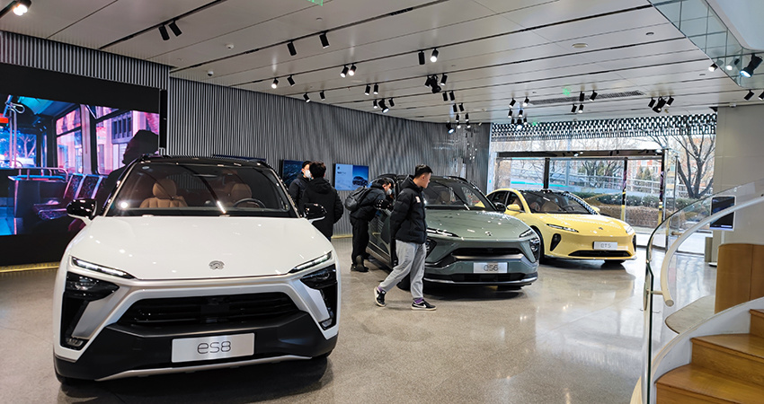
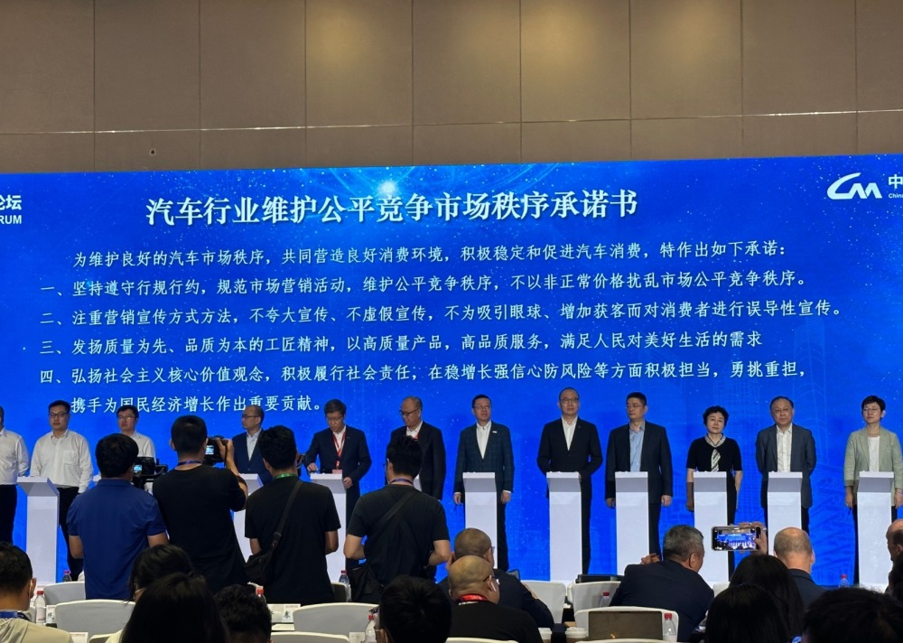

# 史上最强汽车降价潮来袭：宝马均降10万以上 明年会更猛

编者按：求变者恒新，创新者恒强，乐观者恒进。在大变局时代，韧性增长，找到更好立于世界的方式。是为腾讯新闻《潜望》与《远光灯》栏目年终策划系列《韧性生长，穿越周期》第一篇。

腾讯新闻《远光灯》 作者 张小珺

虽有16家车企联名签《承诺书》，但在生存危机面前，车企们可顾不得什么承诺了。

2023年底，中国车企连带着他们的经销商，掀起一轮凶悍的降价潮。不管是降价幅度还是所波及企业的范围，都达到今年之最。

作者在北京蓝色港湾的门店走访发现，不管是国产品牌华为（与奇瑞、赛力斯的合作车型）、蔚来，还是德国品牌宝马，都在推出今年以来最大力度的优惠策略。
**降价达到今年高潮。**

华为策略以赠送选装为主，可视为间接降价行为。以华为与奇瑞合作的轿跑智界S7为例，该车型上个月刚上市，虽车价不减，但会送5.5万元选装；华为与赛力斯合作的SUV问界M7，如果是京牌会减1万元现金，送2.7万元选装（非京牌不减现金）。销售人员称，价格优惠力度比今年任何时候都大。

“（汽车行业）都这样。”上述销售人员说，“我们现在都在卖库存车了。”据他介绍，如果现在定车，定的大概率是今年8月至10月生产的2023款车型；2023款车在11月至12月已不生产，现在生产也是为明年24款做储备。所以，
**2023款车必须要在今年底卖完，否则“跨年就变老款了”。**

宝马的降价策略最直接、也最激进——每款车型至少降10万元不止，SUV车型甚至降25万之多。以在现场展示的宝马i4为例，原价含选装约47万，优惠完约36万；宝马i3原价约35万，优惠完约21万——每款车型至少便宜十万元。SUV力度更大，直接降幅约25万。

这是一家宝马的半直营店，现场人员称，进口车今年上半年原本没什么优惠，但7月至8月突然开始降价。原因很直接——“为了多卖。”他说，一来是，明年进口车要交购置税；二来是iX、i4、i7这几款车在欧美卖得不错，但在中国销量极不理想，年中时主机厂下达销量任务。“为了完成任务必须降价卖。”

蔚来降价幅度最小，现车减8000元。“年底算优惠比较大了。”一名现场销售说。

据不完全统计，2023年11月以来至少有15家-20家车企参与到新一轮价格战中。他们的降价手段不一，有的是官方调整主导价，有的通过促销，给消费者各种各样的置换补贴、上牌补贴或金融补贴等。

**而相比今年上半年价格战，年底价格战的成因、特征和力度都有显著不同。**

**更凶猛、却更悄无声息的价格战**

“年底价格战比上半年打得更激烈。”汽车垂直媒体有车以后联合创始人陈强谈到。有车以后有汽车销售业务，他对各家车企的价格十分敏锐。

据他观察， **这次价格战首先是参与选手改变了。**
“上半年降价的，主要是比较早扛不住的，比如传统合资品牌（东风雪铁龙、上汽通用）。”陈强说，年底这次有很大不同，即便是被认为销量坚挺的理想汽车也加入了价格战，而且降价幅度不低（终端实际成交价最高优惠接近3万元）。

“市场更卷了，没有谁能独善其身。”他说道。

奥纬咨询董事合伙人、亚太汽车与工业品业务主管张君毅说， **这次的“降价风”并不光是小企业推动，很多大企业也推波助澜，如比亚迪的大范围降价。**
“因为它要冲货，年底要突破300万台年度销售目标。明年会有更大压力。”

在他看来，大企业更具有降价的底气。“反而是一些初创企业，有销量压力，但由于亏不起，在价格上动作不是这么大。”这意味着，想要降更多价、卖更多车，需要有经营底盘做支撑——不是想降就降。

张君毅进一步称， **车企们的另一重隐形压力在于，明年部分地区有可能会出台牌照管理新政**
，这会引起市场震荡，所以车企们更希望能尽快出货。“像上海这些地区，交通道路容量和承载有限，或许今后可能一个人只能有一张牌照，无论绿牌还是蓝牌，这类可能存在的政策调整，对于销售端有压力。所以，大家趁着今年底、明年初清货。”

最新消息显示，12月15日晚《上海市鼓励购买和使用新能源汽车实施办法》发布，对新能源车牌继续免费发放支持，但申请门槛有所提高——要求个人名下“既无新能源车，也无燃油车（沪C号段车辆除外）”。这意味着上海新能源车牌照政策有所收紧。

陈强则称，事实上，车企年底降价是惯例，往年也差不多是这样的节奏。一来，金九银十以后进入汽车销售旺季，正是消费热情上涨之时；二来，各家企业都要在年底冲销售任务。然而，今年又极为特殊。

“大家体感很不一样。”前几年受制于疫情和流动性限制，各车企制定年度销售目标时趋于理性，所以价格战打不起来；今年初所有人的预期是反弹，于是制定目标激进；然而，到10月份很多主机厂发现销量未达预期，为了完成指标必须加码降价，这导致“真正意义上的价格战打起来了”。

据他观察，上半年是以主机厂为主导的降价潮，目的是为了清理积压库存；而年底的这轮价格战是从经销商网络开始，“经销商五花八门地降”，然后甚至悄无声息地蔓延至主机厂，导致有些主机厂或直营店直接官降。

**他形容称，上半年更像是一场“运动式的降价”，“突然有人开枪，你不表态就吃亏了”。年底看似不如年初激烈和叫嚣声量大，更安静，但实际幅度更大——这次降价更像传染，从个别经销商开始，直到传染到整个市场进行价格下探。**

“年底任务压力大，销售老总现在不把子弹都打出去，再等下去，位置都换成别人了。”一位出行行业对销售和市场尤其资深的人士道。

相比之前的降价以出清尾货为目标，这次降价潮涉及许多新车型。吉利和百度合资生产的极越汽车，刚上市两个月就宣布全系直降3万元。

“上半年降价，大家对市场还有信心，降价幅度相对有限、保守，主要对滞销车型进行处理；而下半年的降价，无论滞销不滞销，哪怕新车型都开始了——很多企业并没有完成年初的销量计划。”张君毅称。

**值得一提的是，即将要上桌和要出牌的对手、可预期的更强劲的竞争压力，也是本轮降价潮根源之一。**

今年12月到明年1月，包括小米汽车、理想MEGA等大量新车要上市。“这些车出来之前，如果你是它的竞争对手，一定会先降价。”一位与多家主机厂打交道的人士分析道，“他们要把徘徊、犹豫的消费者抢过来。先出手、先抢人。不会等着别人出招。”否则战场上，你会陷入被动。

这也将压力传导至小米汽车等要上市的新车型上。他们需要更谨慎地定价并制定销售策略，“不能过于自信”。

**在年度业绩、政策收紧、更强的敌人甚至生存危机面前，降价又一次成为众多主机厂的共同选择。**

“降价的幅度和降价的力度是前所未有的。”张君毅这样说。

**失效的调停**

价格战是2023年中国车企的最大话题之一。早在今年初，特斯拉降价就间接引发一轮中国汽车大规模价格战。

虽然特斯拉有示范作用，但根源并非特斯拉降价。麦肯锡全球董事合伙人方寅亮称，其根源之一是， **汽车厂商扩大供给与消费者真实需求之间的错配。**

一开始，各车企对于2023开年销量预期很高；同时，这些年车企对智能化、电动化在研发等各方面投入加大，所以他们更急迫地期待短期销量能拉升经营业绩。然而，中国汽车总销量维持在2300万台到2500万台，每年3-4%左右平稳增长，总量无大幅拉升。这导致，车企预期与消费需求存在错位。

更令人担忧的是，产业降价信号不断，对消费者的信心恢复没起到正向刺激，反而让消费者退后一步，抱持币观望的态度。

**某种意义上来说，这是车企与消费者心理的一场拉锯战。**

陈强观察到，一开始车企们预期特别高，制定了激进的销售策略。
**“所有人摩拳擦掌，结果发现不大对劲。”他说，“先是特斯拉打了一枪，接着雪铁龙直接把价格‘踩在地上’，这引发一轮恐慌，大家开启踩踏式降价。”**

不可否认的是，这波降价风波背后有其内在动因。“这些车企本来也想降，特斯拉、雪铁龙刚好代表两种类型，车企都找到了榜样和标杆，所以跟着降价。”但最后，大家悲观地发现，“降了也卖不动，降了也是白降”。

更糟糕的是，消费者的心理预期平衡被打破，更多消费者持币观望。

**这时，市场亟需一位“中间人”调停，让降价风波得到阶段性缓和，进而收尾。** 中国汽车工业协会于是站了出来。

今年7月，在中汽协主办的2023中国汽车论坛上，16家车企联合签署《汽车行业维护公平竞争市场秩序承诺书》。签署《承诺书》的车企包括一汽、东风、上汽、长安、北汽、广汽、重汽、奇瑞、江淮、吉利、长城、比亚迪、蔚来、理想、小鹏和特斯拉。

_2023中国汽车论坛上，16家车企联合签署《承诺书》_

此举被认为是由中汽协牵头，令车企协商避免恶性降价——《承诺书》似乎宣告了上半年的价格战暂时告一段落。

然而，消费者信心稍一见好，火药味就又燃起来。

特别是到今年四季度，各家车企掌门人旋即开始担忧年度业绩如何达成。很快，调停宣告失效。新一轮降价潮又打响了。

“这个没有用。这是企业行为，企业要生存，不占市场占有率就做不下去。”一位汽车行业有二十年从业经历的资深人士说，“明年如果市场不好，大家还会硬撑。大家都在抢份额，抢生存机会。如果你的量大了，还能融资获得资金资源；如果没有量，根本就没生存机会。”

汽车产业价格战打得如此猛烈，有其产业特殊性——首先，汽车行业的产业链足够长；其次，汽车产业属于竞争性行业，非垄断性，打起价格战呈现市场化特征；更重要的是，
**汽车产业波及面甚广，各个地方政府、银行、资本与投资人都充当车企背后的推手与弹药库。**

“汽车销量不起来，可能引发各种地方财政、就业等危机。”上述汽车行业人士说道，这导致， **所有人都在拼命往里扔弹药。**

**2024年：流血战斗的关键时刻**

理想汽车副总裁刘杰曾在广州车展上称，明年20万以上新能源市场渗透率接近55%，总量约400万辆，这意味着
**2024年会是汽车市场重要的拐点，将从早期大众进入到晚期大众阶段。**

他认为，这一阶段过渡的巨大挑战在于，是不是头部品牌至关重要。如果不是头部品牌，消费者不会考虑你。而且，这将不仅是新能源头部和燃油车头部品牌之间的比较，对晚期大众，它会把所有在同一价格区间的品牌放在一起，判断谁或哪几家是首选。

刘杰谈到， **2023到2025年这三年，是整个行业最关键的淘汰赛，甚至淘汰赛还有持续提前的趋势**
——以前行业普遍认为电动的渗透和智能的渗透会是两轮淘汰赛，现在发现会合成一轮。电动化的渗透里有物理、化学要素，但智能化的渗透是软件，速度会比电池技术、电动技术更快。

“这三年就是淘汰赛的竞争，没有任何一家企业可以高枕无忧，没有任何一家企业是绝对领先和安全。”他说，可能到明年年底，哪几家企业能最终留在牌桌上会初见分晓。

明年还会更大幅度继续降价吗？张君毅对2024年的市场预期是，明年一二月份要看看市场是不是企稳，如果市场不企稳，春节以后到车展前后一定会有大促。“除非所有人都协同不降价，但大概率不太可能吧。”

令人不安的是，虽然今年车企价格接连下探，却没有带来销量的剧烈反弹。对于价格和销量敏感的陈强说：“今年雪铁龙宣布以后，热闹了一波，很短提升了购车热情，随后就陷入到了持币待购的状态。年底旺季在终端正常拉了一些提升，但没有出现很大震荡。”

他也认为，明年价格战可能会更激烈。“明年车也多，将进入淘汰赛更激烈的时期，是决定生与死的时候——
**不管是搅局者还是希望进一步奠定自己地位的企业，他们都到了流血战斗的关键时刻。** ”没有人能保证拿到船票，没有人敢松懈。

即将出牌的敌人、激进的年度目标、或有变化的政策、清尾货压力，甚至还有销售老大的屁股，以及生与死的威胁——都让本轮降价潮的幅度和所波及广度达到空前。

然而， **就在所有人流血卖车之时，特斯拉却反向操作，近期宣布涨价。**
行业人士认为，这符合特斯拉的做派——相比关注竞争对手动态，他们更关注自身的产能与节奏。

可以预见的是，和任何历史上的版图之争一样，一番诸侯混战以后，最终形成几大诸侯，“你打不死我、我打不死你”，市场才会进入稳态。

“好戏还在后头。”陈强说。

