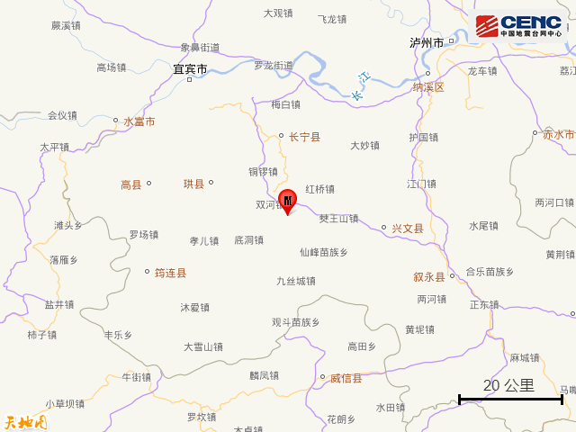
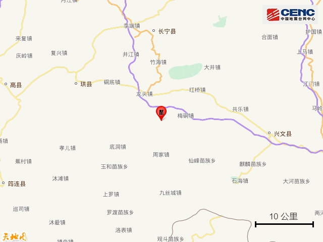
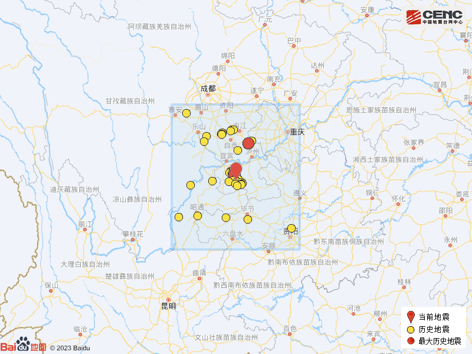

# 四川宜宾市长宁县发生3.1级地震

据中国地震台网正式测定，12月19日21时49分在四川宜宾市长宁县发生3.1级地震，震源深度8公里，震中位于北纬28.34度，东经104.94度。

震中5公里范围内平均海拔约571米。

根据中国地震台网速报目录，震中周边200公里内近5年来发生3级以上地震共303次，最大地震分别是2021年9月16日在四川泸州市泸县发生的6.0级地震（距离本次震中103公里）和2019年6月17日在四川宜宾市长宁县发生的6.0级地震（距离本次震中4公里），按震级大小前50次历史地震分布如图。

