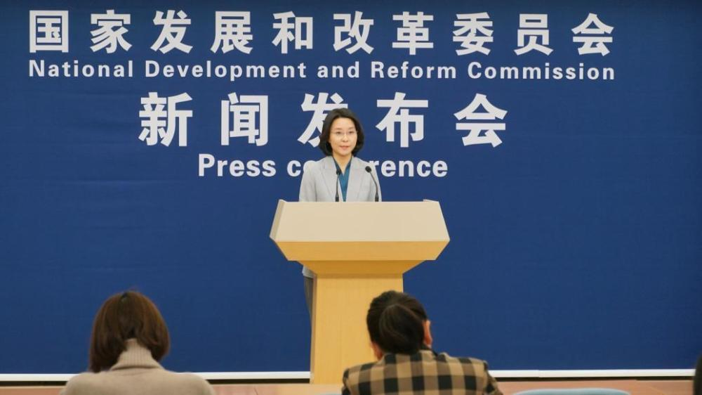

# 国家发改委：预计明年CPI将温和回升

_发布会现场 澎湃新闻记者 周頔 摄_

12月19日，在国家发改委召开的12月例行新闻发布会上，澎湃新闻（www.thepaper.cn）记者提问：近期食品价格涨幅明显偏低，原因是什么、后期走势如何？国家发改委如何看待明年我国CPI的前景？

对此，国家发改委政策研究室副主任、新闻发言人李超表示，今年1—11月，食品价格与去年基本持平，涨幅为近十年较低水平。究其原因，主要是受输入性、周期性、季节性等因素叠加影响，猪肉、蔬菜等价格去年基数较高、今年高位回落。具体来看：从猪肉看，去年下半年，生猪价格处于周期高位、产能明显增加，今年处于周期下行阶段，生猪、猪肉市场供应充足、价格低位运行，11月价格同比下降31.8%。

李超表示，从近日情况看，随着“两节”临近，市场需求季节性增加，生猪、猪肉价格略有回升，后期可能继续有所回升。从鲜菜看，去年冬季，受运输物流一度不畅影响，鲜菜价格上涨较多，导致基数较高；今年同期国内物流配送畅通，鲜菜供给充足，10—11月平均价格同比下降1.6%。从粮食看，受地缘政治冲突等影响，去年国际粮食价格大幅上涨，直接导致国内小麦、玉米、大豆等谷物价格不同程度上升；今年输入性影响明显减弱，粮食、食用油价格总体平稳，对食品价格的影响远小于去年。从后期看，我国农产品市场供应充裕，产销衔接畅通，市场秩序良好，食品价格具备平稳运行基础。

对于CPI明年前景问题，李超表示，今年CPI总体低位运行，随着输入性、周期性、季节性等因素有所改变，基数效应逐步减弱，商品服务需求持续恢复，
**预计明年CPI将温和回升。**

**相关报道**

[国家发改委：深化国资国企改革 促进民营经济发展壮大 ](https://news.qq.com/rain/a/20231219A02IDG00)

