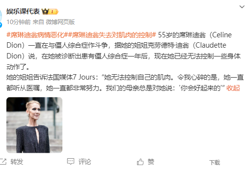
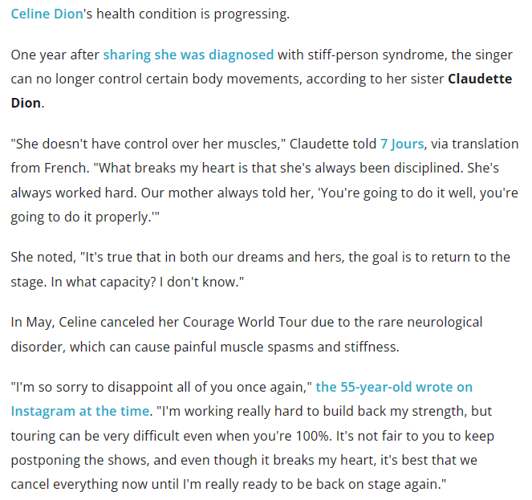

# 席琳·迪翁病情恶化，患不治之症一年已无法控制自己的肌肉

55岁歌后席琳·迪翁去年12月确诊僵人综合征（SPS），经过一年艰苦对抗，席琳·迪翁的病情逐渐恶化，已无法控制身体上的肌肉了。

据外媒《7 Jours》报道，姐姐克劳德特·迪翁受访表示，席琳·迪翁的病情正在恶化，至今没有找到有效药物，她很努力工作，但已经无法控制自己的肌肉。

席琳·迪翁去年确诊之后宣布取消演唱会，她很努力的对抗SPS，可惜事与愿违，逐渐失去自理能力，已经由74岁的姐姐照顾。

姐姐总是引用母亲的话鼓励席琳·迪翁：“你会做得很好...”

据悉，席琳·迪翁患上的是一种不治之症，全球发病率仅百万分之一，患者发病时会全身肌肉剧烈疼痛，肌肉逐渐硬化并伴随痉挛，直至患者失去行动能力，所以被称作是“僵人”。

周海媚因红斑狼疮去世，此病与僵人综合征同属免疫系统疾病，因免疫系统混乱而攻击神经系统，至今没有被攻克。

席琳·迪翁患病之后，姐姐一直悉心照顾，他们也找了很多顶尖的医疗团队，尝试了很多种药物，可惜还是无法延缓席琳·迪翁的病情，任何人都无法减轻她的痛苦。

55岁席琳·迪翁因一首《我心永恒》红遍全球，光鲜亮丽的背后是坎坷的人生，他的父亲、哥哥都英年早逝，丈夫在2016年患癌流失，留下一双12岁的双胞胎儿子相依为命。

今年10月，姐姐曾透露好消息，表示席琳·迪翁行走不需要轮椅，仍计划回归演艺圈，她本人也多次外出观看演唱会，虽然外形干瘪但状态不错，笑容满面。10月底，席琳·迪翁带着两个儿子一起观看比赛，期间在后天与友人握手，行动自然表现轻松。

外媒此前曾拍到席琳·迪翁去观看凯蒂·佩里的演出，当时儿子就坐在她的身边，日渐消瘦的模样令人担忧。

