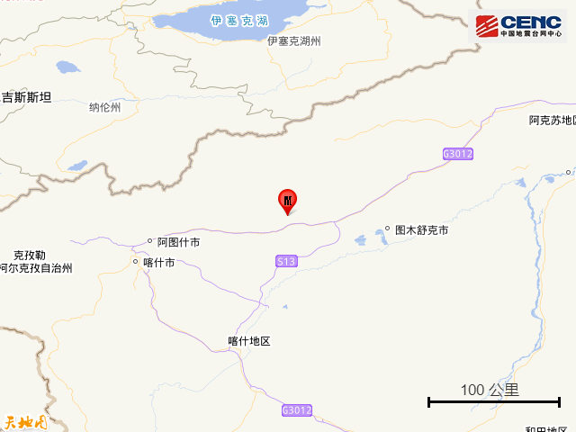
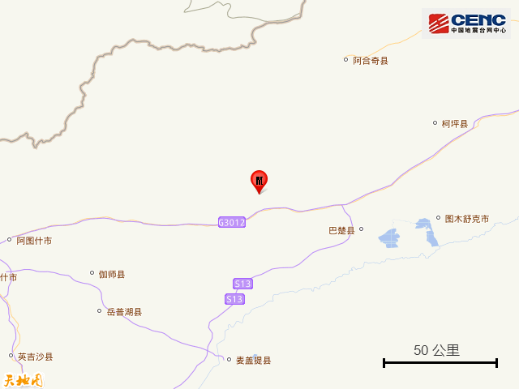
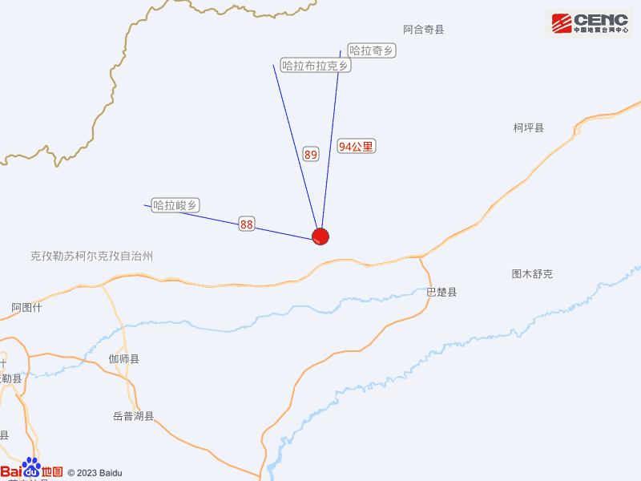
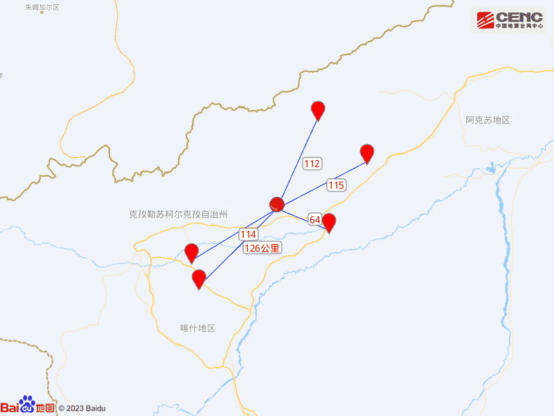
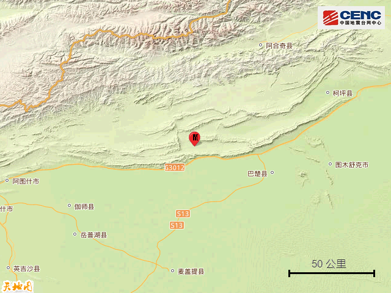
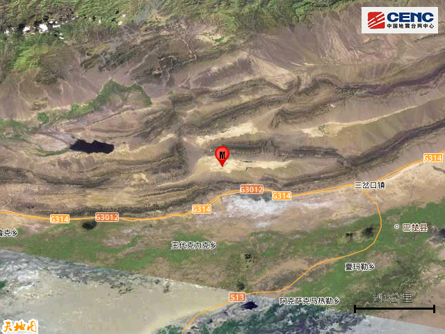
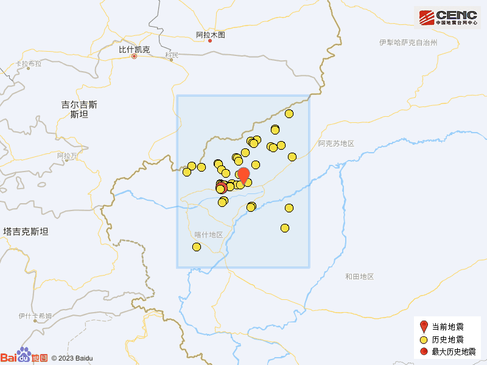

# 新疆克孜勒苏州阿图什市发生5.5级地震

据中国地震台网正式测定，12月19日9时46分在新疆克孜勒苏州阿图什市发生5.5级地震，震源深度10公里，震中位于北纬40.02度，东经77.86度。

本次地震周边5公里内的村庄有托帕奥特，50公里内无乡镇驻地分布，100公里内的乡镇有哈拉峻乡、哈拉布拉克乡、哈拉奇乡。

震中距巴楚县64公里、距阿合奇县112公里、距伽师县114公里、距柯坪县115公里、距岳普湖县126公里，距图木舒克市105公里，距克孜勒苏柯尔克孜自治州149公里，距乌鲁木齐市911公里。

震中5公里范围内平均海拔约1433米。

根据中国地震台网速报目录，震中周边200公里内近5年来发生3级以上地震共181次，最大地震是2020年1月19日在新疆喀什地区伽师县发生的6.4级地震（距离本次震中59公里），按震级大小前50次历史地震分布如图。

