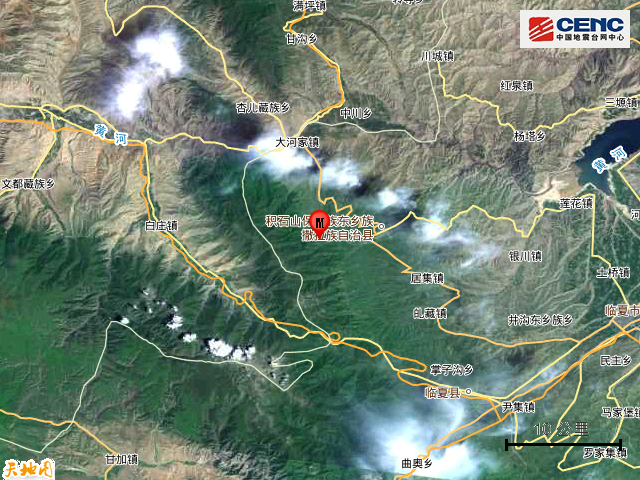

# 甘肃临夏州积石山县发生6.2级地震，周边有多个县城、村庄

据中国地震台网正式测定，12月18日23时59分在甘肃临夏州积石山县发生6.2级地震，震源深度10公里，震中位于北纬35.70度，东经102.79度。

本次地震周边5公里内的村庄有黄草坪、大山庄、河崖村、积石山民俗村、尕护林、赵家地、大沟、盖新坪、怕沟湾、二沟，20公里内的乡镇有石塬镇、刘集乡、柳沟乡、吹麻滩镇、寨子沟乡、居集镇、中咀岭乡、关家川乡、大河家镇、郭干乡。

震中距积石山保安族东乡族撒拉族自治县8公里、距青海循化撒拉族自治县32公里、距临夏县34公里、距临夏市42公里、距永靖县53公里，距临夏回族自治州40公里，距兰州市102公里。

震中5公里范围内平均海拔约2787米。

根据中国地震台网速报目录，震中周边200公里内近5年来发生3级以上地震共24次，最大地震是本次地震，历史地震分布如图。

