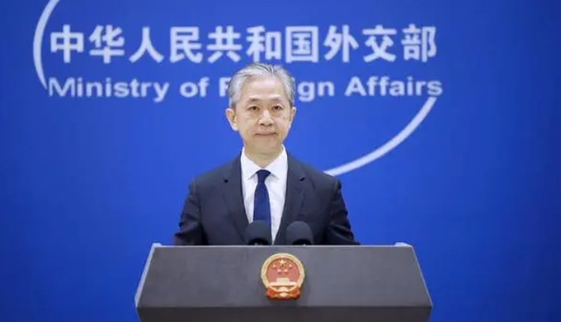
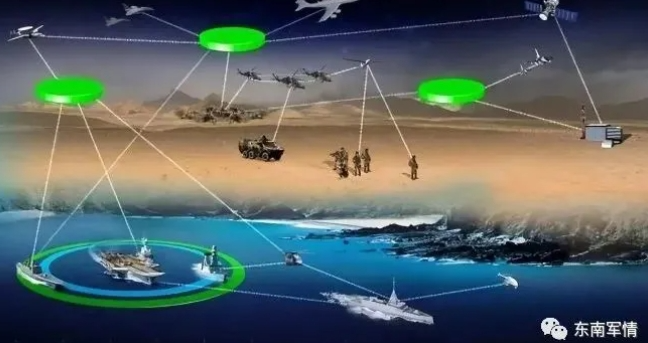

# 中方将采取反制措施！美国此次对台3亿美元军售不同以往

**撰文 | 李岩**

据环球网消息，美国国防安全合作局（DSCA）近日证实，美国国务院已批准对台湾最新一项军售，金额达3亿美元，以维持所谓信息安全计划指挥、控制、通讯与电脑（C4）系统生命周期，包括先前采购的多功能MIDS-
LVT终端与联合战术情报分配系统（JTIDS）设备，以及备件与维修零件、技术援助、后勤等。

**将采取反制措施**

就此，外交部、国防部12月18日、19日相继进行回应。

外交部发言人汪文斌表示，美方公然违反一个中国原则和中美三个联合公报，再次宣布向中国台湾地区出售武器，严重损害中国主权和安全利益，严重危害台海和平稳定，向“台独”分裂势力发出严重错误信号。中方对此强烈不满，坚决反对，已向美方提出严正交涉。无论美方向台湾地区提供多少武器，都阻止不了中国统一的历史进程，动摇不了中国人民捍卫国家主权和领土完整的坚定意志。

汪文斌还强调，中国终将统一，也必将统一。中方将采取坚决有力措施捍卫国家主权和领土完整。 **我们将对参与对台售武的有关企业采取反制措施。**

国防部新闻发言人吴谦应询回应，台湾问题始终是中美关系中最重要、最敏感的问题。我们要求美方停止武装台湾，切实将不支持“台独”的表态落实到具体行动，停止干涉中国内政，不要在错误和危险的道路上越走越远。
**“以台制华”注定失败，“以武谋独”死路一条。中国人民解放军加强练兵备战，坚决捍卫国家主权和领土完整，坚定维护台海和平稳定。**

**不同以往**

梳理此前历次美国对台军售可以发现，美国向台湾提供的大多为飞机、火炮、导弹等装备或弹药。此次军售中提及的指挥、控制、通讯与电脑（C4）系统，联合战术情报分配系统在以往军售中很少出现，升级、维护指挥链路这类看似“软性”军售，也和直接售卖武器弹药的作用、意图存在很大差异。

军事评论员宋忠平向政知君解释称，综合来看，美国这次的动作意图明显，就是希望给台湾打造、升级其C4ISR系统。所谓C4ISR，即现代战争中一体的信息化指挥系统，涉及指挥、通讯、侦测等。这类系统通过将更多作战单元、平台纳入统一的信息化链路之中，实现更有效率的情报搜集和指挥决策。

“我们再也不能简单认为，美国对台军售会一直延续以往套路，仅仅为其提供枪炮弹药。”宋忠平评价称，这类信息化系统，在现代战争中是至关重要的，将提高联合作战、快速反应的能力。台湾方面既有的相关系统陈旧老化了，那么就需要维护升级，这种维护升级显然只能依靠美国提供的技术。而美国的动作也说明，其维护自身霸权的意图从未改变，用“打台湾牌”方式遏制中国发展也不会改变。

今年6月，东南卫视栏目曾援引台媒消息称，美国将协助台军取得先进战术数据链，从而为台军升级其联合作战指挥系统作好准备。

有军事专家在东南卫视栏目中解读称，此举将让台湾军事力量的“神经”和美军甚至美国盟国进行联通，通过这种所谓的情报共享，台湾将成为美国的“提线木偶”。

宋忠平认为，台当局再次“豪掷”重金，用百姓血汗钱求购美国指挥系统是甘当“冤大头”之举。

他分析称，正像外交部、国防部多次表态，“无论美方向台湾地区提供多少武器，都阻止不了中国统一的历史进程”。从技术角度来看，解放军的C4ISR系统并不存在劣势，一样先进可靠。此外，台湾的这套系统购自美国，其自身并不具备改造、升级、迭代的能力，战时如果出现漏洞和偏差无法及时修补纠正。相比之下，解放军的指挥控制系统自研、自造，整体性、应用性、升级空间更优，战时调整应变能力更强。

**【版权声明】本文著作权归政知新媒体独家所有，未经授权，不得转载。**

