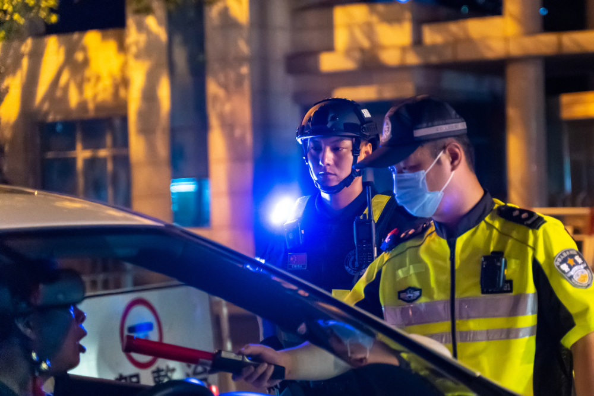
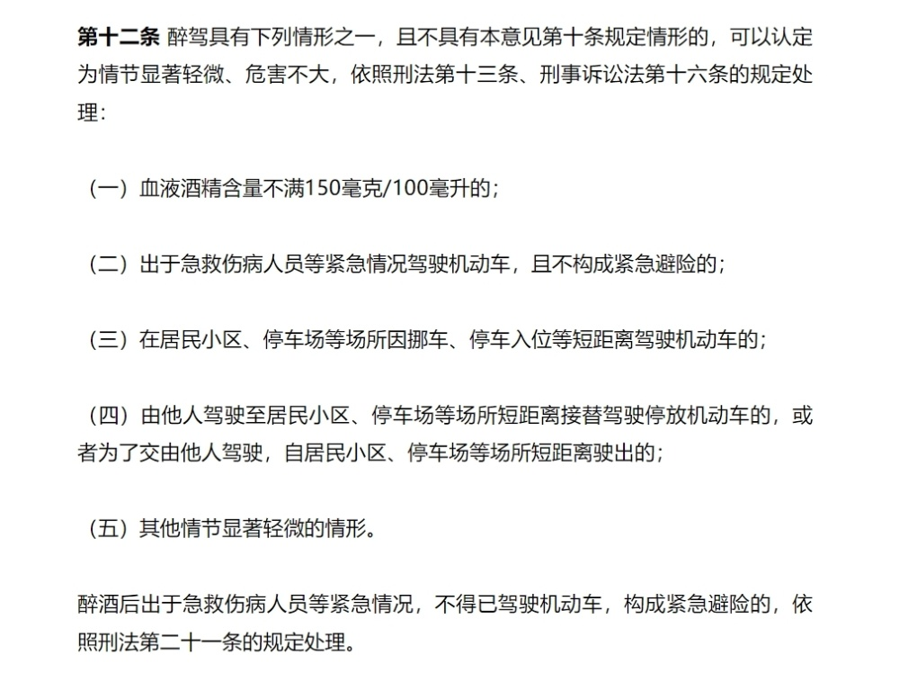

# 醉驾不再强调“一律入罪”，媒体：公众要的是“人人平等”的执法过程

12月18日，最高人民法院、最高人民检察院、公安部、司法部联合发布《关于办理醉酒危险驾驶刑事案件的意见》（以下《意见》）。《意见》将于2023年12月28日起施行。被公众认为，最大的变化在于——《意见》明确，醉驾情节轻微的，可以不起诉或者定罪免刑；情节显著轻微、危害不大的，可以不作为犯罪处理，按照道路交通安全法的规定给予行政处罚。

这一规定引发了网友的热议，执行了13年的“醉驾一律入罪”，是不是要取消了？甚至个别网民认为，这样的“放松处理”可能为官员今后醉驾逃刑留下后窗程序？

_2022年7月31日晚，江苏省镇江市交警支队京口大队联合京口分局巡特警大队，开展夜查行动。万凌云/澎湃影像 资料图_

其实，这一次《意见》按照“血液酒精含量+情节”的双模式确定入罪标准，统一和规范了立案、起诉、缓刑、罚金刑、行政处罚等标准。通俗地说，《意见》延续目前适用的血液酒精含量80毫克/100毫升的立案标准，同时，将不满150毫克/100毫升的，列入可以适用“情节显著轻微、危害不大”，从而适用有关不起诉、定罪免刑等规定；再将超过180毫克/100毫升的，列入一般不适用缓刑的情形。

也就是说，新的《意见》画出了80、150、180毫克的三条红线，并且适用了“血液酒精含量+情节”的双模式——不严谨地可概括为，大于80毫克可以立案，小于150毫克可适用不起诉，大于180毫克一般不缓刑——而改变了之前被俗称的“超过80毫克一律醉驾入罪”的标准。

为什么要对“超过80毫克一律醉驾入罪”做修正呢？

在2010年醉驾入刑之前，醉驾只是普通的行政违法，只适用拘留和吊销驾照的行政处罚。这意味着，在当时醉驾只要不撞死、撞伤人，就很难构成犯罪。结果就导致了“孙伟铭案”等一系列惨痛的醉驾个案发生。2010年，刑法正式修订，补上了这个漏洞，醉驾作为一种危险犯正式入刑，不再需要造成撞伤人的严重后果，只要是醉酒驾驶就可以构成犯罪。而且当年为更好发挥震慑作用，宣传时更多强调的是“一律入罪”。

但是，法律在执行13年之后，也产生了一些新问题。

一方面，目前，醉驾已经取代盗窃罪，成为“第一大犯罪”。“醉酒驾车型”危险驾驶罪大约占所有刑案的1/3，每年有30余万人被判刑。所以，之前周光权等法学家、律师都提出“醉驾每年让30万人入狱”，严重占用司法资源，建议做出精细化改变。

另一方面，“一律入罪”也遭遇到了很多复杂的情形，要做出更细致的规定，不能够再一刀切了。比如，醉酒在小区停挪车；家里有病人要紧急送医院，不得不醉酒时开车，这些是不是也要入罪？似乎“一律入罪”有悖公平原则。

之前浙江等地一直在打补丁，而这一次两高、两部出台的新司法政策，全方位升级细化了执行标准。

以大家最关心的醉驾可以不起诉的情形来说，这次《意见》的第12条规定：（二）出于急救伤病人员等紧急情况驾驶机动车，且不构成紧急避险的；（三）在居民小区、停车场等场所因挪车、停车入位等短距离驾驶机动车的；（四）由他人驾驶至居民小区、停车场等场所短距离接替驾驶停放机动车的，或者为了交由他人驾驶，自居民小区、停车场等场所短距离驶出的，等等，可以适用有关不起诉等从宽处理规定，都是有的放矢的细化政策。

要强调的是，《意见》不是对醉驾一律从宽，而是体现了宽严相济、精准司法的特色。《意见》按照“酒后危险驾驶行为+醉酒程度+有无从重情节”的模式确定从宽和从严的具体标准，比如规定了，醉驾造成交通事故后逃逸的；五年内曾因饮酒后驾驶机动车被查获或者受过行政处罚的等情形不适用缓刑的规定。这些从严的规定，填补了之前司法政策的空白点，有利于统一司法裁判标准、做到同案同判。

目前，对于醉驾这个“第一大犯罪”，在法律执行13年之后，升级适用更精准的司法裁量标准，引入“血液酒精含量+情节”的双模式，体现了司法的谦抑精神和实事求是的态度。

但是，也希望司法机关能够看到公众的焦虑所在，从之前的“80毫克一律立案乃至入罪”，到目前“不满150毫克的可以不起诉”，具体的个案有了更宽松的处置、裁量空间，谁能够享受到这次精准司法的红利？会不会变成某种特权？

所以，更精细的司法政策，需要更阳光、更透明的执法程序来保障其公平性，这方面司法机关必须做出更大的努力。公众不是执着于“一律入罪”的结果，要的是“人人平等”的执法过程。

