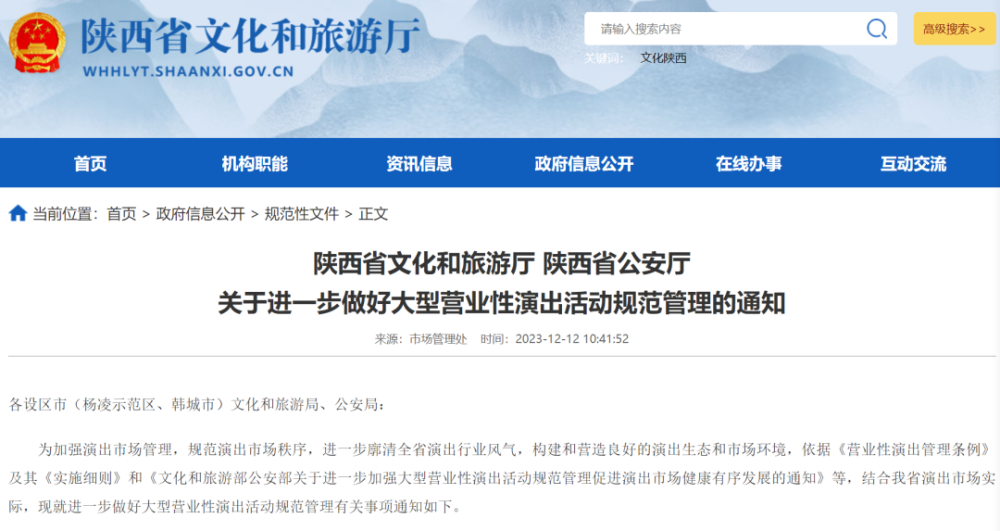

# 陕西规范大型演出活动：严禁假唱，及时劝阻粉丝举旗游街等不理性行为

为加强演出市场管理，规范演出市场秩序，进一步廓清全省演出行业风气，构建和营造良好的演出生态和市场环境，日前，陕西省文化和旅游厅、陕西省公安厅联合印发
**《关于进一步做好大型营业性演出活动规范管理的通知》** ，要求各设区市（杨凌示范区、韩城市）文化和旅游局、公安局进一步做好大型营业性演出活动的规范管理。

各设区市（杨凌示范区、韩城市）文化和旅游局、公安局：

为加强演出市场管理，规范演出市场秩序，进一步廓清全省演出行业风气，构建和营造良好的演出生态和市场环境，依据《营业性演出管理条例》及其《实施细则》和《文化和旅游部公安部关于进一步加强大型营业性演出活动规范管理促进演出市场健康有序发展的通知》等，结合我省演出市场实际，现就进一步做好大型营业性演出活动规范管理有关事项通知如下。

**一、加强演出审批管理**

**1.规范审批程序。**
坚持“属地管理、分级负责”和“谁主管谁负责”的原则，对观众人数在5000人以上的大型营业性演出活动，审批前由地市级文化和旅游部门进行社会稳定风险评估和综合研判，于7个工作日内上报省文化和旅游厅。省文化和旅游厅按照《关于加强新形势下重大决策社会稳定风险评估机制建设的若干措施》，建立大型营业性演出活动联席联勤会商机制和联席会议制度，根据工作需要组织公安、民宗、安全、市场监管、外办、台办、宣传、网信、文化执法等部门联合会商，综合研判提出审批意见，切实强化活动风险评估和审批前置管理。审批结果由属地文化和旅游部门报同级党委政府和上一级文化和旅游部门备案。

**2.严格内容审查。**
负责审批的文化和旅游部门要落实主体责任，认真依照《营业性演出管理条例》及其《实施细则》等有关规定开展演出内容审查，杜绝违规内容，抵制低俗倾向。严禁演出所涉语言、文字及视频出现危害社会公德、违反公序良俗、畸形审美等违规内容。严禁邀请或聘用影响恶劣的违法失德失范演员。

**3.加强提醒约谈。**
在对活动热度、社会反映、明星艺人舆情等情况进行综合研判的基础上，由文化和旅游部门牵头，会同公安等相关部门联合在活动举办前对举办方、艺人经纪公司、工作室等进行约谈，要求在演出合同中细化举办方及演出经纪机构、演员等的义务和责任，对相关管理规定及监管要求进行宣讲和提示，压实其在引导粉丝线上线下言行、及时发现举报违规行为和倡导理性追星、文明观演等方面的责任。

**4.优化审批服务。**
文化和旅游和公安部门要增强服务意识，提高办事效率，积极实施一网通办、线上审批。对研判评定为“低风险”的演出申请，及时调取资料开展审核审批工作，减少非必要环节、尽量缩短审批时限，切实营造良好的营商环境。

**二、加强演出票务管理**

**5.强化票源管理。** 演出举办单位要严格落实票价公开明示制度和明码标价规定。
**对观众人数在5000人以上的大型营业性演出活动，全面推行实名售票制度，每场演唱会每个身份证件只能购买一张门票，购票人与入场人身份信息保持一致。**
演出举办单位面向市场公开销售门票须对接公安部门身份认证系统，确保每张门票具有详细的购票人实名信息、购票时间、座位和入场核验信息等。演出举办单位在面向市场公开售票比例不低于核准观众数量的85％，对其余15％的门票在演出前24小时进行个人信息绑定，做到“实名绑定、实名入场”。

**6.做好票务销售。**
演出举办单位应当明示其授权的票务代理机构，引导消费者从合法渠道购买门票。拓宽大型文化演艺活动购票渠道，鼓励票务代理机构在车站、地铁站、演艺现场等公共区域部署自助购票机，分配一定比例的演出门票到自助购票机。演出举办单位应当建立大型演出活动退票机制，设定合理的梯次退票收费标准，保障购票人的正当权益。售出的门票应当注明票务代理机构名称和联系方式，并告知消费者购票、入场和退票规则。对因票务经营不规范引起的炒票问题或可能造成不良影响的行为，文化和旅游部门要及时约谈举办方和票务经营单位，指出问题并立即整改，对票务经营中存在的违规违法行为依法进行处理。

**7.加强票务监管。**
文化和旅游行政部门要加强对演出票务销售平台的管理，根据实名认证系统提供的数据，对票务代理机构未履行实名核验、为倒卖门票提供服务等违规行为进行依法处置，同时列入“文化和旅游市场失信主体”实施联合惩戒。
**公安部门要严厉打击二手票证的非法高价转售倒卖活动，全面收集线上线下有关倒卖、炒作票证的信息，一经发现加价、变相加价销售票证的违法犯罪行为，予以严厉打击。**
文化和旅游部门要督促举办单位、票务销售平台遵守相关规定，坚守职业操守，迭代升级售票平台防“倒票”、防“抢票”防火墙系统，对“黄牛”使用软件“刷票”行为可采取拒售措施，并第一时间举报。文化和旅游行政部门要督促演出举办单位、演出票务销售平台将票务信息（包括但不限于演出项目的名称、演出时间、演出场次、门票数量、票务销售方案、票房收入等信息）实时传输至全国文化市场技术监管与服务平台，进一步加强大型文化演出活动票务信息规范管理。

**三、加强演出现场管理**

**8.做好演出安全防范。**
文化和旅游部门、公安部门要督促演出举办单位根据有关要求，加强演出入场的核验工作，更新验票闸机的实名认证、比对系统，做到人证票三合一。同时，对进入演出现场的观众进行严格的安全检查，严禁携带易燃易爆危险品、管制器具等违禁品进入演出场所。演出举办单位要建立完善现场巡查制度，指定专人负责演出活动的巡查，做好观众管理，防止拥挤、踩踏等事故发生。严格按照消防安全等方面要求，落实安全生产责任制。

**9.强化现场管理。** 文化和旅游市场部门、综合执法机构要加强对大型演出活动的实地检查，
**现场核验演员信息及演出节目内容，严禁擅自变更演员及演出内容，严禁假唱、假演奏等违法违规行为。**
文化和旅游部门、公安部门要做好现场监管，对临时搭建的舞台、看台严格进行安全检查。演出举办单位要加强对观众的有序引导，在确保安全的前提下，尽可能多开设进出口，便利观众快速安全入场、撤场。在公安部门指导下充实现场安保力量，做好工作培训，针对冲线闯卡、打架斗殴等突发状况制定预案并进行现场应急处置。

**10.做好场外管控。** 公安部门、文化执法部门要协同配合，聚焦场外黄牛倒票和“饭圈”乱象，加强联合执法，维护公共秩序。
**对粉丝在活动举办地举旗游街、租用户内外广告扰乱正常社会秩序等不理性行为，要加强引导，及时劝阻。对场外大规模粉丝聚集，要及时组织力量进行劝阻疏散。**
配合市场监管部门对演出场外一定区域内售卖彩旗、明星文化产品、荧光棒等做好规范和管理。

**11.压实举办方责任。**
演出举办单位作为安全生产第一责任人，要对演出内容、票务经营、演员组织、现场管理等进行全流程把控，积极配合做好行业监管。不得发布或者雇佣营销号发布可能引发粉丝互撕、拉踩引战等行为的有害信息，不得以打赏排名、刷屏控评、虚构事实、造谣攻击等方式进行炒作，不得以虚假消费、带头打赏、后援集资等方式诱导粉丝消费。要督促经纪公司、演员主动劝导粉丝理性追星、文明观演。要对演出现场专业音响进行测试，合理控制音量，防止场内场外粉丝互动引发问题。演出举办单位要加强服务，有组织地提供荧光棒、明星手举牌等物品，满足观众现场需求。

陕西省文化和旅游厅

陕西省公安厅

2023年12月11日

来源：陕西省文化和旅游厅官网

