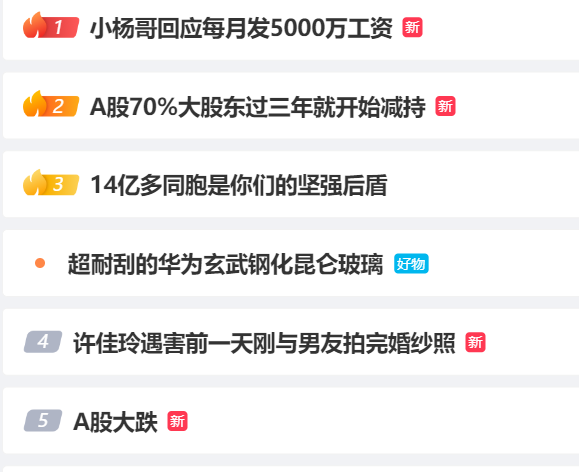
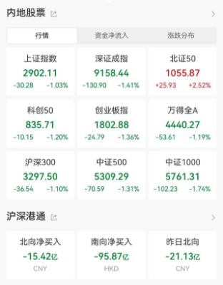
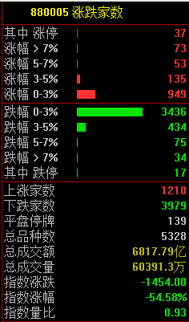
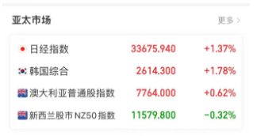
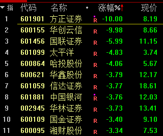
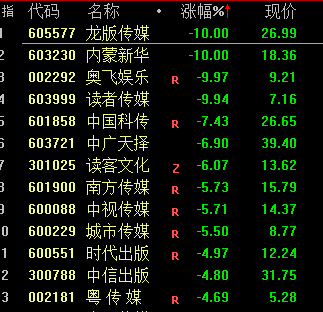
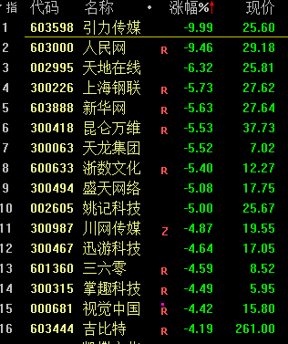
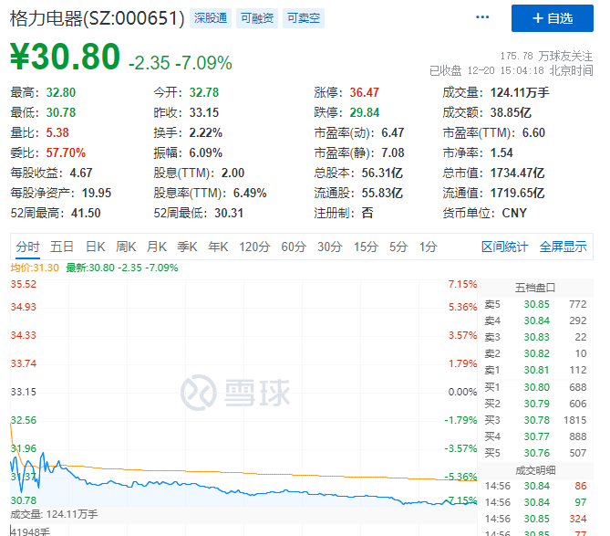

# A股打响2900点保卫战！券商、传媒股跳水领跌，格力电器放量大跌7%

中国基金报 泰勒

兄弟姐妹们啊，大家还撑得住吗？今天正式打响了2900点保卫战，“A股”更是冲上了微博热搜榜。

12月20日，A股三大指数开盘后持续跳水，尾盘均跌超1%，创年内新低，上证指数险守2900点整数关口！

截至收盘，沪指跌1.03%，深成指跌1.41%，创业板指跌1.36%，北证50指数逆市走强，涨超2%。

市场共1210只个股上涨，3979只个股下跌。

12月20日，亚太市场主要股市多数上涨，日经指数涨超1%，韩国综合指数涨近2%。

券商股集体下挫，方正证券、华创云信跌停。

传媒板块跳水领跌。

格力电器放量下跌7%，成交额近40亿元。昨日晚间，格力发布了一则受让子公司股份的公告。公告表示，本次交易完成后，格力电器将控制格力钛总股本72.47%的表决权，其中直接持有格力钛55.01%的股份，并通过表决权委托安排，拥有董明珠持有的格力钛约1.93亿股股份对应的表决权（占格力钛总股本的17.46%）。

**接下来是泰勒的股民“按摩”时间，为何最近A股持续下跌？泰勒看到一个公募的点评，说得很到位，分享给大家。**

相对于偏弱的的经济现实而言，市场所蕴含的悲观预期显然更甚，投资者到底在怕什么？

回顾历史，我们经常会发现有诸多在短期无法说服自己扭转预期的场景，也看不到当下立马生效的解决方案，因此每个人都容易在短周期认为当下趋势的延续是理所当然的。

2008年全球金融危机发生的时候，全球投资者认为类比于1929年大崩盘，会面临10多年的长期低迷；

2011年欧债危机的时候，投资者认为欧“猪”五国的困境无解，最终会导致欧盟的解体；

2018年贸易战的时候，投资者认为中国的出口会从此雪崩；

新冠蔓延的时候，专家说从此人类社会将与病毒长期共存，生活方式不再，结果是确实共存了，如同流感病毒一样，但马照跑，舞照跳；

前年新能源热火朝天之时，专家说现在不投新能源，如同20年前不投房地产一样，结果新能源现在已经是最不受待见的冷宫娘娘。

所以不要太相信眼前的所见所闻和所想，也不要太相信趋势背景下所谓专家对现状乐观或者悲观的放大解读，这些短周期的趋势终将被时间改变，常识仍将发挥作用。

好了，市场就分析到这里，泰勒还有事要忙，祝福大家，祝福A股。

