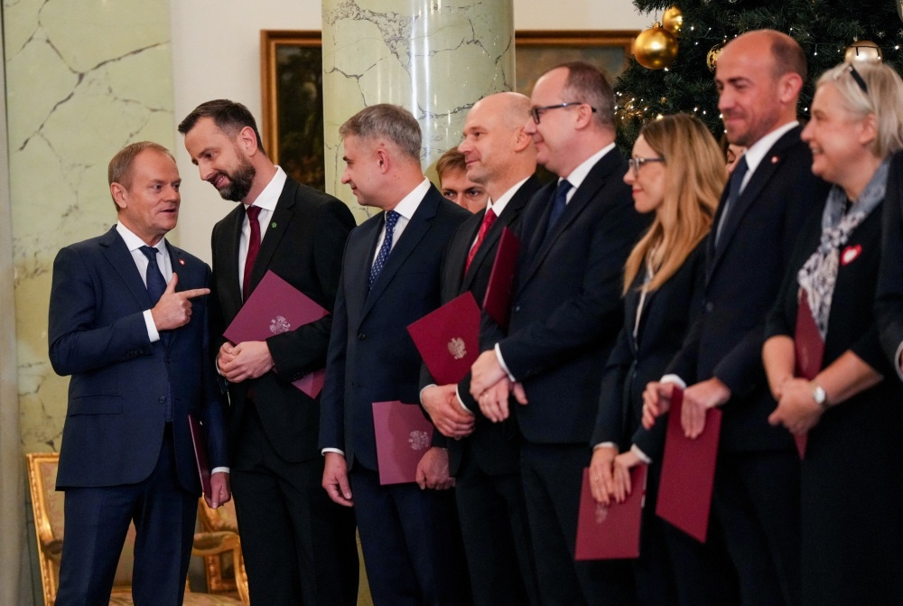
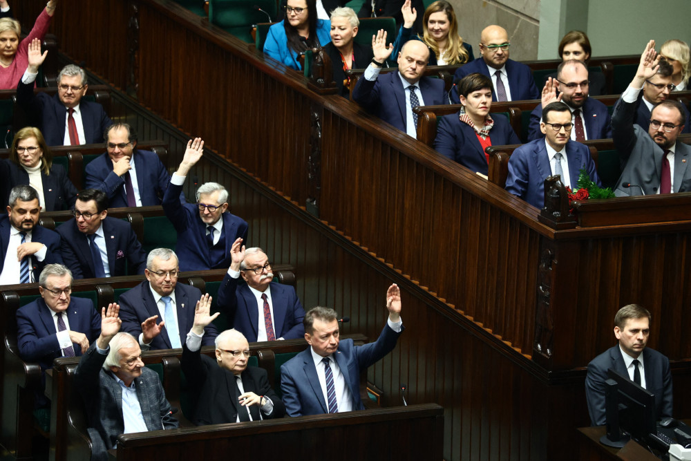

# “回归欧盟”背后，波兰新政府的桎梏与隐患

2023年10月15日波兰大选至今已有两个月之久，三个反对党联盟公民联盟、“第三条道路”和左翼联盟在选前和选后始终保持着团结，最终实现了政党轮替的目标。前欧洲理事会主席、前波兰总理唐纳德·图斯克（Donald
Tusk）如愿再度出任总理，法律与公正党长达八年的完全执政就此宣告终结。欧洲人民党党魁曼弗雷德·韦伯（Manfred
Weber）10月16日的感慨言简意赅地反映了许多人对此次波兰大选的感想：“波兰回来了。”这当然不是说法律与公正党有任何实质性的退出欧盟的打算或动作，而是因为波兰政府与欧盟在移民政策乃至司法制度等方面的冲突以及前者对匈牙利欧尔班政府的偏袒，已经使波兰成了欧盟中“可怕的孩子”。现在，这个孩子不再可怕了，图斯克无论作为欧盟政治家还是作为波兰政治家都拥有相当丰富的经验，但他与新政府的前程会一帆风顺吗？

_当地时间2023年12月11日，波兰华沙，波兰众议院以248票支持、201票反对的结果选举前总理、欧洲理事会前主席图斯克为新一届政府总理。_

**毁誉参半的执政过往**

请注意，我们说一个人，特别是一个政治家“经验丰富”并不意味着这个人在过去取得了全面成功，如果公民纲领党（图斯克所领导的公民联盟主导政党）真的在2007-2015年间取得了非凡的成就，法律与公正党显然不该在2015年取得大胜，并且执政到2023年。那么，上一任图斯克政府究竟表现如何？

“欧洲绿岛”是上一任图斯克政府最值得一提的功绩。在那场全球金融危机当中，波兰成为了欧盟中唯一一个没有经历经济衰退的国家，2007年到2015年每一年的GDP都在正增长，出口数据也翻了一番。除此以外，2012年欧洲足球锦标赛被确定在波兰和乌克兰举办也成为了图斯克政府大力推动基础设施建设的契机，高速公路里程由不足1000公里达到了接近2000公里，火车站、机场的现代化改造也在这一时期纷纷上马开工。总而言之，无论是从经济统计数据还是基础设施建设实效来看，上一任图斯克政府的表现都堪称可圈可点。

但这并非上一任图斯克政府的全貌，财政赤字和债务规模同样是应当注意的一部分，很遗憾，他们在这些方面表现不佳。2006年，波兰公共财政部门的赤字规模为222亿兹罗提，到了2014年，这一数字变成了397亿兹罗提，赤字扩张的脚步并未停下，反而有愈演愈烈的趋势——在这一时期政府拟定的2016年预算草案中，假设赤字规模将高达550亿兹罗提。公共财政部门的债务规模也表现出了类似的扩张趋势，且速度更为迅猛，从2006年的2640亿兹罗提急剧增加到2014年的8270亿兹罗提。不可否认，这一时期的波兰经济同时也在高速发展，然而即使看债务或者财政赤字占GDP的比重，答案依然是这一时期的债务和赤字规模在显著上升，因为GDP的增速并没有这么高。

作为一个经济自由主义者，图斯克没能实现减少经济领域的官僚主义、税收改革和降低失业率的竞选承诺。经济领域的官僚主义是个比较见仁见智的问题，但是失业率和税收不是——波兰的失业率在他执政初期降低到了10%以下，随后快速反弹到10%以上，到了图斯克辞职的2014年，失业率已达13%。税收更不必提，上一任图斯克政府不但没有降低税收或者如他所说的那样废除农业社会保险基金并代之以农民所得税，反而略微增加了增值税的税率。或许我们很难在全球性金融危机的大背景下指责图斯克未能实现降低失业率的承诺，我们也同样可以基于这一时期的图斯克政府是联合政府（由公民纲领党和波兰人民党联合执政）这一事实为图斯克在其他领域的裹足不前辩护几句，指出联合政府制约了他能做的事，但不要忘记，此次执政的也是联合政府。

**强大又脆弱的多数**

从三个政党联盟获得的席位数量和图斯克出任总理的信任票票数来看，本届波兰政府拥有的瑟姆（众议院）议席数量目前可以确定为248席。鉴于此前的法律与公正党政府长期依靠不足235席的多数执政（瑟姆总议席数为460席），248席理应属于比较安逸的多数席位，图斯克政府也不太需要担心联盟中个别只有个位数席位的小党“造反”导致政府危机。在波兰政界，小党“造反”是许多政府都需要警惕的事情，此前的法律与公正党就因“协议”党出身的副总理雅罗斯瓦夫·高文与政府意见不合，高文宣布率领“协议”党退出政府而面临过执政危机，最后是依靠“协议”党部分议员脱党支持政府与“库奇兹”运动党同意为政府提供信任供给才安然渡过险关。

就席位来看，公民纲领党主导的公民联盟有157席，组成“第三条道路”联盟的“波兰2050”党有33席，“波兰联盟”（波兰人民党主导）有32席，左翼联盟有26席，其又可以分为较为温和的拥有19席的“新左翼”党和更加激进的拥有7席的“左翼一起”党。选前曾有人对“左翼一起”对执政联盟可能造成的破坏表示过担忧，因为在当时的许多预估中，反对派联盟仅能获得235席左右的多数，这意味着“左翼一起”党很可能对政府能否获得信任有决定性影响。这样的担忧现在被证明是虚惊一场，无论是拥有7席的“左翼一起”党还是其他小党均难以对政府造成实质性伤害。不过，执政联盟中的“小党”不能成事，不代表其他较大的联盟伙伴不能造反。

波兰人民党和左翼联盟的关系是一个突出问题。10月17日，波兰人民党主席瓦迪斯瓦夫·科西尼亚克-卡梅什（Władysław Kosiniak-
Kamysz）在电台节目中称未来的联盟协议不能包括公民联盟和左翼联盟主张的12周内堕胎合法化议题，因为这是“意识形态问题”。公民联盟方面没有过多置评，但左翼联盟议员安娜-
玛丽亚·茹科沃斯卡（Anna-Maria Żukowska）对此很不满，她在X（即此前的Twitter）上与科西尼亚克-
卡梅什针锋相对，称：“农民事务或者任何你想纳入协议中的内容也都将基于同样的基础。”这场争论最终以左翼联盟的退让而告终，茹科沃斯卡在两天后承认联盟协议很可能不包括堕胎权议题，最终于11月出炉的联盟协议也证实了她的说法。作为回应，更加激进的“左翼一起”党以“绝对不令人满意”评价整份协议，并且决定仅仅对联合政府提供信任供给，而不加入政府。

这个话题告一段落了吗？暂时没有。即使在未来，堕胎议题也将是新政府不得不处理的一个难题。“第三条道路”主张对堕胎议题进行公投，这或许是因为他们内部对堕胎的意见也有分歧（考虑到“第三条道路”同时包括更加保守的波兰联盟和更加中间派、强调绿色政治的“波兰2050”党，该联盟的“大帐篷”特性相当强），公民联盟则在近一年多来强烈反对公投，议员阿格涅斯卡·波马斯卡（Agnieszka
Pomaska）直斥这是对女性的侮辱，伊莎贝拉·莱斯奇纳（Izabela
Leszczyna）更是指出这是“过去八年来反对派最愚蠢的想法”。鉴于莱斯奇纳已被确定为新政府的卫生部长，波兰人民党又始终没有放弃公投的想法，其党团主席克日什托夫·帕西克（Krzysztof
Paszyk）在11月15日还在强调“应询问波兰人民的意见，这比460名议员的意见强烈得多”，图斯克政府在未来势必要直面这一问题，但恐怕很难给出所有人都满意的答案。

_当地时间2023年12月13日，波兰华沙，波兰新一届政府在总统府宣誓就职。_

我们或许不能指望“第三条道路”，或者更准确地说，其中的“波兰联盟”做出过多让步，这与其特性有关。在波兰第三共和国三十多年的政治发展史里，波兰人民党是唯一一个从1991年到2023年每次瑟姆选举都能够顺利获得席位的政党，且其支持率始终相对稳定——除1993年之外，每次的支持率基本都在5%到9%之间徘徊。虽然在经济议题上有所转向，但该党始终坚持社会保守立场，在堕胎、学校的宗教教育等方面拒绝妥协。考虑到波兰人民党长久以来主要是在乡村地区同各类右翼政党争取选民，而乡村选民又大多持有社会保守立场，该党基于这一点而拒绝在社会议题与乡村议题上让步并不令人惊奇。

对波兰人民党来说，最好的前车之鉴大概是他们的前竞争对手波兰共和国自卫党，该党一度以左翼民粹主义、农业社会主义的立场与波兰人民党争夺选民（客观上，这也推动了波兰人民党在经济方面转向右翼），但其进步的社会观点，譬如说同性伴侣、堕胎和动物福利等议题很快被证明不受欢迎。在2001年和2005年两次表现突出（均超过了当时的波兰人民党）之后，该党因同右翼结盟以进入政府而面临不能自洽的困境，在2007年遭遇了灾难性失败，随后迅速变得默默无闻。泡沫化抑或被吞并的前景使得波兰人民党始终对任何可能损害自身独立性的行动保持警惕，因此他们不太可能和公民联盟中的其他小党一样完全赞成公民纲领党以及图斯克的议程。

值得庆幸的地方在于，波兰人民党抛弃图斯克、转头拥抱法律与公正党的情形大概不会出现，因为波兰人民党主导的“波兰联盟”有32席，法律与公正党领导的“联合右翼”有194席，除非他们能再找到几个愿意加入他们的议员，否则230席的门槛将成为他们的叹息之壁。但波兰人民党还有第三条路可走——如果政府执政成效不佳且存在纷争，他们完全可以退出政府，投下不信任票，以促成新的选举。一份12月初进行的民意调查显示，“波兰2050”党和波兰人民党组成的“第三条道路”获得了17.3%的支持，显著高于其在议会选举中的得票率14.4%，客观上也说明了虽然其选民的独特性——许多人反对法律与公正党，但也未必多喜欢公民纲领党和图斯克。

谈罢波兰人民党，来自左翼的反对同样值得警惕，前文提及的“左翼一起”党对联合政府的不满已可见一斑。既然波兰人民党持保守立场又不愿意过多妥协，那么左翼联盟就必然得做出许多妥协。当然，应该承认的是左翼联盟的许多主张确实被纳入了联合政府协议，譬如说性别平等、司法秩序、孕妇的免费产检、气候变化应对等等，但这些是左翼联盟的最高纲领，还是最低纲领？打开其他政党的竞选纲领，不难发现这些大多并非左翼联盟的独特主张。在包罗万象，试图解决无数问题，却又有着鲜明中右翼色彩的图斯克政府中，左翼联盟，尤其是选择加入政府而非提供信任供给的“新左翼”党如何向选民明确自身定位，仍是悬而未决的难题。

“左翼一起”党积极分子埃娃·波斯皮辛斯卡（Ewa Pospieszyńska）在英国激进左翼杂志《红辣椒》（Red
Pepper）上刊文指出了左翼联盟未来可能面临的尴尬处境：波兰的CPI自今年2月激增至18.4%以后正在逐步降低，但预计恢复到2%-3%的平稳状况还需要一段时间，这意味着波兰物价上升的趋势短时间内不会停止。既然左翼联盟是政府的一部分，那么他们显然很难在民众生活遇到困难的情况下吸引选民，以免选民倒向法律与公正党乃至极右翼的“联邦”。再者，法律与公正党的杜达总统拥有对法案的否决权，图斯克的联合政府并没有足够的席位推翻总统否决权，这意味着即使左翼联盟据理力争在瑟姆成功通过一些进步法案，很可能还是会被总统否决——而公民联盟或者“第三条道路”所提出的较为温和的法案则可能不会遭遇此类命运。这样一来，选民对左翼联盟难免会感到疑虑：你们对一切都无能为力，为什么要投给你们？

左翼联盟确实需要考虑这个问题。公民联盟内部也有一些主张绿色政治或者社会民主主义的政党，譬如说波兰绿党和“波兰倡议”党，选民不选择公民联盟而选择左翼联盟，大概率是因为他们认为左翼联盟的左翼替代方案更加清晰且左翼立场更加明确。如果左翼联盟不能证明他们的左翼立场是能够落于实处的，甚至让选民怀疑他们是在“骗票”，那左翼联盟的前景恐怕就很堪忧了。因此，左翼联盟如果想要在下一次大选中继续生存，他们就必须得向选民证明自己是独立的左翼政治力量，而不是公民联盟中的小党那般缺乏独立性的存在。要担忧的地方也在这里：如果左翼联盟认为他们不得不采取行动以证明这一点，那么这一行动很可能意味着图斯克新政府的终结。

**法律与公正党的阴影**

从选前到选后，法律与公正党尽了一切努力阻止反对派联盟执政，在选前，国有媒体想方设法诋毁不属于“联合右翼”的所有政党；在选后，法律与公正党又想方设法拉拢、分裂反对派，向波兰人民党和有极右翼色彩的“联邦”抛出橄榄枝，希望他们能够加入法律与公正党领导的新一届政府。这些努力都没能获得足够的成效，法律与公正党开始做出更大的让步，甚至表示可以成立一个“非政治化”的技术官僚政府，该政府不一定要由法律与公正党领导，法律与公正党党魁雅罗斯瓦夫·卡钦斯基（Jarosław
Kaczyński）在11月底的一次访谈中表达了这样的看法：“专家政府这一概念并非封闭的，不仅来自法律与公正党的总理可以领导这样一个政府，其他人也可以，也许这个人来自波兰人民党……”

_当地时间2023年12月11日，波兰华沙，由波兰总理莫拉维茨基领导的新政府未能通过众议院信任投票，这意味着新政府在就职14天后将解散。_

卡钦斯基如此表态的时间点非常微妙，那是法律与公正党总理马泰乌什·莫拉维茨基（Mateusz
Morawiecki）“新政府”刚刚上任的时间。因为法律与公正党并没有同其他任何政党达成协议，新政府必须在14天内面临信任投票，故该政府被认为是一个生存期最多只有14天的、用于拖延时间的政府。为什么在明显无望的情况下还要拖延时间？一个可能的答案是为了继续分化反对派，以便在14天后向波兰社会提供一个“不由法律与公正党领导的新政府”。这个新政府可能在形式上是非法律与公正党主导的，但又依赖法律与公正党的支持而存续，法律与公正党也可以由此避免被全面清算的命运——鉴于他们这八年来对波兰司法体系、国营媒体、国有企业和半官方机构无孔不入的渗透，全面清算势必意味着无数“自己人”会失去饭碗。

反对派还得面对现任波兰总统安杰伊·杜达（Andrzej
Duda）。公允地说，杜达并非法律与公正党的极端分子，在过去八年中，他时不时会以“调和者”的面目出现。譬如说在2017年7月波兰最高法院危机中，作为对公众抗议的回应，杜达宣布他将否决瑟姆提交的改革法案，为此甚至受到了时任法律与公正党总理贝娅塔·希德沃（Beata
Szydło）的批评。在2021年下半年围绕波兰广播电视法修改产生的一系列争议与抗议活动中，杜达也站在了反对派一边，否决了广播电视法修正案。上述事例证明杜达有可能会和反对派合作，但能合作的范围有多广呢？

杜达确实不是极端分子，但他在意识形态上基本保持了和法律与公正党的一致性。在11月接受右翼杂志《网络》（Sieci）采访时，他以近乎威胁的口吻表达了对未来图斯克新政府的警告：“我不止一次使用过总统否决权，我会毫不犹豫地再次这样做。”在对瑟姆的演讲中，他积极捍卫法律与公正党的“执政成就”，同时表示任何威胁这些“成果”的立法都将被否决。下次波兰大选在2025年5月，杜达的任期则至2025年8月6日届满，在一年多的时间里，图斯克的新政府每一个立法都必须再三斟酌，同时还要竭力解决波兰社会面临的种种困境，防止反对派联盟在2025年总统选举中失利。否则的话，头疼的时间就不止一年多了。

整个欧盟都对唐纳德·图斯克的“第二次降临”寄予厚望，在斯洛伐克大选结果令人失望之后，反对派联盟在波兰的胜利确实是一剂强心针。两个月过去了，反对派联盟看起来似乎仍然坚不可摧，但他们究竟能走多久？曾经的波兰人民党盟友，如今的法律与公正党同路人，“库奇兹”运动领袖帕维尔·库奇兹（Paweł
Kukiz）称他“很难相信这个奇怪的创造物能存活四年”，这当然是个恶毒的诅咒，但未必全然没有道理。无论在波兰历史还是在世界历史中，执政联盟因为各种各样能够和不能预料到的议题分崩离析的事件并不少见，更何况图斯克率领的大联盟由多达11个政党组成，另外还有一些独立人士。

但我们也不必过分悲观，因为反对派联盟仍然有一个基本的目标，那就是回归欧盟。波兰属于欧盟，波兰理应拥抱欧盟。这是他们共同的期许，也是将他们凝聚在一起的力量。

