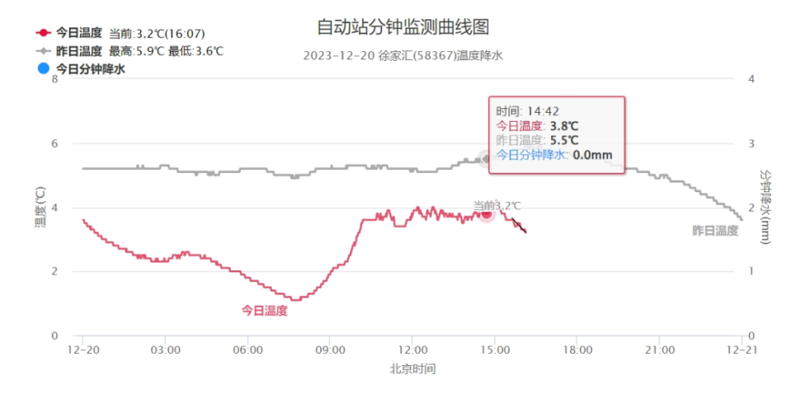
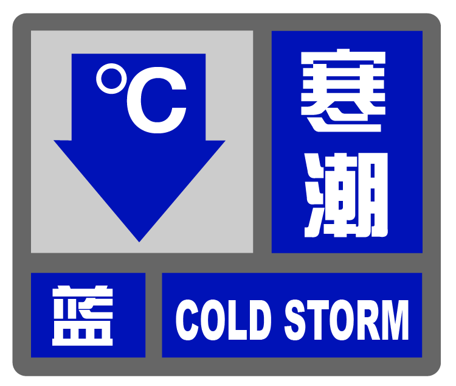
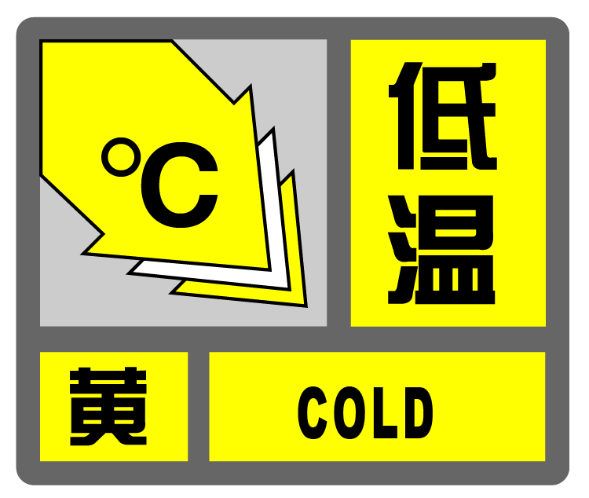
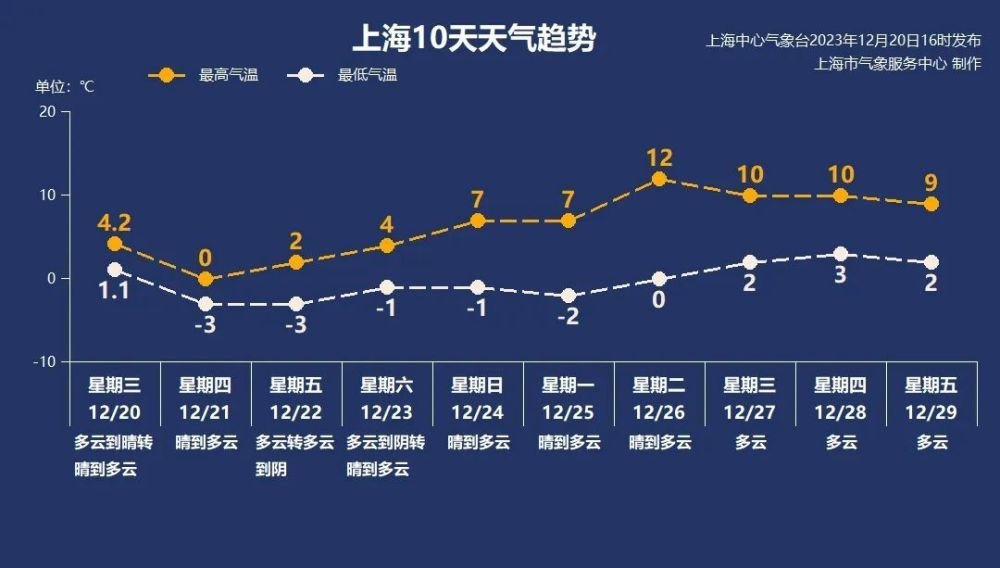

# 上海将出现连续5天最低气温不到-1℃，40年同期未现的持续低温要来了

上海明日（12月21日）全天气温都在“零下”。

根据上海气象部门目前的预报，上海徐家汇站将出现连续5天（21~25日）最低气温低于零下1℃的情况。统计数据显示，近40年来12月下旬徐家汇站没有出现过持续5天最低气温低于零下1℃的天气，比较类似的情况是1991年、1993年和1999年出现连续4天，此次的持续低温可谓“超长待机”了。

上海市气象服务中心称，今天（12月20日）早晨，北方较强冷空气开始影响上海，天空放晴。此次寒潮天气的降温幅度没有上次那么大，但由于基础气温已经很低，今天属于冷上加冷，全天气温在1.1℃~4.2℃（市区徐家汇站）。

**“一蓝一黄”预警高挂**

寒冷天气标配的寒潮+低温预警套餐已“上线”。今天（12月20日）17时，上海中心气象台发布低温黄色预警信号；寒潮蓝色预警信号维持。

明天（12月21日）早晨，上海市区最低气温将跌至零下3℃，有冰冻；郊区零下6℃到零下4℃，有冰冻或严重冰冻。全天气温都将在冰点以下，具体为：晴到多云，零下3℃到0℃，西北风5级阵风6~7级。空气湿度70%~40%。

气象部门提醒，明日全天气温在零下，防寒保暖一定做足；早晨冰冻或严重冰冻，及时清理积水，车辆注意检查防冻液；空气变得干燥，用电负荷变大，在家注意用火用电安全。

**未来天气趋势**

周五将进入二十四节气中的“冬至”，预计上海中心城区徐家汇站最低气温零下3℃，郊区更低；白天最高仅有2℃。

周六起，白天气温虽进入上升通道，但早晚依然在冰点以下。下周中回暖较明显，最高气温告别个位数。未来十天总体较晴冷，防寒保暖工作仍是重中之重。

气象部门提示，周后期空气逐渐变得干燥，大家注意补水。12月22日又逢冬至祭扫，大家一定要注意祭扫安全。

