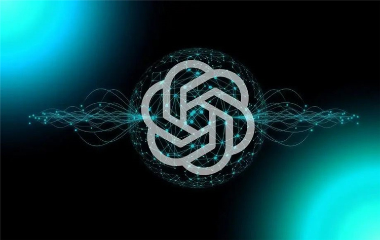
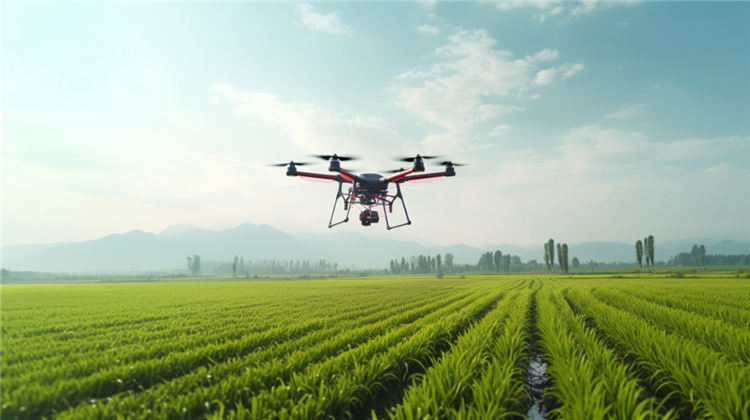

# 中国工程院评选2023全球十大工程成就，华为鸿蒙与ChatGPT入选

12月20日，中国工程院院刊《Engineering》发布了“2023全球十大工程成就”。其中华为鸿蒙操作系统、ChatGPT、中国空间站、百亿亿次超级计算机等工程成就入选。

可能有很多小伙伴会有疑问，为什么“2023全球十大工程成就”会包括2019年就发布的鸿蒙操作系统。实际上，据《Engineering》的介绍，本年度入围的“全球十大工程成就”，主要指过去五年由世界各国工程科技工作者合作或单独完成且实践验证有效的、并且已经产生全球影响的工程科技重大创新成果。

关于
**华为鸿蒙操作系统入选的理由，《Engineering》表示鸿蒙操作系统为人、设备、场景的互联互通提供了解决方案，代表了面向全场景智慧时代的技术创新**
。

而ChatGPT入选，则是因为 **ChatGPT是迄今为止通过自然语言交互获得人工智能赋能最成功的产品之一，** 为人类实现通用人工智能提供了一种范式。

此外，中国空间站、百亿亿次超级计算机、白鹤滩水电站、双小行星重定向测试、RTS,S/AS01疟疾疫苗、Spot &
Atlas机器人、锂离子动力电池、无人驾驶航空器也在榜单之上。

**中国空间站入选理由：** 中国空间站的建成和运行，将为人类太空探索和开发提供更加广阔的前景和机会。

**百亿亿次超级计算机入选理由：**
作为全球首个突破每秒百亿亿次性能的计算机，“FRONTIER”超级计算机开启了E级计算的新时代，将为解决目前世界上最严峻的科学挑战，如精确的气候预测、核聚变模拟、新材料和新药物研发等，提供更加有力的计算工具。

**白鹤滩水电站入选理由：**
白鹤滩水电站与三峡工程、葛洲坝工程、乌东德水电站、溪洛渡水电站、向家坝水电站，构成了中国长江上跨越1800千米的全球最大清洁能源走廊。

**双小行星重定向测试入选理由：** 这是人类首次开展的保护地球免受小行星撞击威胁的测试任务，成功展示了人类有目的地改变天体轨道运动的能力。

**RTS,S/AS01疟疾疫苗入选理由：** 该疟疾疫苗创新性地将恶性疟原虫环子孢子蛋白CSP的C-
末端序列与乙型肝炎病毒表面抗原融合、组装成病毒样颗粒结构的亚单位疫苗，极大提高了免疫原性。疟疾疫苗的研制成功是人类抗击疟疾史上的重要的里程碑事件。

**Spot & Atlas 机器人入选理由：**波士顿动力机器人代表了当今机器人研发的最先进水平，呈现出广阔的产业应用前景。

**锂离子动力电池入选理由：** 作为一种新型能源存储技术，锂离子动力电池已在电动汽车、电动轻型车、电动工具、航空航天等领域得到广泛应用。

**无人驾驶航空器入选理由：** 作为一种具备高度灵活性的运载工具，无人驾驶航空器在军事及民用等诸多领域表现出极具潜力的应用前景。

