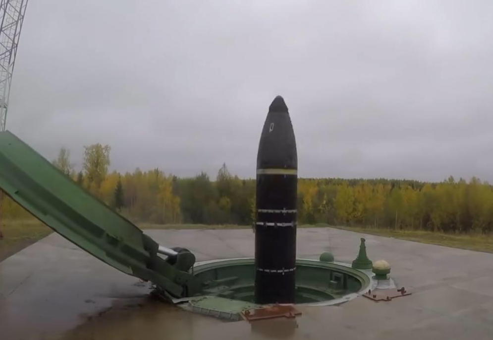
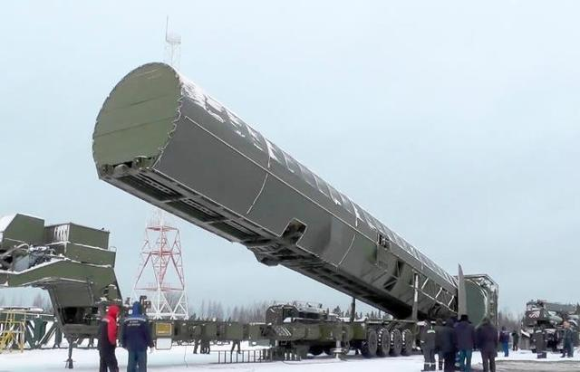

# 俄罗斯正研制新型机动式核导弹，强化陆基核战力

俄罗斯正在研制用于替代“亚尔斯”导弹系统的新一代机动式核导弹。

据《参考消息》17日援引俄媒报道称，俄罗斯战略火箭兵司令谢尔盖·卡拉卡耶夫在接受俄媒采访时说，俄正在研制用于取代“亚尔斯”陆基战略导弹系统的新型机动式战略导弹系统。

卡拉卡耶夫还表示，俄罗斯计划在2024年试射7枚洲际弹道导弹。试射时至少提前24小时通知美国，华盛顿也会如此。

_“亚尔斯”导弹最多可携带3个弹头，一次可攻击多个目标。_

**整体性能进一步提升**

报道称，卡拉卡耶夫指出：“（新型机动式战略导弹系统）正在研制中。此外，还在进行有关该机动式导弹系统装备外形论证和制造路径的科研和试验设计工作。该系统未来可取代‘亚尔斯’导弹系统。”他还表示，关于导弹武器完善路径的论证研究一直不曾中断，这有助于军方及时就启动新系统建造和完善现有系统作出决定。

现役的“亚尔斯”机动式洲际导弹系统是俄战略火箭兵的核心装备之一，在2007年5月首次发射成功，2010年开始服役，射程可达1.1万千米，采用分导式核弹头。据相关分析，“亚尔斯”最多可携带3个弹头，一次可攻击多个目标。

“亚尔斯”导弹有两种发射方式，一种是采用发射井的固定部署方式，由厚重的钢筋混凝土掩体保护，很难被摧毁；另外一种是公路机动式“亚尔斯”导弹，导弹发射车采用高机动特种车，依托公路进行广泛的机动，具有很强的生存能力。

今年8月，卡拉卡耶夫称，俄战略火箭军今年将完成换装“亚尔斯”机动导弹发射车系统。去年年底，俄国防部长绍伊古在国防部年底总结会议上表示，2023年的优先任务包括让俄战略导弹部队的22个“亚尔斯”“先锋”和“萨尔马特”洲际弹道导弹系统投入战斗值班。

_采用固定部署的井基“亚尔斯”导弹。_

根据美国原子能科学家公报2022年发布的报告，截至2022年初，俄罗斯拥有约4477枚实战部署核弹头，陆基洲际导弹的部署数量为306枚，其中“亚尔斯”洲际导弹部署了173枚，包括153枚公路机动式“亚尔斯”和20枚固定部署的井基“亚尔斯”导弹。

导弹专家李文盛向澎湃新闻（www.thepaper.cn）介绍说，“亚尔斯”是“白杨”-M导弹的改进型，是一个过渡的产品，研制“亚尔斯”导弹更多是为了解决俄罗斯独立生产公路机动式洲际导弹的问题，因为过去固体洲际导弹产业背后有多个独联体国家工业部门的支撑，但因为苏联解体，配套体系分散在多个国家，比如固体发动机、制导组件等，容易受到限制。

“随着‘亚尔斯’导弹列装工作的基本完成，面对新的威胁形势和换装需求，加上需要维持洲际导弹工业体系的运转，俄罗斯研制‘亚尔斯’导弹的换代产品也是意料之中的事情。”李文盛表示。

对于俄罗斯新一代机动式洲际导弹技术性能，李文胜分析认为会在以下几个技术方面增强作战能力：一是进一步提高导弹的突防能力，采用新型速燃发动机、新型突防诱饵和高超声速弹头，降低被美国反导系统拦截的概率；二是进一步提升快速反应能力，继续采用优化过的无依托发射技术、长期可储存技术，并且解决影响战备程度的数据保障、战场通信等方面的问题。

卡拉卡耶夫向媒体透露，俄战略火箭兵的机动战略导弹系统计划装备高超声速弹头。据报道，俄战略火箭兵目前只有固定部署的“先锋”装备了这种弹头，第一个“先锋”高超声速导弹团于2019年投入值班。

_俄罗斯试射“亚尔斯”导弹，该导弹在近几年的俄战略演习中频繁亮相。_

**将与“萨尔马特”并肩作战**

研制新一代机动式核导弹意味着俄未来陆基核力量将延续公路机动式核导弹+固定式井基核导弹的装备模式。“在俄罗斯陆基核力量中，机动式核导弹承担着‘二次核反击’的重要任务，这是俄罗斯地理情况和技术基础决定的，”李文盛介绍说，“一方面俄罗斯国土广袤，适合部署机动式核导弹，另一方面，俄罗斯在机动式核导弹领域拥有深厚的技术积累。”

按照目前俄罗斯陆基核力量的发展，新一代机动式核导弹将和固定部署的井基“萨尔马特”洲际导弹一道，成为俄陆基核力量的中坚。

据《参考消息》11月21日报道，在法国成功试射M51洲际弹道导弹的背景下，俄罗斯媒体报道称，全世界最强大的俄罗斯“萨尔马特”导弹正在为飞行-
设计试验作准备，其中包括发射导弹飞越南极。俄国防部的消息人士透露，战略火箭兵首个配备“萨尔马特”的导弹团将于今年12月投入战斗值班。

这个团隶属于战略火箭兵乌茹尔导弹兵团（驻地在克拉斯诺亚尔斯克边疆区）。根据战略火箭兵的现行惯例，导弹团的指挥所和两座发射井首先投入战斗值班，然后再把发射井增加到标准数量。

军事专家、退役上校谢尔盖·奥韦尔琴科夫认为：“俄罗斯似乎将向距离1.5万千米的南太平洋靶场试射‘萨尔马特’导弹。不管从军事技术角度还是外交角度来看，我们都需要这次试射。首先，俄罗斯将向全世界展示其最强大的新型洲际弹道导弹的战略威力。其次，在乌克兰冲突引发俄罗斯与西方全球对抗的背景下，这将是俄罗斯的一次实力展示。”

_“萨尔马特”是俄罗斯研制的最新型重型洲际弹道导弹，该型导弹在2017年12月进行了首次试射。_

“萨尔马特”是俄罗斯研制的最新型重型洲际弹道导弹，该型导弹在2017年12月进行了首次试射，射程可能超过1.8万千米，可携带至少10个分导式核弹头。

卡拉卡耶夫此前向外界表示，“萨尔马特”服役后将彻底取代R-36M洲际导弹（北约代号SS-18，名称为“撒旦”），该导弹拥有突破目前及未来全球所有反导系统的能力。它不仅可沿最佳弹道让弹头抵达目标，而且能从不同方向进行打击，这迫使敌方必须四面进行导弹防御。

“萨尔马特”导弹研发单位马克耶夫设计局总设计师、俄罗斯科学院院士弗拉基米尔·杰格佳里在去年11月表示，“萨尔马特”将在未来40至50年里“加强俄武装力量的战斗力，确保俄罗斯的安全不受外部威胁”。他认为，“在当今地缘政治条件下，这是我们的坚固盾牌、主要核威慑手段和维护和平的保证。”

分析人士认为，俄乌冲突爆发后，俄罗斯与西方的关系降至冰点，仅凭常规军事力量已经难以确保自身的战略安全，核力量是俄罗斯为数不多可与西方国家抗衡的重要工具，也是俄维护大国地位的可靠保障，因此，未来俄罗斯可能会更加非常重视核力量的发展。

值得一提的是，据新华社12月12日报道，俄罗斯总统普京12月11日在俄北方机械制造厂表示，俄罗斯将继续加强海上力量建设，持续为海军配备最先进的武器装备并增加量产。位于阿尔汉格尔斯克州北德文斯克市的北方机械制造厂当天为“亚历山大三世”号核潜艇和“克拉斯诺亚尔斯克”号核潜艇举行升旗仪式，普京参加仪式并宣布这两艘核潜艇开始在俄海军服役。

据悉，“亚历山大三世”号是“北风之神-A”级战略核潜艇系列的第三艘，“克拉斯诺亚尔斯克”号是“亚森-M”级多用途核潜艇系列的第二艘，二者均属于第四代核潜艇，其中“北风之神-A”级可携带16枚能搭载核弹头的“布拉瓦”潜射弹道导弹，射程超过9000千米。

俄罗斯计划建造7艘“北风之神-A”级潜艇，计划在2027年全部交付部队，加上已经列装的3艘“北风之神”级，俄罗斯将拥有10艘“北风之神”系列潜艇，海基核力量的战略威慑力将大幅提高。

