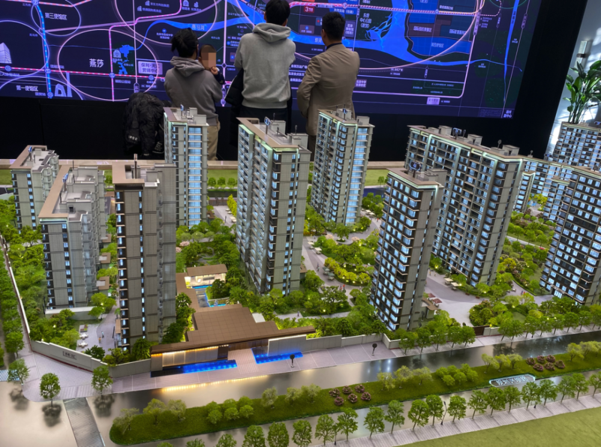
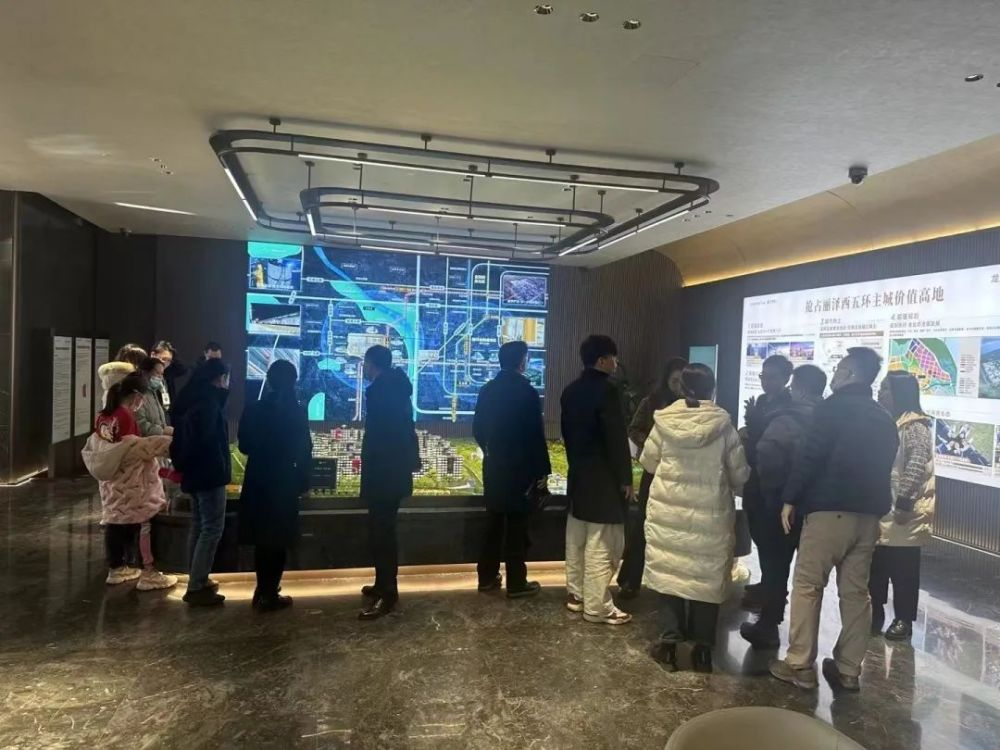
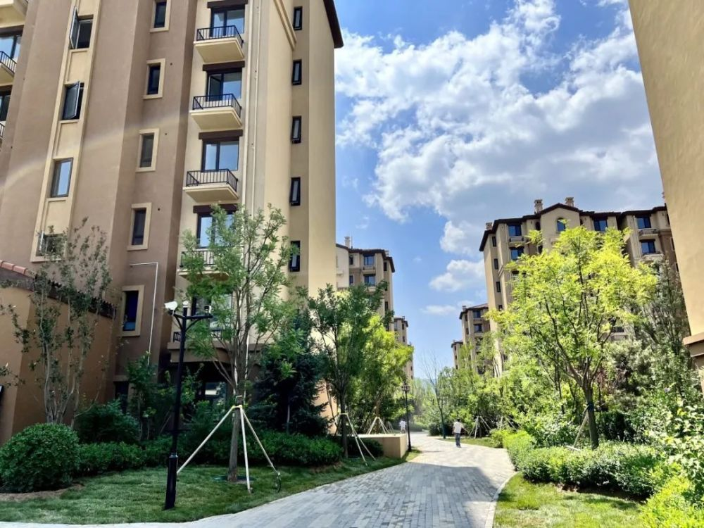

# 北京楼市新政一周：有人两天卖20多套房，年底“翘尾”行情能否延续？

此次新政的核心是“降门槛”，但也“提杠杆”。

_本期策划系腾讯房产与北京商报联合推出_

记者丨王寅浩

这个冬天，北京遭遇了罕见寒流，但身处冰封市场的楼市，却迎来了自己的暖流——一轮意外之喜的调控突然落下。

说这一轮调控是意外之喜，一是时间早，按照行业此前的普遍预期，这轮调控落下是肯定的，但大概率要在元旦前后。或许监管层看到了市场对预调的需求，让政策的及时雪来得更早，给了企业年终冲刺的抓手，给了购房者更多的决策周期。二是措施全。从降首付、降利率、增贷款年限，到呼吁了许久的普宅标准，哪一条单独出台都是重量级的，但监管没有遮掩，一次性在新年前、寒冬里送给了市场一份大礼包。以至于调控落地的当晚，有知名房企的营销总反复打电话给认识的记者，“希望确认这是真的”。

调控优化落地到底给市场带来了什么？购房者想问，市场的低点到了吗？换房者想知道，我挂出去的房子什么时候什么价钱能卖掉？营销总想知道，哪些项目、什么样的产品卖得好？从业者们更关心的是，这轮翘尾行情能否给明年带来期待中的“小阳春”？带着这些问题，腾讯房产与北京商报联合推出年终策划系列——《暖春将至》，一探调控优化落地后的北京楼市。

随着年底的临近，北京楼市也进入了冲刺阶段。在这个关键时期，北京出台楼市新政，为市场注入了新的活力。近日，北京调整优化住房政策，涉及降低首付款比例、延长贷款年限、下调房贷利率、优化普宅标准等，力度之大，超出市场预期。

北京商报记者于近期走访北京在售楼盘发现，寒冷天气未能阻挡购房者的热情，售楼处“人声鼎沸”再次回归，各大在售项目的到访及成交颇为喜人，有人两天卖了20多套，全员取消年底休假更是常态。受新政影响，北京新房市场年末“翘尾”成为众多一线营销人员的一致判断。

**销售周末全部取消休假**

随着新政策的出台，售楼处再次变得热闹起来。人们纷纷涌向售楼处，想要了解新政策的具体内容和购房的优惠政策。售楼处的销售人员也忙碌起来，为前来咨询的客户解答各种问题。

“自‘认房不认贷’热度消退后，这样的忙碌在近两个月的北京楼市中不多见。”某央企在京项目营销负责人李卓告诉北京商报记者，与“认房不认贷”客户连夜进场不同，受寒冷天气影响，此次热度在政策首个周末集体释放。“前后对比来看，新政落地后的首个周末相比之前周末的话，成交量提升近两倍，两天卖了二十多套。”

李卓称，新政在首付和利率两大端口进一步降低了购房者的入场压力，之前存在犹豫的部分购房者开始选择入市。受新政影响，购房者的包容度也变高了，例如对楼层位置、边户还是中间户、窗外可视景观等等此类的接受度也有所提高。

记者于近期走访北京在售楼盘，在位于朝阳东坝的保利天汇项目售楼处，也得到了类似的答案——周末一天大概成交十多套。因为人太多，销售人员忙不过来，记者到访后，只能先跟着“旁听”，将近二十分钟，才有空闲的销售人员前来讲解。

据保利某售楼处销售人员李向东介绍，仅他个人一上午就带看了八组客户，十几个销售在这个周末全部取消休假，周末一天大概成交十余套，周日估计也是这个体量。

政策出台的首个周末，位于丰台的龙湖建工·九里熙宸项目累计到访近150组，环比上升逾100%。九里熙宸项目销售人员齐鹏告诉记者，本次政策利好力度大、反馈速度快、覆盖范围广，无论是77㎡两居的刚需客户，还是120㎡洋房大户型的改善客户，都可以享受到首付下降、利率下调的红利，周末两天项目累计成交了12套。

寒潮来袭，未能阻挡购房者的热情。在售楼处内，人们纷纷询问着各种问题，如房屋的价格、户型、地理位置等。销售人员则耐心地解答着每一个问题，并详细介绍了新政策的具体内容和购房的优惠政策。一些购房者还现场签订了购房合同，表达了对新政策的认可。

**“降门槛”但也“提杠杆”**

住房政策优化为市场注入新的活力，北京楼市热度明显提升，各大在售项目成交数据的背后，可以看到新政所带来的拉动与“变化”。

在房地产市场中，项目到访量与成交量之间的关系一直备受关注。然而，记者在走访中了解到，新政落地后，这两个指标之间并不是成正比关系。部分项目即使到访量很高，也不一定能够转化为实际的成交量。

对此，某TOP20房企的北京营销负责人赵宇告诉记者，此次新政的核心是“降门槛”，但也“提杠杆”。通过降低贷款利率，降低首付款比例，延长贷款年限，让购房者上车门槛变低。但首付降低了，意味着贷款比例更高。对于加杠杆这件事，大家现在还是特别谨慎。

可以看到，新政落地后，市场环境发生了变化。但购房者的购房决策也受到多种因素的影响，除了楼盘的品质、价格等因素外，购房者的经济状况、购房需求、购房预算等因素也会对购房决策产生影响。

另有市场观点认为，此次政策的拉动效果是渐进式的，“认房不认贷”释放的是资格问题，有“等待”的存量需求入场，而新政更多还是在存量需求里面去调动。

另外一个“变化”，在于刚需客群释放优于改善客群。按照市场研判，对于首次置业的买家来说，新政落地的影响相对有限，此次新政更利好改善客群。记者也在新政落地当晚，采访到一位有首次置业需求的购房者，其表示，新政并不会影响到他的购房决策，首付款比例下调，买房月供也会变动，买房计划并不会因此而提前。

针对上述情况，赵宇直言，改善客群决策周期要更长，刚需客群决策周期会短一些。此外，北京目前可供选择的项目也较为充足，改善需求会在接下来的一段时间持续释放。

**“翘尾”行情能否延续？**

虽然购房者层面仍保持谨慎，但受新政影响，北京新房市场年末“翘尾”成为众多一线营销人员的一致判断。

那么这波年末“翘尾”行情是否会延续到2024年的“小阳春”？

对于2024年“小阳春”的到来，李卓等营销负责人也表示肯定。

李卓称，根据市场周期性变化，传统“小阳春”受季节因素影响，在经历了漫长的寒冬之后，积压需求会随着春天的到来集中释放。而且每年初购房者的置业信心会比较强，因此，2024年传统的“小阳春”还会出现。

除周期因素外，新政利好起到至关重要的作用。在李卓看来，此次北京的普宅标准调整，二手房置换打开了窗口。随着政策的落地，二手房市场迎来了新的机遇。

根据政策要求，北京对普宅的建筑面积、价格标准进行了上调。调整后，住宅小区建筑容积率在1.0（含）以上，单套建筑面积在144平方米（含）以下，5环内成交价格在85000元/平方米（含）以下、5-6环成交价格在65000元/平方米（含）以下、6环外成交价格在45000元/平方米（含）以下的住房视为普宅。

普通住宅与非普通住宅的界定，对于购房者来说意义重大，此前的被“豪宅”化，买房置换需要更充足的“底气”。此次调整后，据机构测算，北京全市普宅占比将从约三成提高到约七成。“二手房交易活跃，新房市场‘小阳春’可期。”李卓如是说道。

编辑丨杨博

图片丨北京商报

