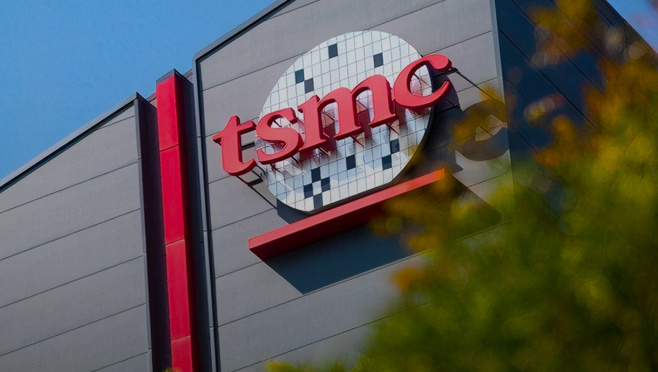

# 台积电董事长刘德音2024年退休，CEO魏哲家或接替

**划重点：**

  * _1_ 台积电董事长刘德音2024年退休，董事会已推荐现任首席执行官兼副董事长魏哲家接替，但仍需经股东批准。
  * _2_ 台积电目前生产3纳米芯片，并计划2025年开始量产2纳米芯片。它正在德国、日本和美国亚利桑那州建设新工厂，其中日本工厂计划明年开始运营，美国工厂遇到了劳动力短缺等挑战。

12月19日，全球最大芯片代工厂台积电表示，台积电董事长刘德音2024年退休，董事会已推荐现任首席执行官兼副董事长魏哲家接替，但仍需经股东批准。

刘德音1993年加入台积电。台积电创始人张忠谋退休后，2018年刘德音成为台积电董事长。魏哲家拥有耶鲁大学电气工程博士学位，1998年加入台积电，自2017年以来一直是台积电董事会成员。

台积电表示，“董事长刘德音博士已决定不再寻求下一届台积电董事会成员提名，并将在2024年年度股东大会后退休。”根据台积电的一份声明，刘德音表示，希望把他“几十年的半导体经验用于其他用途，花更多的时间和家人在一起，开始人生下一个篇章”，“我相信台积电在未来几年将继续表现出色。”

台积电被视为整个科技行业的晴雨表，它是苹果和英伟达等公司的主要供应商，通常基于芯片设计公司Arm的架构。今年9月，随着Arm上市，台积电批准向这家英国公司投资高达1亿美元。据CNBC报道，台积电目前生产3纳米芯片，并计划2025年开始量产2纳米芯片。

另据路透社报道，今年台积电股价飙升30%，公司估值4833亿美元，这在一定程度上得益于人工智能应用的繁荣。台积电多次表示，该行业的大趋势将继续推动业务增长，这也是5G网络和数据中心对高性能计算芯片的需求所带来的。

虽然台积电表示其大部分制造业务将继续留在中国台湾，但2020年台积电开启了积极的海外扩张计划，它正在德国、日本和美国亚利桑那州建设新工厂，满足全球芯片需求。不过据《日经亚洲》报道，张忠谋曾不止一次表示全球化已经死亡，并认为在美国制造芯片的成本过高。

《日经亚洲》报道称，台积电正在美国亚利桑那州建设一家尖端芯片工厂，并在日本建设一家不太先进的工厂。日本工厂是台积电在日本的第一家芯片工厂，其进展速度比美国项目要快，计划于明年开始运营。美国工厂是最先宣布的，但遇到了劳动力短缺等挑战，计划投产时间推迟到2025年。

