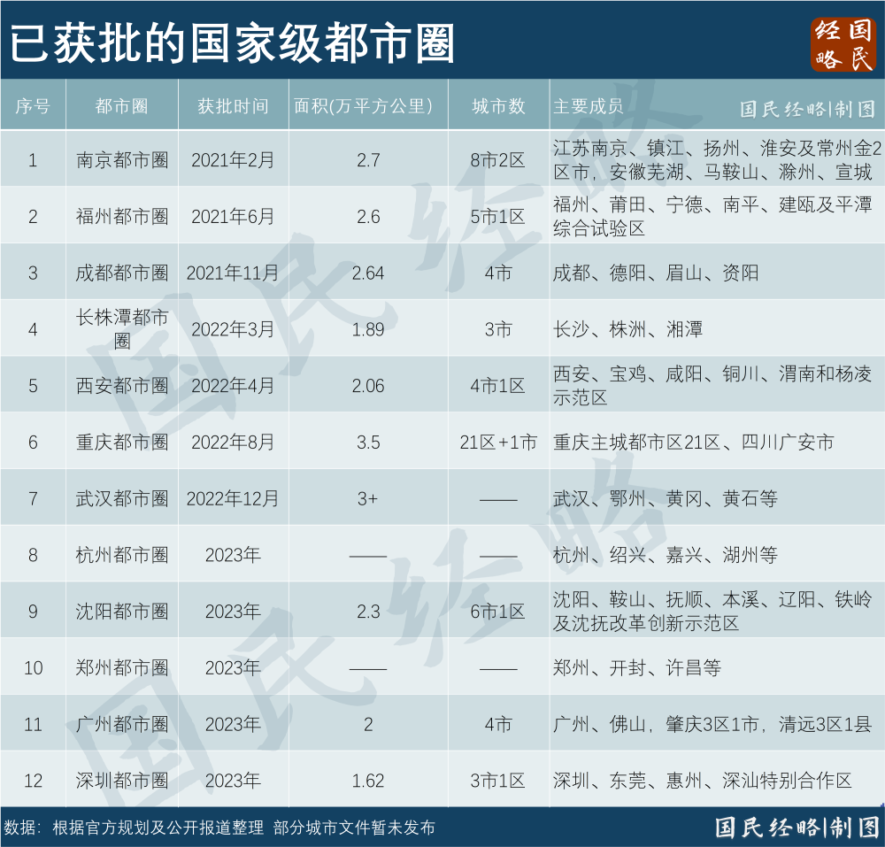
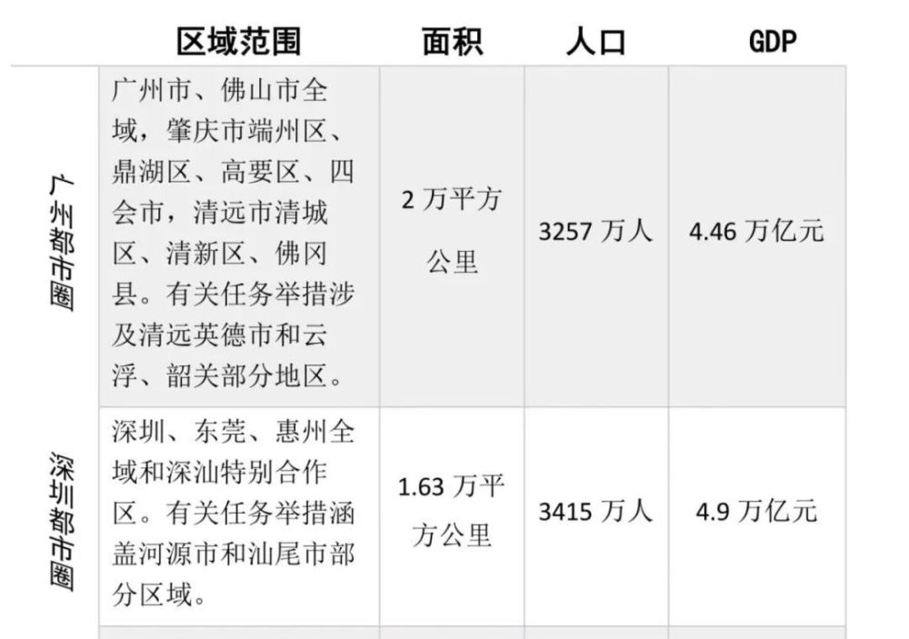
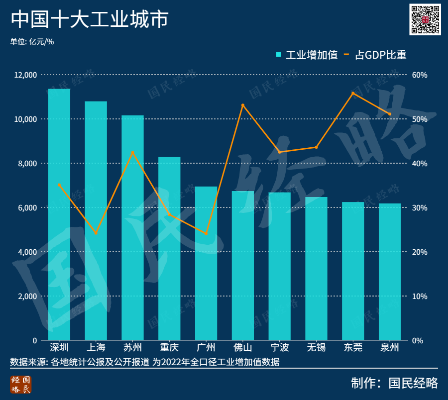
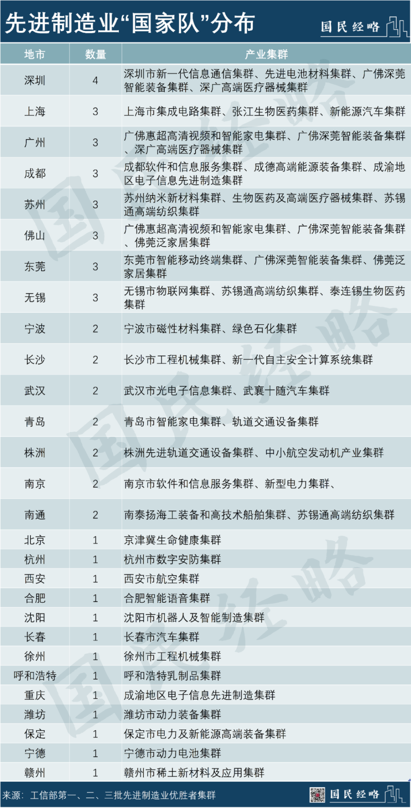
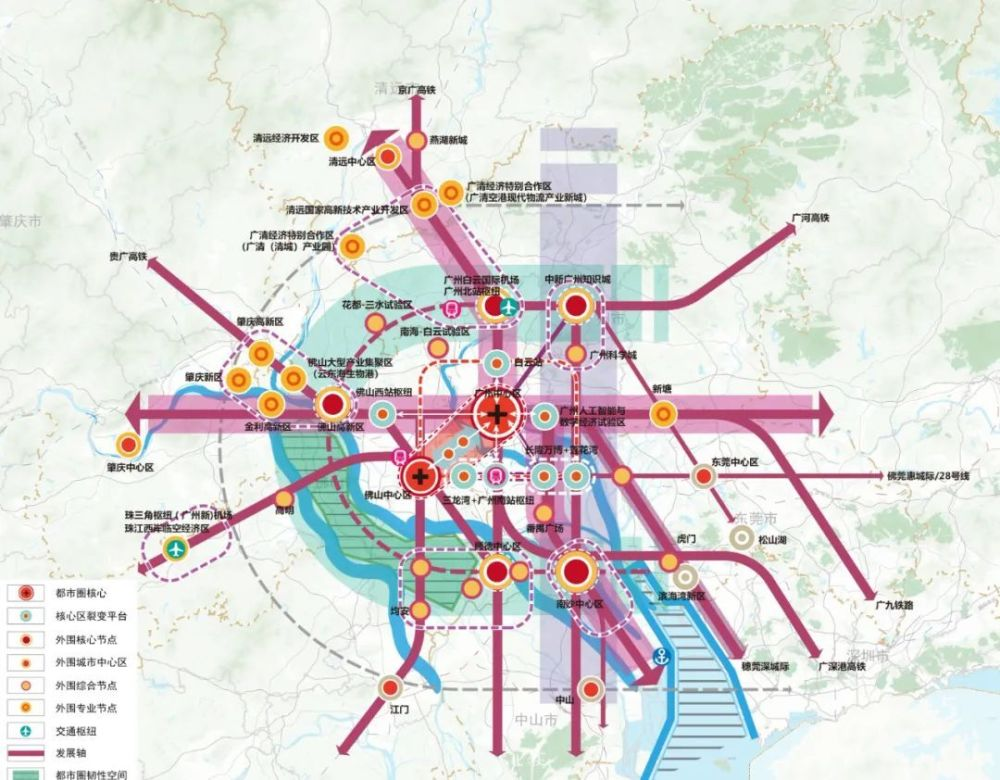
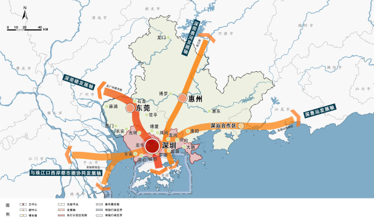
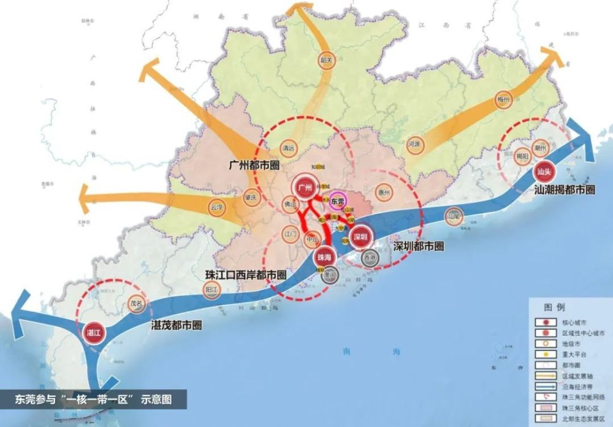
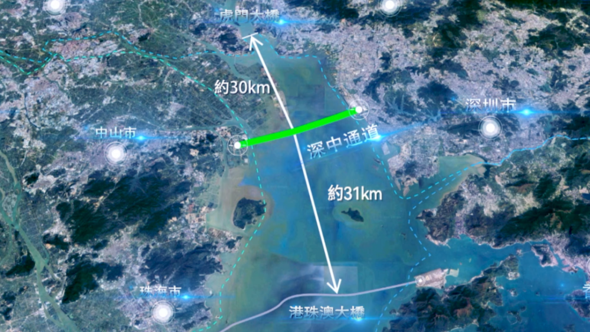

# 广州、深圳都市圈发展规划官宣，5万亿国家级都市圈终于来了

**文|凯风**

国家级都市圈，再次扩容。

日前，广东省印发 **广州、深圳都市圈发展规划** 。规划由两地会同省发展改革委牵头编制，经国家发展改革委衔接函复。

这意味着，一线城市终于有了国家级都市圈，广州、深圳成为全国第11个、12个国家级都市圈。

虽然规划姗姗来迟，但广州都市圈、深圳都市圈都是 **5万亿级量级** ，在已获批的所有国家级都市圈中霸榜前二。

5万亿都市圈，意味着什么？

**01**

都市圈、城市群，是新一轮城镇化的主要载体。

目前，我国共有19个城市群、数十个都市圈，但不是每一个城市群、都市圈都能位列“国家级”。

是否晋级国家级，看的不是圈子大小或经济强弱，而是相关规划是否获得国家层面批复。

以此为准，目前，我国只有 **12个严格意义上的国家级都市圈。**

这些国家级都市圈包括此前获批的南京、福州、成都、长株潭、西安、重庆、武汉、杭州、沈阳、郑州，以及此番落地的广州、深圳。

为何众多二线城市都市圈率先落地，一线城市却姗姗来迟？ **京沪为何仍然没有获批？**

其实，国家级都市圈，并非以经济实力论高下，更不是以批复先后论高低，其中不乏政策扶持乃至均衡发展的考虑。

一线城市经济实力更强，辐射范围更广，都市圈的划分牵一发而动全身，不会仓促落地。

无论是上海大都市圈，还是广州都市圈、深圳都市圈，核心圈层都已相当成熟，如广佛、深莞惠、沪苏等等。

但在核心圈层之外， **一些邻近地区是否纳入其中，则存在一定争议** 。比如清远、韶关之于广州，河源之于深圳，湖州等地之于上海等等。

如今，广州、深圳都市圈规划横空出世，意味着一线城市都市圈终于取得实质性突破，北京、上海都市圈也不远了。

**02**

广深两大都市圈，到底有多强？

无论广州都市圈还是深圳都市圈，面积都不大，都在2万平方公里之内，人口规模在3000万人以上，但经济总量双双逼近5万亿。

根据最新规划， **广州都市圈2022年GDP总量达到4.46万亿** ，人均GDP13.4万元；

而 **深圳都市圈达到4.9万亿** ，人均GDP更是高达14.3万元，在全国都是首屈一指。

今年以来，随着全力拼经济成为主流，广东经济迎来全面反弹。深圳都市圈将率先突破5万亿，广州都市圈离5万亿只有一步之遥。

不仅经济体量庞大， **广深两大都市圈还是全国最成熟的都市圈。**

根据清华大学中国新型城镇研究院发布的报告，全国共有34个都市圈，只有6个属于成熟型，广州都市圈、深圳都市圈分别位列第一和第四。

都市圈成熟与否，看的是一体化乃至同城化的程度，广佛、深莞在全国都是首屈一指。

在 **广州、深圳两大都市圈，地理边界几近消失** ，城市之间几乎连成一体，就连都市圈之间，也不再有明显的界限。

无论是从广州到佛山，还是从深圳从东莞，都丝毫感受不到行政边界的存在感，不仅跨市的地铁、城轨等轨道交通纵横交错，跨城通勤更是成为常态。

根据报告，2022年大湾区内地九市日均出行量542万人次，其中广佛两市间出行量171万人次，深莞也接近百万人次，远高于沪苏等长三角地区。

要知道，这还是疫情波动之下的数据，今年以来，广州、深圳接连霸榜全国人口流入城市榜首之位，几地的跨城通勤量有望再次迈上新的台阶。

**03**

超级都市圈，产业有多强？

广州、深圳都市圈的同城化，不只是体现在交通互联上，就连产业也形成了协同发展的态势。

作为经济第一大省，广东是我国工业最发达的区域，而广州、深圳都市圈又是先进制造业的高地。

一个表现是， **全国十大工业城市，珠三角占了近半壁江山** ，都属于两大都市圈的范畴。

以工业增加值来看，深圳超过上海跃居全国工业第一大市，而广州、佛山、东莞分别位列第5、第6和第9。

另一个表现是， **先进制造业集群“国家队”最密集的区域，都在两大都市圈之内。**

根据工信部先后发布的45个先进制造业集群优胜者名单，广东共有7个集群入围。

这些集群包括广佛惠超高清视频和智能家电集群，东莞智能移动终端集群，广深佛莞智能装备集群，深圳先进电池材料集群，深广高端医疗器械集群，佛莞泛家居集群。

这些先进产业集群，都已达到万亿级，且多数横跨两个乃至更多地市，产业协同效应可见一斑。

目前，广佛正在共同打造先进装备制造、汽车、新一代信息技术、生物医药与健康等四个万亿级产业集群，深莞也在联手共建全国最大的电子信息产业集群。

这正是都市圈之为都市圈的最大意义所在。

**04**

广州、深圳都市圈，为何都 **“瘦身”** 了？

在最初的十四五规划中，广州都市圈、深圳都市圈都超出珠三角的界限，将粤东西北的多个地市纳入其中。

然而，在最新的规划中，广州都市圈仅包括广州、佛山全域，以及肇庆、清远的都市区，面积不到2万平方公里。

同样，深圳都市圈则回到了深圳、东莞、惠州以及深汕特别合作区的传统范畴，面积更是缩小到1.67万平方公里。

与最初的规划相比，原本被纳入广州都市圈的 **韶关、云浮等地被排除在外** ，一开始被纳入深圳都市圈的 **汕尾、河源等地也不在其列。**

为何会出现这样的现象？

事实上，这不是首次出现，武汉都市圈从最初的“1+8”缩减到武鄂黄黄四城，郑州都市圈也不再将洛阳囊括在内。

早在去年9月，国家发改委对此已有定调：

我国都市圈发展还处在初级阶段，各地要尊重客观规律，不能跨越发展阶段，在不具备条件的情况下推动都市圈建设……要依据人口经济联系科学合理确定都市圈空间范围，
**防止盲目扩张** 。

所谓都市圈，一般指的是城市群内部以超大特大城市或辐射带动功能强的大城市为中心、以1小时通勤圈为基本范围的城镇化空间形态。

**1小时通勤圈，基本界定了都市圈的合理范围，** 大概50-100公里的半径，而地域面积一般都在2万平方公里左右。

毕竟，将几百公里之外的县市，都划到强中心的都市圈，只有形式意义；将整个省都划成一个都市圈，也顶多只是概念的狂欢，并无多少实际意义。

既是成熟如广深，辐射效应极其可观，但也难以覆盖周边所有地区，真正的都市圈一体化乃至同城化，必然尊重现实，有所取舍。

不过，虽然韶关、云浮、河源、汕尾等粤东西北地市未被纳入两大一线城市都市圈， **未必不能享受两大一线城市的辐射。**

且不说在规划中许多任务都已涉及这些城市，而借助“市市通高铁”带来的连通效应，以及广东“百千万工程”推动的跨区域帮扶及合作，大量产业飞地、科创飞地正在兴起，粤东西北迎来新的发展机遇。

**05**

广东，有多少个“圈”？

广东共规划了5大都市圈，除了广州、深圳两大国际级都市圈外，还有 **珠江口西岸、汕揭潮、湛茂都市圈** 。

两大国家级都市圈分别对应广深两大一线城市，而三个地方都市圈对应的则是 **珠海、汕头、湛江三大省域副中心城市** 。

5大都市圈的横空出世，标志着广东省内不再是广深独大，而会形成以广州、深圳为中心，湛江、汕头、珠海为副中心的协调发展格局。

对于广东来说，广州、深圳谋求的是大都市圈格局，范围将跨越珠三角，辐射粤东西北。

**珠江口西岸都市圈** ，由 珠海、中山、江门、阳江全域。

珠西都市圈虽然战略定位不低，但缺乏强中心城市，没有引领者，但地处广深两大都市圈之间，有了 **左右逢源** 的可能。

且不说广州的地铁城轨正在向珠海、中山延伸，而位于珠江东岸的深圳，更是借助 **深中通道、深珠通道** ，将势力范围拓展到珠海、中山、江门等地。

日前，深中通道主线正式贯通，离开通只有一步之遥，而深珠通道正在规划之中。

随着11条跨海大通道日益建成，大湾区，越来越像一个市。

同样，借助都市圈，汕头、湛江作为省域副中心的地位将会更加巩固。

**汕潮揭都市圈** 包括汕头、潮州、揭阳全域，梅州都市区为联动发展区，其中汕头核心区为主中心，打造现代化沿海经济带增长极。

**湛茂都市圈** 包括湛江、茂名全域，以湛江市城区为主中心，茂名市城区为副中心，，目标是打造国家重大战略联动融合发展示范区、国家西部陆海新通道的门户枢纽。

一旦粤东、粤西集体崛起，广东的经济还能再上一个台阶。

