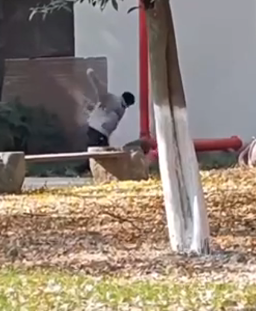
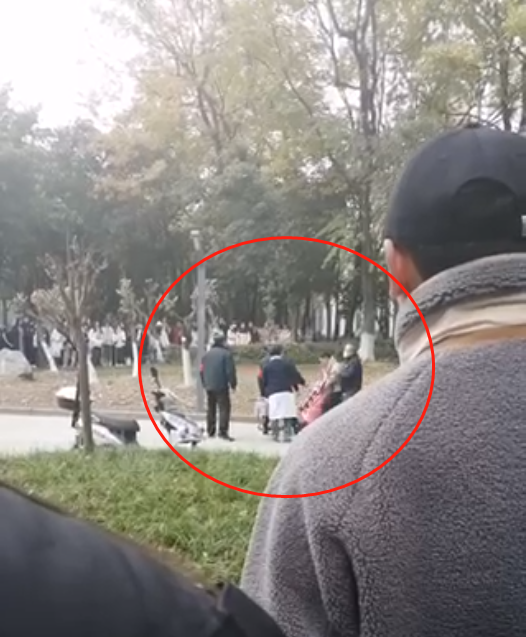

# 成都师范学院一男生校内拳打女友？学校：警方介入，她被母亲接回

12月20日，多段视频和群聊截图在网上流传，有网友爆料称，成都师范学院一男生在校内拳打女友。

一段视频显示，一名男生与一名女生蹲在地上，两人相隔一段距离，女生情绪激动吼了几句话，突然男子冲上去对倒在地上的女生不断抡拳头。另外视角的视频中，现场有许多人在围观，有身穿制服的工作人员将男生拉开，在现场进行处理。

12月20日，成都师范学院警务站的一名工作人员告诉潇湘晨报（报料微信：xxcbbaoliao）记者，已经移交派出所处理，具体情况需要等待警方调查。“女孩子没有受伤，她已经被她母亲接回家了。”

潇湘晨报记者周凌如

