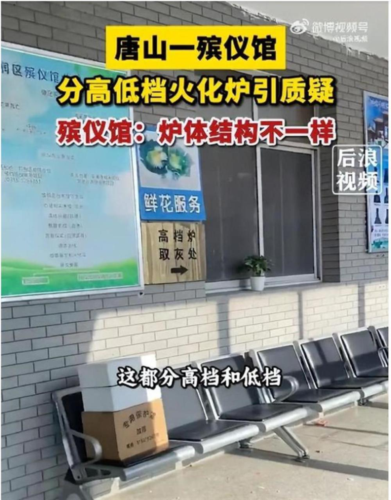

# 殡仪馆也分高低档火化炉，费用相差3倍以上，这与“厚养薄葬”相符吗？

极目新闻评论员 吴双建

据“后浪视频”报道，12月19日，在河北唐山，一网友发视频称，唐山丰润区一殡仪馆火化分高档炉取灰处和低档炉取灰处，网友质疑火化为什么要分高低档。对此，该殡仪馆工作人员回应称，高低档炉炉体结构不一样，和逝者需求有关，高档炉比低档炉豪华一些，收费就贵一些。（据12月19日九派新闻）

_相关视频截图_

殡仪馆称，“普通炉的炉体简单结构简单，高档炉肯定比低档炉豪华点，费用相对来说高点。低档炉咱们本地户口免费，外地户口净火化费250元。高档炉也分区内区外，区外户口净火化费800元。”

按这个说法，殡仪馆就是针对市场需求，实行差异化的定价策略。从中不难看出，殡仪馆有追求利润的冲动。

如果是其他行业，这样的差异化服务就无可厚非。比如小汽车分高中低档，餐厅也有豪华和平价的区别，这些是纯市场行为，就看消费者是否买账。但殡仪馆推出差异化服务，难免就让一些人心里不舒服，产生质疑。

当前，国家和社会提倡“厚养薄葬”，长辈健在的时候要多多孝顺，给他们好的生活，让他们安度晚年。当他们去世后，下葬的时候就简约一点，节约一点。那么，火化炉分高档和低档，与此相符吗？

从科学上来说，人已经去世，高档炉与低档炉达到的效果是一样的，本身没有任何区别。这与乘坐高档车或到豪华餐厅就餐不是一个概念，最多让家属有一个心理安慰。如果仅仅是心理安慰也就罢了，问题就在当前社会上，在老人去世后如何操办，有一些陈旧落后的观念。有人认为，老人走了，大操大办才能体现对老人的孝顺，才会得到好评，才不被舆论指责。

就是说，老人走了，家属如何处理后事是很敏感的一件事。如果殡仪馆再将火化炉分档次，是不是有些群众怕受到“不孝”“不舍得给老人花钱”的指责，来选择“高档炉”呢？是不是变相增加群众的负担呢？

殡仪馆在引导公众践行绿色殡仪观念方面，有着不可替代的引领作用，应该切实承担起社会责任来，不能向钱看。再说，殡仪馆在现场还贴有“高档炉取灰处”和“低档炉取灰处”的标识，就给人一种不好的观感，给逝者家属一种别样的压力。在这种压力之下，难免会有群众做出非理性的选择。

人死如灯灭，再高档的炉子，炉体结构再不一样，结果都是一样的。国务院发布的《殡葬管理条例》中明确指出，积极地、有步骤地实行火葬，改革土葬，节约殡葬用地，革除丧葬陋俗，提倡文明节俭办丧事。各级政府发布的相关条例中，“文明节俭治丧”是非常重要的关键词。高档炉“豪华一些”的说法，是不是与此相悖？在此要强调，殡仪事业带有一定的公益性，应该承担相应的社会责任。

丧葬费用过高，一直为群众所诟病，减少群众相关支出，各级政府部门也一直在努力。诚然，一些陈腐落后的殡葬观念的改变需要时间，对一些陈规陋习，社会各方应该加以正面引导，不能单方面迎合这些需求，助长攀比心理。就是说，火化炉本不该有什么高中低档，一视同仁就好。

（来源：极目新闻）

