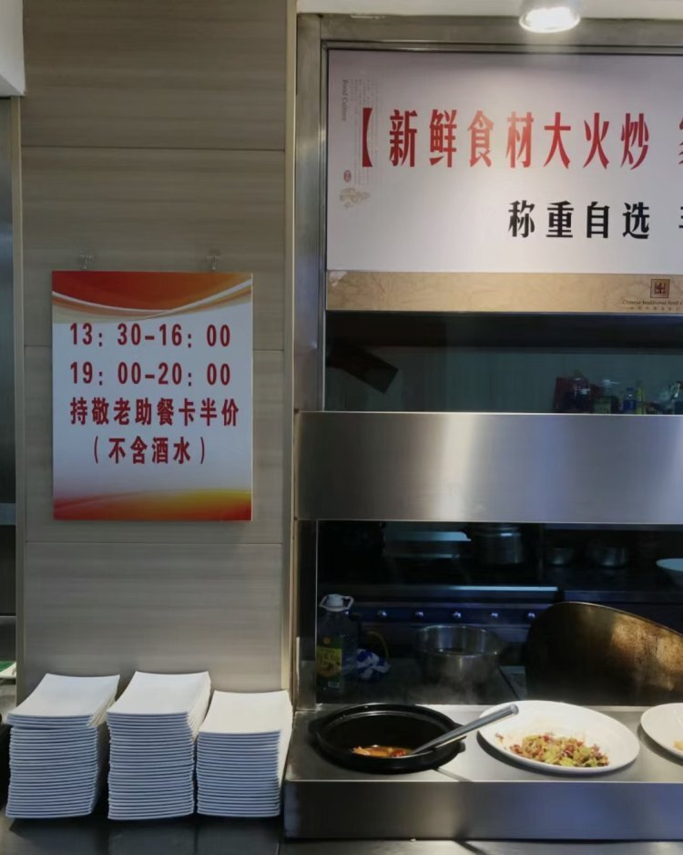
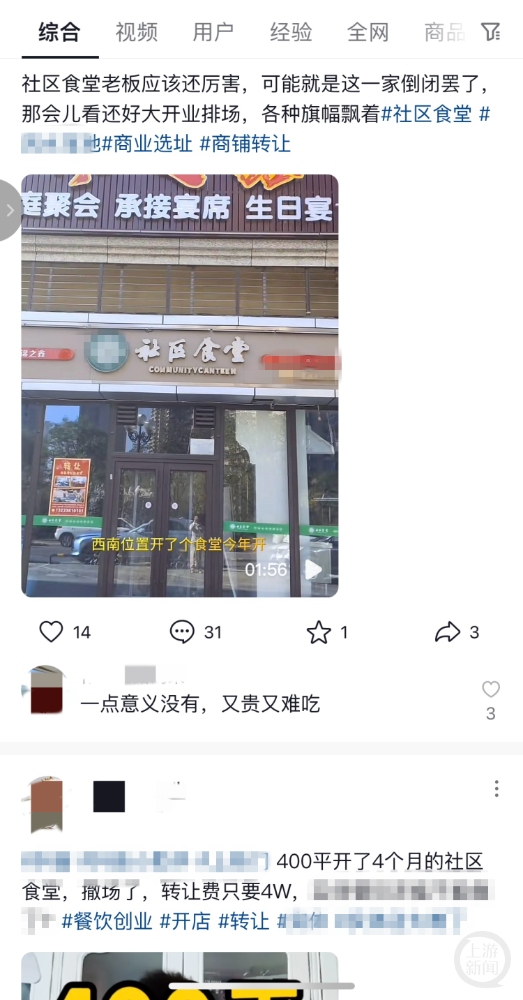

# 热潮之下的社区食堂：有人退出市场有人着急入场，今年新注册达1700家

社区食堂作为社区居家养老服务中需求量较大的一项服务，在满足老年人需求方面发挥着重要作用。近日，辽宁省沈阳市皇姑区两家社区食堂关闭引发社会关注。同时，一些年轻人涌入社区食堂就餐打卡，又使社区食堂在社交媒体平台上备受关注。上游新闻（报料邮箱：cnshangyou@163.com）记者调查发现，去年以来全国多地出现社区食堂热，今年内新注册的社区食堂、长者食堂在1700家以上，但部分地方社区食堂在实际发展过程中遇到一些问题，多地陆续有社区食堂关停。

业内人士称，在让老年人吃好饭的基础上，一些社区食堂为了寻找赢利点，提高存活率，正在积极尝试升级，延伸出更多可盈利的业务线。

_沈阳瑞兰香公司经营的社区食堂关停。 受访者供图_

**开业不足两月关停两家店**

12月12日，沈阳瑞兰香公司开办的两家社区食堂开业不到两个月便宣布暂时关停，引起舆论关注。就在今年10月，《沈阳日报》报道称，皇姑区民政局引入沈阳瑞兰香健康养老产业发展集团有限公司等养老服务企业，布点建设社区食堂。

媒体报道称，沈阳瑞兰香餐饮管理有限公司负责人罗先生曾解释，关门的主要原因是社区食堂投入很大，亏损严重。该公司本来要开6家社区食堂，一共投资了1000万元，但除两家店开业外，其余4家社区食堂一直未开业，目前已亏损800多万元。上游新闻记者联系该公司工作人员时，对方表示因亏损关门，近两日忙着处理后续的善后工作。

皇姑区民政局12月13日发布通报称，已引入合作伙伴，社区食堂将恢复运营。

记者了解到，沈阳正在加速布局社区老年助餐点。2023年起，沈阳市开展“舌尖上的幸福”老年人助餐暖心三年行动，主要为老年人提供方便可及的助餐服务。今年2月，沈阳市民政局起草了《“舌尖上的幸福”沈阳市老年人助餐暖心行动实施方案（2023-2025年）》及配套政策文件。根据实施方案，2023年，沈阳全市打造不少于300个老年人助餐点，在2024年，全市打造老年人助餐点1000个。

社区食堂是社区居家养老服务中需求量较大的一项服务，在满足老年人需求方面发挥着重要作用。

当地居民对社区食堂仍充满期待。沈阳居民林女士向记者讲述了社区食堂对老年人尤其是独居老人的重要性：“许多老人饭量小，做一次要吃好几顿剩菜，经常简单应付一餐，而社区食堂解决了他们的问题。”她说：“家中老人曾去过两次，对社区食堂评价还不错，干净的环境、丰富的饭菜，而且离家很近，价格也实惠。”

上游新闻记者走访发现，社区食堂的设立不仅解决了老年人的饮食问题，更在一定程度上成为了他们的社交中心，丰富了他们的生活。

12月16日，记者在哈尔滨龙泰社区食堂看到，食堂内干净整洁，上午11时30分不到，老年人就陆续进来就餐，该时段食堂提供20余种菜品。“酱豆腐、烧茄子、各类小炒，每天菜谱都不一样，适合老年人，菜价也比社会饭店便宜，老年人就餐还可打折。”工作人员说。

哈尔滨龙泰社区居民刘老先生也分享了他的观点：“我年纪大了，买菜做饭有些吃力。现在花上10多块钱，在家门口就有热腾腾、健康美味的饭菜，真是太好了。在社区食堂跟其他老年人一起聚聚，下棋打牌、唠唠家常，在吃饱吃好之余丰富了精神文化生活，每逢节日社区还组织老人一起包饺子呐。”

_哈尔滨一家社区食堂持敬老卡就餐半价。 受访者供图_

**政府补贴降低运营成本**

民以食为天，小食堂托起大民生。近年来，具有公益属性的社区食堂在全国各地迅速出现。

去年10月，国家住建部、民政部联合发布《关于开展完整社区建设试点工作的通知》。通知提到，自2022年10月开始，试点社区将配建食堂、家政服务网点等便民商业服务设施。今年7月份，商务部等13部门办公厅（室）关于印发《全面推进城市一刻钟便民生活圈建设三年行动计划（2023—2025）》的通知，再次提到“探索发展社区食堂，建立老年人助餐服务网络”。

随后各地陆续发布相关政策，多地明确社区食堂保障对象、建设要求以及政策激励。例如2022年6月，福建发布《关于长者食堂建设运营的指导意见》，意见提出长者食堂应选取在房屋的一层或低层，并结合老年人数量、年龄结构、需求及就近方便等因素，优先安排建设意愿强、老年人就餐多的社区（村）。意见要求，长者食堂建筑面积不少于80平方米，能容纳20人以上同时就餐。各地的运营模式大致分为三类：公建民营、民建民营、公私合营三种。

值得注意的是，一些地方已经早早开始了社区食堂的试点工作。例如，早在2016年，浙江、黑龙江等省份就已经启动了社区食堂（长者食堂）的试点工作。

为了更好地推动社区食堂的建设和运营，各地政府也出台了一系列的激励政策。福建、辽宁、山西等多个省份在税费、房屋使用等方面有一定的减免政策，水电费用等则按居民生活类价格执行，享受社区养老服务的相关税费优惠减免政策。

除此之外，还有建筑补贴（不同地方也称为装修补贴、创建补贴等）、助餐补贴（就餐补贴）以及运营补贴等三类，具体补贴细则各地有所不同。例如，山东烟台给予社区食堂一次性创建奖补，按照每平方米800元的标准给予社区食堂创建一次性奖补，最高不超过80万元。

沈阳市民政局养老服务和老年人福利处工作人员接受上游新闻记者采访时表示，沈阳的补贴包括就餐补贴以及运营补贴。如果食堂当年实际运营满240天，并且为60周岁及以上老年人服务人次占总服务人次比例达到30%及以上的，可向区民政部门申请运营补贴，最高给予每年5万元运营补贴。

另外，记者梳理发现，很多地方将社区食堂建设纳入民生实事项目，作为事关人民幸福感的“关键小事”来抓。例如，云南省将老年“幸福食堂”建设列入云南省政府十件惠民实事，着力解决高龄、空巢老人用餐难问题。

 _网民发布某地社区食堂关门的消息。 网络图_

**有人退场不断有人入场**

自去年起，各地掀起了一股“社区食堂”热潮，新店如雨后春笋般纷纷涌现，在政策和市场的双重驱动下，社区食堂屡次成为社会关注的焦点。然而，今年以来，部分地方的社区食堂发展出现问题，尽管有政策支持，但部分社区食堂仍然面临营收困难、服务面窄等问题，因营运亏损，不得不停业的案例并非孤例。

从今年开始，陆续有社区食堂停业、关门的信息见诸报端。皇姑区两家“社区食堂”因经营问题关闭之外，今年年初，北京十里堡北里小区、福盈家园小区的社区食堂停止经营。今年6月，西安一家社区食堂也因经营不善倒闭，甚至导致数百名老人就餐卡预付的钱退不回来。此外，在多个社交网络平台上也有网民提到身边一些社区食堂关门的情况。有网友称，其所在的社区曾开了一家社区食堂，刚开始第一个月就餐人数较多，但不到半年就关门了。

今年7月，上观新闻发布的一篇报道称，上海静安区、黄浦区、浦东新区等城区的社区食堂，尽管绝大多数仍能经营下去，但没有大幅盈利的，比较好的情况也只是微利。

为何一些社区食堂有政策扶持仍难以维持？多名受访经营者总结称，一方面，菜品大而全，利润空间较低、运营成本却并不低；同时，食堂定位公益+社会餐饮，众口难调，无法培育核心客户群。

一名来自安徽的社区食堂经营者蔡先生向记者透露，相较于普通餐饮门店，社区食堂的投入并不低。由于需要提供一日三餐，菜品种类多且需要大量的人力投入，同时定价相对较低，食堂所在的社区人口基数有限，因此经营压力较大。

蔡先生称，社区食堂受众面窄，食堂菜品也无法同时兼顾老人和年轻人的口味。与上班族、学生族固定用餐情况不同，社区食堂内每天用餐人数并不固定，经常出现一天只有几名老人用餐的情况。

“去年已经亏损了20万元，还拖欠了2个月的员工工资未发，今年已经及时止损，决定不再继续经营。”蔡先生说。

蔡先生表示，社区食堂涉及很多方面，它既是面向市场的饭店，又是服务居民生活的载体。这非常考验经营者的经营水平和能力，如果依靠补贴肯定是难以维系生存的。

“能保本就不错了。”湖北省的一名社区食堂经营者艾先生说。在了解到政策大力扶持社区食堂后，艾先生便在当地开了一家面积500平方米的社区食堂，聘请了两名厨师，两名服务员，虽然房租费用很低，但依旧只是勉强维持。

艾先生算了一笔账，每个月人工费用就需要2万元，一般餐饮的毛利率50%左右，但社区食堂菜品定价低，小炒种类多，毛利率顶多是40%。

不过虽然部分社区食堂经营困难，也有一些地方的社区食堂经营不错。哈尔滨的龙泰社区食堂已经营业近5年，是哈尔滨首批落地的社区养老照护中心及服务驿站。西南地区某市一名社区食堂经营者程先生告诉上游新闻记者，他的门店经营还行，自己正在筹备第三家社区食堂。

在上海，陆家嘴社区食堂是上海第一批社区食堂，吸引了一批忠实食客。经营3年时间，该食堂进行了不少的创新。例如，在餐桌边加置了拐杖扣，便于老人放置拐杖；餐盘上加装NFC装置，老人取餐自动感应即可计费。在支付环节，老人用人脸识别就能轻松结账。

在苏州，自2015年创办的姑苏区里河社区食堂，起初仅为60岁以上老年人提供就餐服务。2019年后，这里又成为苏州第一批社区食堂对外开放。如今食堂已经营已有八年时间，它吸引着各年龄段群体的光顾。每到饭点，许多年轻人以及一些家长带着孩子前来就餐。

有意思的是，一边是不断有社区食堂经营者退出市场，另一边不断有新的社区食堂开办。记者注意到，哈尔滨、沈阳、太原、烟台、杭州、成都等多地都涌现出一批新的社区食堂，其经营者包括一些知名的餐饮集团、养老机构以及地产商。

记者检索公开工商信息显示，今年内，新注册的社区食堂或长者食堂在1700家以上，其中湖南、陕西新注册数量最多。同时，年轻人涌入社区食堂就餐打卡，也使社区食堂在社交媒体平台备受关注。在某社交平台上，关于社区食堂的笔记更是超过3万篇。

_哈尔滨龙泰社区食堂。 摄影/上游新闻记者 张莹_

**社区食堂寻求升级**

业内人士称，在让老年人吃好饭的基础上，如何寻找赢利点，提高社区食堂存活率，是经营者们需要思考的难题。一些社区食堂正在积极尝试转型和升级，延伸出更多可盈利的业务线。

“开店容易守店难，依靠政府补贴绝不是长久之计。”一名社区食堂经营者程先生介绍，目前在政策支持下，房租成本可以忽略不计，水电费用也按民用收费标准收取，也大大降低成本，但仅仅依靠这些，社区食堂盈利仍十分困难。因此，经营者需要摸索出更多可持续运营模式。

程先生称，在政策允许的经营范围内，社区食堂可引入更多的网红餐饮品牌合作，吸引年轻群体，使受众从“老龄”到“全龄”，挖掘更多的客群。同时可以延伸更多业务，例如生鲜超市、老年驿站、康养业务等。

记者了解到，多地的政策中，均提及保障对象以老年人为主，允许在满足老年人就餐服务需求的同时向社会开放。

上海某餐饮集团的社区食堂项目工作人员林女士告诉记者，在保障公益性、共享性基础上，社区食堂需要建立自我造血机制，坚持专业化的市场运营，挖掘上班族、独居青年、双职工家庭等更多潜在客群，引入其他业态搭配，从而实现长期健康运营。

林女士认为，一些社区食堂还尝试着从提高空间使用效率入手，利用时间差，提供健康讲座、体检服务，开展各类兴趣小组活动，举办活动、讲座、社区议事等。

在多位受访的业内人士看来，尽管社区食堂面临诸多挑战，但是有政府支持、享受政策优惠和补贴的社区食堂，自带价格优势与引流优势，再通过模式创新和多元化服务，仍然具有巨大的发展潜力。

上游新闻记者 张莹

