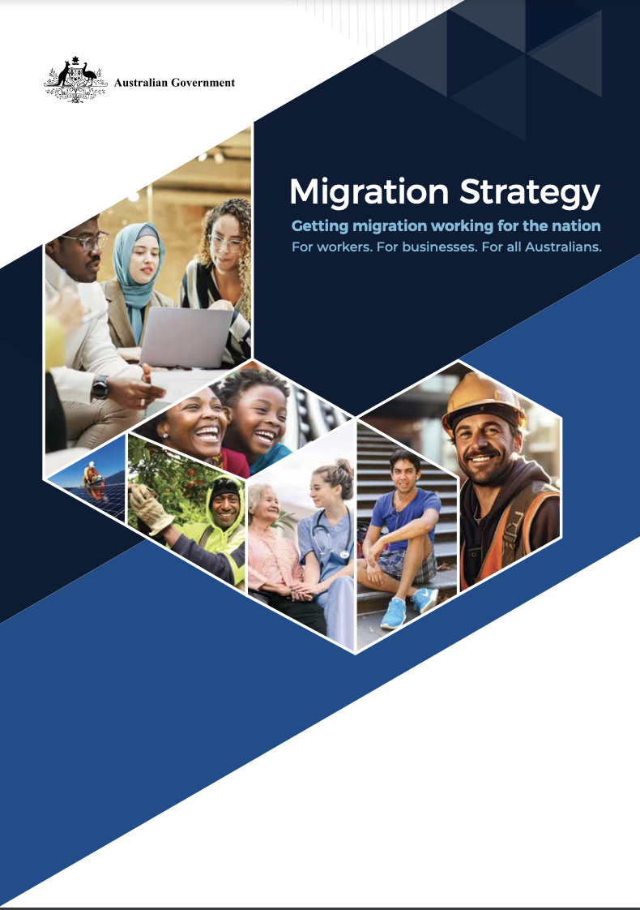
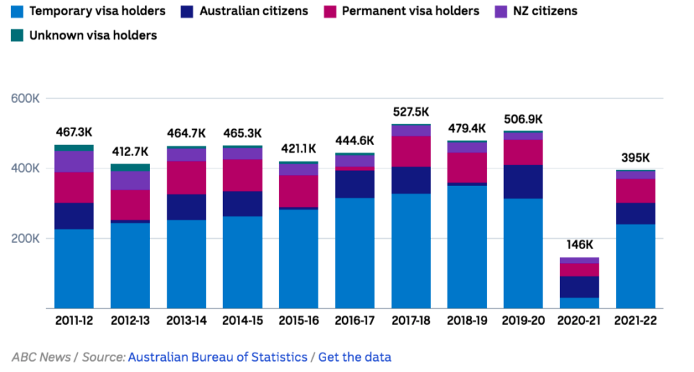
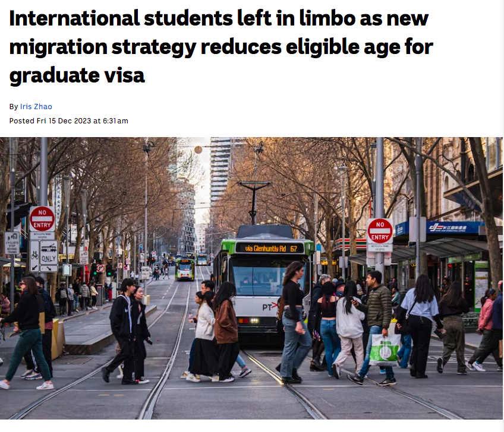
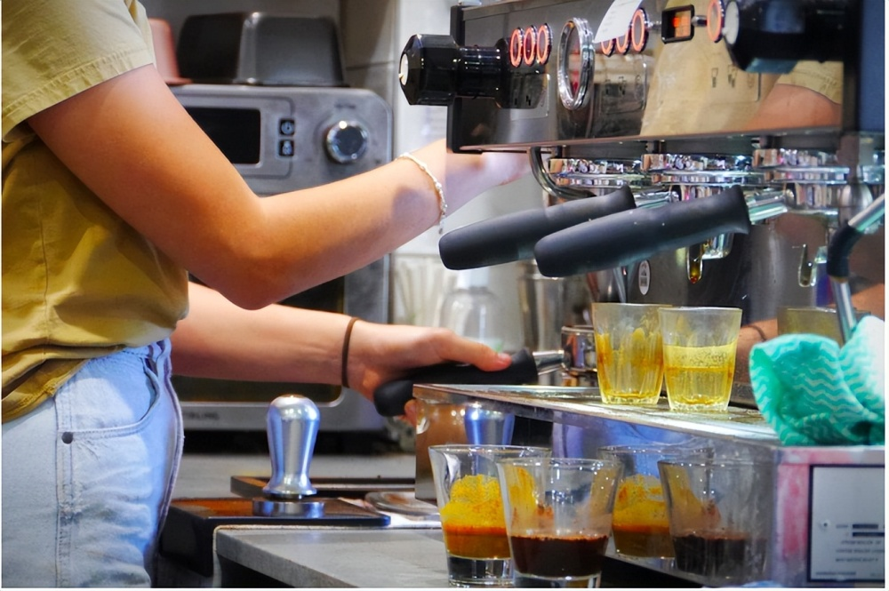
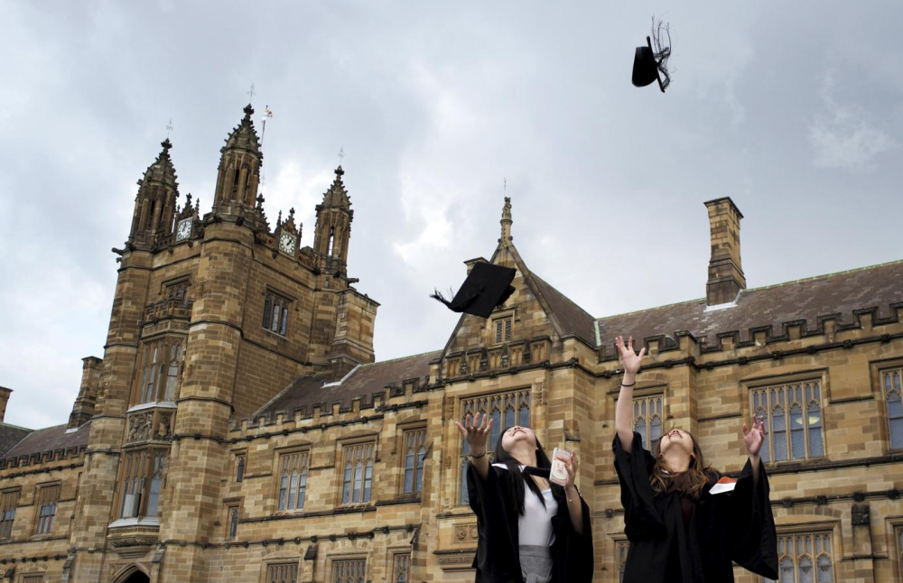
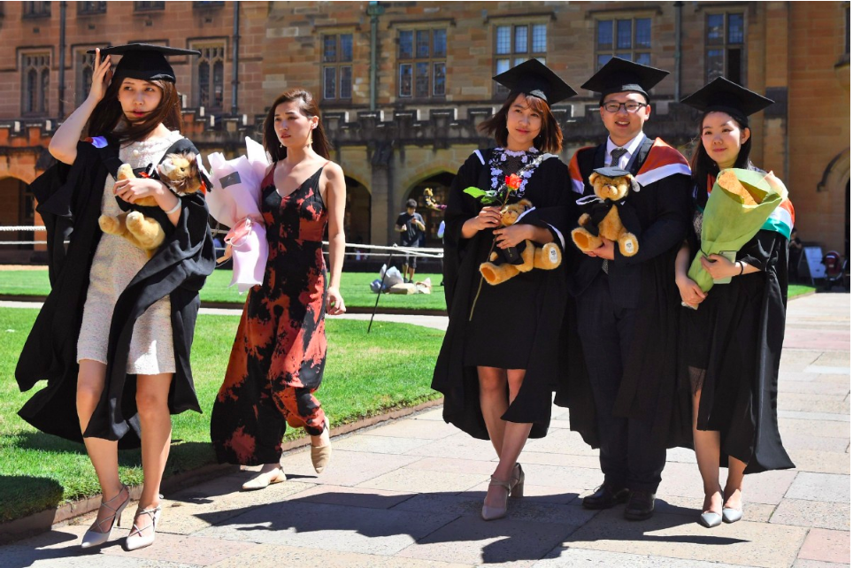

# 留学不能再“混”，“野鸡大学”无所遁形：澳大利亚重拳整改移民政策

**文/冯祎（发自澳大利亚墨尔本）**

**编辑/漆菲**

澳大利亚国际学生以及外籍打工人的日子，愈发不好过了。

2023年12月中旬，澳大利亚内政部长克莱尔·奥尼尔和移民部长安德鲁·吉尔斯公布了一份长达99页的移民新战略（Migration
Strategy）以及基于新战略的行动计划，掀起热烈讨论。

12月11日，澳大利亚官网发布了该国新版移民战略。

按照新计划，澳大利亚将收紧对临时移民工人和留学生的签证程序，清理留学行业中的“幽灵大学”和“签证工厂”，严厉打击引进低技能工人的“后门”入境行为，同时新增对专业人才的签证项目。这些政策将于2024年开始陆续实施。

截至2023年9月的过去一年中，澳大利亚净移民人数达到50余万人，创下历史新高。其中持临时签证的人数急剧增加。澳大利亚联邦政府希望通过这项改革，将2024年的净移民人数从上一财年的51万峰值降至37.5万，到2025年进一步降至25万。

_按群体划分的澳大利亚海外移民入境人数（2011-2022）_

 _澳大利亚净海外移民人数（2000-2022）_

虽然澳方宣称，新政的实施是为了“让移民制度更好地服务国家”，但潜台词却是：“不优秀的人，请你别来！”

不止澳大利亚，包括英国、法国在内的西方多国纷纷收紧移民政策，更有学者认为，2024年大选后，美国或将采取类似政策。

留学生们不能再“混”了

移民新政颁布时，Alan从澳大利亚第二大城市、维多利亚州首府墨尔本迁至塔斯马尼亚州首府霍巴特刚满一年。2020年，Alan来到皇家墨尔本理工大学就读会计专业，2022年顺利拿到硕士学位。但当他想申请维多利亚州的190州政府担保移民签证时，却发现自己的条件并不占优。

190签证属于技术移民类别，对申请人以自己的专业、英语、工作经验等为基础，获得澳大利亚州或领地政府的提名，通过打分测试，最终得到移民局签发的永居签证，移民成功后需要在担保的地方居住两年后才能去其他地区。

“在墨尔本、悉尼、布里斯班这样的大城市，光是读两年书，已经很难获得永居签证了。”Alan向《凤凰周刊》介绍说，“虽然190签证的积分申请门槛只需65分，但大城市人才济济，许多留学生会通过刷雅思、额外考取证书等方式为自己增加筹码。在维多利亚州公布的相关文件中，190签证的积分已涨至90分。”

无奈之下，Alan只好转战移民政策较为宽松的塔斯马尼亚州，可要获得当地担保，他依然得走留学路线。“且不说要多交两年学费（约合25万元人民币），还要再学一遍在墨尔本学过的内容，感觉在浪费时间。”更让Alan担心的是，当他在霍巴特读完书后，恰好卡在35岁的尴尬年龄上。按照新政，毕业生签证（485签证）申请者的年龄上限将从50岁大幅下调到35岁。

澳大利亚媒体报道，由于移民新政下调了毕业生签证的申请年龄，国际学生陷入困境。

更多的被采访者，将吐槽火力集中在语言技能要求的提高和签证时长的改动方面。

由于一半以上毕业生工作签证（485签证）持有者的工作能力明显低于其技能水平，移民新政要求毕业生工作签证申请人的雅思成绩从6.0分提高到6.5分；学生签证申请人的雅思成绩从5.5分提高到6.0分；原本四到六年的毕业后工作期限将缩至两到三年；政府还将采取限制措施阻止在岸“跳签”（visa
hopping），即在澳大利亚境内更换签证类别，如限制毕业生工作签证持有者转回学生签证。这一举措能在很大程度上“消灭”掉想成为“永久性临时移民”的人。

“为了延长在澳大利亚的逗留时间，不少留学生会通过中介采用‘跳签’方式，即从一种课程转到另一种课程。”中国留学生Fiona告诉《凤凰周刊》，为了能顺利毕业或是混学时，大家会选择转到低于自己当前学习水平的课程，其中网课最受欢迎；省下来的时间，大多数人会用来打工。“我以前去美甲店的时候，见过有美甲师一边播着网课，一边给别人做指甲。”

2022年，时任移民部长亚历克斯·霍克（Alex
Hawke）提出为国际学生提供无限的工作权利——从之前的每两周40小时增加到48小时。这一决定推动了2022年和2023年海外学生签证申请量的激增。目前在澳大利亚有超过61万名国际学生。

公开数字显示，国际学生在所谓“永久性临时移民”中占有最大比例，其中有10.8万人已在澳大利亚逗留五年甚至更久。2022年持多次连续学生签证留在澳大利亚的国际学生人数增长了30%以上，达到创纪录的15万人。

移民新政一公布，留学生们纷纷表示，以后不好“混”了。各学校已开始行动，要求持学生签证的人的出勤率和及格分数需达到80%。

因为政府将对申请第二次签证的人采取更严格的审查，比如进行“真学生测试”，要求学生证明申请第二个签证会如何提升学术抱负或促进职业发展。例如，博士生可能无法成功申请学生签证来学习酒店管理课程。“‘真学生测试’将激励真正的学生申请，并阻止主要目的是工作而非学习的伪学生进入澳大利亚的国际教育系统。”内政部长奥尼尔如此解释。

_澳大利亚内政部长克莱尔·奥尼尔表示，当前的移民计划让澳大利亚和申请来该国的人们倍感失望。_

然而，受访的留学生们向《凤凰周刊》表达了另一重担忧。受疫情等因素影响，澳大利亚劳动力市场处于疲软状态，意味着持临时毕业生签证的人越来越难获得长期且稳定的技术工作。对毕业生而言，没有工作便无法获得所在州或领地政府的提名，进而获得独立技术移民签证（189签证）或是雇主担保的临时技术短缺签证（482签证）。

“临时技术短缺签证的最低年薪要求从5.39万澳元升至7万澳元。”Fiona说，要知道，墨尔本所在的维多利亚州，年薪中位数也不过6.5万澳元。“餐厅服务员这种低端工种，已经不能为拿签证背书了，可想要进入高薪职业，除非自身能力特别强，否则对无人际关系、语言没有优势的中国留学生而言实在太难。”

_在澳大利亚，很多留学生会从事餐厅服务员等低端工作。_

难怪有人评论称，在澳中国留学生的黄金二十年已经终结，对于想通过留学留在澳大利亚的中国人而言，仿佛进入了“黑铁时代”。而服务于他们的各个产业，如留学移民中介、大学培训机构等，也将面临洗牌。

_澳大利亚政府预计，新政策将使净移民人数从去年的 51 万下降到 2025 年的 25 万。_

“野鸡大学”将无所遁形

“一块牌子掉下来砸中10个人，6个学会计、4个学IT。”这是澳大利亚留学圈的现实。

会计和IT是公认的移民专业。尤其是技术门槛更低、毕业率更高的会计专业——无论是高中毕业想到澳大利亚大学镀金的，还是在国内工作多年、希望通过“回炉”上学拿到永居签证的——课堂上90%的面孔都是留学生。

“说实话，给想来澳大利亚留学的中国人办签证，我们基本首推会计，因为流程已经很成熟了，语言等方面的门槛也较低。”一位有着多年经验的中介不避讳地告诉《凤凰周刊》，申请会计专业，学校给他们的“返点”也更多；可对于毕业后会面临何种竞争、如何解决就业等问题，他们大多会回避。

新政实施后，政府将设立一个“临时需求技能”（skills in
demand）签证，以取代现有的临时技术短缺签证，以吸引那些“有潜力提高澳大利亚劳动力技能和专业知识”的高技能人才。

_国际学生是澳大利亚高等教育领域的重要资源。_

这一签证分为三类：第一种是专家技能人才（specialists
skills），向年收入不少于13.5万澳元的申请人开放（技工、机械操作员、司机除外），为的是吸引网络技术和绿色能源等行业的精英；第二种是核心技能人才（core
skills），政府会根据就业市场定期更新职业清单，年收入门槛为前文提到的7万澳元；第三种是基本技能人才（essential
skills），重点关注低收入人群的劳动力短缺问题，如护理行业从业者。据了解，目前有八家老年护理服务机构正在签约海外工人，涵盖2000个临时签证和4000个永久签证。

用更通俗的话解释：如果你是护士、心理专家、托儿所员工、养老护理员、数据分析师以及几乎所有类别的工程师，澳大利亚的移民新政对你而言便是好消息，因为你所做的是澳大利亚面临重大技能缺口的职业。

“野鸡大学的生意应该不好做了。”已从事移民中介5年的Hugo
Huo向《凤凰周刊》感叹道。这是因为，澳大利亚政府将对教育培训机构进行风险等级排序，当留学生申请签证时，也将根据所就读教育培训机构的风险等级进行排序，那些被认为风险较高的机构，相关签证处理起来也会变得缓慢。

据澳大利亚广播电台（ABC）分析，虽然澳大利亚不会限制国际学生的入学人数，但会打击到那些低质量的教育培训机构，并进一步限制利用学生签证留在澳大利亚的低技能工人。换句话说，新政将努力留住成绩最好的学生，并吸引更多高技能人士成为永久移民。

普爱信为律师事务所（ProActive. Legal）董事、资深移民留学律师Sean
Dong指出，诚信保障是专家技能人才签证项目成功的一个关键。“让人担心的地方在于，如何能规避那些利用虚假高工资进行移民的申请人。”他还预测，出于对英语水平的考量，欧美及印度等国的获提名人可能会比大中华区要多。

_医护行业是澳大利亚的缺口行业。_

Sean
Dong认为，这一战略将令移民留学产业重新洗牌，他赞成对这些所谓“签证工厂”的教育培训机构及以此赚钱的中介进行合理清理。“留学中介应该以真实的课程申请作为收入来源，而不应该吸引那些只会重复读廉价课程的学生。”

澳大利亚国际教育协会首席执行官菲尔·霍尼伍德（Phil
Honeywood）指出，教育部门欢迎这一战略中的大多数措施，例如提高最低英语语言入学标准。“在这方面，我们终于能与加拿大和英国同步了。毕业后工作期限从四至五年缩减至两至三年，也是我们的主要竞争国家已经在实行的做法。”

霍尼伍德说，澳大利亚的国际教育产业价值达到400亿澳元，公立大学40%的研究经费和校园建筑都来自于国际学生的学费。“新政对公立大学留学生人数的影响不会很大，因为政府将目标锁定在处于生态系统低端的私立学校。毕竟太多年轻人毕业后，并没获得与课程相关的就业能力。”

截至2023年6月30日，澳大利亚在过去一年内发放了369979份留学签证，数量较疫情前有大幅提升。“国际教育是澳大利亚非常重要的出口产品，是第四大出口产品，每年为我们的经济贡献300亿澳元，为25万澳大利亚人提供就业岗位。”移民部长吉尔斯表示，提高国际学生在澳受教育的质量，也是为了减少未来可能发生的潜在的职场剥削。

_2016年4月22日，澳大利亚悉尼，悉尼大学举行毕业典礼后，两名留学生将毕业帽抛向空中庆祝。_

移民政策早已“不合时宜”

“我们的生产率增长缓慢，正在影响澳大利亚家庭的财富积累！”“我们的人口老龄化速度很快，但没有足够的专业人员来照顾他们！”“我们迫切需要向净零排放经济过渡，可我们这里没有这样的技能和能力！”公布移民新政时，内政部长奥尼尔道出了其背后动因，“新移民政策，可以帮助澳大利亚应对这些挑战。”

对于移民人数，澳大利亚政府每年会以移民和人道主义项目规划目标的形式设定永久移民上限。目前，澳大利亚约有230万人持有具有工作权利的临时签证。

“从历史上看，澳大利亚的大多数移民都是永久性的。这鼓励人们在澳大利亚建立自己的生活，并赋予他们与公民同等的权利。但近年来，政府鼓励更多临时移民。后者并不享有与公民和永久居民相同的权利，如社会福利、托儿补贴，在工作场所权利方面也面临障碍，这往往导致他们的工资低于其合法应得的水平。”悉尼大学商学院副教授克里斯·莱特（Chris
Wright）如此解释。

_自澳大利亚国门重新开放以来，已有超过15万名中国留学生来到澳大利亚。_

在后疫情时代，各国边境重新开放后，返回澳大利亚的临时移民人数虽在预测范围内，但增速极快。

此前这被认为是新冠疫情后的留学生回流潮，但据澳大利亚广播公司分析，这不仅仅是暂时性的激增，而正在成为国际趋势，来自印度、东南亚和拉丁美洲的一些中等收入家庭希望在澳大利亚、加拿大、美国和英国等高收入国家寻求更好的机会。

奥尼尔表示，“如果不对这种增长进行干预，签证制度很容易被寻求廉价劳动力的雇主所利用。”由于中层技术工人签证要求的变化，预计未来12个月内获准进入澳大利亚的人数将减少约2.5万人。

奥尼尔表示，这一最新战略并非只是针对移民数字，而是关乎移民制度结构的合理性。“如今的澳大利亚需要技术熟练的劳动力队伍，帮助这个国家过渡到净零排放经济，从而应对人口老龄化带来的压力等问题。”

总理阿尔巴尼斯也提到：“我们确实需要将移民水平保持在一个可持续的水平。留学生就读的课程要对澳大利亚本国的技能需求或国家利益有实质性的帮助。”

此次移民战略改革主要基于2023年4月的一份审查。时任总理及内阁部秘书马丁·帕金森（Martin
Parkinson）对澳大利亚移民制度进行了审查，认为签证系统已经“不合时宜”。

过去一年，反对党一直指责政府造成了创纪录的移民潮——财政部在2022年3月的财政预算中预计，截至2023年6月的一年内，澳大利亚净移民人数将达到18万，但才到5月，这一数字就已升至40万了——这给住房和基础设施带来极大压力。近日，斯坎伦基金会（Scanlon
Foundation）有关社区态度的年度报告显示，澳大利亚的社会凝聚力处于15年以来的最低水平，其中33%的人担心移民数量过多。

澳大利亚AMP资本投资公司首席经济学家肖恩·奥利弗（Shane
Oliver）在一项对移民规模提出新问题的预测中估计，只有当净移民人数降至每年20万人左右，才能与当下住房供应能力保持一致。

早在2023年7月，阿尔巴尼斯政府上任一年之际，就有消息称，澳大利亚政府将在未来两年内对移民政策进行重大改革。几乎同一时间，澳大利亚政府宣布，将取消在新冠疫情期间推出的疫情签证（pandemic
event visa），那是专门发放给由于旅行限制而无法离开澳大利亚的海外学生和毕业生的临时签证，目前有近10万人持此签证留在澳大利亚。

_2020年12月10日，澳大利亚悉尼市中心，正在过马路的人们。_

澳大利亚财政部的预测显示，新的移民战略将在四年内削减18.5万净海外移民，到2026-2027财年，净移民人数将降至23.5万人，略低于疫情前的水平。

就在澳大利亚公布移民新政之前，英国保守党政府刚刚调整了本国的移民政策，旨在每年减少30万移民。为此，政府将限制护理工作者带家属来英国，逐步减少接收国际学生，英国公民或已在英国定居的人需证明自己的年收入超过38700英镑，其海外伴侣才能赴英和他们团聚，而之前的要求为18600英镑。

而经过数月紧张谈判，法国议会于2023年12月19日批准了一项有争议的移民法案，加强政府驱逐外国人的权限，并收紧福利和公民身份的获取条件。该法案收紧了合法居住在法国的外国居民获得儿童和住房福利的条件，并提高了居住许可的法语水平要求。外籍父母在法国所生子女将不再自动获得公民身份。该法案还设定了移民配额，并取消了禁止驱逐13岁前就入境法国的外国人的禁令。

路透社认为，该法案是法国总统马克龙所领导的政党与保守反对派之间达成妥协的产物，反映了欧洲大部分地区在政治上的右倾，各国政府试图通过对移民采取更强硬的态度来争取民众，从而抵御极右翼势力的崛起。

对于澳大利亚政府的“重拳出击”，莱特认为，英国近来加大了移民的难度，美国也有极大可能在2024年大选后采取限制移民的措施，因此，承诺缩短申请专家技能签证处理时间的澳大利亚或在这场高技能人才抢夺战中获利。“那些国家（指欧美）在政治上的不确定性，将让澳大利亚和加拿大变得更具吸引力。”

对于新移民战略改革能否解决留学生遭遇的如工作受剥削、学业诚信及毕业后申请永居等问题，奥利弗认为不能太乐观。“如果申请移民时强调工作机会，势必会让买卖工作的行为更加猖獗，除非有严厉的诚信监管和惩罚措施以防止腐败。”他坦言。

