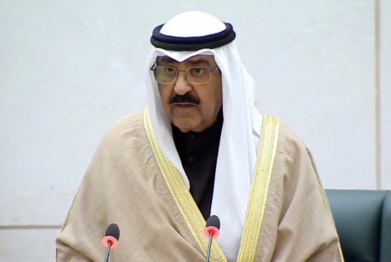

# 科威特新任埃米尔米沙勒宣誓就职

 _科威特新任埃米尔米沙勒宣誓就职现场（图源：科威特国家电视台）_

当地时间20日上午，科威特新任埃米尔（国家元首）米沙勒·艾哈迈德·萨巴赫在科国民议会的特别会议上宣誓就职。

科威特上一任埃米尔纳瓦夫·艾哈迈德·贾比尔·萨巴赫于本月16日去世。根据科宪法，王储米沙勒成为新一任埃米尔，也是科威特第十七任埃米尔。

米沙勒生于1940年，曾在科内政部、国民警卫队担任要职多年，是已故埃米尔纳瓦夫同父异母的弟弟。纳瓦夫在任期间，曾因身体原因授权米沙勒行使部分国家元首的权力。（总台记者
李超）

来源：央视新闻客户端

