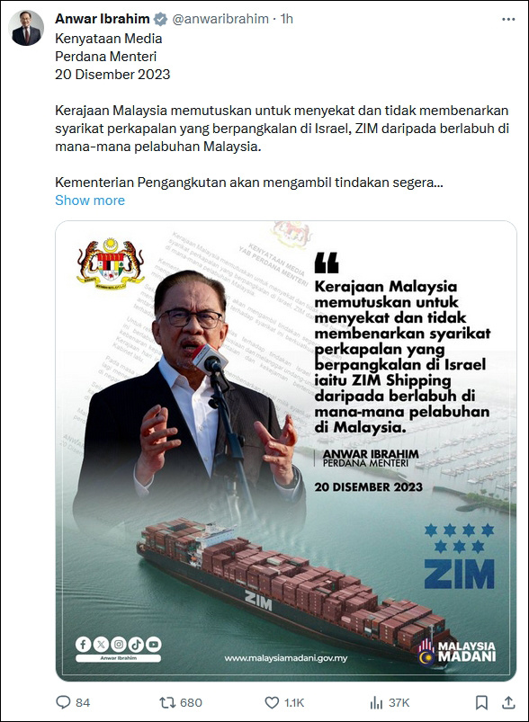

# 马来西亚禁止以色列船只停靠该国港口：是对以色列持续暴行的回应

（观察者网讯）

当地时间12月20日，马来西亚总理安瓦尔宣布，将禁止所有悬挂以色列国旗的船只停泊在任何马来西亚港口，并禁止任何前往以色列的货船在该国港口装载货物，这两项禁令“立即生效”。

声明还特别点名了总部位于以色列且在以色列上市的国际货运公司以星综合航运（ZIM），禁止其旗下船只在该国任何港口停泊。安瓦尔责令交通部“立即实施这项永久禁令”，马来西亚媒体称该禁令预计于一个月后生效。

安瓦尔说：“这些制裁措施是对以色列无视人类基本原则、违反国际法、持续屠杀巴勒斯坦人的暴行的回应。”他强调，政府有信心这一决定不会影响马来西亚的贸易活动。

声明提到，马来西亚内阁最早从2002年起允许以星旗下船只在该国停靠，后来又在2005年将该决定扩大到允许其装卸货物，“然而，如今政府决定取消过去内阁（对此）的所有决定”。

_安瓦尔推特声明_

马来西亚和巴勒斯坦均为以伊斯兰教为主要宗教的地区，耶路撒冷被视为圣地、巴勒斯坦阿克萨清真寺具有重要地位，两国拥有共同的宗教和文化联系。马来西亚长期以来一直是巴勒斯坦事业的支持者，主张以“两国方案”解决巴以冲突。巴勒斯坦伊斯兰抵抗运动（哈马斯）高级领导人过往常常访问马来西亚，并会见该国总理。

与邻近的印度尼西亚、文莱、孟加拉国、马尔代夫和巴基斯坦一样，马来西亚与以色列没有建立正式的外交关系。马来西亚护照内页长期以来也标注“除以色列外对所有国家有效”的文字，以色列护照持有者未经事先许可，不得进入马来西亚。

美国有线电视新闻网（CNN）20日提到，尽管美国是马来西亚的主要贸易伙伴，安瓦尔仍是在国际舞台上就巴以问题最为直言不讳的领导人之一。在11月的一次议会演讲中，安瓦尔表示，马来西亚政府不会承认美国对哈马斯施加的单方面制裁，并将继续与其保持联系。

彭博社20日指出，以色列的经济依赖于海运贸易，但它并不是一个主要的船旗国（一艘船舶根据其法律注册或获得许可的司法管辖区，全面负责国际海事法规的实施和执行），其船只总数与巴拿马、利比里亚和马绍尔群岛等更大的船旗国相比相形见绌。另一方面，马来西亚拥有东南亚第二大港巴生港，该港口占据了世界上称为黄金海运线——马六甲海峡的交汇位置，2021年被评为世界上最繁忙的港口第12位。

随着也门胡塞武装升级在红海对“与以色列有关的船只”的打击，自11月中旬以来，进出以色列的航运线路受到严重干扰。这迫使航运公司停止向以色列发货或收取额外附加费，即使以色列政府在10月表示将为因本轮巴以冲突受损的船只提供赔偿。以星在本月14日的一份公告中说，由于“威胁程度增加”，为了维持服务水平以及船员、船只和货物的安全，该公司对其船只征收了更高的附加费。

**本文系观察者网独家稿件，未经授权，不得转载。**

