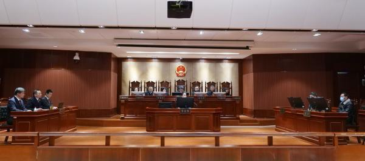
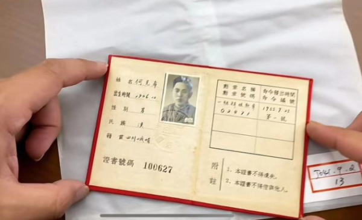

# “开国少将被自媒体造谣成叛徒”案开庭，检方诉称应承担民事侵权责任

12月21日，“开国少将何克希被自媒体造谣成叛徒”一案在杭州互联网法院开庭审理。

_庭审现场。澎湃新闻记者 钟常宇 图_

此前，开国少将何克希的照片被一些自媒体盗用成“革命叛徒”的短视频被大量转发，造成恶劣影响。11月30日，西湖区检察院对郭某某、何某某、付某某侵害革命英雄何克希同志肖像、名誉和荣誉的行为向杭州互联网法院提起民事公益诉讼，追究三人的民事侵权责任。

_何克希同志《一级解放勋章》证书。潮新闻 图_

何克希将军的家属石女士在接受潮新闻采访时表示，8月初她接到宁波市委党史研究室的电话，称发现有自媒体用了她外公的照片发布到网上，涉嫌诋毁、侮辱、诽谤英烈。石女士和亲属发现，这些自媒体账号发布涉及外公的视频内容基本相同，自行排列了“中共最恶劣十大叛徒”并配上简介等。其中，“顾顺章”对应的照片是她外公年轻时的照片，并配文“中共历史上最危险的叛徒”。

西湖区检察院诉称，网络自媒体博主应确保发布信息客观真实，不得发布侵害他人合法权益的网络虚假信息。郭某某、何某某、付某某未尽信息发布核实义务，将何克希同志的肖像用于叛徒顾顺章的头像。何克希同志作为革命先驱，为争取民族独立和人民解放作出重要贡献，属于法律规定的英雄范畴。根据英雄烈士保护法，“英雄烈士的姓名、肖像、名誉、荣誉受法律保护。任何组织和个人不得在互联网以侮辱、诽谤或者其他方式侵害英雄烈士的姓名、肖像、名誉、荣誉。”三人的行为侵害了何克希同志的肖像、名誉和荣誉，也伤害了革命英雄亲属的情感，破坏了尊崇英雄烈士的社会风气和公共道德，不利于民族共同利益的赓续传承，损害了社会公共利益。根据英雄烈士保护法、民法典有关规定，三人依法应承担民事侵权责任。

澎湃新闻（www.thepaper.cn）从庭审现场获悉，西湖检察院向法院诉请：判令被告郭某某、何某某、付某某分别在全国有影响力的媒体上公开赔礼道歉、消除影响，并分别赔偿公益损害赔偿金10万元、4万元、1万元。

西湖检察院表示，赔偿款项将用于何克希同志英雄事迹宣传褒扬和何克希同志纪念场所设施维护和保障。后续将在征求何克希家属的意见上，确定赔偿款的具体使用方式。

据介绍，何克希1906年出生，四川峨眉县人，1929年加入中国共产党。1935年，他赴上海从事情报工作，成为中央特科成员。1938年，他率部深入江南敌后开辟抗日革命根据地，1942年被任命为新四军浙东纵队司令员、浙东区党委委员。抗日战争胜利后，何克希先后担任新四军1纵队3旅政委，华东野战军1纵队副司令员、35军政委等职务，1949年4月率部参加解放南京的战役。1955年9月，在我国首次将官授衔仪式上，何克希被授予少将军衔，成为“开国少将”，并获颁一级解放勋章。1966年，何克希到浙江工作，担任省政协副主席，直至临终。

