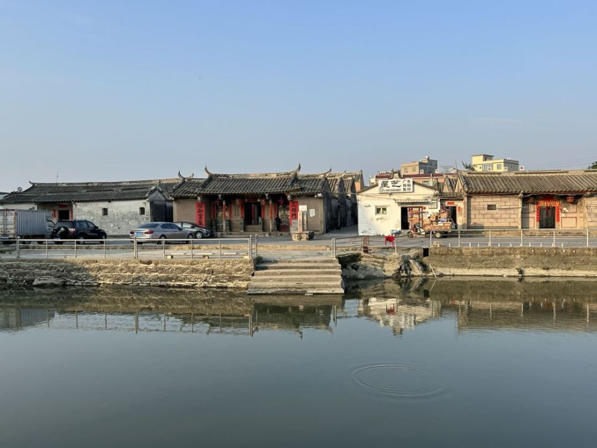
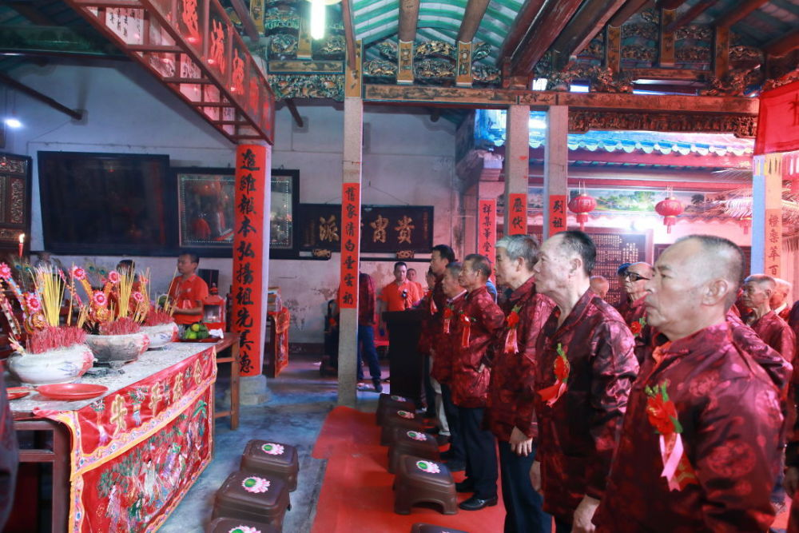

#  一个违背祖宗的决定：村落间化解百年“世仇”

 _（广东省揭阳市榕城区仙桥街道槎桥村的陈氏宗祠 。南方周末记者韩谦/图）_

这听上去像是古老的传说。

村落间有“互不通婚”的祖训，当有年轻人想盟结良缘时，开明的家长们不得不想出一些“花招”：有人把女儿过继给另一村的亲戚后再出嫁；也有人给女儿在酒店定下一个房间，新郎从酒店门口接亲。

“棒打鸳鸯”的故事仍在上演：有相恋的情侣被长辈拆散，男方在20岁时便相亲结婚，以断念想；也有人因年轻时被家人阻拦，年近40岁仍然未婚。

这些都是真实的故事，发生在广东省揭阳市榕城区仙桥街道十四寨（14个自然村）杨、黄、郭、邱4个有“世仇”的宗族间。

不过，从2023年10月1日起，所有的故事都已成过去。当天上午9点半，一场以“睦邻友好”为主题的和解仪式在4个宗族的祠堂同时开始。

“解除旧约，缔结婚姻。祈祖笑允，四姓俱兴。”在司仪诵念的祝文声中，百年“世仇”化解。

一对原本被视为“数典忘祖”的新人，也成了摆脱陋习的典型。他们来自十四寨中两个有“世仇”的村寨，在2023年9月中旬订婚，双方父母当时都没敢告诉邻里，和解仪式结束后，他们公开了喜讯，村民的态度有了“180度转弯”。

一场推翻百年祖训的仪式能在此时发生，是自上而下形成合力的结果。从揭阳市委巡察组到榕城区仙桥街道办事处，再到村委会、村中负责掌管祭祀事务的“老人头”，缺了哪一方都不行。

9年前的失败

2023年11月末的揭阳，气温二十多度，人字拖、短袖还是出行标配。路旁的榕树和秋枫伸展着粗壮的枝条，地面散落着紫荆花玫红色的花瓣。

揭阳市中心被榕江北河与榕江南河分割、环绕，形成一片葫芦状的冲积平原。榕江南河以南是仙桥街道辖区。化解不通婚规定的十四寨，分属4个行政村。

此次“睦邻友好”活动中，杨氏是人口最多的宗族，有一万多人，涉及7个寨，其中6个属于槎桥村。除了杨氏，十四寨中有“世仇”的还包括3个宗族：黄氏、邱氏与郭氏。各寨间矛盾因何而起已不可考。

2023年11月28日，一位参与编写杨氏年谱的老人向南方周末记者回忆，在老一辈的讲述中，矛盾的产生与百年前的农耕有关。各村耕地接壤，免不了发生摩擦，譬如，某个村村民饲养的家禽在田间越界，吃了邻村村民种植的作物。事情不大，但由此引发的矛盾愈来愈深，直至发展成宗族间的械斗，有人甚至丧了性命。冲突严重的年份，村寨间相邻的农田都没人敢耕种，担心单独行动时被人报复。于是，先祖们在祠堂发下毒誓，后人不再与有冲突的宗族通婚。

虽然没有文字记载，但一代代人自小就被长辈灌输这一理念：
两个村有“世仇”，村民之间可以正常做生意、交朋友，只不过如果青年人与“仇人的后代”结婚，那是绝对的禁忌。

如果有人违背祖训，此后一旦家中发生变故，总会受到闲言碎语的指责——那一定是受到了祖先惩罚。

要化解延续百年的“世仇”，卸下族人的思想包袱，没那么容易。

9年前，时任槎桥村党支部书记杨继波就有过尝试，但以失败告终。

2014年3月，杨继波担任槎桥村支书不到一个月，就受揭西县杨氏宗亲邀请，带着村“两委”干部参加了揭西县3个宗族的和解仪式。

新官上任，当然想做出些成绩。槎桥与邻村美西、美东的黄氏宗族有不通婚的祖训，化解两个宗族的矛盾，不失为一个抓手。回村后，杨继波找到时任美西村支书黄潮明。两人商量后，决心促成此事。

进度最终卡在杨氏宗祠理事会会长杨东河那里。宗祠理事会会长，在潮汕地区俗称“老人头”，主管村中祭祀大事，是宗族里的“意见领袖”。

杨东河认为，和解自然是好事。只不过杨氏宗族的内部矛盾还没解决，去解决外部的事，没有必要。

当时，杨氏内部各寨间存在矛盾，其中一个过节，发生在杨继波所在的斗门自然村同杨东河所处的东光自然村间。

“营老爷”，是潮汕地区盛大的祭祀活动，每年农历正月，人们把“老爷”从庙中请出，在村中巡游。斗门与东光接壤，斗门村“营老爷”，需经过东光的一条道，遇到东光村村民阻挠。此后，有东光的老人出殡，要经过斗门的路，也被阻止。这之后，斗门村的老人便不再参与杨东河召集的活动。

还有很多实际的问题也被视为杨氏与黄氏和解的障碍。比如，该由哪方先提出？在村民眼里，主动提出的那一方，总被认为处于弱势。

“那时候没气氛，也没力量，加上又有别的任务，结果不了了之。”杨继波说，经历了一次失败，他意识到，推动两村和解，“不是你说要办就有办法，得大家都要办才能成。”

_2023年10月1日，和解仪式开始，老人们在先祖前祭拜，破除“祖训”（受访者供图）_

“铺台阶”与“造舆论”

9年后，一次巡察带来了化解“世仇”的契机。

2023年7月初，揭阳市委第三巡察组、榕城区委第三巡察组进驻仙桥街道，开展美丽圩镇创建专项巡察。

在一场会议上，有巡察组成员了解到，杨氏与黄氏间有“互不通婚”的规定。如果能化解这一“世仇”，既符合巡察工作为老百姓做些实事的目的，又契合了揭阳创建文明城市的目标。巡察组决定支持推动此事。

这之前，杨贵彬就在街道领导班子会议上提出过这个问题。他是槎桥人，任揭阳市慢性病防治院副院长，2021年到仙桥街道挂职，担任驻街道帮镇扶村工作队队长。

自到街道，杨贵彬就琢磨着如何推动化解“世仇”。这次，有了市委巡察组的加持，在他看来是个难得的好机会，巡察组的名头“能给我们‘借力’，调动干部们的积极性”。

化解工作就此被推上日程。

到仙桥街道挂职前，杨贵彬没有基层工作经验。让谁来具体推动这件事？他想到了老书记杨继波。

2021年卸任槎桥村支书后，杨继波转岗仙桥街道人大工作委员会办公室，他担任过十多年仙桥街道文化站站长，是《仙桥志》执行主编，熟悉各村历史和祭拜礼节，是再合适不过的人选。

街道牵头，又有巡察组支持，杨继波这回有了底气。但老问题还摆在那里：怎么得到“老人头”支持？

9年前的失败经历，让杨继波多了点担心——要是他自己出面说和，如果一开始被回绝，就没了退路。

杨继波决定改变策略，先打“亲情牌”，让杨东河的侄子杨少育“打头阵”，他还是榕城区人大代表。

2023年7月19日下午，杨继波找到杨少育。二人商量好了“话术”：让杨东河转变视角，先把内部恩怨放在一边，应对外边的事儿。就像一家人之间总会有些摩擦，但也得同外界接触，说不定，与黄氏的“世仇”化解，也能推动自家矛盾调和。

当晚，杨继波就收到杨少育的回复，他已经同叔父聊过，觉得事情能有“七八成把握”。

被侄子说服后，杨东河决定召开一场杨氏宗祠理事会，听听各寨代表们的意见——各寨有各自独立的宗祠供奉自己的先祖，也会成立宗祠理事会和“老人头”。

不过，没几天，杨东河就开始打退堂鼓。他召集7个寨开理事会，有3个寨的“老人头”没到场。连开会都聚不齐人，还怎么商量？

这时候，街道干部和村干部出马了。

2023年8月2日，仙桥街道开了场会，成立“睦邻友好”活动专项领导小组，街道党工委书记担任组长，杨贵彬与3名街道办副主任任副组长。领导小组下设办公室，杨继波任主任，十四寨涉及的4个行政村村支书被列为副主任。

街道办分管宗教、文化工作的副主任杨永涛，还负责解决通过12345热线反映问题的村民投诉，是化解乡村矛盾的熟手。在他看来，政府是化解“世仇”的“中介”，要给宗祠里的老人们“铺好台阶”，让他们走到一起。

一个办法是，“开大会前先开小会”。杨继波同杨永涛等人一道，开始逐个拜访杨氏宗族各自然村的“老人头”。

最棘手的东洋村，是杨氏七寨中唯一一个在行政区划上不属于槎桥的村落。东洋的宗祠理事会会长有次参加宗祠活动时，杨东河与槎桥村村支书挨桌敬酒，不小心遗漏了他所在的那桌。现场，这位会长愤而离席，就此“结下了梁子”。

在杨继波看来，这是“说小也小，说大很大”的事，在农村，牵涉颜面与尊严。

最终，杨继波分4步解决这件事：先向槎桥村干部打听矛盾的根源；再找这位“老人头”的朋友做说客；等沟通得差不多，杨继波和杨永涛登门拜访，以表对他的尊重；最后，组了个饭局，槎桥村书记到场，补敬他一杯酒，解开了心里的疙瘩。

与此同时，杨继波9年前的“老搭档”，现任美西村村支书黄潮明也开始在村中宣传，通知村委会干部、乡贤、企业主，听取各方的看法。黄潮明称此做法是：做事前，先得“造舆论”。

“舆论”起来后，与杨、黄两个宗族亦有不通婚祖训的郭氏和邱氏，主动申请，也要参与和解。由此，这一活动扩大至十四寨。

“只许成功，不许失败”

从2023年7月中旬开始，有关和解的消息在坊间一直是“传言”。

直到9月1日，“老人头”们基本达成一致意见，有了八成把握，一份由杨继波主笔、落款为“仙桥街道睦邻友好领导协调工作小组”的倡议书才被分发到各村村民手中。其中写着，“族中未婚青年男女，要有大无畏精神，大胆勇敢点亮爱情心灯，合法寻找另一半”。

和解仪式举办时间提前确定在10月1日。选这个日子，也有讲究。在村里，办祭祀仪式总得求个黄道吉日。为了避免每个村算出不同的“好日子”，节外生枝，活动领导小组把仪式举行时间定在国庆节当天，这是个各方都没有争议的日子。

消息传开，一些短视频平台上出现了村民们发布的视频，预告即将到来的仪式。有记者刷到视频，早早联系采访。

一种“只许成功，不许失败”的氛围在村民中散播开来。

气氛有了，可谁来办事？9月初，槎桥村现任支书杨燕填在村里连开两次会议，结果并不乐观。有村干部觉得，这是祠堂的事，村干部为什么要插手？也有不少人还在观望：这事到底能不能成？会不会同过去一样，像阵风，来得快，散得也快？

9月6日，杨贵彬、杨永涛、杨继波等人代表街道，第一次到槎桥村委会，同村干部开会。现场氛围凝重，三人都是本村人，说了不少“狠话”。

杨永涛在发言里提到，如果这次办不成，“我们都是历史罪人”，“街道下这么大力气做的事都没成，下次谁还敢来办？”

杨继波在笔记本上写下自己发言的要点：“输人勿输阵”“树欲皮，人欲脸”，他解释，在会上得“敲敲他们的脑袋”，“说别的村子都干得怎么样，我们没有干好，那就丢脸”。

“有些事，让村支书去办，不好做”，在杨永涛看来，街道一级的领导出面，“意义是不一样的”。有了“党政牵头”，村干部的工作热情被推动起来。

风气一旦形成，杨贵彬注意到了一些有趣的变化。

原本心中有疙瘩、觉得推动此事会让自己受诅咒的老人，也主动参与进来。甚至出现了争抢去其他宗族互访的名额 ，“就像外交使节一样，多有面子”。

和解仪式定下了一些原则：不设宴席，不请大戏，强调平等，“大村照顾小村”，祭拜流程、服饰、伴手礼等各村均保持一致。

细节在会议上被反复讨论。例如，按照潮汕习俗，祭拜祖先时，六七十岁的人，着短款唐装。年纪更大的，则穿长衫。但对具体年龄界限划定，各寨都有不同的规矩。考虑到不好统一，且唐装和长衫代表着不平等的关系。街道规定，所有参加仪式的老人统一着唐装。

有八十多岁的长者向村干部“抗议”：以自己的年纪，还是应当穿长衫参加仪式。村干部回绝得强硬：街道就是这么规定的，所有老人均穿唐装。到时穿长衫者，会被请出会场。

正式仪式到来前几日，各村进行互访时，有的代表开着上百万的豪车出行。担心各宗族间产生攀比心理，街道规定，在正式仪式举行时，各宗族统一租下一辆丰田考斯特中巴车和一辆用来装匾额的货车。

杨继波多次向南方周末记者强调“细节”的重要性。但凡一个细节出现差错，都可能触发新的矛盾。

2023年10月1日上午9时左右，4个宗族的代表各自从祠堂出发，前往有“世仇”的宗族。

10分钟后，在槎桥村，一辆考斯特中巴车在大红色的充气彩虹门前停下。锣鼓声响起，12名身着暗红色唐装、胸口别着大红花的黄姓老人下车，踏上红地毯，步行前往200米外的杨氏宗祠。走在他们前面的，是抬着“睦邻友好”牌匾的4名青壮年。随队的村干部拎着一个红色袋子，里头装着伴手礼：8个桔子，4包旺旺奶糖。穿着橙色polo衫的杨氏族人站在红地毯两侧，鼓掌欢迎。郭氏、邱氏的队伍也陆续抵达。

上午9点半，鞭炮声同时在4个宗祠外响起，仪式开始。族中长者在先祖排位前跪下，同旧时代的守则告别。

这时候，仙桥街道党工委书记、办事处主任在街道大楼“坐镇”，副书记们在祠堂里镇场。杨继波、杨永涛等人则是机动组人员，他们提前预想了不少突发状况：预防有人中暑，在祠堂内配备了冷风机，担心有老人突发疾病，提前安排医护人员待命，还准备了常用药物。

还有些小事需要时刻防备。比如，万一有人扔烟头烫坏了红地毯，说不定又会被视作不祥的征兆。

_2023年11月28日，杨氏宗祠内摆放着曾有“世仇”的村庄送来的牌匾。（南方周末记者韩谦/图）_

“共谋”

仪式结束后，“广东揭阳4个世仇村和解”上了新闻热搜。这场仪式受到的关注是杨贵彬意想不到的。即便是过去一个多月后，还有3位“北京来的”记者到访。

让杨贵彬困惑的是，几乎每位记者都会向他发问，为什么百年前的祖训，到现在还能被此地的人遵循？

听到这样的问题，他总是无奈地一笑，“那是你们不了解潮汕文化”。他从没考虑过这个问题，这似乎是件自然而然的事。

在潮汕地区，有“千年亲戚，万年祖宗”的说法，“世仇村”也并不罕见。仅在仙桥街道，近年来已经举办了4次宗族间化解“世仇”的仪式。

潮汕文化研究者、韩山师范学院历史文化学院副院长温建钦在调研中发现，“世仇”和解的达成，其背后大都有党委和政府的支持，“也就是通过党建引领基层社会治理的方式，构筑了和解的平台”。

2023年10月2日，在揭阳下辖县级市普宁，富美村和庵埔村也化解了“世仇”。温建钦了解到，两村和解的契机，是普宁市委书记在下乡调研时，提到要做好基层社会治理。此外，两个村子两位乡贤的后代正在谈婚论嫁，便趁机促成此事。

推动“世仇”化解，某种意义上是基层政府与宗族的“共谋”。在温建钦看来，对政府来说，乡风文明建设是推动乡村振兴的要求；而对宗族来说，村中即便有人想推翻祖训，没有政府牵头，往往也难以达成。

温建钦认为，在潮汕地区，地方主政者在基层治理中难免会遇到两股“独特”的力量：一是宗族的力量，二是民间信仰的力量。作为传统的延续，它们一时不会消失。对主政者来说，不能把它们当做“洪水猛兽”，而要从中吸收优秀的部分，引导这两股力量与政府治理融合，甚至可以降低社会治理的成本。

在仙桥街道，十四寨“世仇”化解后，一些变化正在发生。郭氏宗族聚集的西洋村，成了最早的受益方。

内涝，是困扰西洋村十多年的难题。一条排水渠从西洋村向东流，途经曾与西洋有不通婚约定的两个村庄，分属黄、杨两个宗族。排水渠内积有一米多厚的淤泥，下游村庄的村民们在河道上搭起职工宿舍、茅房，野草在河道间疯长，岸边榕树的气根深深扎入淤泥。下游河道的堵塞造成上游的积水无法及时排走，即便下上一场中雨，西洋村中地势低洼的古寨，积水都能没过小腿。

过去，西洋村村支书郭奕辉试图推动排水渠治理，不过，到了那两个“世仇”村，问题总没法协调。村干部答应得痛快，但给搭违建的村民做工作，则是一拖再拖。

趁着谈和解计划
，郭奕辉又向两个“世仇”村提出了治理水渠的想法。两村的村支书答应得很干脆，“以后都是亲戚，排水渠这么点小事，还有什么谈不成的？”这回，他们还派出村干部，专门跟进协调此事。

排水渠疏通工程在9月中旬便提上日程。两个多月后，宿舍、茅房、杂草全都从河道里消失。2023年11月30日下午，郭奕辉来到排水渠边，一台挖掘机正在施工，七百多米的淤堵河段，尚有数十米未完成清淤工作。郭奕辉同岸边围观的村民们打了个招呼，神色得意，“总算把这事给办成了”。

促成十四寨和解后，杨继波又有了新的差事。仙桥街道还有一个行政村村内4个自然村间也“互不通婚”。看到十四寨的经验后，村支书也想打破村里的旧习，邀请杨继波做参谋。经过沟通，和解仪式举行时间被预定在另一个大家公认的“好日子”：2024年1月1日，元旦。

南方周末记者 韩谦 发自广东揭阳

责编 钱昊平

